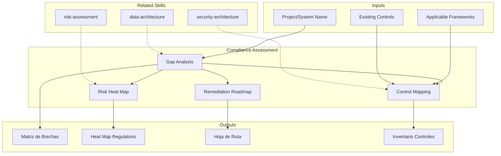

# Compliance Assessment: Regulatory & Standards Gap Analysis

Compliance assessment identifies gaps between an organization's current practices and applicable regulatory or standards requirements. The skill produces compliance gap matrices, remediation roadmaps, and risk heat maps that enable informed prioritization of compliance investments.

## Grounding Guideline

> *Compliance without evidence is a statement of intentions. Compliance with evidence is a guarantee.*

1. **Traceable evidence.** Every control must have verifiable evidence, not just declarative documentation.
2. **Regulation as a design constraint.** Regulatory requirements are not added at the end — they are incorporated from the start.
3. **The cost of non-compliance always exceeds the cost of compliance.** Fines, sanctions, and loss of trust are exponentially more expensive than compliance investment.

## TL;DR

- Evaluates compliance status against applicable regulatory frameworks (GDPR, SOX, PCI-DSS, HIPAA, ISO 27001)
- Generates gap matrix with severity, remediation effort, and residual risk
- Produces remediation roadmap prioritized by regulatory impact and risk exposure
- Maps existing controls against regulatory requirements to identify coverage and gaps
- Delivers regulatory risk heat map for executive communication

## Inputs

The user provides a project or system name as `$ARGUMENTS`. Parse `$1` as the **project/system name**.

**Parameters:**
- `{MODO}`: `piloto-auto` (default) | `desatendido` | `supervisado` | `paso-a-paso`
- `{FORMATO}`: `markdown` (default) | `html` | `dual`
- `{VARIANTE}`: `ejecutiva` (~40%) | `tecnica` (full, default)
- `{MARCO}`: `GDPR` | `SOX` | `PCI-DSS` | `HIPAA` | `ISO-27001` | `NIST-CSF` | `multi` (default)

## Deliverables

1. **Compliance Gap Matrix** — Control-by-control gap analysis against selected framework(s)
2. **Remediation Roadmap** — Prioritized action plan with effort estimates, owners, and timelines
3. **Regulatory Risk Heat Map** — Visual risk assessment by domain and severity
4. **Existing Controls Inventory** — Mapping of current controls to regulatory requirements
5. **Executive Exposure Report** — C-level summary of compliance posture and key risks

## Process

1. **Identify applicable frameworks** — Determine which regulations and standards apply based on industry, geography, data types, and business model
2. **Inventory existing controls** — Catalog current security controls, policies, procedures, and technical safeguards
3. **Map controls to requirements** — Map existing controls against each requirement of the applicable framework(s)
4. **Evaluate gaps** — Identify gaps where controls are missing, partial, or ineffective; classify by severity
5. **Calculate residual risk** — Assess likelihood and impact of non-compliance for each gap
6. **Prioritize remediation** — Rank remediation actions by regulatory exposure, effort, and business impact
7. **Design roadmap** — Build phased remediation plan with quick wins (0-30 days), medium-term (30-90 days), and strategic (90-365 days)
8. **Generate heat map** — Produce visual risk heat map for executive communication

## Quality Criteria

- [ ] All applicable regulatory frameworks identified and justified
- [ ] Gap matrix covers 100% of framework requirements (not sampled)
- [ ] Each gap has severity classification (critical/high/medium/low)
- [ ] Remediation roadmap includes effort estimates and ownership
- [ ] Risk heat map uses consistent scoring methodology
- [ ] Evidence tags applied: [DOC], [CONFIG], [INFERENCIA], [SUPUESTO]
- [ ] No legal advice given — skill produces technical compliance assessment only
- [ ] Cross-references to related security and architecture assessments

## Assumptions and Limits

- This is a technical compliance assessment, NOT legal advice
- Assumes access to documentation of existing controls and policies
- Does not replace formal certification audits (ISO, SOC2, PCI QSA)
- Regulatory interpretations should be validated by legal counsel

## Edge Cases

1. **Multiple overlapping regulatory frameworks** — When GDPR + PCI-DSS + SOX apply simultaneously, the skill generates a unified control matrix that maps shared requirements to avoid effort duplication.
2. **Organization without control documentation** — If no policies or documented procedures exist, the skill generates an inventory based on interviews/inference tagged with [SUPUESTO] and prioritizes documentation as the first remediation step.
3. **Local regulation not covered by standard frameworks** — For local regulations (e.g., Ley 1581 Colombia, LGPD Brazil), the skill structures the evaluation with the same principles but requires user input on specific requirements.
4. **Early-stage startup without formal controls** — The skill adapts the evaluation to identify minimum viable controls and generates a pragmatic roadmap instead of an exhaustive gap analysis.

## Decisions and Trade-offs

1. **Multi-framework default vs. single framework** — Default multi because most organizations are subject to multiple regulations; a single framework creates a false sense of completeness.
2. **100% gap analysis vs. sampling** — 100% coverage of framework requirements is required because external auditors evaluate against the entirety; sampling is insufficient for certification.
3. **Visual heat map vs. detailed table** — Both are produced: heat map for executive communication and detailed table for remediation teams; the additional cost is justified by the different audiences.
4. **Mandatory legal disclaimer vs. optional** — Always mandatory; the skill produces technical evaluation, never legal advice, and this must be explicit to protect the user.

## Knowledge Graph

## Output Templates

### Markdown (default)
- Filename: `compliance_gap-analysis_{sistema}_{WIP}.md`
- Structure: TL;DR -> Marcos aplicables -> Matriz de brechas (tabla) -> Heat map (Mermaid) -> Roadmap de remediacion -> Informe ejecutivo

### HTML (bajo demanda)
- Filename: `compliance_gap-analysis_{sistema}_{WIP}.html`
- Estructura: HTML self-contained branded (Design System MetodologIA v5). Light-First Technical. Incluye risk heat map interactivo por dominio, compliance matrix filtrable, y remediation roadmap faseado. WCAG AA, responsive, print-ready.

### XLSX
- Filename: `compliance_control-matrix_{sistema}_{WIP}.xlsx`
- Hojas: Framework Requirements | Control Inventory | Gap Matrix | Risk Scoring | Remediation Plan

### DOCX (bajo demanda)
- Filename: `{fase}_compliance_gap-analysis_{sistema}_{WIP}.docx`
- Via python-docx con Design System MetodologIA v5. Cover page, TOC auto, headers/footers branded, tablas zebra. Poppins headings (navy), Trebuchet MS body, gold accents.

### PPTX (bajo demanda)
- Filename: `{fase}_{entregable}_{cliente}_{WIP}.pptx`
- Via python-pptx con MetodologIA Design System v5. Slide master con gradiente navy, titulos Poppins, cuerpo Trebuchet MS, acentos gold. Max 20 slides (ejecutiva) / 30 slides (tecnica). Speaker notes con referencias de evidencia. Para comites directivos y presentaciones C-level.

## Evaluacion

| Dimension | Peso | Criterio |
|-----------|------|----------|
| Trigger Accuracy | 10% | Activa ante "compliance", "GDPR", "PCI-DSS", "regulatory" sin confundir con security assessment general |
| Completeness | 25% | Cubre identificacion de marcos, gap analysis, heat map y roadmap sin huecos |
| Clarity | 20% | Cada brecha referencia requisito especifico con severidad y remediacion concreta |
| Robustness | 20% | Maneja multi-framework, ausencia de documentacion y regulaciones locales |
| Efficiency | 10% | 8 pasos secuenciales donde cada uno usa output del anterior |
| Value Density | 15% | Heat map y roadmap son directamente presentables a C-level y equipos tecnicos |

**Umbral minimo**: 7/10 en cada dimension para considerar el skill production-ready.

## Cross-References

- **metodologia-security-architecture:** Security controls that support compliance requirements
- **metodologia-data-architecture:** Data governance and classification relevant to GDPR/HIPAA
- **metodologia-risk-assessment:** Enterprise risk framework aligned with compliance risks

---
**Autor:** Javier Montaño · Comunidad MetodologIA | **Version:** 1.0.0
