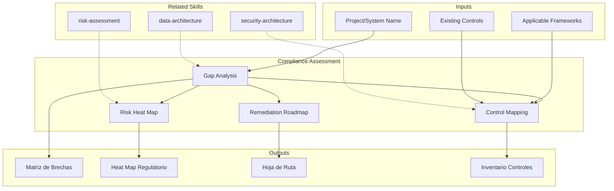

# Compliance Assessment: Regulatory & Standards Gap Analysis

Compliance assessment identifies gaps between an organization's current practices and applicable regulatory or standards requirements. The skill produces compliance gap matrices, remediation roadmaps, and risk heat maps that enable informed prioritization of compliance investments.

## TL;DR

- Evalua el estado de cumplimiento contra marcos regulatorios aplicables (GDPR, SOX, PCI-DSS, HIPAA, ISO 27001)
- Genera matriz de brechas con severidad, esfuerzo de remediacion y riesgo residual
- Produce hoja de ruta de remediacion priorizada por impacto regulatorio y exposicion al riesgo
- Mapea controles existentes contra requisitos normativos para identificar cobertura y vacios
- Entrega heat map de riesgo regulatorio para comunicacion ejecutiva

## Inputs

The user provides a project or system name as `$ARGUMENTS`. Parse `$1` as the **project/system name**.

**Parameters:**
- `{MODO}`: `piloto-auto` (default) | `desatendido` | `supervisado` | `paso-a-paso`
- `{FORMATO}`: `markdown` (default) | `html` | `dual`
- `{VARIANTE}`: `ejecutiva` (~40%) | `tecnica` (full, default)
- `{MARCO}`: `GDPR` | `SOX` | `PCI-DSS` | `HIPAA` | `ISO-27001` | `NIST-CSF` | `multi` (default)

## Entregables

1. **Matriz de brechas de cumplimiento** — Control-by-control gap analysis against selected framework(s)
2. **Hoja de ruta de remediacion** — Prioritized action plan with effort estimates, owners, and timelines
3. **Heat map de riesgo regulatorio** — Visual risk assessment by domain and severity
4. **Inventario de controles existentes** — Mapping of current controls to regulatory requirements
5. **Informe ejecutivo de exposicion** — C-level summary of compliance posture and key risks

## Proceso

1. **Identificar marcos aplicables** — Determine which regulations and standards apply based on industry, geography, data types, and business model
2. **Inventariar controles existentes** — Catalog current security controls, policies, procedures, and technical safeguards
3. **Mapear controles a requisitos** — Map existing controls against each requirement of the applicable framework(s)
4. **Evaluar brechas** — Identify gaps where controls are missing, partial, or ineffective; classify by severity
5. **Calcular riesgo residual** — Assess likelihood and impact of non-compliance for each gap
6. **Priorizar remediacion** — Rank remediation actions by regulatory exposure, effort, and business impact
7. **Disenar hoja de ruta** — Build phased remediation plan with quick wins (0-30 days), medium-term (30-90 days), and strategic (90-365 days)
8. **Generar heat map** — Produce visual risk heat map for executive communication

## Criterios de Calidad

- [ ] All applicable regulatory frameworks identified and justified
- [ ] Gap matrix covers 100% of framework requirements (not sampled)
- [ ] Each gap has severity classification (critical/high/medium/low)
- [ ] Remediation roadmap includes effort estimates and ownership
- [ ] Risk heat map uses consistent scoring methodology
- [ ] Evidence tags applied: [DOC], [CONFIG], [INFERENCIA], [SUPUESTO]
- [ ] No legal advice given — skill produces technical compliance assessment only
- [ ] Cross-references to related security and architecture assessments

## Supuestos y Limites

- This is a technical compliance assessment, NOT legal advice
- Assumes access to documentation of existing controls and policies
- Does not replace formal certification audits (ISO, SOC2, PCI QSA)
- Regulatory interpretations should be validated by legal counsel

## Casos Borde

1. **Multiples marcos regulatorios superpuestos** — Cuando aplican GDPR + PCI-DSS + SOX simultaneamente, el skill genera una matriz de controles unificada que mapea requisitos compartidos para evitar duplicacion de esfuerzo.
2. **Organizacion sin documentacion de controles** — Si no existen politicas ni procedimientos documentados, el skill genera un inventario basado en entrevistas/inferencia marcado con [SUPUESTO] y prioriza la documentacion como primer paso de remediacion.
3. **Regulacion local no cubierta por marcos estandar** — Para normativas locales (ej: Ley 1581 Colombia, LGPD Brasil), el skill estructura la evaluacion con los mismos principios pero requiere input del usuario sobre requisitos especificos.
4. **Startup en etapa temprana sin controles formales** — El skill adapta la evaluacion para identificar controles minimos viables y genera un roadmap pragmatico en lugar de una gap analysis exhaustiva.

## Decisiones y Trade-offs

1. **Multi-framework default vs. framework unico** — Default multi porque la mayoria de organizaciones estan sujetas a multiples regulaciones; un solo framework crea falsa sensacion de completitud.
2. **Gap analysis 100% vs. muestreo** — Se requiere cobertura 100% de requisitos del framework porque los auditores externos evaluan contra la totalidad; el muestreo es insuficiente para certificacion.
3. **Heat map visual vs. tabla detallada** — Se producen ambos: heat map para comunicacion ejecutiva y tabla detallada para equipos de remediacion; el costo adicional se justifica por las audiencias diferentes.
4. **Disclaimer legal obligatorio vs. opcional** — Siempre obligatorio; el skill produce evaluacion tecnica, nunca asesoria legal, y esto debe ser explicito para proteger al usuario.

## Knowledge Graph

## Output Templates

### Markdown (default)
- Filename: `compliance_gap-analysis_{sistema}_{WIP}.md`
- Structure: TL;DR -> Marcos aplicables -> Matriz de brechas (tabla) -> Heat map (Mermaid) -> Roadmap de remediacion -> Informe ejecutivo

### HTML (bajo demanda)
- Filename: `compliance_gap-analysis_{sistema}_{WIP}.html`
- Estructura: HTML self-contained branded (Design System MetodologIA v5). Light-First Technical. Incluye risk heat map interactivo por dominio, compliance matrix filtrable, y remediation roadmap faseado. WCAG AA, responsive, print-ready.

### XLSX
- Filename: `compliance_control-matrix_{sistema}_{WIP}.xlsx`
- Hojas: Framework Requirements | Control Inventory | Gap Matrix | Risk Scoring | Remediation Plan

### DOCX (bajo demanda)
- Filename: `{fase}_compliance_gap-analysis_{sistema}_{WIP}.docx`
- Via python-docx con Design System MetodologIA v5. Cover page, TOC auto, headers/footers branded, tablas zebra. Poppins headings (navy), Montserrat body, gold accents.

### PPTX (bajo demanda)
- Filename: `{fase}_{entregable}_{cliente}_{WIP}.pptx`
- Via python-pptx con MetodologIA Design System v5. Slide master con gradiente navy, titulos Poppins, cuerpo Montserrat, acentos gold. Max 20 slides (ejecutiva) / 30 slides (tecnica). Speaker notes con referencias de evidencia. Para comites directivos y presentaciones C-level.

## Evaluacion

| Dimension | Peso | Criterio |
|-----------|------|----------|
| Trigger Accuracy | 10% | Activa ante "compliance", "GDPR", "PCI-DSS", "regulatory" sin confundir con security assessment general |
| Completeness | 25% | Cubre identificacion de marcos, gap analysis, heat map y roadmap sin huecos |
| Clarity | 20% | Cada brecha referencia requisito especifico con severidad y remediacion concreta |
| Robustness | 20% | Maneja multi-framework, ausencia de documentacion y regulaciones locales |
| Efficiency | 10% | 8 pasos secuenciales donde cada uno usa output del anterior |
| Value Density | 15% | Heat map y roadmap son directamente presentables a C-level y equipos tecnicos |

**Umbral minimo**: 7/10 en cada dimension para considerar el skill production-ready.

## Cross-References

- **metodologia-security-architecture:** Security controls that support compliance requirements
- **metodologia-data-architecture:** Data governance and classification relevant to GDPR/HIPAA
- **metodologia-risk-assessment:** Enterprise risk framework aligned with compliance risks

---
**Autor:** Javier Montaño · Comunidad MetodologIA | **Version:** 1.0.0
