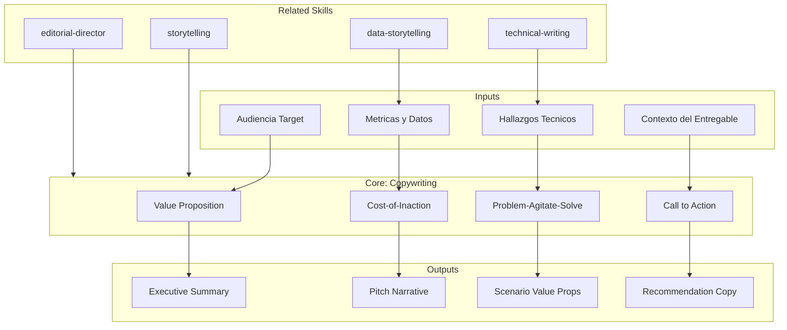

# Copywriting — Persuasive Executive Communication

Transforms technical findings into decision-driving prose. Owns value propositions, calls to action, cost-of-inaction narratives, executive summaries, and recommendation justifications across all discovery deliverables.

## Guiding Principle

**The best copy does not convince — it reveals what the reader already knows but has not articulated.** A C-level executive knows they have technical debt. They do not need to be told. They need the cost of inaction quantified and a clear path shown with options. Copy transforms data into decisions.

### Persuasion Philosophy

1. **Evidence before assertion.** Never "we believe that" — always "the data shows that." Every claim carries a number, a source, or an explicit assumption.
2. **Demonstrated urgency, not declared.** Not "it is urgent to act." Instead "the cost of inaction is X FTE-months/quarter, equivalent to..."
3. **Options, not mandates.** The decision-maker chooses. The consultant recommends with evidence and trade-offs.
4. **Radical conciseness.** Every word must earn its place. If a sentence does not add information or move the reader, it is eliminated.

## Inputs

- `$1` — Target audience: `ceo`, `cto`, `cfo`, `board`, `mixed` (default: `mixed`)
- `$2` — Deliverable context: `pitch`, `scenario`, `roadmap`, `summary`, `recommendation` (default: `summary`)

Parse from `$ARGUMENTS`.

## Techniques Arsenal

### Value Proposition Construction

```
Structure: [Quantified benefit] + [for whom] + [eliminating what pain] + [in what timeframe]

Example:
  BAD: "Improve the system architecture"
  GOOD: "Reduce time-to-market from 12 to 4 weeks, freeing 3 FTE-months/quarter
      currently consumed by workarounds in the legacy system"
```

### Cost-of-Inaction (COI) Narrative

```
Pattern: [Quantified current state] → [Trend if no action] → [Cumulative impact] → [Point of no return]

Framing: "Each quarter without action costs [X] and accumulates [Y] of additional technical debt.
          In [Z] months, the remediation cost exceeds the transformation cost."
```

### Problem-Agitate-Solve (PAS)

| Phase | Purpose | Technique |
|-------|---------|-----------|
| Problem | State pain with data | Metrics, benchmarks, evidence tags |
| Agitate | Show consequences of inaction | COI projection, trend extrapolation |
| Solve | Present solution with options | 3 scenarios, recommended path highlighted |

### Call to Action Design

```
Structure: [Specific action] + [concrete timeline] + [immediate next step] + [what happens if not]

Example:
  BAD: "It is recommended to proceed with modernization"
  GOOD: "Approving scenario B (incremental modernization) this week allows
      starting Sprint 0 in Q2 and capturing the first quick win (API gateway)
      before July. → Next step: alignment workshop with technical team."
```

## Tone Calibration by Audience

| Audience | Tone | Lead With | Avoid |
|----------|------|-----------|-------|
| CEO | Strategic, visionary | Competitive advantage, positioning | Technical jargon, implementation details |
| CTO | Technical-strategic | Technical risk, modernization | Excessive simplifications |
| CFO | Financial, quantitative | NPV, payback, cost avoidance | Narratives without numbers |
| Board | Governance, fiduciary | Risk-adjusted ROI, compliance | Operational detail |
| Mixed | Progressive: impact → technical | Impact headline + progressive depth | Assuming a single profile |

## Anti-Patterns

| Anti-Pattern | Correction |
|-------------|-----------|
| "It is worth noting that..." | Eliminate — go straight to the point |
| "It is important to highlight..." | Eliminate — if it were important, it needs no announcement |
| "It is recommended to consider..." | Recommend directly with evidence |
| Passive voice without agent | Active voice: who does what |
| Numbers without context | Always compare: vs baseline, vs industry, vs target |
| Assertions without evidence | Mandatory tag: [CÓDIGO], [CONFIG], [DOC], [INFERENCIA] |
| Superlatives without support | "The best" → "Superior by X% according to [metric]" |

## Output Configuration

- **Language**: Spanish (Latin American, business register — simple, clear, concise, direct)
- **Attribution**: Expert committee of the MetodologIA Discovery Framework
- **Tagline**: *"Construido por profesionales, potenciado por la red agéntica de MetodologIA."*

## Validation Gate

Before delivery, every copy section must pass:

| Criterion | Check |
|-----------|-------|
| Every claim has evidence tag | [CÓDIGO], [CONFIG], [DOC], [INFERENCIA], [SUPUESTO] |
| Every number has context | vs baseline, vs benchmark, vs target |
| COI is quantified | FTE-months, cost/quarter, trend projection |
| CTA is specific | Action + timeline + next step |
| Zero filler phrases | No filler constructions, no "undoubtedly" |
| Audience tone match | Calibrated per target audience |

## Supuestos y Limites

- El input contiene hallazgos tecnicos ya validados; esta skill transforma, no investiga.
- El copy se produce en espanol (registro empresarial latinoamericano) salvo indicacion explicita.
- NUNCA producir precios. Solo FTE-meses, magnitudes, cost drivers.
- NUNCA usar verde (#00FF00) para exito. Usar gold (#22D3EE) en contexto MetodologIA.
- Esta skill posee **calidad de prosa y persuasion**. NO posee arco narrativo entre entregables (eso es storytelling) ni visualizacion de datos (eso es data-storytelling).

## Casos Borde

| Caso Borde | Estrategia de Manejo |
|---|---|
| No hay datos cuantitativos disponibles | Usar evidencia cualitativa con tags [INFERENCIA] explicitos. Enmarcar como "basado en patrones observados en [N] archivos/modulos/entrevistas". Declarar limitacion en la primera linea del entregable. |
| Multiples audiencias en el mismo documento | Aplicar progressive disclosure: headline ejecutivo + detalle tecnico expandible. Usar callouts diferenciados por audiencia. Nunca asumir un solo perfil de lector. |
| Recomendacion controversial o con riesgo politico | Presentar todas las opciones con igual rigor. Recomendar con evidencia explicita. Documentar dissent en registro de riesgos. Incluir seccion "Consideraciones Alternativas" antes del CTA. |
| El cliente solicita copy en idioma diferente al espanol | Producir en el idioma solicitado manteniendo la estructura y tecnicas. Documentar terminologia clave en ambos idiomas. Priorizar claridad sobre estilo literario. |

## Decisiones y Trade-offs

| Decision | Justificacion | Alternativa Descartada |
|---|---|---|
| Evidencia antes que afirmacion como regla absoluta | Credibilidad con audiencias ejecutivas requiere datos primero. Un C-level detecta copy sin sustento en segundos. | Afirmar y luego justificar: percibido como opinion no fundamentada. |
| Opciones sobre mandatos (3 escenarios) | El decision-maker elige; el consultor recomienda con evidencia. Aumenta ownership de la decision. | Recomendacion unica: percibida como imposicion, genera resistencia. |
| Conciseness radical sobre exhaustividad | Tiempo de atencion ejecutivo es limitado. Cada palabra debe aportar informacion o mover al lector. | Prosa exhaustiva: pierde la audiencia ejecutiva en el segundo parrafo. |
| COI cuantificado sobre urgencia declarada | "El costo de inaccion es X FTE-meses/trimestre" es verificable y accionable. "Es urgente actuar" es opinion. | Urgencia declarada: no diferencia de cualquier otra recomendacion. |

## Knowledge Graph



## Output Templates

### Template 1: Executive Summary (Markdown)

**Filename:** `Executive_Summary_{project}_{WIP|Aprobado}.md`

```markdown
# Resumen Ejecutivo: {project}

## Headline
{Una linea: beneficio cuantificado + para quien + eliminando que dolor}

## Situacion Actual
{2-3 parrafos: estado actual con evidencia [TAGS], metricas con contexto}

## Costo de Inaccion
{Proyeccion cuantificada: FTE-meses/trimestre, tendencia, punto de no retorno}

## Opciones
| Escenario | Inversion (FTE-meses) | Beneficio | Timeline | Riesgo |
|---|---|---|---|---|

## Recomendacion
{Escenario recomendado con justificacion basada en evidencia}

## Siguiente Paso
{Accion especifica + timeline + que pasa si no se actua}
```

### Template 1b: Executive Summary (HTML, bajo demanda)

**Filename:** `Executive_Summary_{project}_{WIP|Aprobado}.html`

HTML self-contained branded (Design System MetodologIA v5). Dark-First Executive. Incluye headline hero con metricas de impacto, COI projection visual, y comparativa de escenarios con CTA destacado. WCAG AA, responsive.

### Template 1c: Executive Summary (DOCX, bajo demanda)

**Filename:** `{fase}_Executive_Summary_{project}_{WIP}.docx`
Via python-docx con Design System MetodologIA v5. Cover page, TOC auto, headers/footers branded, tablas zebra. Poppins headings (navy), Montserrat body, gold accents.

### Template 1d: Executive Summary (XLSX, bajo demanda)

**Filename:** `{fase}_Executive_Summary_{cliente}_{WIP}.xlsx`
Via openpyxl con MetodologIA Design System v5. Headers con fondo navy y tipografía Poppins en blanco, conditional formatting por escenario y prioridad, auto-filters en todas las columnas, valores directos sin fórmulas.

### Template 1e: Executive Summary (PPTX, bajo demanda)

**Filename:** `{fase}_{entregable}_{cliente}_{WIP}.pptx`
Via python-pptx con MetodologIA Design System v5. Slide master con gradiente navy, titulos Poppins, cuerpo Montserrat, acentos gold. Max 20 slides (ejecutiva) / 30 slides (tecnica). Speaker notes con referencias de evidencia. Para comites directivos y presentaciones C-level.

### Template 2: Pitch Narrative (HTML)

**Filename:** `Pitch_{project}_{WIP|Aprobado}.html`

```
Estructura HTML con secciones:
- Hero: headline con metricas de impacto
- Problem: estado actual con datos y evidencia visual
- Agitate: costo de inaccion con proyeccion temporal
- Solve: 3 escenarios con comparativa visual
- CTA: accion recomendada con timeline y siguiente paso
- Footer: atribucion MetodologIA + evidencia tags summary
Estilo: colores MetodologIA (#6366F1 primary, #0F172A background)
```

## Evaluacion

| Dimension | Peso | Criterio |
|---|---|---|
| Trigger Accuracy | 10% | Se activa ante solicitudes de copy ejecutivo, pitch, value proposition, CTA, o resumen persuasivo |
| Completeness | 25% | Incluye value proposition construida, COI cuantificado, CTA especifico, y tono calibrado por audiencia |
| Clarity | 20% | Cero frases de relleno; cada afirmacion tiene evidencia; voz activa predominante |
| Robustness | 20% | Produce copy efectivo con datos parciales, multiples audiencias, y recomendaciones controversiales |
| Efficiency | 10% | Genera copy listo para entrega con parametros minimos (audiencia + contexto) |
| Value Density | 15% | Cada parrafo contiene informacion accionable; ratio de conversion dato-a-decision es alto |

**Umbral minimo: 7/10**

## Cross-References

- `metodologia-storytelling` — Arco narrativo cross-deliverable que el copy apoya
- `metodologia-data-storytelling` — Metricas interpretadas que el copy consume
- `metodologia-technical-writing` — Precision documental que el copy transforma en prosa ejecutiva
- `metodologia-editorial-director` — Coordinacion editorial cross-entregable

## Limits

- This skill owns **prose quality and persuasion**. It does NOT own narrative arc across deliverables (that's editorial-director) or data visualization (that's metodologia-data-viz-storytelling).
- NEVER produce prices. Only FTE-months, magnitudes, cost drivers.
- NEVER use green (#00FF00) for success in any output. Use gold (#22D3EE).
