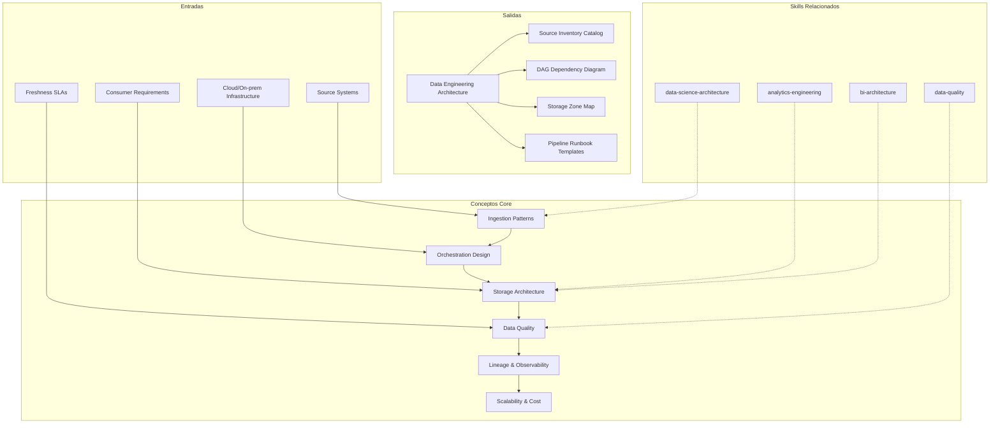

# Data Engineering: Pipeline Architecture & Data Platform Design

Data engineering architecture defines how data is ingested, orchestrated, stored, validated, and observed — the backbone infrastructure that feeds analytics, ML, and operational systems. This skill produces data engineering documentation that enables teams to build reliable, scalable, and cost-efficient data platforms.

## Grounding Guideline

**A pipeline that cannot be observed cannot be trusted.** Data engineering designs how data flows from sources to consumers — with validated quality, traceable lineage, and measurable SLAs at every step. Data does not "arrive" — it is orchestrated.

### Data Engineering Philosophy

1. **Idempotency by design.** Every pipeline can be re-executed without duplicating data. If it is not idempotent, it is not production-ready.
2. **Schema evolution, not schema revolution.** Schemas change — backward/forward compatibility is mandatory. Breaking changes are planned, not surprises.
3. **Data contracts between teams.** The producer defines the contract, the consumer validates it. Without contracts, quality is no one's responsibility.

## Inputs

The user provides a system or project name as `$ARGUMENTS`. Parse `$1` as the **system/project name** used throughout all output artifacts.

**Parameters:**
- `{MODO}`: `piloto-auto` (default) | `desatendido` | `supervisado` | `paso-a-paso`
  - **piloto-auto**: Auto para ingestion patterns y storage design, HITL para orchestration decisions y data contracts.
  - **desatendido**: Zero interruptions. Arquitectura de data platform documentada automáticamente. Assumptions documented.
  - **supervisado**: Autónomo con checkpoint en storage architecture y quality framework.
  - **paso-a-paso**: Confirma cada ingestion pattern, DAG design, storage zone, y quality check.
- `{FORMATO}`: `markdown` (default) | `html` | `dual`
- `{VARIANTE}`: `ejecutiva` (~40% — S1 ingestion + S3 storage + S5 lineage) | `técnica` (full 6 sections, default)

Before generating architecture, detect the project context:

```
!find . -name "*.py" -o -name "*.yaml" -o -name "*.yml" -o -name "Dockerfile" -o -name "*.tf" -o -name "*.sql" | head -30
```

Use detected tools (Airflow, Dagster, Prefect, Spark, Kafka, dbt, etc.) to tailor recommendations.

If reference materials exist, load them:

```
Read ${CLAUDE_SKILL_DIR}/references/pipeline-patterns.md
```

---

## When to Use

- Designing data ingestion pipelines (batch, streaming, CDC)
- Architecting pipeline orchestration with dependency management
- Planning storage architecture (data lake, lakehouse, warehouse zones)
- Building data quality frameworks with validation and profiling
- Establishing lineage tracking and pipeline observability
- Optimizing data platform scalability and cost management

## When NOT to Use

- dbt transformations and data modeling → use analytics-engineering skill
- Dashboard and reporting architecture → use bi-architecture skill
- ML model training and serving pipelines → use data-science-architecture skill
- Application-level software architecture → use software-architecture skill

---

## Delivery Structure: 6 Sections

### S1: Ingestion Patterns

Defines how data enters the platform — sources, methods, schema handling.

**Data contract enforcement at ingestion:**
- Schema registry (Confluent Schema Registry or AWS Glue): enforce backward compatibility by default — new schemas must read old data
- Breaking change detection: CI pipeline validates schema changes against compatibility mode before deployment; block breaking changes to production topics
- Contract specification: producer publishes schema + SLA + ownership; consumer registers dependency; breaking changes require consumer sign-off
- Format selection: AVRO for schema evolution flexibility, Protobuf for performance-critical paths, JSON only for prototyping

**Includes:**
- Source inventory (databases, APIs, files, events, SaaS connectors)
- Ingestion method per source (batch extract, CDC, streaming, webhook)
- Connector selection (Fivetran, Airbyte, custom, native connectors — managed preferred for standard SaaS sources)
- Schema evolution strategy (backward/forward/full compatibility modes per topic)
- Initial load vs incremental strategy (full dump, watermark, CDC log)
- Data format standards (Parquet for analytics, Avro for streaming, Iceberg/Delta for lakehouse)

**Exactly-once delivery patterns:**
- Kafka: enable idempotent producers (`enable.idempotence=true`) + transactional consumers (`isolation.level=read_committed`) for end-to-end exactly-once
- Idempotent sinks: use natural keys + upsert (MERGE) for database sinks; partition-overwrite for object storage sinks
- Deduplication windows: maintain a dedup buffer (Redis set or warehouse staging table) for at-least-once sources; window size = 2x expected max latency
- Design every pipeline stage to be safely replayable — this is the foundational reliability property

**Key decisions:**
- Batch vs CDC vs streaming: latency requirement per source drives selection (daily-acceptable = batch, minutes = CDC, seconds = streaming)
- Managed connectors vs custom: managed for standard SaaS (Fivetran/Airbyte handles 80% of sources); custom only when managed fails
- Schema-on-read vs schema-on-write: schema-on-write preferred for production pipelines; schema-on-read for exploratory

### S2: Orchestration Design

Maps DAG patterns, scheduling, dependency management, and SLA enforcement.

**Orchestrator comparison — select by team profile:**

| Criterion | Airflow | Dagster | Prefect | Mage |
|---|---|---|---|---|
| **Philosophy** | Task-centric DAGs | Asset-centric software-defined data | Flow-centric with dynamic tasks | Notebook-style hybrid |
| **Best for** | Large teams, complex operator ecosystem | Analytics/ML teams, typed data contracts | Event-driven, dynamic workflows | Small teams, rapid prototyping |
| **Local dev** | Heavy (Docker-based) | Lightweight dev server | Lightweight agent | Built-in UI + notebooks |
| **Data contracts** | Convention-based (no native typing) | Native typed inputs/outputs | Pydantic validation | Schema validation |
| **Kubernetes** | Battle-tested KubernetesExecutor | Kubernetes support (newer) | Kubernetes agent | Kubernetes support |
| **Community size** | Largest (10K+ contributors) | Growing rapidly (2K+) | Medium (1.5K+) | Smaller (600+) |
| **Choose when** | Existing Airflow investment, heavy K8s ops | Greenfield, asset-first thinking, dbt integration | Dynamic/event-driven workflows | Data scientists building pipelines |

Practical guidance: run Dagster for new analytics/ML pipelines; keep Airflow for legacy or operator-heavy workflows; trigger across systems via APIs. Migrate incrementally.

**Includes:**
- DAG architecture (pipeline decomposition, task granularity, dependencies)
- Scheduling strategy (cron, event-driven, data-availability triggered)
- Dependency management (cross-DAG dependencies, sensors, external triggers)
- SLA definition and monitoring (pipeline completion time, data freshness guarantees)
- Failure handling (retry policies with exponential backoff, dead-letter queues, alerting, escalation)
- Idempotency design: every task must produce identical results on re-execution (partition-overwrite for batch, upsert for CDC, deduplication windows for streaming)

**Key decisions:**
- Monolithic DAG vs micro-DAGs: micro-DAGs for independent domains; monolithic only when strict ordering is required across domains
- Time-triggered vs event-triggered: time for predictability, event for responsiveness — hybrid is common
- Retry strategy: exponential backoff with max 3 retries; distinguish transient (network, throttle) vs permanent (schema, permission) failures

### S3: Storage Architecture

Designs the data platform storage layers — zones, formats, and lifecycle.

**Lakehouse table format comparison:**

| Criterion | Apache Iceberg | Delta Lake | Apache Hudi |
|---|---|---|---|
| **Multi-engine support** | Strongest (Spark, Flink, Trino, Presto, Dremio, Snowflake) | Spark-native, growing (Trino, Flink via UniForm) | Spark, Flink, Presto |
| **Best for** | Multi-engine analytics, large-scale reads | Databricks ecosystem, streaming + batch | CDC-heavy workloads, record-level upserts |
| **Hidden partitioning** | Yes (partition evolution without rewrite) | No (explicit partition columns) | No (explicit partition columns) |
| **Time travel** | Snapshot-based, branch/tag support | Version-based log | Timeline-based |
| **Compaction** | Automatic + manual | Auto-optimize, Z-order | Inline + async compaction |
| **Catalog** | Nessie, Polaris, HMS, AWS Glue | Unity Catalog, HMS | HMS |
| **Choose when** | Multi-engine is priority, vendor-neutral | Databricks-centric, need Delta Sharing | Heavy CDC from transactional DBs |

Decision guidance: Iceberg is the 2025-2026 momentum leader for multi-engine portability; Delta Lake for Databricks-committed shops; Hudi only for CDC-dominant workloads.

**Includes:**
- Zone architecture (landing/raw → curated/clean → consumption/marts → archive)
- Storage format selection (Parquet for analytics, Avro for streaming, JSON only for prototyping)
- Partitioning strategy (date-based for 80% of cases, hash for high-cardinality joins)
- Catalog management (Unity Catalog, AWS Glue Catalog, Polaris — choose by cloud + engine)
- Data lifecycle (retention policies, archival, deletion, compliance holds)

**Key decisions:**
- Lakehouse is the 2025-2026 baseline: open table formats + catalog on object storage; pure warehouse for teams prioritizing simplicity; pure lake only when cost dominates
- Hot/warm/cold tiering: access frequency drives storage class (S3 Standard → Infrequent Access → Glacier)
- Small file problem: set minimum file size targets (128-256MB for Parquet); schedule compaction for active tables daily, stable tables weekly

### S4: Data Quality Framework

Establishes validation, profiling, and remediation within data pipelines.

**Data observability stack integration:**

| Tool | Focus | Integration | Best For |
|---|---|---|---|
| **Monte Carlo** | Full observability (freshness, volume, schema, distribution) | Native warehouse + orchestrator connectors | Enterprise teams wanting managed observability |
| **Elementary** | dbt-native data observability | dbt package, runs with `dbt test` | dbt-centric teams, budget-conscious |
| **Soda** | Data quality checks as code | YAML-based checks, CI/CD integration | Cross-platform, polyglot teams |
| **Great Expectations** | Programmable data validation | Python library, checkpoint-based | Engineering teams wanting full control |

Selection criteria: Elementary for dbt shops (zero incremental infra); Soda for multi-tool environments; Monte Carlo for enterprise-wide observability; Great Expectations for Python-first teams.

**Includes:**
- Quality checks in pipeline (schema validation, null checks, range validation)
- Profiling integration (automated statistical profiling on ingestion)
- Validation placement (pre-load, post-load, pre-consumption — at minimum validate at zone boundaries)
- Severity classification (critical: block pipeline; warning: log and continue)
- Quarantine pattern (bad records isolated, investigated, reprocessed or discarded)
- Quality metrics per dataset (completeness > 99.5%, timeliness within SLA, uniqueness on keys = 100%)

**Key decisions:**
- Fail-fast vs fail-safe: block pipeline on quality failure for critical datasets; log and continue for non-critical
- Quality SLAs: agreed thresholds per dataset with consumer teams — document in data contracts
- Remediation ownership: data engineering owns pipeline failures; source system team owns data quality at origin

### S5: Lineage & Observability

Tracks data flow, monitors pipeline health, and enables incident response.

**Includes:**
- Lineage tracking (table-level minimum for all paths, column-level for regulated/complex pipelines)
- Lineage tools (OpenLineage for vendor-neutral standard; Marquez for OSS catalog; DataHub/Atlan for enterprise)
- Pipeline monitoring (task duration, success rate, data volume anomalies, SLA compliance)
- Alerting design (PagerDuty/Opsgenie for critical, Slack for warnings; group related alerts to prevent fatigue)
- Incident response (runbook per critical pipeline, escalation paths, post-mortem template)
- Metadata management (technical + business + operational metadata in unified catalog)

**Key decisions:**
- Lineage granularity: table-level is achievable with OpenLineage; column-level requires dedicated tooling investment
- Alert fatigue prevention: group related failures, deduplicate retries, snooze during known maintenance
- Observability tool: Elementary/Soda for data-specific; Datadog/Grafana for infrastructure + data combined

### S6: Scalability & Cost Management

Optimizes data platform for growth while controlling costs.

**Includes:**
- Partitioning and compaction (target 128-256MB files; compact daily for active, weekly for stable)
- Compute scaling (auto-scaling clusters, serverless for bursty workloads, spot instances for fault-tolerant jobs — 60-90% savings)
- Retention policies (90-day hot, 1-year warm, 7-year cold — adjust by compliance requirement)
- Cost attribution (per-pipeline cost tracking via query tags, team chargeback, budget alerts at 80% threshold)
- Capacity planning (growth projections at 6-month intervals, storage forecasting, compute headroom of 30%)
- Performance tuning (parallelism, memory tuning, shuffle optimization, predicate pushdown)

**Key decisions:**
- Spot vs on-demand: spot for batch jobs with checkpointing; on-demand for SLA-critical pipelines
- Cost per GB ingested: track as key platform efficiency metric; benchmark against industry ($0.01-0.10/GB depending on complexity)
- Warehouse isolation: heavy transforms on dedicated compute; ad-hoc on separate auto-suspend cluster

---

## Trade-off Matrix

| Decision | Enables | Constrains | Threshold |
|---|---|---|---|
| **CDC Ingestion** | Low latency, minimal source impact | CDC tool dependency, schema coupling | Transactional DBs with <5min freshness need |
| **Batch Ingestion** | Simple, predictable, easy debugging | Higher latency, full-scan cost | APIs, file drops, daily-freshness acceptable |
| **Lakehouse Architecture** | Unified batch+streaming, ACID, multi-engine | Learning curve, table format maturity | Modern platforms, mixed workloads |
| **Event-Driven Orchestration** | Responsive, decoupled | Harder debugging, eventual consistency | Data-availability triggers, microservice events |
| **Managed Connectors** | Fast setup, low maintenance | Vendor lock-in, limited customization | Standard SaaS sources, team < 5 engineers |
| **Column-Level Lineage** | Precise impact analysis, compliance | Tool cost, implementation effort | Regulated industries, 100+ tables |

---

## Assumptions

- Cloud or on-premise infrastructure is provisioned or being planned
- Source systems identified and accessible (or access being negotiated)
- Team has Python/SQL skills and familiarity with orchestration concepts
- Data consumers (analytics, ML, applications) have defined requirements
- Budget covers compute, storage, and tooling for data platform

## Limits

- Focuses on *data platform and pipelines*, not transformation modeling
- Does not design *consumption layer* (dashboards, KPIs)
- Does not address *ML-specific pipelines* (feature stores, model serving)
- Infrastructure provisioning details (Terraform, networking) are out of scope

---

## Edge Cases

**Greenfield Data Platform:**
Start with managed connectors for quick wins, event-driven architecture for new systems, batch for legacy. Avoid custom connectors until managed options fail. Choose Iceberg as table format for future portability.

**Legacy ETL Migration (Informatica, SSIS, Talend):**
Map existing jobs to modern orchestration. Document undocumented business logic. Run parallel validation before cutover. Expect 20-30% of logic to be obsolete.

**Multi-Cloud Data Platform:**
Data ingested from AWS, processed in GCP, served from Azure. Address cross-cloud networking costs ($0.01-0.02/GB transfer), format compatibility (use Iceberg for portability), and unified catalog.

**Real-Time Streaming at Scale:**
Kafka/Kinesis with millions of events per second. Address exactly-once semantics, consumer group management, dead-letter queues. Backpressure handling: bounded buffers, flow control that slows producers when consumers lag, consumer lag as first-class metric.

**Compliance-Heavy Environment (GDPR, CCPA, HIPAA):**
Data must be classifiable, deletable, and auditable. Support PII tagging in catalog, right-to-delete pipelines (Iceberg row-level deletes), and access logging at record level.

---

## Validation Gate

Before finalizing delivery, verify:

- [ ] Every source has defined ingestion method with freshness SLA
- [ ] Schema registry enforces compatibility; breaking changes blocked in CI
- [ ] Orchestration tasks are idempotent and retryable
- [ ] SLAs defined and monitored with alerting (PagerDuty/Slack)
- [ ] Storage zones have clear boundaries, naming conventions, and lifecycle policies
- [ ] Data quality checks exist at zone boundaries (landing → curated, curated → marts)
- [ ] Lineage tracked at minimum table level for all critical paths
- [ ] Data observability tool selected and integrated (Elementary, Soda, or Monte Carlo)
- [ ] Cost attribution enables per-pipeline visibility via query tags
- [ ] Every pipeline stage is safely replayable (idempotent writes)

---

## Output Format Protocol

| Format | Default | Description |
|--------|---------|-------------|
| `markdown` | ✅ | Rich Markdown + Mermaid diagrams. Token-efficient. |
| `html` | On demand | Branded HTML (Design System). Visual impact. |
| `dual` | On demand | Both formats. |

Default output is Markdown with embedded Mermaid diagrams. HTML generation requires explicit `{FORMATO}=html` parameter.

## Output Artifact

**Primary:** `A-01_Data_Engineering.html` — Ingestion patterns, orchestration design, storage architecture, quality framework, lineage and observability, scalability and cost management.

**Secondary:** Source inventory catalog, DAG dependency diagram, storage zone map, pipeline runbook templates, cost attribution dashboard spec.

## Edge Cases

| Case | Handling Strategy |
|---|---|
| Greenfield data platform | Managed connectors for quick wins, event-driven for new systems, batch for legacy. Iceberg as table format for future portability. |
| Legacy ETL migration (Informatica, SSIS, Talend) | Map existing jobs to modern orchestration. Document undocumented business logic. Parallel validation before cutover. 20-30% obsolete logic expected. |
| Multi-cloud data platform | Cross-cloud networking costs ($0.01-0.02/GB transfer). Iceberg for format portability. Unified catalog (Polaris or similar). |
| Real-time streaming at scale (millions events/sec) | Kafka/Kinesis with exactly-once semantics. Consumer group management. Dead-letter queues. Backpressure with bounded buffers and consumer lag as primary metric. |
| Compliance-heavy (GDPR, CCPA, HIPAA) | PII tagging in catalog, right-to-delete pipelines (Iceberg row-level deletes), record-level access logging. Mandatory data classification. |

## Decisions and Trade-offs

| Decision | Discarded Alternative | Justification |
|---|---|---|
| Idempotency as foundational property | At-least-once without deduplication | A replayable pipeline without duplicating data is the base reliability requirement. Without idempotency, re-executions corrupt data. |
| Lakehouse as 2025-2026 baseline | Pure data warehouse, pure data lake | Lakehouse (open table formats + catalog on object storage) unifies batch + streaming, provides ACID, and supports multi-engine. Warehouse for teams that prioritize simplicity. |
| Data contracts between teams (producer defines) | Schema-on-read without contracts | Without contracts, quality is no one's responsibility. Producer publishes schema + SLA + ownership; consumer registers dependency; breaking changes require sign-off. |
| Dagster for greenfield, Airflow for legacy | Single orchestrator for everything | Dagster is asset-centric with typed data contracts (ideal for analytics/ML). Airflow has the largest ecosystem (ideal for operator-heavy workflows). Coexistence via APIs. |

## Knowledge Graph



## Output Templates

**Formato Markdown (default):**

```
# Data Engineering Architecture: {project}
## S1: Ingestion Patterns
### Source Inventory
| Source | Type | Method | Freshness SLA | Connector |
...
### Schema Registry & Data Contracts
### Exactly-Once Delivery Patterns
## S2: Orchestration Design
### Orchestrator Selection: {Airflow|Dagster|Prefect}
### DAG Architecture (Mermaid)
### SLA Monitoring & Alerting
## S3: Storage Architecture
### Zone Architecture (Landing > Curated > Consumption > Archive)
### Table Format: {Iceberg|Delta|Hudi}
### Lifecycle Policies
## S4: Data Quality Framework
### Quality Checks per Zone Boundary
### Observability Stack Selection
## S5: Lineage & Observability
### Lineage Tracking (OpenLineage)
### Pipeline Monitoring Dashboard
## S6: Scalability & Cost Management
### Cost Attribution per Pipeline
```

**Formato HTML (bajo demanda):**

```
A-01_Data_Engineering_{project}_{WIP}.html
```
HTML self-contained branded (Design System MetodologIA v5). Light-First Technical. Incluye DAG dependency diagram interactivo, storage zone map visual, y pipeline observability dashboard layout. WCAG AA, responsive, print-ready.

**Formato XLSX (bajo demanda):**

```
Sheet 1: Source Inventory — source, type, method, freshness SLA, connector, owner
Sheet 2: Pipeline Catalog — pipeline name, DAG, sources, targets, schedule, SLA, owner
Sheet 3: Storage Zones — zone, format, partitioning, retention, lifecycle
Sheet 4: Quality Rules — dataset, check type, threshold, severity, remediation
Sheet 5: Lineage Map — source table, transformation, target table, pipeline
Sheet 6: Cost Attribution — pipeline, compute type, avg duration, estimated cost/run
```

**Formato DOCX (bajo demanda):**

```
A-01_Data_Engineering_{project}_{WIP}.docx
```
Via python-docx con Design System MetodologIA v5. Cover page, TOC auto, headers/footers branded, tablas zebra. Poppins headings (navy), Trebuchet MS body, gold accents.

**Formato PPTX (bajo demanda):**

```
{fase}_Data_Engineering_{cliente}_{WIP}.pptx
```
Via python-pptx con MetodologIA Design System v5. Navy gradient slide master, Poppins titles, Trebuchet MS body, gold accents. Máx 20 slides ejecutivo / 30 técnico. Speaker notes con referencias de evidencia.

## Evaluacion

| Dimension | Peso | Criterio |
|---|---|---|
| Trigger Accuracy | 10% | Activacion correcta ante keywords de data pipelines, ingestion, orchestration, data lake, lakehouse, Airflow, Dagster, CDC, lineage, pipeline SLAs. |
| Completeness | 25% | 6 secciones cubren ingestion, orchestration, storage, quality, lineage, y scalability. Schema registry y data contracts incluidos. |
| Clarity | 20% | Comparison matrices (orchestrators, table formats, quality tools) con criterios de seleccion claros. Decision rules por context. |
| Robustness | 20% | Edge cases (greenfield, legacy ETL, multi-cloud, streaming at scale, compliance) manejados. Exactly-once delivery patterns documentados. |
| Efficiency | 10% | Variante ejecutiva reduce a S1+S3+S5 (~40%). Context detection automatica adapta a stack detectado. |
| Value Density | 15% | Data contracts con enforcement en CI. Orchestrator comparison accionable. Cost attribution per-pipeline. Pipeline runbook templates. |

**Umbral minimo: 7/10.** Debajo de este umbral, revisar idempotency design y data contract enforcement.

---
**Autor:** Javier Montano · Comunidad MetodologIA | **Ultima actualizacion:** 15 de marzo de 2026
