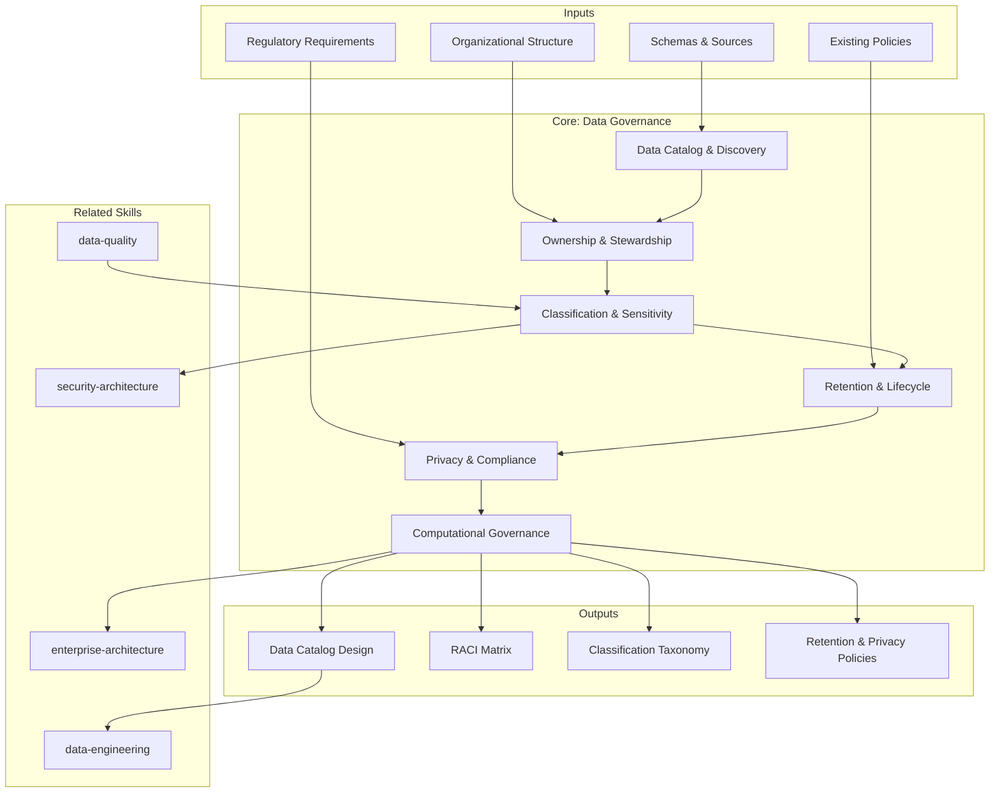

# Data Governance: Catalog, Ownership, Classification & Compliance

Data governance defines how data assets are discovered, owned, classified, retained, and protected across an organization. This skill produces governance frameworks that enable trust in data, regulatory compliance, and scalable self-serve data access.

## Principio Rector

**Datos sin dueño son datos sin calidad.** El modelo de ownership se establece ANTES de catalogar. La clasificación determina la protección — no al revés. Privacy by design no es un afterthought sino el punto de partida de cada pipeline. Cada activo de datos tiene un dueño con nombre y apellido, un nivel de clasificación, y una política de retención vinculada a regulación específica.

## Inputs

The user provides an organization or data domain as `$ARGUMENTS`. Parse `$1` as the **organization/domain name** used throughout all output artifacts.

**Parameters:**
- `{MODO}`: `piloto-auto` (default) | `desatendido` | `supervisado` | `paso-a-paso`
  - **piloto-auto**: Auto para inventario y clasificación, HITL para ownership assignments y privacy decisions.
  - **desatendido**: Cero interrupciones. Catálogo, clasificación y políticas generados automáticamente. Supuestos documentados.
  - **supervisado**: Autónomo con checkpoint en classification taxonomy y retention policies.
  - **paso-a-paso**: Confirma cada asset, clasificación, owner y política de retención.
- `{FORMATO}`: `markdown` (default) | `html` | `dual`
- `{VARIANTE}`: `ejecutiva` (~40% — S1 catalog + S3 classification + S5 privacy compliance) | `técnica` (full 6 sections, default)

Before generating governance artifacts, detect the data landscape:

```
!find . -name "*.sql" -o -name "*.py" -o -name "*.yaml" -o -name "*.json" -o -name "schema*" | head -30
```

Use detected schemas, pipelines, and data sources to tailor catalog structure, classification rules, and ownership recommendations.

If reference materials exist, load them:

```
Read ${CLAUDE_SKILL_DIR}/references/governance-frameworks.md
```

---

## Framework Comparison

Select or combine based on organizational context. These are complementary, not mutually exclusive.

| Criterion | DAMA DMBOK 3.0 | DCAM (EDM Council) | ISO 38505 | COBIT |
|---|---|---|---|---|
| **Scope** | 11 knowledge areas, full data management lifecycle | Capability assessment and benchmarking | IT governance extension for data, board-level | IT governance + controls, risk-oriented |
| **Best for** | Comprehensive data management programs | Regulated industries needing peer comparison | Orgs with existing ISO governance | Compliance-driven, audit-heavy contexts |
| **Maturity model** | No built-in assessment | Yes — assessment-based, benchmarkable | Strategic guidance, less operational detail | CMMI-aligned capability model |
| **Certification** | CDMP (individual) | DCAM assessment (organizational) | ISO audit certification | COBIT Foundation (individual) |
| **AI/Cloud readiness** | DMBOK 3.0 (2025) adds AI governance, cloud-native | Updated for modern data platforms | Lags on modern architecture | Limited data-specific guidance |
| **Typical combination** | Use as overarching guide | Pair with DMBOK to measure maturity | Layer on for board-level accountability | Layer on for audit controls |

**Practical recommendation:** Use DAMA DMBOK as the knowledge base, DCAM to assess maturity, and supplement with ISO/COBIT for regulatory or board-level requirements.

---

## Governance Maturity Model

Assess current state before prescribing solutions. 5-level model aligned with DAMA DMBOK and CMMI.

| Level | Name | Characteristics | Governance Style | Acceptance Criteria |
|---|---|---|---|---|
| **1** | Initial | No formal governance, tribal knowledge, reactive | None — start with data inventory | <20% assets cataloged, no formal owners |
| **2** | Developing | Emerging awareness, fragmented policies, siloed ownership | Centralized — establish foundations | 20-50% assets cataloged, RACI drafted |
| **3** | Defined | Documented policies, cross-functional alignment, RACI in place | Centralized with domain input | >50% assets cataloged, policies enforced manually |
| **4** | Managed | Integrated into operations, metrics-driven, automated enforcement | Federated — domains adopt standards | >80% assets cataloged, automated classification |
| **5** | Optimizing | Continuous improvement, predictive compliance, self-serve | Computational — policy as code | >95% assets cataloged, <1% policy violations |

**Assessment method:** Score each criterion (policy documentation, ownership coverage, classification completeness, automation ratio, compliance incident rate) from 1-5. Average determines level. Target: advance one level per 6-12 months.

---

## When to Use

- Building or improving a data catalog with metadata management
- Establishing data ownership and stewardship across domains
- Classifying data by sensitivity (PII, PHI, financial, confidential)
- Designing retention and lifecycle policies for regulatory compliance
- Mapping privacy requirements (GDPR, CCPA, LGPD) to data assets
- Implementing federated governance in a data mesh architecture

## When NOT to Use

- Designing data pipelines and ETL/ELT architecture (data-engineering skill)
- Validating data quality rules and monitoring (data-quality skill)
- Enterprise-wide capability mapping (enterprise-architecture skill)
- Infrastructure and storage design (infrastructure-architecture skill)

---

## Delivery Structure: 6 Sections

### S1: Data Catalog & Discovery

Maps data assets across the organization.

**Catalog platform selection criteria:**

| Criterion | Atlan | Alation | DataHub (OSS) | OpenMetadata (OSS) |
|---|---|---|---|---|
| **Deployment** | SaaS | SaaS / On-prem | Self-hosted | Self-hosted |
| **Auto-cataloging** | Yes, 50+ connectors | Yes, broad connectors | Yes, plugin-based | Yes, 30+ connectors |
| **Lineage** | Column-level | Column-level | Table + column | Table + column |
| **Search UX** | Natural language, AI-powered | Business glossary-driven | Faceted search | Faceted search |
| **Cost** | $$$  (enterprise SaaS) | $$$$ (enterprise) | Free (infra cost) | Free (infra cost) |
| **Best for** | Modern data stack, mid-large orgs | Large enterprise, compliance | Engineering-led, cost-conscious | Small-mid orgs, Airflow-native |

**Includes:**
- Asset inventory: databases, tables, files, APIs, streams, reports
- Metadata strategy: technical (schema), business (definitions), operational (freshness, usage)
- Auto-cataloging: crawlers, schema detection, tag inference
- Lineage integration: source-to-consumption tracing, impact analysis

**Key decisions:**
- Active vs passive cataloging: crawl-on-schedule vs event-driven registration
- Lineage granularity: table-level (fast) vs column-level (precise) vs row-level (expensive)
- Catalog scope: start with critical data elements, expand iteratively

### S2: Ownership & Stewardship Model

Defines who is accountable for data assets and who maintains them.

**Includes:**
- Domain ownership model: each business domain owns its data products
- Steward role: responsibilities, authority, time commitment (minimum 20% allocation)
- RACI matrix: data owner, steward, consumer, platform team, compliance
- Escalation paths: quality issues, access disputes, classification disagreements
- Governance council: composition, cadence (monthly), decision authority

**Key decisions:**
- Centralized vs federated ownership: single governance team vs domain autonomy
- Owner authority: can owners restrict access, define SLAs, deprecate assets?
- Steward capacity: dedicated role vs part-time (dedicated required at Level 4+)
- Accountability metrics: ownership coverage %, issue resolution time (target: <48h)

### S3: Classification & Sensitivity

Assigns sensitivity tiers enabling proportional security and handling.

**Includes:**
- Taxonomy: Public, Internal, Confidential, Restricted, Highly Restricted
- PII detection rules: name, email, SSN, phone, address, biometric, IP address
- Automated tagging: regex patterns for structured PII, ML classifiers (Presidio, Google DLP, AWS Macie) for unstructured
- Handling rules per tier: encryption requirements, masking rules, access control, audit logging
- Reclassification triggers: schema changes, new regulations, data repurposing

**Key decisions:**
- Granularity: table-level vs column-level classification (column-level required for GDPR Article 30 compliance)
- Automation vs manual review: automate detection, human-approve classification changes
- Cross-border sensitivity: data classified differently in different jurisdictions
- Derived data: classification of aggregated or anonymized datasets (anonymization must be irreversible to downgrade classification)

### S4: Retention & Lifecycle

Governs how long data is kept, when archived, when purged.

**Includes:**
- Retention policy matrix: data type x regulation x business need = retention period
- Archival strategy: cold storage tiers, compression, retrieval SLAs
- Purge procedures: hard delete vs soft delete, verification, audit trail
- Legal hold management: litigation hold process, scope definition, release
- Cost modeling: storage cost per retention tier, projected growth, optimization targets

**Key decisions:**
- Default retention: conservative (keep longer, higher cost) vs minimalist (delete sooner, privacy-friendly)
- Archival accessibility: hours-to-restore tolerance for archived data
- Purge verification: who approves irreversible deletion? (minimum: data owner + compliance)
- Regulatory conflicts: when retention and privacy requirements conflict, document resolution with legal counsel

### S5: Privacy & Compliance

Maps privacy regulations to data assets and operationalizes compliance workflows.

**Regulation mapping (specific provisions):**

| Requirement | GDPR | CCPA | LGPD |
|---|---|---|---|
| **Processing records** | Article 30 — written records of processing activities | Section 1798.100 — disclosure of data categories | Article 37 — processing activity records |
| **Right to access** | Article 15 — 30-day response | Section 1798.110 — 45-day response | Article 18 — 15-day response |
| **Right to delete** | Article 17 — erasure unless legal basis | Section 1798.105 — deletion with exceptions | Article 18(IV) — elimination |
| **Consent** | Article 7 — explicit, granular, withdrawable | Opt-out model (no prior consent for most) | Article 8 — explicit, specific purpose |
| **Breach notification** | Article 33 — 72 hours to authority | Section 1798.150 — reasonable security | Article 48 — reasonable timeframe |
| **Cross-border transfer** | Articles 44-49 — adequacy, SCCs, BCRs | No restriction (but state laws vary) | Article 33 — adequate protection |

**Includes:**
- Consent management: purpose-based consent, granular opt-in/out, consent lifecycle
- DSAR workflows: discovery, extraction, redaction, response within regulatory timeframe
- DPIA: trigger criteria, assessment template, risk scoring
- Audit trail: who accessed what, when, for what purpose, immutable logging

**Key decisions:**
- Privacy by design vs retrofit: build into pipelines (strongly preferred) or apply after
- Anonymization vs pseudonymization: irreversible (lower classification) vs re-identifiable with key (maintains classification)
- DSAR SLA: regulatory maximum is the ceiling; target 50% of regulatory window for internal processing

### S6: Computational Governance & Data Products

Applies governance as executable code in federated architectures.

**Data product thinking:** Each dataset treated as a product with:
- Owner and consumer contracts (SLOs for freshness, completeness, accuracy)
- Published schema with semantic versioning
- Discovery metadata (description, tags, lineage, usage statistics)
- Quality score (composite metric visible in catalog)

**Computational policies (policy as code):**
- **OPA/Rego:** General-purpose policy engine for access control, metadata validation, lifecycle state transitions. Evaluate at query time or in CI/CD gates.
- **Cedar (AWS):** Authorization policy language for fine-grained access control.
- **Schema validation in CI/CD:** Block non-compliant data products at deploy time. Validate naming conventions, required metadata fields, classification tags.
- **Automated PII detection on publish:** Scan new/changed columns with Presidio, DLP API, or regex; tag, mask, or reject based on classification policy.
- **SLA enforcement:** Freshness, completeness, accuracy checks run continuously; breach triggers escalation per data-quality SLA tiers.

**Global vs local policy boundary:**
- **Global (non-negotiable):** Classification taxonomy, privacy rules, naming conventions, minimum metadata requirements, PII handling
- **Local (domain-decides):** Schema design, refresh cadence, tool selection, access approval workflow

**Key decisions:**
- Policy maturity progression: manual checklists (Level 2) -> automated gates (Level 3) -> continuous compliance (Level 4) -> predictive governance (Level 5)
- Central team scope: enablement (tooling, training, templates) vs enforcement (blocking gates)
- Cross-domain data products: ownership of joins/aggregations follows the consumer-creates-derived-product model

---

## Trade-off Matrix

| Decision | Enables | Constrains | When to Use |
|---|---|---|---|
| **Centralized Governance** | Consistency, simpler audits | Bottleneck, slower iteration | Small orgs, highly regulated, Level 1-2 |
| **Federated Governance** | Domain autonomy, scalability | Inconsistency risk, platform investment | Large orgs, data mesh, Level 4-5 |
| **Automated Classification** | Speed, coverage, consistency | False positives, tuning effort | Large data estates, frequent schema changes |
| **Manual Classification** | Accuracy, business context | Slow, doesn't scale | Small data estates, initial taxonomy |
| **Aggressive Retention** | Regulatory safety, historical analysis | Storage costs, privacy risk | Regulated industries, audit-heavy |
| **Minimal Retention** | Cost savings, privacy compliance | Lost historical data | Privacy-first orgs, GDPR-sensitive |

---

## Assumptions & Limits

- Assumes organizational commitment to data governance exists (executive sponsor identified)
- Classification taxonomy requires domain expert input — AI can propose, humans must validate
- Retention policies must be reviewed by legal counsel; this skill provides structure, not legal advice
- Maturity model assessment is point-in-time; re-assess quarterly for accuracy
- Cross-cloud governance assumes catalog tooling supports multi-cloud metadata federation

## Casos Borde

| Caso | Estrategia de Manejo |
|---|---|
| Organizacion greenfield sin activos de datos | Iniciar con inventario de datos; asignar owners iniciales; definir clasificacion minima viable (3 tiers); evitar sobre-ingenieria de gobernanza para datos que aun no existen |
| Industria altamente regulada (financiero, salud) | Multiples regulaciones superpuestas; mapear cada regulacion a elementos de datos especificos; documentar resolucion de conflictos retencion-vs-privacidad con legal counsel |
| Transicion a data mesh | Modelos paralelos durante transicion; platform team codifica politicas como checks automatizados; dominios adoptan incrementalmente (Level 3 minimo antes de auto-gobernarse) |
| Multi-cloud / hybrid data estate | Catalogo abstrae sobre ubicaciones cloud; lineage cross-cloud requiere integration adapters; clasificacion y retencion location-aware para data residency |
| Fusiones y adquisiciones (M&A) | Priorizar descubrimiento de activos (inventariar ambos estates en 30 dias); harmonizar clasificacion y ownership; asignar owners interinos inmediatamente; 6-12 meses para integracion completa |

## Decisiones y Trade-offs

| Decision | Alternativa Descartada | Justificacion |
|---|---|---|
| Ownership model establecido ANTES de catalogar | Catalogar primero, asignar owners despues | Datos sin dueno son datos sin calidad; el modelo de ownership determina quien es responsable de la clasificacion, retencion y calidad |
| Clasificacion a nivel de columna (no solo tabla) | Clasificacion solo a nivel de tabla | GDPR Article 30 requiere granularidad a nivel de campo para PII; tabla-level no cumple y no permite masking selectivo |
| Privacy by design integrado en pipelines | Privacy como retrofit post-implementacion | Retrofit es 5-10x mas costoso y deja ventanas de exposicion; privacy by design es el punto de partida de cada pipeline |
| Gobernanza federada para organizaciones Level 4+ | Gobernanza centralizada para todos los niveles | La gobernanza centralizada no escala en organizaciones grandes; la federada habilita autonomia de dominio con estandares globales |

## Knowledge Graph



## Output Templates

| Formato | Nombre | Contenido |
|---|---|---|
| **Markdown** | `A-01_Data_Governance_Framework.md` | Framework completo con catalog design, ownership model, classification taxonomy, retention matrix, privacy compliance workflows y data mesh governance strategy. Diagramas Mermaid de ownership model y classification flow. |
| **XLSX** | `A-01_Data_Governance_Matrix.xlsx` | Matriz interactiva con inventario de activos, clasificacion por columna, owners asignados, politicas de retencion por regulacion, y compliance status por dataset. |
| **HTML** | `A-01_Data_Governance_Framework_{cliente}_{WIP}.html` | Mismo contenido en HTML branded (Design System MetodologIA v5). Light-First Technical, self-contained, WCAG AA, responsive. Incluye classification taxonomy visual, ownership RACI interactivo, y retention policy matrix filtrable por regulacion. |
| **DOCX** | `{fase}_Data_Governance_Framework_{cliente}_{WIP}.docx` | Documento formal via python-docx (Design System MetodologIA v5). Cover page, TOC auto, headers/footers branded, tablas zebra. Poppins headings (navy), Montserrat body, gold accents. |
| **PPTX** | `{fase}_Data_Governance_Framework_{cliente}_{WIP}.pptx` | Via python-pptx con MetodologIA Design System v5. Navy gradient slide master, Poppins titles, Montserrat body, gold accents. Máx 20 slides ejecutivo / 30 técnico. Speaker notes con referencias de evidencia. |

## Evaluacion

| Dimension | Peso | Criterio |
|---|---|---|
| Trigger Accuracy | 10% | Descripcion activa triggers correctos (data catalog, ownership, classification, GDPR, data mesh, PII) sin falsos positivos con data-quality o enterprise-architecture |
| Completeness | 25% | Las 6 secciones cubren catalogo, ownership, clasificacion, retencion, privacy y computational governance sin huecos; todos los dominios de datos representados |
| Clarity | 20% | Instrucciones ejecutables sin ambiguedad; clasificacion con tiers y handling rules claros; regulaciones mapeadas a provisiones especificas; RACI con roles concretos |
| Robustness | 20% | Maneja greenfield, regulacion estricta, transicion data mesh, multi-cloud y M&A con estrategias diferenciadas |
| Efficiency | 10% | Proceso no tiene pasos redundantes; variante ejecutiva reduce a S1+S3+S5 sin perder catalogo, clasificacion y compliance |
| Value Density | 15% | Cada seccion aporta valor practico directo; maturity model y regulation mapping son herramientas de posicionamiento y compliance inmediata |

**Umbral minimo: 7/10.**

---

## Validation Gate

Before finalizing delivery, verify:

- [ ] Data catalog covers critical data elements with technical and business metadata
- [ ] Every data domain has an identified owner and steward
- [ ] Classification taxonomy defined with clear tier boundaries and handling rules
- [ ] Retention policies map to specific regulatory requirements with business justification
- [ ] Privacy workflows (DSAR, consent) are operationalized with SLAs, not just documented
- [ ] Federated governance defines global vs local policy boundaries explicitly
- [ ] At least one computational policy implemented or specified (schema validation, PII detection)
- [ ] Escalation paths clear for disputes and incidents
- [ ] Cost implications of retention and storage quantified
- [ ] Framework phased for incremental adoption (target: advance one maturity level per 6-12 months)

## Output Format Protocol

| Format | Default | Description |
|--------|---------|-------------|
| `markdown` | Yes | Markdown con Mermaid embebido (ownership model, classification flow). |
| `html` | On demand | Branded HTML (Design System). Visual impact. |
| `dual` | On demand | Both formats. |

Default output is Markdown with embedded Mermaid diagrams. HTML generation requires explicit `{FORMATO}=html` parameter.

## Output Artifact

**Primary:** `A-01_Data_Governance_Framework.html` -- Data catalog design, ownership model, classification taxonomy, retention matrix, privacy compliance workflows, data mesh governance strategy.

**Secondary:** Classification taxonomy document, RACI matrix, retention policy matrix, DSAR workflow diagram, OPA/Rego policy templates, catalog evaluation scorecard.

---
**Autor:** Javier Montaño | **Última actualización:** 12 de marzo de 2026
