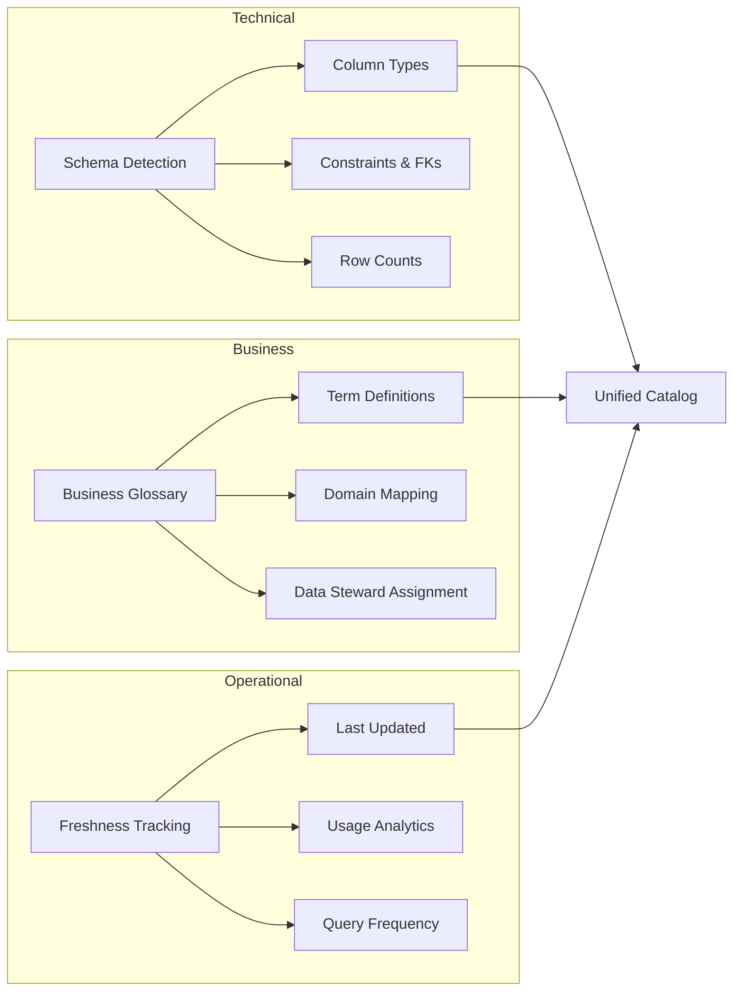
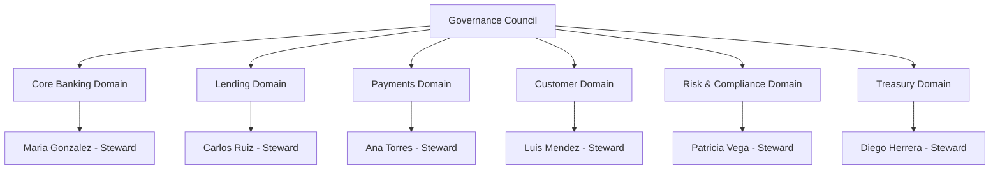
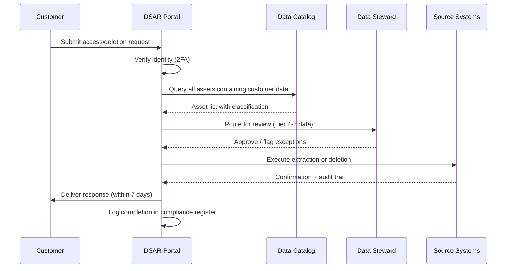

# Data Governance Framework — Acme Corp Banking Modernization

**Proyecto:** Acme Corp Banking Modernization
**Variante:** Tecnica (full)
**Fecha:** 12 de marzo de 2026
**Nivel de madurez actual:** 2 (Developing)

---

## S1: Data Catalog & Discovery

### Asset Inventory

Acme Corp operates 14 core banking databases, 6 data warehouses, and 23 downstream reporting systems. The data estate spans on-premises Oracle instances and cloud-native PostgreSQL on AWS RDS.

| Asset Category | Count | Cataloged (%) | Critical Assets |
|---|---|---|---|
| Core Banking Tables | 342 | 35% | accounts, transactions, customers, loans |
| Data Warehouse Views | 187 | 22% | risk_aggregates, regulatory_reports, customer_360 |
| API Data Sources | 48 | 10% | payment_gateway, credit_bureau, KYC_provider |
| File-Based Feeds | 31 | 5% | SWIFT_messages, ACH_batches, FX_rate_feeds |
| ML Feature Stores | 12 | 0% | fraud_features, credit_scoring_features |

### Catalog Platform Recommendation

Given Acme Corp's hybrid infrastructure and regulatory requirements, **DataHub (OSS)** is recommended for Phase 1 with a migration path to **Atlan** once catalog maturity reaches Level 3.

### Metadata Strategy

### Lineage Integration

Column-level lineage is required for GDPR Article 30 compliance. The lineage graph covers source-to-consumption tracing across 4 layers:

| Layer | Source | Lineage Tool | Granularity |
|---|---|---|---|
| Ingestion | Oracle CDC, SWIFT feeds | Apache Atlas | Table-level |
| Transformation | dbt models, Spark jobs | dbt lineage + DataHub | Column-level |
| Serving | PostgreSQL views, Redis cache | DataHub API | Column-level |
| Consumption | Tableau dashboards, ML pipelines | Tableau Metadata API | Dashboard-to-column |

---

## S2: Ownership & Stewardship Model

### Domain Ownership Matrix

| Domain | Data Owner | Data Steward | Steward Allocation | Key Assets |
|---|---|---|---|---|
| Core Banking | VP Retail Banking | Maria Gonzalez | 40% | accounts, transactions, balances |
| Lending | Director Credit Risk | Carlos Ruiz | 30% | loans, collateral, amortization |
| Payments | Head of Payments | Ana Torres | 30% | transfers, SWIFT, ACH, FX |
| Customer | Chief Customer Officer | Luis Mendez | 40% | customers, KYC, preferences |
| Risk & Compliance | Chief Risk Officer | Patricia Vega | 50% | risk_scores, regulatory_reports |
| Treasury | CFO | Diego Herrera | 20% | positions, hedging, liquidity |

### RACI Matrix

| Activity | Data Owner | Data Steward | Platform Team | Compliance | Consumers |
|---|---|---|---|---|---|
| Define classification | A | R | C | C | I |
| Approve access requests | A | R | I | C | I |
| Maintain metadata | I | A/R | C | I | I |
| Resolve quality issues | I | A | R | I | C |
| Privacy impact assessment | C | C | I | A/R | I |
| Deprecate datasets | A | R | C | C | I |

### Governance Council

- **Composition:** CRO (chair), domain data owners, CISO, Head of Compliance, Platform Engineering lead
- **Cadence:** Monthly; emergency sessions within 24h for breach incidents
- **Decision authority:** Classification disputes, cross-domain access, retention exceptions, new regulation adoption

---

## S3: Classification & Sensitivity

### Classification Taxonomy

| Tier | Label | Examples at Acme Corp | Encryption | Access Control | Audit |
|---|---|---|---|---|---|
| 5 | Highly Restricted | SSN, biometric data, authentication keys | AES-256 at rest + TLS 1.3 in transit | Named individuals only, MFA | Every access logged |
| 4 | Restricted | Account balances, loan amounts, credit scores | AES-256 at rest + TLS 1.3 | Role-based, need-to-know | Every access logged |
| 3 | Confidential | Customer names, addresses, phone numbers | AES-256 at rest | Role-based | Weekly audit |
| 2 | Internal | Branch codes, product catalogs, org charts | TLS in transit | Employee access | Monthly audit |
| 1 | Public | Published interest rates, branch locations | None required | Open | None |

### PII Detection Rules

| PII Type | Detection Method | Regex Pattern | False Positive Rate |
|---|---|---|---|
| SSN | Regex + context | `\d{3}-\d{2}-\d{4}` | 2.1% |
| Credit Card | Luhn + regex | `\d{4}[\s-]?\d{4}[\s-]?\d{4}[\s-]?\d{4}` | 0.8% |
| Email | Regex | `[\w.-]+@[\w.-]+\.\w+` | 0.3% |
| Phone (CO) | Regex + country code | `\+57[\s-]?\d{10}` | 1.5% |
| IBAN | Regex + checksum | `[A-Z]{2}\d{2}[A-Z0-9]{4}\d{7}([A-Z0-9]?){0,16}` | 0.5% |

### Automated Classification Pipeline

Acme Corp uses **AWS Macie** for S3 data lakes and **Presidio** (OSS) for PostgreSQL databases. Classification runs on every schema change and weekly full scans.

---

## S4: Retention & Lifecycle

### Retention Policy Matrix

| Data Category | Regulation | Business Need | Retention Period | Archive Tier | Purge Method |
|---|---|---|---|---|---|
| Transaction records | SFC Circular 007 | Audit trail | 10 years | S3 Glacier after 2 years | Hard delete + audit log |
| Customer PII | Habeas Data (CO) | Customer service | Active + 5 years | Cold storage after 3 years | Cryptographic erasure |
| KYC documents | SARLAFT | AML compliance | 20 years | S3 Glacier Deep Archive | Hard delete with legal hold check |
| Session logs | Internal policy | Security analysis | 90 days | None | Auto-purge |
| Credit bureau pulls | Credit bureau agreement | Underwriting | 2 years | None | Soft delete + 30-day grace |
| Marketing consent | Habeas Data (CO) | Campaign targeting | Until withdrawal + 1 year | None | Hard delete on withdrawal |

### Storage Cost Projection

| Year | Active Storage (TB) | Archive (TB) | Monthly Cost (USD) | Cumulative Savings vs. No-Archive |
|---|---|---|---|---|
| 2026 | 48 | 12 | $14,200 | — |
| 2027 | 62 | 31 | $16,800 | $22,400 |
| 2028 | 78 | 55 | $19,100 | $51,200 |

---

## S5: Privacy & Compliance

### Regulation Mapping for Acme Corp

Acme Corp operates in Colombia (Habeas Data Law 1581/2012) with international correspondent banking (GDPR exposure via EU counterparties).

| Requirement | Habeas Data (CO) | GDPR (EU exposure) | Acme Corp Implementation |
|---|---|---|---|
| Processing records | Required (SIC registration) | Article 30 | Centralized processing register in DataHub |
| Right to access | 10 business days | 30 calendar days | Automated DSAR portal, 7-day SLA |
| Right to delete | Upon request + legal basis check | Article 17 | Cryptographic erasure pipeline |
| Consent | Explicit, purpose-specific | Article 7 — granular, withdrawable | Purpose-based consent management (OneTrust) |
| Breach notification | SIC notification + affected individuals | 72 hours to authority | Incident response playbook, <48h target |
| Cross-border transfer | Authorization from SIC required | SCCs or adequacy decision | Data residency in AWS Bogota (sa-east-1) |

### DSAR Workflow

---

## S6: Computational Governance & Data Products

### Data Product Catalog

| Data Product | Owner Domain | Consumers | Freshness SLA | Quality Score |
|---|---|---|---|---|
| Customer 360 | Customer | Risk, Marketing, Lending | 15 min | 94.2% |
| Transaction Ledger | Core Banking | Payments, Treasury, Risk | Real-time | 99.1% |
| Credit Risk Score | Risk & Compliance | Lending, Collections | 1 hour | 97.8% |
| Regulatory Report Pack | Risk & Compliance | External (SFC, SIC) | Daily | 99.5% |
| Branch Performance | Core Banking | Executive, Operations | 4 hours | 91.3% |

### Policy-as-Code Implementation

Global policies enforced via OPA/Rego at the data platform layer:

| Policy | Scope | Enforcement Point | Action on Violation |
|---|---|---|---|
| PII columns must have classification tag | All tables | CI/CD (dbt deploy) | Block deployment |
| Tier 4-5 data requires encryption at rest | All storage | Infrastructure provisioning | Reject unencrypted resources |
| Every dataset must have an owner | All data products | Catalog registration | Block publishing |
| Retention policy must be assigned | All tables | Quarterly audit | Alert steward, escalate at 30 days |
| Cross-border data requires SIC authorization | International transfers | API gateway | Block transfer + alert compliance |

### Global vs. Local Policy Boundary

| Policy Type | Scope | Authority | Examples |
|---|---|---|---|
| Global (non-negotiable) | All domains | Governance Council | Classification taxonomy, PII handling, naming conventions, retention minimums |
| Local (domain-decides) | Per domain | Domain Data Owner | Schema design, refresh cadence, internal access workflow, tool selection |

---

## Conclusions

### Current State Assessment: Level 2 (Developing)

Acme Corp has emerging awareness of data governance needs with fragmented policies across domains. The 35% catalog coverage and absence of automated classification represent significant gaps for a regulated financial institution.

### Recommended Roadmap

| Phase | Timeline | Target Level | Key Deliverables |
|---|---|---|---|
| Phase 1 — Foundation | Q2 2026 | Level 2 -> 3 | DataHub deployment, classification taxonomy, ownership assignments |
| Phase 2 — Operationalize | Q3-Q4 2026 | Level 3 stable | DSAR automation, retention enforcement, data contracts for top 10 products |
| Phase 3 — Federate | H1 2027 | Level 3 -> 4 | OPA policies in CI/CD, automated PII detection, domain self-governance |
| Phase 4 — Optimize | H2 2027 | Level 4 stable | Predictive compliance, quality-score-driven governance, full lineage |

### Risk Register

| Risk | Probability | Impact | Mitigation |
|---|---|---|---|
| Steward capacity insufficient | High | Medium | Minimum 30% allocation enforced by governance council |
| Classification false positives disrupt pipelines | Medium | High | 30-day tuning period with warn-only mode before enforcement |
| Cross-border compliance gap with EU correspondents | Medium | High | Legal counsel engagement, SCC templates, data residency audit |
| Catalog adoption resistance from engineering | Medium | Medium | Quick-win integrations (dbt, Airflow), developer experience focus |

---

**Autor:** Javier Montano — MetodologIA Discovery Framework v6.0
