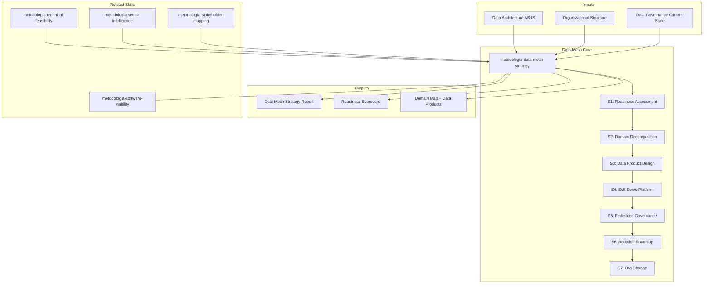

# Data Mesh Strategy

Generates data mesh readiness assessment and adoption strategy based on Zhamak Dehghani's 4 foundational principles: domain ownership, data as a product, self-serve data platform, and federated computational governance. Produces readiness scorecard, domain decomposition map, data product catalog design, platform requirements, and phased adoption roadmap.

## Guiding Principle

> *Data mesh is not a technical architecture — it is an organizational model for data. If the organization cannot decentralize decisions, it cannot decentralize data.*

1. **Organizational readiness before platform design.** Data mesh requires organizational maturity (clear domains, ownership culture, engineering capacity). Assess readiness before proposing adoption.
2. **Data products, not data pipelines.** The mental shift is from "moving data between systems" to "publishing data products with SLAs, documentation, and guaranteed quality."
3. **Federated governance, not absence of governance.** Decentralization without governance is chaos. The federated model defines global standards that domains implement locally.

## Inputs

- `$1` — Path to data architecture analysis (AS-IS, data flows, data governance assessment)
- `$2` — Assessment scope: `full` (default), `readiness` (assessment only), `pilot` (single domain design)

Parse from `$ARGUMENTS`.

**Parameters:**
- `{MODO}`: `piloto-auto` (default) | `desatendido` | `supervisado` | `paso-a-paso`
- `{FORMATO}`: `markdown` (default) | `html` | `dual`
- `{MODO_OPERACIONAL}`: `readiness` (default, assessment against 4 principles) | `estrategia` (full mesh strategy with roadmap) | `dominio` (single domain pilot design)
- `{VARIANTE}`: `ejecutiva` (~40% — readiness scores + recommendation) | `técnica` (full, default)

## Input Requirements

**Mandatory:**
- Current data architecture description (centralized/distributed/federated)
- Organizational structure (business domains, team composition)
- Data governance current state (catalog, ownership, policies)

**Recommended:**
- AS-IS analysis (especially data sections)
- Data flow maps (sources, transformations, consumers)
- Data quality assessment
- Current analytics/BI architecture
- Team engineering maturity assessment

## Assumptions & Limits

**Assumptions:**
- Organization has >3 identifiable business domains
- Some form of data infrastructure exists (warehouse, lake, pipelines)
- Engineering teams exist per domain (or can be formed)
- Leadership understands that data mesh is organizational change, not just tech

**Cannot do:**
- Implement data mesh platform (designs requirements and architecture)
- Reorganize teams (recommends structure, org change requires management)
- Guarantee data mesh is the right solution (may recommend against it)
- Replace data engineering fundamentals (mesh assumes solid foundations)

## When Data Mesh Makes Sense

- Organization has >5 distinct business domains with unique data needs
- Central data team is bottleneck (request queue >2 weeks)
- Domain expertise needed to define correct metrics and data quality
- Engineering maturity to maintain distributed data products
- Executive commitment to organizational restructuring

## When Data Mesh Does NOT Make Sense

- Small organization (<50 employees or <5 domains)
- Single business domain or highly centralized operations
- No engineering culture for distributed ownership
- Regulatory requirements mandate centralized data control
- Current data foundations are immature (fix foundations first)

## Edge Cases

- **Hybrid model needed:** Not all domains ready. Recommend mesh for mature domains, centralized for others. Document boundary conditions.
- **Regulated data (PII, PCI, HIPAA):** Federated governance must include compliance automation. Central compliance team retains veto power.
- **Real-time requirements:** Data products with streaming SLAs. Platform must support event-driven data products, not just batch.
- **Legacy monolith as source:** Strangler pattern for data extraction. CDC (Change Data Capture) as interim.
- **Multi-cloud data estate:** Platform abstraction layer. Data product portability requirements.
- **No data catalog exists:** Prerequisite. Recommend establishing catalog before mesh.

## Trade-off Matrix

| Decision | Enables | Constrains | When to Use |
|---|---|---|---|
| **Readiness assessment** | Clear go/no-go signal | No implementation plan | Early discovery, Phase 1 |
| **Full strategy** | Complete roadmap, platform spec | 5-7 days, requires deep domain knowledge | Committed to data mesh |
| **Single domain pilot** | Low risk, fast learning | Limited scope, may not generalize | Testing mesh viability |

## 7-Section Framework

### S1: Data Mesh Readiness Assessment (4 Principles)

Per principle, score 1-5 with evidence:

| Principle | Assessment Questions | Score |
|---|---|---|
| **Domain Ownership** | Are business domains clearly defined? Do teams own their data? Is there domain expertise for data quality? | |
| **Data as a Product** | Can teams treat data outputs as products? Are there SLAs for data? Is there a product mindset for data? | |
| **Self-Serve Platform** | Is there infrastructure for teams to publish/consume independently? Can domains deploy data products without central team? | |
| **Federated Governance** | Can governance be distributed without losing compliance? Are there global standards that domains can implement locally? | |

Composite readiness score. Go/No-Go recommendation with conditions.

### S2: Domain Decomposition
Business domain identification based on DDD bounded contexts. Per domain: name, description, key data entities, current data ownership, data consumers, data quality responsibility. Domain interaction map.

### S3: Data Product Design
Data product specification template: name, domain, owner, SLA (freshness, quality, availability), schema, access patterns, consumers, documentation requirements. Data product catalog design.

Quality dimensions per product: accuracy, completeness, timeliness, consistency, uniqueness.

### S4: Self-Serve Platform Requirements
Platform capabilities needed: data product authoring tools, schema registry, data catalog, quality monitoring, access management, lineage tracking, cost allocation. Build vs. buy analysis. Reference architectures per cloud provider.

### S5: Federated Governance Model
Global policies (data classification, retention, PII handling, naming conventions). Domain-level implementation (quality gates, access controls, documentation standards). Governance automation (policy-as-code, automated quality checks). Interoperability standards (schema compatibility, API contracts).

### S6: Adoption Roadmap
Phased approach:
- **Phase 1 (3-6 months):** 1-2 pilot domains. Establish platform foundation. Define governance basics.
- **Phase 2 (6-12 months):** 3-5 domains. Platform maturation. Federated governance operational.
- **Phase 3 (12-24 months):** Full mesh. Self-serve mature. Continuous improvement.

Per phase: domains included, platform capabilities, governance evolution, success metrics, risks.

### S7: Organizational Change Requirements
Team structure changes needed. New roles (data product owner, domain data engineer, platform team). Training requirements. Cultural shift from "data as byproduct" to "data as product." Integration with metodologia-change-readiness-assessment and metodologia-adoption-strategy skills.

## Cross-Section Traceability

- S1 Readiness → S6 Roadmap (readiness gaps determine phasing)
- S2 Domain Decomposition → S3 Data Products (domains produce data products)
- S3 Data Products → S4 Platform (product requirements drive platform capabilities)
- S4 Platform → S5 Governance (platform enforces governance)
- S5 Governance → S3 Data Products (governance defines product quality standards)
- S6 Roadmap → S7 Org Change (roadmap phases trigger org changes)
- S7 Org Change → S1 Readiness (org changes improve readiness scores over time)

## Casos Borde

| Caso | Estrategia de Manejo |
|------|---------------------|
| Modelo hibrido necesario (no todos los dominios estan listos) | Recomendar mesh para dominios maduros, centralizado para los demas; documentar condiciones de frontera y criterios de transicion |
| Datos regulados (PII, PCI, HIPAA) cruzan dominios | Gobernanza federada debe incluir automatizacion de compliance; equipo central de compliance retiene poder de veto sobre data products sensibles |
| No existe catalogo de datos como prerequisito | Establecer catalogo como paso previo obligatorio; no es posible implementar mesh sin visibilidad de lo que existe |
| Monolito legacy como fuente principal de datos | Aplicar strangler pattern para extraccion de datos; CDC (Change Data Capture) como solucion interim mientras se desacopla |

## Decisiones y Trade-offs

| Decision | Alternativa Descartada | Justificacion |
|----------|----------------------|---------------|
| Evaluar readiness con los 4 principios de Dehghani antes de proponer estrategia | Asumir que data mesh es la solucion correcta y disenar directamente | Data mesh no es adecuado para todas las organizaciones; la evaluacion de readiness previene inversiones en transformaciones que la organizacion no puede sostener |
| Recomendar piloto de 1-2 dominios antes de adopcion completa | Big-bang migration de todos los dominios simultaneamente | El piloto reduce riesgo, genera aprendizaje, y construye evidencia interna; la migracion completa tiene tasa de fracaso alta |
| Incluir cambio organizacional como seccion mandatoria (S7) | Tratar data mesh como decision puramente tecnica | Data mesh es un modelo organizacional, no una arquitectura tecnica; sin cambio organizacional, la implementacion falla independientemente de la tecnologia |
| Recomendar against data mesh cuando readiness score <2 en >2 principios | Siempre recomendar data mesh cuando el cliente lo solicita | Recomendar una transformacion que la organizacion no puede absorber dania la credibilidad y desperdicia inversion del cliente |

## Knowledge Graph



## Output Templates

**Formato MD (default):**

```
# Data Mesh Strategy — {proyecto}
## Resumen Ejecutivo
> Readiness score: X/5. Recomendacion: [Go/No-Go/Conditional]. Dominios piloto: N.
## S1: Readiness Assessment
| Principio | Score (1-5) | Evidencia | Gap |
## S2: Domain Decomposition
```mermaid
mindmap
    root((Dominios))
    ...
```
## S3-S7: [secciones completas]
## Roadmap de Adopcion
```mermaid
gantt
    title Data Mesh Adoption
    ...
```
```

**Formato HTML (bajo demanda — Design System MetodologIA v5):**

```
DataMesh_Strategy_{project}_{WIP}.html
```
HTML self-contained branded (Design System MetodologIA v5). Dark-First Executive. Incluye readiness radar chart interactivo (4 principios), domain decomposition mindmap, y adoption Gantt faseado. WCAG AA, responsive.

**Formato HTML (para presentacion ejecutiva — legacy):**

```
Header: Logo + proyecto + readiness score visual
Section 1: Readiness Scorecard (radar chart 4 principios)
Section 2: Domain Map (mindmap interactivo)
Section 3: Data Product Catalog Preview (cards por dominio)
Section 4: Platform Requirements (tabla comparativa build vs buy)
Section 5: Governance Model (diagrama de flujo)
Section 6: Adoption Roadmap (Gantt visual con fases)
Section 7: Org Change Requirements (tabla de roles nuevos)
Footer: Attribution MetodologIA + fecha
```

**Formato DOCX (bajo demanda):**

```
{fase}_DataMesh_Strategy_{project}_{WIP}.docx
```
Via python-docx con Design System MetodologIA v5. Cover page, TOC auto, headers/footers branded, tablas zebra. Poppins headings (navy), Montserrat body, gold accents.

**Formato XLSX (bajo demanda):**
- Filename: `{fase}_DataMesh_Strategy_{cliente}_{WIP}.xlsx`
- Via openpyxl con MetodologIA Design System v5. Headers con fondo navy y tipografía Poppins en blanco, conditional formatting por readiness score y principio, auto-filters en todas las columnas, valores directos sin fórmulas.

**Formato PPTX (bajo demanda):**
- Filename: `{fase}_DataMesh_Strategy_{cliente}_{WIP}.pptx`
- Via python-pptx con MetodologIA Design System v5. Navy gradient slide master, Poppins titles, Montserrat body, gold accents. Máx 20 slides ejecutivo / 30 técnico. Speaker notes con referencias de evidencia.

## Evaluacion

| Dimension | Peso | Criterio | Umbral Minimo |
|-----------|------|----------|---------------|
| Trigger Accuracy | 10% | El skill se activa ante prompts de data mesh, domain ownership, data as a product, federated governance | 7/10 |
| Completeness | 25% | Las 7 secciones pobladas; readiness con score por principio; data products con SLAs y dimensiones de calidad | 7/10 |
| Clarity | 20% | Recomendacion go/no-go es binaria y justificada; dominios mapeados a estructura real del negocio | 7/10 |
| Robustness | 20% | Edge cases cubiertos (hibrido, regulado, sin catalogo, legacy); cross-section traceability completa | 7/10 |
| Efficiency | 10% | Modo operacional correcto (readiness/estrategia/dominio) seleccionado; no se genera estrategia completa cuando solo se necesita assessment | 7/10 |
| Value Density | 15% | Cada fase del roadmap tiene criterios de entrada/salida; platform requirements incluyen build-vs-buy; org change es accionable | 7/10 |

**Umbral minimo global: 7/10.** Si alguna dimension cae por debajo, el entregable requiere revision antes de entrega.

## Escalation to Human

- Readiness score <2 on >2 principles (not ready for data mesh)
- No executive sponsor for organizational change
- Regulatory constraints that prevent domain ownership of sensitive data
- Central data team politically opposed to decentralization
- Platform investment >$500K (requires business case beyond this assessment)

## Execution Workflow

1. **Context Ingestion (1-2 hours):** Review AS-IS, data architecture, org structure
2. **Readiness Assessment (3-4 hours):** Score 4 principles, interview-based or artifact-based
3. **Domain & Product Design (4-6 hours):** Decompose domains, define product specs, platform requirements
4. **Strategy & Roadmap (3-4 hours):** Governance model, phased adoption, org change plan

**Typical engagement:** 4-6 days for organizations with 5-15 business domains.

## Output Artifact

**Primary:** `DataMesh_Strategy_{project}.md` (o `.html` si `{FORMATO}=html|dual`) — Full 7-section data mesh strategy with readiness scorecard, domain map, and adoption roadmap.

**Secondary:** `DataMesh_Readiness_{project}.md` — Executive readiness scorecard (S1 + go/no-go recommendation).

**Included diagrams:**
- Mindmap: domain decomposition with data products
- Quadrant chart: domain readiness (maturity × data volume)
- Flowchart: data product lifecycle
- Gantt chart: phased adoption roadmap

## Validation Gate

- [ ] All 7 sections populated with evidence-based content
- [ ] Readiness scored with observable evidence per principle
- [ ] Domain decomposition maps to actual business structure
- [ ] Data product specs include SLAs and quality dimensions
- [ ] Platform requirements include build-vs-buy analysis
- [ ] Governance model balances autonomy with compliance
- [ ] Roadmap is phased with clear entry/exit criteria per phase
- [ ] Cross-section traceability complete

## Output Format Protocol

| Format | Default | Description |
|--------|---------|-------------|
| `markdown` | ✅ | Rich Markdown + Mermaid diagrams. Token-efficient. |
| `html` | On demand | Branded HTML (Design System). Visual impact. |
| `dual` | On demand | Both formats. |

## Operational Modes

| Mode | Focus | Best For |
|---|---|---|
| `readiness` (default) | S1 + go/no-go + conditions | Early discovery, Phase 1 assessment |
| `estrategia` | Full 7-section strategy | Committed to data mesh adoption |
| `dominio` | S2 + S3 deep for 1 domain | Pilot design, proof of concept |

## Additional Resources

### References (Progressive Disclosure — Level 3)
- `Read ${CLAUDE_SKILL_DIR}/references/knowledge-graph.mmd` — Domain knowledge graph
- `Read ${CLAUDE_SKILL_DIR}/references/body-of-knowledge.md` — Academic and industry sources (Dehghani, Fowler, DAMA)
- `Read ${CLAUDE_SKILL_DIR}/references/state-of-the-art.md` — Trends 2024-2026

### Examples
- `Read ${CLAUDE_SKILL_DIR}/examples/sample-output.md` — Golden reference output
- `Read ${CLAUDE_SKILL_DIR}/examples/sample-output.html` — Branded HTML

### Prompts
- `Read ${CLAUDE_SKILL_DIR}/prompts/use-case-prompts.md` — Ready-to-use prompts
- `Read ${CLAUDE_SKILL_DIR}/prompts/metaprompts.md` — Meta-strategies

## Output Configuration

- **Language**: Spanish (Latin American, business register — simple, clear, concise, direct)
- **Attribution**: Expert committee of the MetodologIA Discovery Framework
- **Tagline**: *"Construido por profesionales, potenciado por la red agéntica de MetodologIA."*
