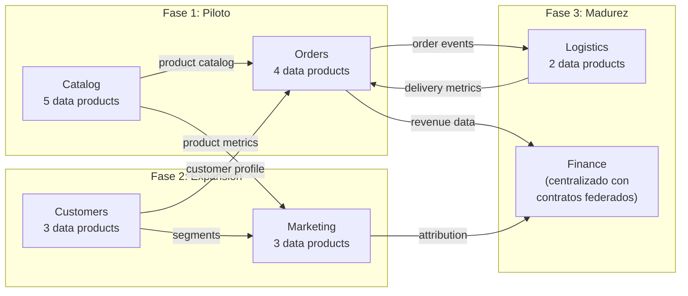
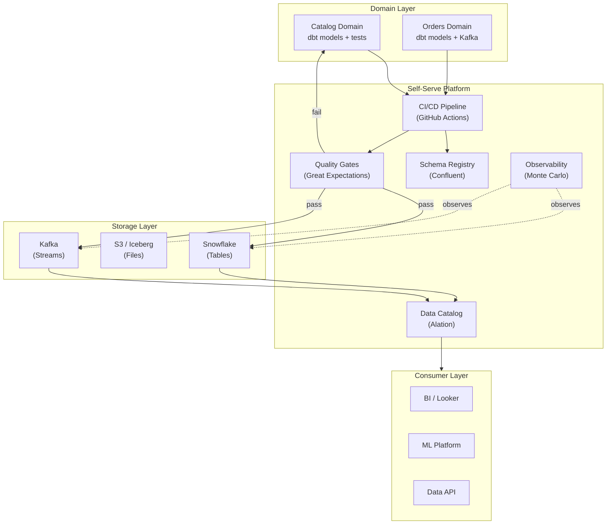
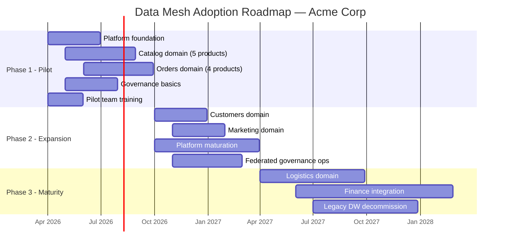

# Data Mesh Strategy — Acme Corp Digital Platform

Estrategia integral de data mesh para Acme Corp, una empresa de e-commerce con 800 empleados, 7 dominios de negocio identificados, y una plataforma de datos centralizada que se ha convertido en bottleneck. Este documento cubre las 7 secciones del framework: readiness assessment, domain decomposition, data product design, platform requirements, federated governance, adoption roadmap, y organizational change.

---

## TL;DR

- Readiness composite: **2.8/5** — Condicionalmente viable con inversiones en platform y governance
- 5 dominios identificados para mesh, 2 recomendados para piloto: **Catalog** y **Orders**
- 14 data products identificados en la primera iteracion (5 en dominio piloto)
- Recomendacion: **Selective mesh** — no full mesh. Piloto en 2 dominios, expansion gradual
- Timeline estimado: 24 meses para mesh operativo en 5 dominios

---

## S1: Data Mesh Readiness Assessment (4 Principios)

### Scoring por Principio

| Principio | Score | Evidencia | Gaps Criticos |
|-----------|-------|-----------|---------------|
| **Domain Ownership** | 3.5/5 | 7 dominios de negocio identificados. Equipos de ingenieria por dominio. Sin embargo, los datos analiticos estan centralizados en el data warehouse gestionado por el equipo de Data Engineering (15 personas). [STAKEHOLDER] | Los dominios no tienen ownership de datos analiticos. El data warehouse es responsabilidad del equipo central. |
| **Data as a Product** | 2.0/5 | No existe concepto de "data product". Los datos se mueven via pipelines ETL sin SLAs formales. La documentacion de datasets es parcial (30% documentado en Confluence). [DOC] | Sin SLAs, sin quality metrics, sin ownership por dataset. Los consumidores no saben a quien reclamar cuando los datos fallan. |
| **Self-Serve Platform** | 2.5/5 | Existe un data warehouse (Snowflake) y un orquestador (Airflow). dbt para transformaciones. Pero todo pasa por el equipo central — los dominios no pueden publicar data products independientemente. [CONFIG] | No hay self-serve: toda solicitud de datos pasa por el equipo central. Queue promedio: 3 semanas. |
| **Federated Governance** | 3.0/5 | Existe un data catalog (Alation, parcialmente poblado). Politicas de PII definidas pero enforcement manual. Naming conventions existen pero no se auditan. [DOC] | Governance centralizada, no federada. No hay policy-as-code. El catalog tiene 60% de cobertura. |

**Composite Readiness Score: 2.8/5 — Condicionalmente Viable**

```mermaid
quadrantChart
    title Data Mesh Readiness — Acme Corp
    x-axis Impacto Bajo en Adopcion --> Impacto Alto en Adopcion
    y-axis Score Bajo --> Score Alto
    quadrant-1 Fortalezas (aprovechar)
    quadrant-2 Construir Primero
    quadrant-3 Riesgo Bajo
    quadrant-4 Bloquers Criticos
    Domain Ownership: [0.65, 0.70]
    Federated Governance: [0.70, 0.60]
    Self-Serve Platform: [0.85, 0.50]
    Data as a Product: [0.90, 0.40]
```

### Veredicto

**GO condicional.** La organizacion tiene los prerequisitos organizacionales (dominios claros, equipos por dominio, liderazgo que entiende el problema). Los gaps criticos son en Data as a Product (concepto nuevo) y Self-Serve Platform (requiere inversion). Se recomienda:

1. **Piloto en 2 dominios** antes de comprometer adopcion full
2. **Platform investment** para habilitar self-serve (S4)
3. **Data product training** para los equipos piloto (S7)

---

## S2: Domain Decomposition

### Dominios Identificados

| # | Dominio | Bounded Context | Entidades Clave | Data Ownership Actual | Data Consumers | Readiness para Mesh |
|---|---------|----------------|----------------|----------------------|---------------|-------------------|
| 1 | **Catalog** | Product Management | Product, Category, Price, Inventory | Central DW | Orders, Marketing, Analytics, Finance | Alta |
| 2 | **Orders** | Order Management | Order, OrderLine, Payment, Shipment | Central DW | Finance, Logistics, Analytics, Customer Service | Alta |
| 3 | **Customers** | Customer Management | Customer, Account, Preferences, Segments | Central DW | Marketing, Orders, Analytics | Media |
| 4 | **Marketing** | Marketing & Campaigns | Campaign, Attribution, Channel, Conversion | Central DW | Finance, Analytics, Catalog | Media |
| 5 | **Logistics** | Fulfillment & Delivery | Shipment, Route, Warehouse, Returns | Central DW | Orders, Customer Service, Finance | Media-Baja |
| 6 | **Finance** | Financial Reporting | Revenue, Cost, Margin, Tax | Central DW (con restricciones) | Executive, Compliance, All domains | Baja (regulatorio) |
| 7 | **Platform** | Technical Platform | Logs, Metrics, Traces, Errors | Observability stack | Engineering, SRE | N/A (no mesh candidate) |

### Domain Interaction Map



### Recomendacion de Piloto

**Dominios piloto: Catalog + Orders**

Justificacion:
- **Alta readiness:** Equipos de ingenieria maduros (7 y 9 ingenieros respectivamente)
- **Alta demanda:** Son los dominios mas consumidos por otros dominios
- **Bajo riesgo regulatorio:** No contienen datos financieros regulados
- **Interconectados:** Catalog → Orders es el flujo mas critico — permite validar interacciones entre data products

---

## S3: Data Product Design

### Data Product Catalog (Dominio Piloto)

#### Dominio: Catalog

| # | Data Product | Tipo | Owner | SLA Freshness | SLA Availability | Consumers |
|---|-------------|------|-------|---------------|-----------------|-----------|
| 1 | `catalog.products.current` | Table | PM Team Lead | 15 min | 99.9% | Orders, Marketing, Analytics |
| 2 | `catalog.products.historical` | Table | PM Team Lead | 24h | 99.5% | Analytics, Finance |
| 3 | `catalog.inventory.realtime` | Stream | PM Team Lead | 30 sec | 99.9% | Orders, Logistics |
| 4 | `catalog.pricing.current` | Table | PM Team Lead | 5 min | 99.9% | Orders, Marketing |
| 5 | `catalog.categories.hierarchy` | Table | PM Team Lead | 24h | 99.5% | Marketing, Analytics |

#### Dominio: Orders

| # | Data Product | Tipo | Owner | SLA Freshness | SLA Availability | Consumers |
|---|-------------|------|-------|---------------|-----------------|-----------|
| 6 | `orders.transactions.daily` | Table | Orders Team Lead | 1h | 99.9% | Finance, Analytics |
| 7 | `orders.events.stream` | Stream | Orders Team Lead | Real-time | 99.9% | Logistics, Analytics |
| 8 | `orders.metrics.aggregated` | Table | Orders Team Lead | 1h | 99.5% | Executive Dashboard, Finance |
| 9 | `orders.returns.daily` | Table | Orders Team Lead | 24h | 99.5% | Logistics, Finance, Customer Service |

### Data Product Specification Template

```yaml
# Data Product Spec — catalog.products.current
name: catalog.products.current
domain: catalog
version: 1.0.0
owner:
  team: catalog-engineering
  contact: catalog-data@acme.com
  escalation: pm-team-lead@acme.com

description: >
  Current product catalog with pricing, availability, and attributes.
  Updated every 15 minutes from the operational product database.

sla:
  freshness: 15 minutes
  availability: 99.9%
  quality_score_minimum: 95%

schema:
  format: Apache Iceberg
  location: s3://acme-data-products/catalog/products/current/
  schema_registry: confluent-schema-registry
  evolution: backward-compatible

quality:
  accuracy: >99% (validated against source DB)
  completeness: >98% (required fields non-null)
  timeliness: <15 min from source change
  uniqueness: product_id is unique key
  consistency: prices match pricing service within 1%

access:
  classification: internal
  pii_fields: none
  authentication: IAM role-based
  consumers_registered:
    - orders-service
    - marketing-analytics
    - executive-dashboard

documentation:
  data_dictionary: s3://acme-data-products/catalog/products/current/docs/
  lineage: tracked in Alation
  change_log: CHANGELOG.md in product repo
```

### Quality Dimensions per Product

| Dimension | Definition | Measurement | Threshold |
|-----------|-----------|------------|-----------|
| **Accuracy** | Data matches real-world entity | Comparison with source system | >99% |
| **Completeness** | Required fields populated | % non-null for mandatory columns | >98% |
| **Timeliness** | Data freshness meets SLA | Time since last successful refresh | Per SLA |
| **Consistency** | Cross-product data agrees | Cross-reference validation | >99% |
| **Uniqueness** | No duplicates on primary key | Duplicate count on PK | 0 |

---

## S4: Self-Serve Platform Requirements

### Platform Capabilities Needed

| Capability | Priority | Current State | Gap | Build vs Buy |
|-----------|----------|--------------|-----|-------------|
| **Data Product Authoring** | P0 | dbt (exists) + custom scripts | Necesita template, CI/CD, testing | Build (extend dbt) |
| **Schema Registry** | P0 | No existe | Full gap | Buy (Confluent Schema Registry) |
| **Data Catalog** | P1 | Alation (60% coverage) | Extend coverage, add data product metadata | Extend (Alation) |
| **Quality Monitoring** | P1 | Ad-hoc SQL checks | Necesita automated quality gates | Buy (Great Expectations + Soda) |
| **Access Management** | P1 | Snowflake RBAC | Extend to data product level | Extend (Snowflake + IAM) |
| **Lineage Tracking** | P2 | Alation (partial) | Extend to data product granularity | Extend (Alation) |
| **Cost Allocation** | P2 | No existe per-domain | Necesita showback por dominio | Build (Snowflake cost views) |
| **Data Product Discovery** | P2 | Alation search | Add product-specific UX | Extend (Alation) |

### Reference Architecture



### Build vs Buy Summary

| Approach | Investment Estimate | Timeline | Pros | Cons |
|----------|-------------------|----------|------|------|
| **Full Build** (OSS: OpenMetadata + dbt + Great Expectations + Kafka) | 4-6 FTE-months | 6-9 meses | Control total, sin vendor lock-in | Alto mantenimiento, lento time-to-value |
| **Hybrid** (Extend Alation + buy Confluent + build integrations) | 2-3 FTE-months + licensing | 3-6 meses | Balance costo/control, usa lo existente | Integracion custom necesaria |
| **Full Buy** (Atlan o Collibra + Confluent + managed) | 1-2 FTE-months + licensing premium | 2-4 meses | Rapido time-to-value | Vendor lock-in, costo alto |

**Recomendacion: Hybrid.** Acme ya tiene Alation (catalog) y Snowflake (storage). Extender lo existente, comprar schema registry (Confluent) y quality monitoring (Great Expectations + Soda), build la capa de integracion.

---

## S5: Federated Governance Model

### Global Policies (aplican a TODOS los data products)

| # | Politica | Enforcement | Mecanismo |
|---|---------|-------------|-----------|
| 1 | **Naming convention:** `{domain}.{entity}.{qualifier}` | Automatico | CI/CD check en data product registration |
| 2 | **Schema compatibility:** backward-compatible evolution | Automatico | Schema Registry validation |
| 3 | **PII classification:** todo campo PII etiquetado y encriptado | Automatico | Alation auto-classification + Snowflake masking |
| 4 | **Quality minimum:** accuracy >95%, completeness >95% | Automatico | Great Expectations suite en CI/CD |
| 5 | **Documentation:** data dictionary + SLA + owner obligatorios | Automatico | Template validation en PR review |
| 6 | **Retention:** minimo 90 dias, maximo segun clasificacion | Automatico | Lifecycle policies en storage layer |
| 7 | **Access:** role-based, request + approval workflow | Semi-automatico | Alation access requests + Snowflake RBAC |

### Domain-Level Implementation

| Responsabilidad | Global (Platform Team) | Local (Domain Team) |
|----------------|----------------------|-------------------|
| Naming convention | Define el pattern | Elige nombres dentro del pattern |
| Schema evolution | Define reglas de compatibilidad | Evoluciona el schema respetando reglas |
| PII handling | Define politica de encriptacion | Identifica campos PII en sus datos |
| Quality thresholds | Define minimos globales (>95%) | Puede definir umbrales mas altos |
| Documentation | Define template obligatorio | Escribe la documentacion |
| Access control | Define modelo de roles | Define quien puede acceder a sus data products |
| SLAs | Define SLA minimo por tier | Define SLAs especificos de sus products |

### Governance Automation (Policy-as-Code)

```yaml
# governance-policies/naming.rego
package data_product.naming

# Product name must follow pattern: domain.entity.qualifier
valid_name(name) {
    parts := split(name, ".")
    count(parts) == 3
    parts[0] in ["catalog", "orders", "customers", "marketing", "logistics"]
}

# governance-policies/quality.yaml
quality_gates:
  global_minimum:
    accuracy: 0.95
    completeness: 0.95
    uniqueness_pk: 1.0
  enforcement: block_publish_if_fail
  exceptions: require_approval_from_data_governance_lead
```

---

## S6: Adoption Roadmap

### Phase 1: Foundation & Pilot (Meses 1-6)

| Milestone | Timeline | Deliverable | Success Metric |
|-----------|----------|-------------|----------------|
| Platform foundation | Mes 1-3 | Schema registry, quality gates, CI/CD template | Infrastructure operational |
| Catalog domain pilot | Mes 2-5 | 5 data products published, documented, with SLAs | 3+ consumers using products via platform |
| Orders domain pilot | Mes 3-6 | 4 data products published, including 1 streaming | Streaming product meets <30s freshness SLA |
| Governance basics | Mes 2-4 | Naming convention, quality gates, PII policies automated | 100% pilot products pass governance checks |
| Training (pilot teams) | Mes 1-3 | Data product owner training, dbt training | Teams self-serve without central support |

**Entry criteria:** Executive sponsor confirmed, pilot team leads committed, platform budget approved.
**Exit criteria:** 9 data products in production, 5+ consumers active, quality SLAs met for 30 days.

### Phase 2: Expansion (Meses 7-12)

| Milestone | Timeline | Deliverable | Success Metric |
|-----------|----------|-------------|----------------|
| Customers domain onboard | Mes 7-9 | 3 data products | Cross-domain product consumption working |
| Marketing domain onboard | Mes 8-11 | 3 data products | Attribution data product replaces legacy pipeline |
| Platform maturation | Mes 7-12 | Self-serve portal, cost showback, enhanced catalog | <2 days from "idea to published data product" |
| Federated governance operational | Mes 8-12 | Domain governance leads appointed, automated enforcement | 0 manual governance interventions needed |

**Entry criteria:** Phase 1 exit criteria met, lessons learned documented, 2 new domain teams trained.
**Exit criteria:** 15+ data products, federated governance operational, central team role shifts to platform.

### Phase 3: Maturity (Meses 13-24)

| Milestone | Timeline | Deliverable | Success Metric |
|-----------|----------|-------------|----------------|
| Logistics domain onboard | Mes 13-18 | 2 data products | End-to-end order-to-delivery data traceable |
| Finance integration | Mes 15-24 | Finance consumes mesh products (does not publish — centralized) | Financial reporting uses mesh products as source |
| Central DW decommission | Mes 18-24 | Legacy pipelines migrated to domain-owned data products | 0 active legacy pipelines |
| Continuous improvement | Ongoing | Quarterly mesh health review, product lifecycle management | Mesh maturity score >4/5 |

### Roadmap Visual



---

## S7: Organizational Change Requirements

### New Roles Required

| Rol | Descripcion | Cantidad | Timing | Source |
|-----|------------|----------|--------|--------|
| **Data Product Owner** (per domain) | Define prioridades, SLAs, quality standards del data product. Trabaja con el PO del dominio | 1 per piloto domain (2 inicialmente) | Fase 1 | Upskill existing senior data analyst or PM |
| **Domain Data Engineer** | Builds and maintains data products del dominio. Usa la self-serve platform | 1-2 per domain | Fase 1 (piloto) → Fase 2 (expansion) | Transfer from central data team or hire |
| **Data Platform Engineer** | Builds and maintains la self-serve platform | 2-3 personas | Fase 1 | Evolve from current data infrastructure team |
| **Data Governance Lead** | Defines global policies, coordinates federated governance | 1 persona | Fase 1 | Evolve from current data governance analyst |
| **FinOps Champion (data)** | Tracks and optimizes data platform costs por dominio | Part-time (FinOps Lead) | Fase 2 | Shared with infrastructure FinOps |

### Team Structure Evolution

**Current State (Centralized):**
- Data Engineering team (15 people) → builds ALL pipelines
- Data Analytics team (8 people) → consumes data
- Data Governance (1 person) → policies, catalog

**Target State (Federated):**
- Data Platform team (4-5 people) → builds/maintains self-serve platform
- Domain Data teams (2-3 per domain) → builds/maintains data products
- Data Governance (1-2 people) → federated governance coordination
- Remaining central data engineers → transition to domain teams (Fase 1-2)

### Team Topologies Mapping

| Team Type | Role in Mesh | Example |
|-----------|-------------|---------|
| **Stream-aligned** | Domain teams that own data products | Catalog Data Team, Orders Data Team |
| **Platform** | Builds self-serve data platform | Data Platform Team |
| **Enabling** | Helps domains adopt data mesh practices | Data Mesh Enablement (temporary, Fase 1-2) |
| **Complicated Subsystem** | N/A for most organizations | — |

### Training Plan

| Audiencia | Contenido | Formato | Duracion | Timing |
|-----------|----------|---------|----------|--------|
| Domain team leads | Data mesh principles, data product thinking | Workshop | 4 horas | Fase 1, Mes 1 |
| Domain data engineers | dbt, Great Expectations, schema registry, CI/CD for data | Hands-on training | 3 dias | Fase 1, Mes 1-2 |
| Data product owners | Product management for data, SLA definition, quality monitoring | Workshop | 2 dias | Fase 1, Mes 2 |
| Platform engineers | Self-serve platform architecture, governance automation | Self-study + mentoring | Ongoing | Fase 1 |
| Executive team | Data mesh value proposition, investment justification, metrics | Presentation | 1 hora | Fase 1, Mes 1 |

### Cultural Shift Required

| De (Current) | A (Target) | Cambio Clave |
|---|---|---|
| "Data is IT's problem" | "Data is a domain asset" | Domain leads include data quality in sprint planning |
| "Request data from data team" | "Discover and consume data products" | Self-serve culture, data catalog as first stop |
| "Pipelines move data" | "Products serve data" | SLAs, documentation, quality as mandatory |
| "Central governance controls" | "Federated governance enables" | Standards enable autonomy, not restrict it |
| "Data quality is someone else's job" | "Domain owns quality of its data products" | Quality gates in CI/CD, domain accountability |

---

## Validation Gate

- [x] All 7 sections populated with evidence-based content
- [x] Readiness scored with observable evidence per principle
- [x] Domain decomposition maps to actual business structure
- [x] Data product specs include SLAs and quality dimensions
- [x] Platform requirements include build-vs-buy analysis
- [x] Governance model balances autonomy with compliance
- [x] Roadmap is phased with clear entry/exit criteria per phase
- [x] Cross-section traceability complete

---

**Autor:** Javier Montaño | **Última actualización:** 13 de marzo de 2026
