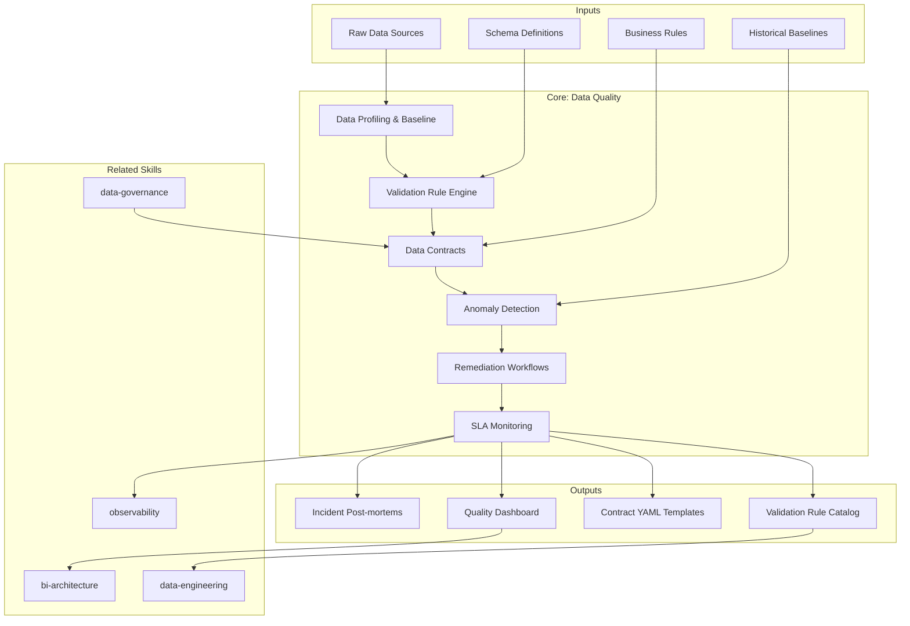

# Data Quality: Framework Design for Validation, Contracts & Monitoring

Data quality architecture defines how organizations detect, prevent, and remediate data issues through profiling, validation rules, anomaly detection, contracts between teams, and SLA monitoring. This skill produces data quality documentation that enables teams to build trust in their data through systematic quality management.

## Grounding Guideline

**Data quality is not inspected at the end — it is built at every step.** Prevention surpasses detection. Data contracts between producers and consumers are the first line of defense. Quarantine patterns protect the pipeline without stopping it. Every validation rule has severity, owner, and last review date.

## Inputs

The user provides a system or project name as `$ARGUMENTS`. Parse `$1` as the **system/project name** used throughout all output artifacts.

**Parameters:**
- `{MODO}`: `piloto-auto` (default) | `desatendido` | `supervisado` | `paso-a-paso`
  - **piloto-auto**: Auto para profiling y reglas de validación, HITL para data contracts y thresholds de anomalía.
  - **desatendido**: Zero interruptions. Framework completo generado automáticamente. Assumptions documented.
  - **supervisado**: Autónomo con checkpoint en severity classification y anomaly thresholds.
  - **paso-a-paso**: Confirma cada regla de validación, contrato, threshold y workflow de remediación.
- `{FORMATO}`: `markdown` (default) | `html` | `dual`
- `{VARIANTE}`: `ejecutiva` (~40% — S1 profiling + S3 data contracts + S5 remediation) | `técnica` (full 6 sections, default)

Before generating architecture, detect the project context:

```
!find . -name "*.py" -o -name "*.yml" -o -name "*.yaml" -o -name "*.sql" -o -name "*.json" | head -30
```

Use detected tools to tailor recommendations. If reference materials exist, load them:

```
Read ${CLAUDE_SKILL_DIR}/references/quality-patterns.md
```

---

## Tool Comparison Matrix

Select based on team profile and existing stack, not feature count alone.

| Criterion | Great Expectations | Soda Core | dbt Tests | Elementary |
|---|---|---|---|---|
| **Best for** | Python teams, diverse sources | SQL-native teams, fast setup | Teams already in dbt | dbt-native observability |
| **Language** | Python (Expectations API) | SodaCL (declarative YAML) | SQL + YAML | SQL + dbt macros |
| **Learning curve** | Steep — rich but verbose | Low — accessible to analysts | Low if dbt-fluent | Low — runs inside dbt |
| **Anomaly detection** | Custom via profiler | Built-in (SodaCL anomaly checks) | Via Elementary add-on | Built-in (volume, freshness, schema) |
| **Data Docs / UI** | Yes (auto-generated HTML) | Soda Cloud (paid) | dbt Docs | Elementary Cloud or OSS dashboard |
| **CI/CD integration** | Checkpoint CLI | `soda scan` CLI | `dbt test` | `dbt test` + `edr` |
| **Cost** | OSS free; GX Cloud paid | OSS free; Soda Cloud paid | Free (bundled with dbt) | OSS free; Cloud paid |
| **Connector breadth** | 50+ (Spark, pandas, SQL) | 20+ (SQL-native) | dbt-supported warehouses | dbt-supported warehouses |

**Combined pattern (recommended for mature orgs):** dbt tests for transformation-layer validation, Great Expectations for ingestion validation of raw sources, Soda Core for continuous production monitoring and alerting. Elementary adds anomaly detection on top of dbt without external tooling.

---

## When to Use

- Designing data quality frameworks from profiling through remediation
- Establishing data contracts between producer and consumer teams
- Setting up anomaly detection for data pipelines
- Defining validation rule engines with severity and escalation
- Building remediation workflows (quarantine, dead-letter, auto-fix)
- Creating SLA monitoring dashboards for freshness, completeness, accuracy

## When NOT to Use

- Data pipeline orchestration and ingestion (data-engineering skill)
- dbt model testing and schema validation (analytics-engineering skill)
- ML model drift detection (data-science-architecture skill)
- Dashboard design and reporting (bi-architecture skill)

---

## Quality Dimension Formulas

Use these standard formulas for composite scoring. Weight per domain; no universal formula fits all.

| Dimension | Formula | Target (critical) |
|---|---|---|
| **Accuracy** | `matching_records / total_records` | >= 99.5% |
| **Completeness** | `non_null_required_fields / total_required_fields` | >= 99.9% |
| **Timeliness** | `p95(event_time - available_time) <= SLA_target` | Tier-dependent |
| **Consistency** | `cross_system_matching_records / total_records` | >= 99.0% |
| **Validity** | `records_passing_rules / total_records` | >= 99.5% |
| **Uniqueness** | `1 - (duplicate_records / total_records)` | >= 99.99% |

**Composite quality score:** `SUM(dimension_score * weight)` where weights sum to 1.0. Adjust weights per domain — financial data weights accuracy higher; event streams weight timeliness higher.

**Cost benchmark:** Poor data quality costs organizations an average of $12.9M per year (Gartner). Use this to justify governance investment: even a 10% reduction in data incidents saves >$1M annually for a mid-size org.

---

## Delivery Structure: 6 Sections

### S1: Data Profiling & Baseline

Establishes the statistical baseline for understanding data characteristics.

**Includes:**
- Statistical profiling (min, max, mean, median, stddev, percentiles per column)
- Distribution analysis (histograms, frequency counts, skewness, kurtosis)
- Cardinality assessment (unique values, distinct counts, high/low cardinality flags)
- Null rate tracking (null percentage per column, null patterns across rows)
- Data type inference and validation (expected vs actual types, format patterns)
- Referential integrity checks (foreign key validity, orphan record detection)
- Profile scheduling (initial baseline, periodic re-profiling, drift comparison)

**Key decisions:**
- Profiling scope: all columns vs critical columns only — cost vs coverage
- Baseline window: 30-day rolling vs fixed snapshot — stability vs recency
- Storage: profile results stored for trend analysis and anomaly baseline

### S2: Validation Rule Engine

Defines systematic data validation with severity classification.

**Includes:**
- Schema validation (column presence, data types, nullable constraints)
- Business rule validation (range checks, format patterns, conditional logic)
- Cross-dataset validation (referential integrity, aggregate consistency, balance checks)
- Temporal validation (sequence ordering, gap detection, duplicate timestamp detection)
- Severity classification: **Critical** (blocks pipeline), **Major** (alerts team, continues), **Minor** (logs only)
- Rule catalog (centralized registry: rule ID, owner, last updated, coverage percentage)
- Rule versioning (changes tracked, impact assessed before deployment)

**Key decisions:**
- Declarative vs imperative: YAML/config-driven vs code-driven validation
- Execution placement: in-pipeline (inline) vs post-pipeline (monitoring) vs both
- Coverage target: 100% of critical datasets for schema; 80% of all datasets minimum

### S3: Data Contracts

Formalizes agreements between data producers and consumers. Follows the data contract specification pattern (Andrew Jones): contracts defined as version-controlled YAML alongside pipeline code.

**Contract specification fields:**
- Schema (column names, types, constraints, semantic tags)
- Freshness SLA (max acceptable lag between event and availability)
- Volume bounds (expected row count range per batch/window)
- Quality thresholds (minimum acceptable scores per dimension)
- Owner and consumer identifiers with contact channels
- Semantic versioning: major (breaking), minor (additive), patch (metadata)

**Enforcement mechanisms:**
- Schema diff in CI catches breaking changes before deployment
- Great Expectations expectations or Soda checks serve as executable contract specs
- Pre-deploy validation gates block non-compliant changes
- Runtime checks alert on SLA breaches

**Key decisions:**
- Strict vs advisory: block on violation vs warn and continue
- Contract scope: table-level vs column-level agreements
- Ownership model: producer-owns (push quality upstream) vs consumer-validates (defensive)

### S4: Anomaly Detection

Implements statistical and ML-based methods for detecting unexpected data changes.

**Statistical methods (start here):**
- Z-score (>3 sigma), IQR (1.5x range), control charts — interpretable, low maintenance
- Seasonal decomposition for periodic data (STL, Prophet-based)

**ML-based detection (use when statistical methods produce too many false positives):**
- Isolation forest, autoencoders, DBSCAN for multidimensional anomalies
- Requires training data and ongoing model maintenance

**Detection targets:**
- Volume anomalies: row count deviation >20% from rolling baseline
- Distribution drift: KS test p-value <0.05, PSI >0.2 (significant shift)
- Freshness anomalies: late arrivals exceeding SLA, missing partitions
- Schema changes: unexpected column additions, type changes, renames

**Key decisions:**
- Threshold sensitivity: too tight = alert fatigue (>5 false positives/week is a signal); too loose = missed issues
- Detection latency: real-time vs batch — cost vs speed
- Baseline adaptation: fixed window vs rolling window vs seasonal adjustment

### S5: Remediation Workflows

Processes for handling data quality failures from detection to resolution.

**Quarantine pattern:** Isolate bad records in a staging area, continue processing good records. Time-bound: 72h before escalation or auto-discard.

**Dead letter queue (DLQ):**
- Capture failed records with failure reason, timestamp, source, and rule ID
- **Automated remediation criteria:** deterministic fixes only — trim whitespace, default nulls, format correction, known enum mappings
- **Manual remediation criteria:** ambiguous business logic, unknown values, cross-system conflicts, data that fails multiple rules simultaneously
- DLQ monitoring: alert if queue depth exceeds 1000 records or 1% of daily volume

**SLA Breach Escalation Matrix:**

| Tier | Scope | Response Time | Escalation |
|---|---|---|---|
| **Tier 1: Revenue-critical** | Payment, billing, pricing data | <15 min | Auto-page on-call engineer |
| **Tier 2: Operational** | Core business metrics, user data | <1 hour | Alert data engineering lead |
| **Tier 3: Analytical** | Reports, dashboards, ML features | <4 hours | Notify domain data steward |

At 4h+ unresolved for any tier: leadership notification with customer/revenue impact estimate.

**Post-mortem template:** Timeline, blast radius (affected datasets/consumers), root cause, corrective action, prevention measures.

### S6: SLA Monitoring & Reporting

Dashboards and metrics for ongoing data quality visibility.

**Monitoring targets:**
- Freshness: time since last update per dataset, breach tracking
- Completeness: percentage of expected records received, null rate trends
- Accuracy: validation pass rate, anomaly count, rule failure rate
- Consistency: cross-system reconciliation, duplicate detection rates

**Dashboard audiences:**
- Executive: composite quality score per domain, trend over 90 days, incident count
- Engineering: per-table metrics, rule failure detail, DLQ depth, anomaly timeline
- Compliance: audit trail, contract adherence history, SLA compliance percentage

**Reporting cadence:** Real-time monitoring + weekly summary + monthly executive report.

**SLA targets (negotiate with consumers):** 99.5% freshness, 99.9% completeness, 99.5% accuracy for Tier 1 datasets.

---

## Trade-off Matrix

| Decision | Enables | Constrains | When to Use |
|---|---|---|---|
| **Strict Data Contracts** | Reliability, upstream accountability | Slower iteration, producer friction | Production-critical pipelines, multi-team |
| **Inline Validation** | Early detection, prevents propagation | Pipeline latency, compute cost | Critical datasets, real-time pipelines |
| **ML Anomaly Detection** | Catches novel issues, adapts | Complexity, false positives, training | Large-scale data with complex patterns |
| **Statistical Detection** | Simple, interpretable, low maintenance | Misses complex patterns | Stable datasets, well-understood distributions |
| **Auto-Fix Rules** | Reduced manual effort | Risk of incorrect corrections | Deterministic fixes only (formatting, defaults) |
| **Quarantine Pattern** | Isolates without blocking pipeline | Storage overhead, investigation burden | Streaming pipelines, high-volume ingestion |

---

## Assumptions & Limits

- Assumes access to data profiling tools or raw data samples for metric calculation
- Statistical thresholds (3-sigma, 4-sigma) assume approximately normal distributions; skewed data needs custom baselines
- Quality scoring is relative to declared expectations — garbage-in expectations produce garbage-in scores
- Automated remediation rules require human validation before production deployment
- Real-time quality monitoring assumes streaming infrastructure exists; batch-only environments use scheduled profiling

## Edge Cases

| Case | Handling Strategy |
|---|---|
| No historical baseline | Use first 30 days as baseline with wide thresholds (4-sigma); adjust gradually; accept higher false positive rate initially |
| Schema-on-read environment | Quality checks as enforcement layer; profiling and validation on-read; quarantine on first access instead of ingestion |
| Third-party data sources | No control over producer quality; contracts are aspirational; monitoring and quarantine essential; budget 2-3x more manual remediation |
| High-volume streaming | Sampling-based profiling (1-5%); micro-batch quality windows (1-5 min); accept statistical confidence instead of deterministic validation |
| Regulated data (GDPR, HIPAA) | Monitoring must not expose PII in logs or dashboards; aggregated metrics only; quarantine respects classification; mandatory quality decision audit trail |

## Decisions and Trade-offs

| Decision | Discarded Alternative | Justification |
|---|---|---|
| Prevention (data contracts) over detection (monitoring) | Post-ingestion detection only | Data contracts between producers and consumers are the first line of defense; detecting problems post-ingestion is 10x more expensive than preventing them |
| Quarantine pattern to isolate without stopping pipeline | Full pipeline stops on error | In high-volume pipelines, stopping everything for bad records affects SLA of good data; quarantine isolates bad and continues with good |
| Auto-fix only for deterministic corrections | Auto-fix for any type of error | Non-deterministic corrections (ambiguous business logic, cross-system conflicts) require human judgment; incorrect auto-fix is worse than not correcting |
| Alerts calibrated for < 5 false positives/week | Very tight thresholds that maximize detection | Alert fatigue is the #1 cause of teams ignoring real alerts; < 5 FP/week is the sustainable attention threshold |

## Knowledge Graph



## Output Templates

| Formato | Nombre | Contenido |
|---|---|---|
| **Markdown** | `A-01_Data_Quality_Framework.md` | Framework completo con profiling baseline, validation rule engine, data contracts, anomaly detection, remediation workflows y SLA monitoring. Diagramas Mermaid de validation flow y remediation workflow. |
| **XLSX** | `A-01_Data_Quality_Scorecard.xlsx` | Scorecard interactivo con composite quality score por dimension (accuracy, completeness, timeliness, consistency, validity, uniqueness), tendencias a 90 dias, y SLA compliance por dataset. |
| **HTML** | `A-01_Data_Quality_Framework_{cliente}_{WIP}.html` | Mismo contenido en HTML branded (Design System MetodologIA v5). Light-First Technical, self-contained, WCAG AA, responsive. Incluye quality scorecard por dimension, SLA escalation matrix visual, y remediation workflow interactivo con DLQ status. |
| **DOCX** | `{fase}_Data_Quality_Framework_{cliente}_{WIP}.docx` | Documento formal via python-docx (Design System MetodologIA v5). Cover page, TOC auto, headers/footers branded, tablas zebra. Poppins headings (navy), Trebuchet MS body, gold accents. |
| **PPTX** | `{fase}_Data_Quality_Framework_{cliente}_{WIP}.pptx` | Via python-pptx con MetodologIA Design System v5. Navy gradient slide master, Poppins titles, Trebuchet MS body, gold accents. Máx 20 slides ejecutivo / 30 técnico. Speaker notes con referencias de evidencia. |

## Evaluacion

| Dimension | Peso | Criterio |
|---|---|---|
| Trigger Accuracy | 10% | Descripcion activa triggers correctos (data quality, data contracts, validation, anomaly detection, SLA) sin falsos positivos con data-governance o analytics-engineering |
| Completeness | 25% | Las 6 secciones cubren profiling, validacion, contracts, anomaly detection, remediation y SLA monitoring sin huecos; todas las dimensiones de calidad representadas |
| Clarity | 20% | Instrucciones ejecutables sin ambiguedad; formulas de calidad con targets numericos; severity classification con acciones por nivel; SLA tiers con tiempos de respuesta |
| Robustness | 20% | Maneja sin baseline, schema-on-read, third-party sources, streaming de alto volumen y datos regulados con estrategias diferenciadas |
| Efficiency | 10% | Proceso no tiene pasos redundantes; variante ejecutiva reduce a S1+S3+S5 sin perder contratos y remediacion |
| Value Density | 15% | Cada seccion aporta valor practico directo; quality dimension formulas y SLA escalation matrix son herramientas de operacion inmediata |

**Umbral minimo: 7/10.**

---

## Validation Gate

Before finalizing delivery, verify:

- [ ] Profiling baseline established for critical datasets
- [ ] Validation rules cover schema, business logic, and cross-dataset checks
- [ ] Severity classification defined (critical, major, minor) with actions per level
- [ ] Data contracts specified between key producer-consumer pairs
- [ ] Anomaly detection covers volume, distribution, and freshness
- [ ] Alert thresholds calibrated (<5 false positives/week target)
- [ ] Remediation workflows define quarantine, DLQ, escalation, and reprocessing
- [ ] SLA metrics cover freshness, completeness, and accuracy with numeric targets
- [ ] Quality dashboard designed for engineering and executive audiences
- [ ] Post-mortem process exists for quality incidents

## Output Format Protocol

| Format | Default | Description |
|--------|---------|-------------|
| `markdown` | Yes | Markdown con Mermaid embebido (validation flow, remediation workflow). |
| `html` | On demand | Branded HTML (Design System). Visual impact. |
| `dual` | On demand | Both formats. |

Default output is Markdown with embedded Mermaid diagrams. HTML generation requires explicit `{FORMATO}=html` parameter.

## Output Artifact

**Primary:** `A-01_Data_Quality_Framework.html` — Data profiling baseline, validation rule engine, data contracts, anomaly detection, remediation workflows, SLA monitoring dashboards.

**Secondary:** Validation rule catalog, data contract YAML templates, anomaly detection configuration, quality scorecard template, incident post-mortem template.

---
**Autor:** Javier Montaño | **Última actualización:** 12 de marzo de 2026
