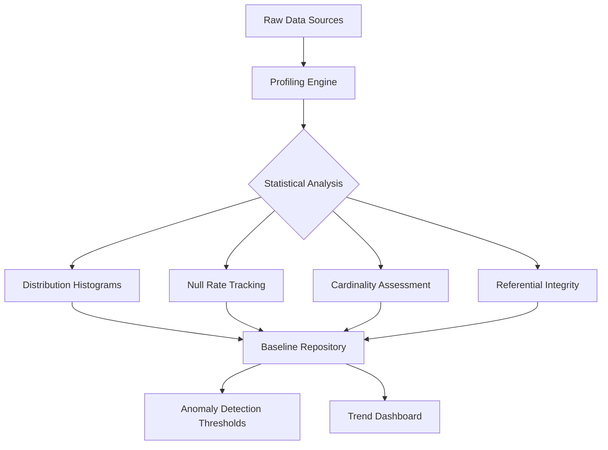
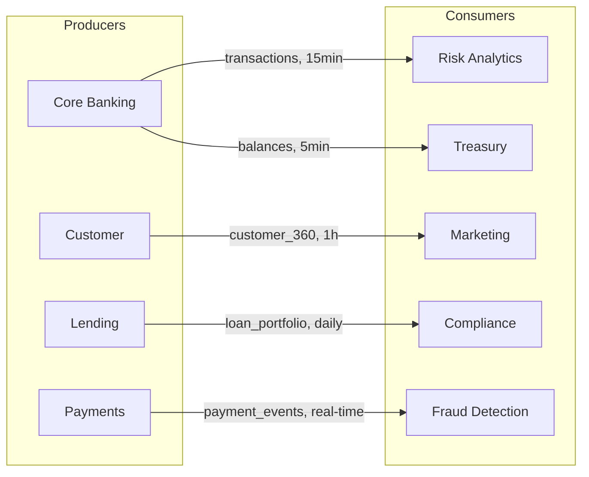
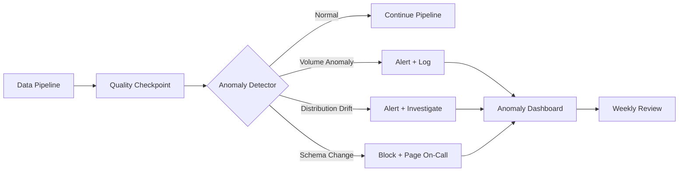

# Data Quality Framework — Acme Corp Banking Modernization

**Proyecto:** Acme Corp Banking Modernization
**Variante:** Tecnica (full)
**Fecha:** 12 de marzo de 2026
**Dominio:** Core Banking (accounts, transactions, loans, payments)

---

## S1: Data Profiling & Baseline

### Critical Dataset Profiles

Profiling executed across 4 core datasets over a 30-day window (February 2026). Results establish the statistical baseline for anomaly detection thresholds.

| Dataset | Rows (30d) | Columns | Null Rate (avg) | Duplicate Rate | Cardinality Issues |
|---|---|---|---|---|---|
| `core.transactions` | 47.2M | 28 | 0.3% | 0.001% | None |
| `core.accounts` | 2.1M | 42 | 1.8% | 0.02% | `phone_secondary` — 89% null |
| `lending.loans` | 340K | 56 | 3.2% | 0.00% | `employer_name` — 12K distinct (low) |
| `payments.transfers` | 18.6M | 22 | 0.1% | 0.003% | None |

### Column-Level Profile: `core.transactions`

| Column | Type | Null % | Min | Max | Mean | P95 | Distribution |
|---|---|---|---|---|---|---|---|
| `amount` | decimal(18,2) | 0.0% | 0.01 | 4,500,000 | 342.50 | 2,850 | Right-skewed (Pareto) |
| `created_at` | timestamp | 0.0% | 2019-01-01 | 2026-03-01 | — | — | Seasonal (payroll spikes) |
| `currency_code` | varchar(3) | 0.0% | — | — | — | — | 94% COP, 4% USD, 2% EUR |
| `channel` | varchar(20) | 0.1% | — | — | — | — | 62% mobile, 28% web, 10% branch |
| `status` | varchar(15) | 0.0% | — | — | — | — | 97.2% completed, 2.1% pending, 0.7% failed |

### Referential Integrity Check

| FK Relationship | Orphan Records | Orphan Rate | Severity |
|---|---|---|---|
| `transactions.account_id` -> `accounts.id` | 0 | 0.000% | OK |
| `loans.customer_id` -> `customers.id` | 14 | 0.004% | Minor |
| `transfers.source_account_id` -> `accounts.id` | 0 | 0.000% | OK |
| `transfers.beneficiary_bank_code` -> `banks.code` | 231 | 0.001% | Major (unknown banks) |



---

## S2: Validation Rule Engine

### Rule Catalog

| Rule ID | Dataset | Rule Description | Severity | Owner | Last Updated |
|---|---|---|---|---|---|
| VR-001 | `core.transactions` | Amount must be > 0 | Critical | Core Banking | 2026-02-15 |
| VR-002 | `core.transactions` | Currency must be in ISO 4217 | Critical | Core Banking | 2026-02-15 |
| VR-003 | `core.transactions` | `created_at` must not be in the future | Major | Core Banking | 2026-02-15 |
| VR-004 | `core.accounts` | Account number format: 10 digits | Critical | Core Banking | 2026-01-20 |
| VR-005 | `core.accounts` | Balance must match sum of transactions | Critical | Core Banking | 2026-02-28 |
| VR-006 | `lending.loans` | Interest rate between 0.01% and 35% | Major | Lending | 2026-02-10 |
| VR-007 | `lending.loans` | Disbursement date <= maturity date | Critical | Lending | 2026-02-10 |
| VR-008 | `payments.transfers` | SWIFT code format: 8 or 11 chars | Critical | Payments | 2026-01-30 |
| VR-009 | `payments.transfers` | Amount in COP must not exceed 50M (regulatory) | Major | Payments | 2026-02-20 |
| VR-010 | `core.accounts` | Email format validation | Minor | Customer | 2026-01-15 |

### Severity Classification & Actions

| Severity | Pipeline Action | Notification | SLA to Resolve |
|---|---|---|---|
| Critical | Block pipeline, quarantine record | Page on-call engineer | < 15 min |
| Major | Continue pipeline, flag record | Alert data engineering lead | < 1 hour |
| Minor | Log only | Weekly summary to steward | < 1 week |

### Tool Selection

Acme Corp adopts a layered validation approach:

| Layer | Tool | Scope | Trigger |
|---|---|---|---|
| Ingestion | Great Expectations | Raw source validation | On every CDC batch |
| Transformation | dbt Tests | Business rule enforcement | On every dbt run |
| Production Monitoring | Soda Core | Continuous SLA monitoring | Every 15 minutes |

---

## S3: Data Contracts

### Contract: Core Banking -> Risk Analytics

```yaml
contract:
  name: transaction-ledger-to-risk
  version: 2.1.0
  producer:
    domain: core-banking
    owner: maria.gonzalez@acmecorp.com
    contact_channel: "#core-banking-data"
  consumer:
    domain: risk-analytics
    owner: patricia.vega@acmecorp.com
  schema:
    - name: transaction_id
      type: bigint
      nullable: false
      unique: true
    - name: account_id
      type: bigint
      nullable: false
      foreign_key: accounts.id
    - name: amount
      type: decimal(18,2)
      nullable: false
      check: "> 0"
    - name: currency_code
      type: varchar(3)
      nullable: false
      enum: [COP, USD, EUR, GBP]
    - name: created_at
      type: timestamp
      nullable: false
  sla:
    freshness: 15m
    completeness: 99.9%
    accuracy: 99.5%
  volume:
    daily_min: 1_200_000
    daily_max: 2_800_000
  enforcement: strict
```

### Active Contracts Summary

| Contract | Producer | Consumer | Freshness SLA | Compliance (30d) |
|---|---|---|---|---|
| transaction-ledger-to-risk | Core Banking | Risk Analytics | 15 min | 99.7% |
| customer-360-to-marketing | Customer | Marketing | 1 hour | 98.2% |
| loan-portfolio-to-regulatory | Lending | Compliance | Daily | 100% |
| payment-events-to-fraud | Payments | Fraud Detection | Real-time | 99.9% |
| account-balances-to-treasury | Core Banking | Treasury | 5 min | 99.4% |



---

## S4: Anomaly Detection

### Detection Configuration

| Metric | Method | Baseline | Alert Threshold | Auto-Escalation |
|---|---|---|---|---|
| Transaction volume (daily) | Z-score | 1.57M +/- 180K | > 3 sigma (> 2.11M or < 1.03M) | After 2 consecutive alerts |
| Average transaction amount | Rolling IQR | $342.50 (IQR: $85-$620) | > 1.5x IQR | After 3 alerts in 24h |
| Null rate on `currency_code` | Fixed threshold | 0.0% | > 0.01% | Immediate (critical field) |
| CDC batch latency | Percentile | P95 = 45s | > 120s | After 15 min sustained |
| New account creation rate | Seasonal decomposition | STL model (weekly + monthly) | Residual > 3 sigma | After 1h sustained |

### Anomaly Detection Architecture



### False Positive Management

- **Current false positive rate:** 3.2 alerts/week (within < 5 target)
- **Tuning cadence:** Monthly threshold review based on confirmed true/false positive log
- **Suppression rules:** Known payroll spikes (1st and 15th of month) excluded from volume alerts

---

## S5: Remediation Workflows

### Quarantine Pattern Implementation

Failed records are routed to `staging.quarantine_{source}` tables with metadata:

| Field | Description |
|---|---|
| `original_payload` | Full record as JSONB |
| `failure_reason` | Rule ID + human-readable description |
| `failed_at` | Timestamp of failure |
| `source_system` | Origin system identifier |
| `severity` | Critical / Major / Minor |
| `resolution_status` | pending / auto-fixed / manually-resolved / discarded |
| `resolved_at` | Timestamp of resolution |
| `resolved_by` | Engineer or "auto-remediation" |

### Auto-Remediation Rules

| Trigger | Auto-Fix | Confidence | Records/Month |
|---|---|---|---|
| Leading/trailing whitespace in names | Trim | 100% | ~2,400 |
| Currency code lowercase | Uppercase | 100% | ~180 |
| Phone number missing country code (CO) | Prepend +57 | 95% | ~450 |
| Null `channel` field | Default "unknown" | 90% | ~1,200 |

### SLA Breach Escalation

| Tier | Datasets | Response Time | Escalation Path |
|---|---|---|---|
| Tier 1: Revenue-Critical | transactions, payments, balances | < 15 min | Auto-page on-call -> VP Engineering at 30 min |
| Tier 2: Operational | accounts, customers, loans | < 1 hour | Alert data engineering lead -> CTO at 4h |
| Tier 3: Analytical | reports, dashboards, ML features | < 4 hours | Notify domain steward -> Governance council at 24h |

---

## S6: SLA Monitoring & Reporting

### Quality Scorecard (February 2026)

| Domain | Freshness | Completeness | Accuracy | Consistency | Composite Score | Trend |
|---|---|---|---|---|---|---|
| Core Banking | 99.8% | 99.9% | 99.6% | 99.2% | **99.6%** | Stable |
| Lending | 99.5% | 98.8% | 99.1% | 98.5% | **98.9%** | Improving |
| Payments | 99.9% | 99.9% | 99.7% | 99.4% | **99.7%** | Stable |
| Customer | 98.2% | 97.5% | 98.0% | 96.8% | **97.6%** | Needs attention |
| Risk & Compliance | 100% | 99.8% | 99.9% | 99.7% | **99.8%** | Stable |

### Dashboard Design

| Audience | Metrics | Refresh | Tool |
|---|---|---|---|
| Executive | Composite quality score per domain, incident count, 90-day trend | Daily | Tableau |
| Engineering | Per-table metrics, rule failures, DLQ depth, anomaly timeline | Real-time | Grafana |
| Compliance | Audit trail, contract adherence, SLA compliance % | Daily | Custom portal |

### Incident Log (Last 30 Days)

| Date | Severity | Dataset | Issue | Resolution Time | Root Cause |
|---|---|---|---|---|---|
| 2026-02-28 | Critical | `payments.transfers` | SWIFT feed 45-min delay | 12 min | Provider maintenance (unannounced) |
| 2026-02-21 | Major | `core.accounts` | 0.3% duplicate phone numbers | 2.1 hours | CDC replay after failover |
| 2026-02-14 | Minor | `lending.loans` | `employer_name` null rate spike to 18% | 3 days | New loan product missing field mapping |
| 2026-02-07 | Major | `core.transactions` | Volume drop 40% (false alarm) | 8 min | National holiday (not in calendar) |

---

## Conclusions

### Quality Investment ROI

Acme Corp's estimated annual cost of poor data quality: **$3.8M** (regulatory penalties, manual reconciliation, customer complaints). The proposed framework targets a 40% reduction in Year 1, saving approximately **$1.5M** against a framework implementation cost of **$420K**.

### Implementation Roadmap

| Phase | Timeline | Deliverables | Cost Driver |
|---|---|---|---|
| Phase 1: Profile & Baseline | Weeks 1-4 | Profiling for top 20 datasets, baseline repository | Engineering time |
| Phase 2: Validation Engine | Weeks 5-10 | 50 validation rules deployed, GX + dbt integration | Tooling + engineering |
| Phase 3: Data Contracts | Weeks 11-16 | 5 producer-consumer contracts formalized | Cross-team coordination |
| Phase 4: Anomaly Detection | Weeks 17-22 | Statistical detection for volume, freshness, distribution | Infrastructure (Grafana, alerting) |
| Phase 5: Remediation & SLAs | Weeks 23-28 | Quarantine pipeline, auto-fix rules, escalation matrix | Engineering + process |
| Phase 6: Monitoring Dashboards | Weeks 29-32 | Executive + engineering + compliance dashboards | Tableau + Grafana |

---

**Autor:** Javier Montano — MetodologIA Discovery Framework v6.0
