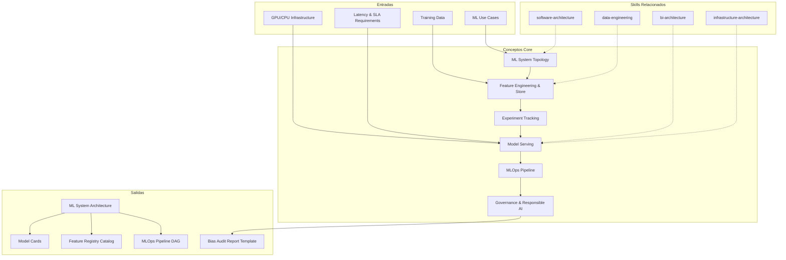

# Data Science Architecture: ML/AI System Design & Model Lifecycle

Data science architecture defines how machine learning systems are structured end-to-end — from feature engineering through model training, serving, monitoring, and governance. This skill produces ML system documentation that enables teams to build reproducible, scalable, and responsible AI systems.

## Grounding Guideline

**A model in a notebook is not a product. A model in production with monitoring is.** Data science architecture designs the complete cycle: from feature engineering to model serving, drift monitoring, and governance. MLOps is not DevOps for ML — it is the discipline that converts experiments into reliable products.

### ML Architecture Philosophy

1. **Mandatory reproducibility.** Every experiment, every training run, every feature pipeline must be reproducible. If it cannot be reproduced, it cannot be trusted.
2. **Monitoring > accuracy.** A model with 95% accuracy that drifts without detection is worse than one with 85% that is monitored. Drift detection is day 1.
3. **Feature store = single source of truth.** Features shared between models, versioned, with lineage. Do not reinvent features per model.

## Inputs

The user provides a system or project name as `$ARGUMENTS`. Parse `$1` as the **system/project name** used throughout all output artifacts.

**Parameters:**
- `{MODO}`: `piloto-auto` (default) | `desatendido` | `supervisado` | `paso-a-paso`
  - **piloto-auto**: Auto para análisis de sistema ML y feature design, HITL para decisiones de serving y governance.
  - **desatendido**: Zero interruptions. Arquitectura ML documentada automáticamente. Assumptions documented.
  - **supervisado**: Autónomo con checkpoint en feature store design y model serving decisions.
  - **paso-a-paso**: Confirma cada topology, feature pipeline, serving pattern, y governance policy.
- `{FORMATO}`: `markdown` (default) | `html` | `dual`
- `{VARIANTE}`: `ejecutiva` (~40% — S1 topology + S4 serving + S6 governance) | `técnica` (full 6 sections, default)

Before generating architecture, detect the codebase context:

```
!find . -name "*.py" -o -name "*.ipynb" -o -name "*.yaml" -o -name "*.toml" -o -name "Dockerfile" | head -30
```

Use detected frameworks (PyTorch, TensorFlow, scikit-learn, MLflow, Kubeflow, etc.) to tailor recommendations.

If reference materials exist, load them:

```
Read ${CLAUDE_SKILL_DIR}/references/ml-system-patterns.md
```

---

## When to Use

- Designing end-to-end ML systems from data ingestion through model serving
- Architecting feature stores and feature engineering pipelines
- Setting up experiment tracking and model registry infrastructure
- Designing model serving architectures (real-time, batch, streaming)
- Planning MLOps pipelines with CI/CD for ML, monitoring, and retraining
- Establishing responsible AI governance (bias detection, explainability, audit)

## When NOT to Use

- General data pipeline design without ML components → use data-engineering skill
- BI dashboards and reporting architecture → use bi-architecture skill
- Application-level software architecture → use software-architecture skill
- Infrastructure provisioning and compute scaling → use infrastructure-architecture skill

---

## Delivery Structure: 6 Sections

### S1: ML System Topology

Maps the overall ML system structure — training vs serving paths, online vs batch inference, data flow.

**Includes:**
- Training pipeline topology (data ingestion, preprocessing, training, evaluation, registration)
- Serving topology (online endpoints, batch scoring, streaming inference)
- Data flow diagram showing feature computation, model input/output, feedback loops
- Environment separation (dev, staging, production) with promotion gates
- Infrastructure mapping (GPU/CPU allocation, storage, networking)

**MLOps maturity level** (assess before designing):
- Level 0: Manual notebooks, no reproducibility — define bridge to production code
- Level 1: Automated training pipelines, manual deployment — add CI/CD for model promotion
- Level 2: Full CI/CD for training and deployment — add drift monitoring and automated retraining
- Level 3: Autonomous operations with self-healing pipelines — add cost governance and audit

**Key decisions:**
- Online vs batch vs streaming inference: latency requirements drive this (sub-100ms = online, minutes-acceptable = batch, continuous = streaming)
- Centralized vs federated training: single platform vs team-owned pipelines
- Feature computation: training-serving skew prevention strategy is non-negotiable

### S2: Feature Engineering & Store Design

Defines how features are computed, stored, served, and reused across models.

**Feature store comparison — select based on ecosystem:**

| Criterion | Feast | Tecton | Hopsworks |
|---|---|---|---|
| **Best for** | Open-source, cloud-agnostic | Real-time features at scale | End-to-end ML platform |
| **Online store** | Redis, DynamoDB, Bigtable | Managed low-latency store | RonDB (sub-ms) |
| **Offline store** | BigQuery, Snowflake, Redshift, S3 | S3/Spark-based | Hive/S3 |
| **Streaming transforms** | Limited (requires external) | Native Spark/Flink | Native Spark/Flink |
| **Cost model** | Free + infra costs | Per-feature-read pricing | License + infra |
| **Choose when** | Budget-constrained, <50 features online | High-throughput real-time serving | Want unified ML platform |

**Includes:**
- Feature pipeline architecture (batch transforms, streaming aggregations, on-demand computation)
- Feature store design (offline store for training, online store for serving)
- Feature registry (discovery, documentation, ownership, lineage)
- Training-serving consistency (point-in-time correctness, backfill strategy)

**Key decisions:**
- Push vs pull feature computation: latency vs freshness trade-off
- Materialization strategy: precompute vs on-demand vs hybrid
- Online store technology: Redis/DynamoDB for sub-millisecond serving; offline in Parquet/Delta — never serve training features from the online store
- Schema evolution: backward compatibility for downstream models

### S3: Experiment Tracking & Model Registry

Documents how experiments are tracked, models versioned, and lineage maintained.

**Experiment tracking tool comparison:**

| Criterion | MLflow | W&B (Weights & Biases) | Vertex AI Experiments |
|---|---|---|---|
| **Best for** | Open-source, self-hosted control | Collaboration, visualization | GCP-native teams |
| **Hosting** | Self-managed or Databricks | SaaS (cloud-hosted) | Managed on GCP |
| **Strengths** | Model registry, broad integrations | Real-time collab, sweep search, report sharing | Tight Vertex pipeline integration |
| **Weaknesses** | UI less polished, scaling effort | Vendor lock-in, cost at scale | GCP-only, less flexible |
| **Cost model** | Free (OSS) + infra | Free tier → $50/user/mo (Team) | Pay-per-use GCP pricing |
| **Choose when** | Multi-cloud, Databricks shop | Research-heavy teams needing rich comparison UI | Already on GCP Vertex |

**Includes:**
- Experiment tracking setup (parameters, metrics, artifacts, code snapshots)
- Model registry design (versioning, staging → production promotion)
- Lineage tracking (data version, feature version, code version, model version)
- Reproducibility framework (environment capture, seed management, deterministic training)

**Key decisions:**
- Model versioning granularity: full model vs incremental checkpoints
- Approval gates: automated quality checks vs manual review for production promotion
- Artifact storage: object store + model registry + container registry integration

### S4: Model Serving Architecture

Designs how models are deployed, scaled, and managed in production.

**Model monitoring stack — select by need:**

| Tool | Focus | Best For | Integration |
|---|---|---|---|
| **Evidently** | Data/model drift, test suites | OSS teams, CI/CD integration | Python lib, dashboards, Grafana |
| **Arize** | Production monitoring, embeddings | Real-time debugging, LLM observability | SDK, auto-instrumentation |
| **WhyLabs** | Continuous profiling, anomaly detection | High-volume streaming, privacy-preserving | whylogs agent, lightweight |
| **Fiddler** | Explainability + monitoring | Regulated industries, model cards | REST API, notebook SDK |

Selection criteria: choose Evidently for budget-conscious OSS; Arize for real-time + LLM workloads; WhyLabs for high-throughput with minimal overhead; Fiddler when explainability is a regulatory requirement.

**Includes:**
- Serving infrastructure (REST/gRPC endpoints, serverless functions, embedded models)
- A/B testing infrastructure (traffic splitting, power analysis for sample size, guardrail metrics that auto-halt experiments, rollback at p < 0.05 with 95% CI)
- Canary deployment (1% → 5% → 25% → 100% ramp, health checks, automatic rollback)
- Shadow mode (parallel inference without serving, comparison metrics)
- Latency optimization (model compilation, quantization, caching, batching)

**Key decisions:**
- Model format: native framework vs ONNX vs TensorRT — ONNX for portability, TensorRT for NVIDIA-specific latency wins
- Scaling strategy: horizontal (replicas) vs vertical (GPU) vs serverless (Lambda/Cloud Run for bursty traffic)
- Fallback behavior: degraded predictions, cached results, or error response — define per-model

### S5: MLOps Pipeline Design

Defines CI/CD for ML — automated training, testing, deployment, monitoring, and retraining.

**GPU cost optimization formulas:**
- Spot/preemptible instances: 60-90% savings for fault-tolerant training with checkpointing every N steps
- Quantization ROI: INT8 cuts inference cost 2-4x with <1% accuracy loss for most classification tasks; FP16 is safe default for training
- Cascade routing: cheap model (e.g., logistic regression) handles 70-80% of requests; expensive model only when confidence < threshold — reduces serving cost 3-5x
- Right-sizing: use T4 ($0.35/hr) for inference before reaching for A100 ($3.67/hr); profile actual GPU utilization — most serving workloads use <30% of an A100
- Multi-instance GPU (MIG): share A100 into 7 partitions for small-model serving
- Budget alerts: set daily spend caps with anomaly detection; alert at 80% threshold

**Includes:**
- CI/CD pipeline stages (data validation, training, evaluation, deployment, monitoring)
- Automated retraining triggers (schedule, drift detection, performance degradation below threshold)
- Model testing framework (unit tests, integration tests, performance benchmarks, bias checks)
- Pipeline orchestration (DAG design, dependency management, failure handling)

**Key decisions:**
- Trigger-based vs scheduled retraining: data volatility determines cadence
- Full retrain vs incremental update: model type and data volume trade-off
- Automated vs gated deployment: risk tolerance for production changes

### S6: Governance & Responsible AI

Establishes guardrails for bias detection, explainability, audit trails, and compliance.

**Responsible AI checklist (mandatory for production models):**
1. **Model card published** — fields: model details, intended use, training data summary, evaluation metrics across subgroups, fairness analysis, limitations, ethical considerations
2. **Bias metrics computed** — demographic parity difference < 0.1, equalized odds difference < 0.1 (adjust thresholds by domain; healthcare/finance require stricter)
3. **Explainability integrated** — SHAP values for tabular, Grad-CAM for vision, attention weights for NLP; global + local explanations available
4. **Data audit completed** — training data profiled for representation gaps, label quality, proxy variables
5. **Human override mechanism** — defined escalation path for high-stakes decisions
6. **Audit trail active** — who trained what, when, with which data, approved by whom
7. **Compliance mapped** — EU AI Act risk classification, GDPR data processing basis, industry-specific requirements

**Includes:**
- Bias detection framework (pre-training data audit, post-training fairness metrics)
- Explainability tooling (SHAP, LIME, feature importance, model cards)
- Data privacy controls (PII handling, differential privacy, federated learning)
- Model risk classification (low/medium/high risk with corresponding controls)

**Key decisions:**
- Fairness metrics: demographic parity, equalized odds, calibration — context-dependent; document why chosen metric fits the use case
- Audit granularity: decision-level logging vs aggregate monitoring
- Human-in-the-loop: when automated decisions require human oversight

---

## Trade-off Matrix

| Decision | Enables | Constrains | Threshold |
|---|---|---|---|
| **Centralized Feature Store** | Feature reuse, consistency | Team autonomy, single point of failure | 3+ models sharing features |
| **Real-Time Serving** | Low latency, interactive UX | Infrastructure cost, complexity | Sub-second SLA required |
| **Batch Inference** | Cost efficiency, simpler infra | Stale predictions | Minutes-to-hours latency acceptable |
| **Automated Retraining** | Fresh models, reduced toil | Compute cost, bad deployment risk | Stable pipelines with drift monitoring |
| **Shadow Deployment** | Risk-free validation | Double compute cost | High-risk models, regulatory requirements |
| **Model Ensemble** | Higher accuracy, robustness | Latency, debugging difficulty | Single-model accuracy insufficient |

---

## Assumptions

- ML use cases validated (business value confirmed before architecture)
- Training data accessible and profiled for quality
- Team has ML engineering capability (not just data science notebooks)
- Infrastructure budget supports chosen serving and training patterns
- Regulatory requirements known (industry, geography, data sensitivity)

## Limits

- Focuses on *ML system architecture*, not algorithm selection or hyperparameter tuning
- Does not design *data pipelines* upstream of ML
- Does not address *application integration* patterns
- Model performance optimization requires domain expertise beyond architectural design

---

## Edge Cases

**Notebook-to-Production Migration:**
Most ML starts in notebooks. Define the bridge: refactor into modular code, add tests, containerize, integrate with CI/CD. Provide incremental adoption path — expect resistance.

**Multi-Model Systems:**
When multiple models interact (ensemble, pipeline, routing), address dependency management, versioning across models, and cascade failure scenarios. Pin model versions for reproducibility.

**Edge/On-Device Deployment:**
Constraints: model size (<50MB typical), quantization (INT8/TFLite), OTA update mechanisms, offline capability. Architecture must address fallback when connectivity is lost.

**Regulated Industries (Healthcare, Finance):**
Audit trail, explainability, and bias detection are mandatory from day one. Model cards, decision logging, human override mechanisms are not optional.

**Cold Start / No Historical Data:**
Feature stores and training pipelines assume historical data. Include bootstrapping strategies, rule-based fallbacks, and progressive learning with feedback loops.

**LLM/Foundation Model Integration:**
When wrapping or fine-tuning LLMs, address: prompt versioning, evaluation frameworks (human + automated), cost per inference tracking, guardrails for hallucination and toxicity, RAG pipeline architecture if applicable.

---

## Validation Gate

Before finalizing delivery, verify:

- [ ] Training and serving paths separated with consistent feature computation
- [ ] Feature store prevents training-serving skew
- [ ] Experiment tracking captures full lineage (data, code, parameters, metrics)
- [ ] Model registry has promotion workflow (staging → production → rollback)
- [ ] Serving architecture meets latency SLA (measured, not estimated)
- [ ] A/B testing or shadow deployment strategy defined with statistical rigor
- [ ] Retraining triggers and pipeline automation specified
- [ ] Drift detection monitors both data distribution and model performance
- [ ] Responsible AI checklist completed (model card, bias metrics, explainability)
- [ ] GPU cost optimization applied (right-sizing, spot instances, quantization)

---

## Output Format Protocol

| Format | Default | Description |
|--------|---------|-------------|
| `markdown` | ✅ | Rich Markdown + Mermaid diagrams. Token-efficient. |
| `html` | On demand | Branded HTML (Design System). Visual impact. |
| `dual` | On demand | Both formats. |

Default output is Markdown with embedded Mermaid diagrams. HTML generation requires explicit `{FORMATO}=html` parameter.

## Output Artifact

**Primary:** `A-01_Data_Science_Architecture.html` — ML system topology, feature store design, experiment tracking, model serving architecture, MLOps pipeline, governance framework.

**Secondary:** Model cards (.md), feature registry catalog, MLOps pipeline DAG diagram, bias audit report template.

## Edge Cases

| Case | Handling Strategy |
|---|---|
| Notebook-to-production migration | Refactor into modular code, add tests, containerize, integrate with CI/CD. Incremental adoption path. Expect team resistance. |
| Multi-model systems (ensemble, pipeline, routing) | Dependency management between models, cross-model versioning, cascade failure scenarios. Pin model versions for reproducibility. |
| Edge/on-device deployment | Constraints: model size <50MB, quantization (INT8/TFLite), OTA updates, offline capability. Fallback when no connectivity. |
| Regulated industries (healthcare, finance) | Audit trail, explainability, and bias detection mandatory from day 1. Model cards, decision logging, human override are not optional. |
| Cold start / no historical data | Feature stores and training pipelines assume historical data. Bootstrapping with rules, rule-based fallbacks, progressive learning with feedback loops. |
| LLM/Foundation model integration | Prompt versioning, evaluation frameworks (human + automated), cost per inference tracking, guardrails for hallucination and toxicity, RAG pipeline if applicable. |

## Decisions and Trade-offs

| Decision | Discarded Alternative | Justification |
|---|---|---|
| Feature store as single source of truth | Features calculated per model, duplicated between teams | Shared, versioned features with lineage prevent training-serving skew and eliminate re-work. 3+ models sharing features justifies the investment. |
| Monitoring > accuracy as principle | Optimize accuracy first, monitoring later | A model with 95% accuracy that drifts without detection is worse than 85% monitored. Drift detection is day 1, not day N. |
| Mandatory Responsible AI checklist (7 items) | Optional or post-launch governance | Model card, bias metrics, explainability, data audit, human override, audit trail, and compliance mapping are production prerequisites, not nice-to-haves. |
| MLflow for multi-cloud, W&B for research-heavy | Single experiment tracking tool for everyone | MLflow (OSS, multi-cloud, broad integrations) for production. W&B (rich collaboration, sweep search) for research-heavy teams. Different teams can use different tools. |

## Knowledge Graph



## Output Templates

**Formato Markdown (default):**

```
# Data Science Architecture: {project}
## S1: ML System Topology
### MLOps Maturity Level: {0|1|2|3}
### Training Pipeline Topology (Mermaid)
### Serving Topology
## S2: Feature Engineering & Store Design
### Feature Store Selection: {Feast|Tecton|Hopsworks}
### Feature Pipeline Architecture
### Training-Serving Consistency Strategy
## S3: Experiment Tracking & Model Registry
### Tool Selection: {MLflow|W&B|Vertex}
### Promotion Workflow (Staging > Production)
## S4: Model Serving Architecture
### Serving Pattern: {real-time|batch|streaming}
### A/B Testing Infrastructure
### Monitoring Stack Selection
## S5: MLOps Pipeline Design
### CI/CD Stages for ML
### Retraining Triggers
### GPU Cost Optimization
## S6: Governance & Responsible AI
### Responsible AI Checklist (7 items)
### Model Risk Classification
```

**Formato HTML (bajo demanda):**

```
A-01_Data_Science_Architecture_{project}_{WIP}.html
```
HTML self-contained branded (Design System MetodologIA v5). Light-First Technical. Incluye MLOps maturity level visual, feature store comparison matrix interactiva, y responsible AI checklist con estado por item. WCAG AA, responsive, print-ready.

**Formato DOCX (bajo demanda):**

```
1. Executive Summary — ML system maturity + key architectural decisions
2. ML System Topology — training & serving paths, data flow diagram
3. Feature Store Design — offline/online stores, registry, consistency strategy
4. Experiment Tracking — tool selection, versioning, reproducibility framework
5. Model Serving — deployment patterns, A/B testing, monitoring stack
6. MLOps Pipeline — CI/CD stages, retraining triggers, cost optimization
7. Responsible AI Governance — checklist, bias metrics, explainability, compliance
Appendix A: Model Card Template
Appendix B: Bias Audit Report Template
Appendix C: GPU Cost Optimization Formulas
```

**Formato XLSX (bajo demanda):**
- Filename: `{fase}_Data_Science_Architecture_{cliente}_{WIP}.xlsx`
- Via openpyxl con MetodologIA Design System v5. Headers con fondo navy y tipografía Poppins en blanco, conditional formatting por MLOps maturity level y riesgo, auto-filters en todas las columnas, valores directos sin fórmulas.

**Formato PPTX (bajo demanda):**
- Filename: `{fase}_Data_Science_Architecture_{cliente}_{WIP}.pptx`
- Via python-pptx con MetodologIA Design System v5. Navy gradient slide master, Poppins titles, Trebuchet MS body, gold accents. Máx 20 slides ejecutivo / 30 técnico. Speaker notes con referencias de evidencia.

## Evaluacion

| Dimension | Peso | Criterio |
|---|---|---|
| Trigger Accuracy | 10% | Activacion correcta ante keywords de ML system, model serving, experiment tracking, feature store, MLOps, drift detection, retraining triggers. |
| Completeness | 25% | 6 secciones cubren topology, features, experiments, serving, MLOps, y governance. Responsible AI checklist con 7 items mandatorios. |
| Clarity | 20% | Comparison matrices (feature stores, experiment trackers, monitoring tools) con criterios de seleccion claros. MLOps maturity levels 0-3 definidos. |
| Robustness | 20% | Edge cases (notebook-to-prod, multi-model, edge deployment, regulated, cold start, LLM) manejados con estrategias especificas. |
| Efficiency | 10% | Variante ejecutiva reduce a S1+S4+S6 (~40%). GPU cost optimization con formulas concretas (spot, quantization, cascade routing). |
| Value Density | 15% | Responsible AI checklist accionable. Feature store comparison per ecosystem. GPU cost formulas con savings estimates. Model card template incluido. |

**Umbral minimo: 7/10.** Debajo de este umbral, revisar feature store design y responsible AI checklist completeness.

---
**Autor:** Javier Montano · Comunidad MetodologIA | **Ultima actualizacion:** 15 de marzo de 2026
