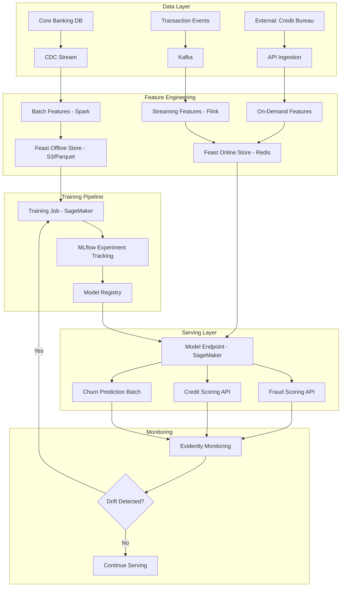
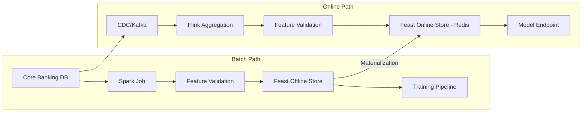
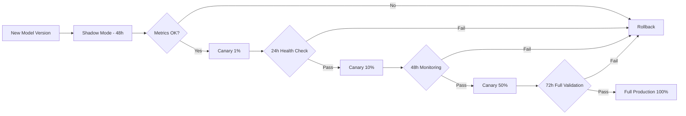

# Data Science Architecture — Acme Corp Banking Modernization

**Proyecto:** Acme Corp Banking Modernization
**Variante:** Tecnica (full)
**Fecha:** 12 de marzo de 2026
**Dominio ML:** Fraud Detection, Credit Scoring, Customer Churn Prediction

---

## S1: ML System Topology

### MLOps Maturity Assessment

Acme Corp currently operates at **Level 1** (automated training pipelines, manual deployment). Target: Level 2 by Q4 2026.

| Criterion | Current State | Target State | Gap |
|---|---|---|---|
| Training automation | Airflow DAGs, scheduled weekly | Event-triggered + drift-based | Medium |
| Model deployment | Manual promotion via tickets | CI/CD with canary rollout | High |
| Experiment tracking | Notebooks + spreadsheets | MLflow centralized registry | High |
| Feature management | Per-model SQL queries | Centralized feature store (Feast) | High |
| Drift monitoring | None | Evidently + automated retraining triggers | Critical |
| Model governance | Ad-hoc documentation | Model cards + bias audits + audit trail | High |

### System Topology

### Model Inventory

| Model | Type | Serving Mode | Latency SLA | Training Frequency | Business Impact |
|---|---|---|---|---|---|
| Fraud Detection v3.2 | XGBoost ensemble | Real-time (REST) | < 50ms P99 | Weekly + drift-triggered | Prevents ~$2.1M/month in fraud losses |
| Credit Scoring v2.1 | LightGBM | Near-real-time (REST) | < 200ms P99 | Monthly | Processes 8,400 applications/month |
| Customer Churn v1.4 | Random Forest | Batch (daily) | N/A | Monthly | Retention campaigns save ~$340K/quarter |

---

## S2: Feature Engineering & Store Design

### Feature Store Architecture

Acme Corp deploys **Feast** with Redis (online) and S3/Parquet (offline). Feature computation runs in two paths to prevent training-serving skew.

| Feature Group | Computation | Features | Freshness | Storage |
|---|---|---|---|---|
| Transaction Aggregates | Spark batch (hourly) | tx_count_24h, tx_amount_sum_7d, tx_avg_30d, tx_max_amount_24h | 1 hour | Offline + Online |
| Account Profile | dbt model (daily) | account_age_days, product_count, avg_balance_30d, overdraft_count_90d | 24 hours | Offline + Online |
| Credit Bureau | API pull (on-demand) | credit_score, delinquency_count, open_accounts, utilization_ratio | On request | Online only |
| Behavioral Signals | Flink streaming | login_frequency_7d, channel_diversity, unusual_time_flag, geo_anomaly | Real-time | Online only |
| Customer Demographics | dbt model (weekly) | age_bucket, income_segment, tenure_years, product_mix_category | Weekly | Offline + Online |

### Feature Registry

Total features: **47 active**, **12 deprecated**, **5 in development**

| Metric | Value |
|---|---|
| Feature reuse ratio | 2.8 models per feature (avg) |
| Most reused feature | `tx_count_24h` (all 3 models) |
| Freshness SLA compliance | 99.2% (30-day average) |
| Point-in-time correctness | Validated via backtest framework |

---

## S3: Experiment Tracking & Model Registry

### Experiment Tracking Setup (MLflow)

| Configuration | Value |
|---|---|
| Tracking server | MLflow on EKS (dedicated namespace) |
| Artifact store | S3 (`s3://acme-ml-artifacts/`) |
| Backend store | PostgreSQL RDS |
| Authentication | SSO via Okta SAML |
| Retention | Experiments: indefinite; artifacts: 1 year for non-production |

### Recent Experiments: Fraud Detection v3.x

| Run | Algorithm | Features | AUC-ROC | Precision @1% FPR | Latency (P99) | Status |
|---|---|---|---|---|---|---|
| fraud-v3.0 | XGBoost | 32 | 0.961 | 0.78 | 42ms | Production (retired) |
| fraud-v3.1 | XGBoost + SMOTE | 38 | 0.968 | 0.82 | 45ms | Production (retired) |
| fraud-v3.2 | XGBoost ensemble (3) | 42 | 0.974 | 0.86 | 48ms | **Production (current)** |
| fraud-v3.3 | LightGBM ensemble | 42 | 0.972 | 0.85 | 35ms | Staging (candidate) |
| fraud-v3.4 | Neural network | 47 | 0.976 | 0.87 | 120ms | Rejected (latency) |

### Model Registry Workflow

| Stage | Gate | Approver | Automation |
|---|---|---|---|
| Development | Experiment logged, metrics recorded | Data scientist | Automated via MLflow |
| Staging | AUC > 0.95, latency < 60ms, bias check passed | ML engineer | CI/CD gate |
| Production | A/B test significant (p < 0.05), no regression in guardrails | ML lead + product owner | Manual approval |
| Archived | Replaced by newer version, 30-day grace period | Automated | TTL-based |

---

## S4: Model Serving Architecture

### Serving Infrastructure

| Model | Endpoint | Instance Type | Replicas | Autoscaling | Fallback |
|---|---|---|---|---|---|
| Fraud Detection | SageMaker real-time | ml.c5.xlarge | 3 (min) - 8 (max) | Target: 70% CPU | Rules-based scoring (v2 legacy) |
| Credit Scoring | SageMaker real-time | ml.c5.large | 2 - 4 | Target: 60% CPU | Decline-by-default |
| Churn Prediction | SageMaker batch | ml.m5.2xlarge | 1 | N/A | Previous day's scores |

### A/B Testing Framework

Current A/B test: Fraud Detection v3.2 (control, 90%) vs v3.3 (treatment, 10%)

| Metric | v3.2 (Control) | v3.3 (Treatment) | Significance |
|---|---|---|---|
| Fraud catch rate | 86.2% | 85.8% | p = 0.42 (not significant) |
| False positive rate | 1.02% | 0.88% | p = 0.03 (significant) |
| P99 latency | 48ms | 35ms | p < 0.001 (significant) |
| Revenue impact (est.) | Baseline | +$42K/month (fewer false blocks) | -- |

**Decision:** Continue test for 2 more weeks to reach statistical power on fraud catch rate. Preliminary results favor v3.3 on operational metrics.

### Canary Deployment Strategy

---

## S5: MLOps Pipeline Design

### CI/CD Pipeline for ML

| Stage | Duration | Actions | Gate |
|---|---|---|---|
| Code Quality | 3 min | Lint, type check, unit tests | Coverage > 80% |
| Data Validation | 8 min | Schema check, GX expectations on sample | All critical checks pass |
| Training | 45 min | Full retrain on latest data window | Completes without OOM/error |
| Evaluation | 10 min | AUC, precision, recall, latency benchmark, bias metrics | AUC > threshold, latency < SLA |
| Registry | 2 min | Log to MLflow, generate model card | Model card complete |
| Staging Deploy | 5 min | Deploy to staging endpoint | Health check passes |
| Integration Test | 15 min | End-to-end inference test, load test | P99 < SLA, no errors |
| Production Approval | Manual | ML lead reviews model card + metrics | Signed off |

### Retraining Triggers

| Trigger | Detection Method | Action | Frequency |
|---|---|---|---|
| Scheduled | Cron | Full retrain | Weekly (fraud), monthly (credit, churn) |
| Data drift | PSI > 0.2 on top features | Alert + auto-retrain | Continuous monitoring |
| Performance decay | AUC drops > 2% from baseline | Alert + investigation + retrain | Continuous monitoring |
| New feature available | Feature store event | Experiment with new feature | On availability |
| Regulatory change | Manual trigger | Retrain with updated rules | As needed |

### GPU Cost Optimization

| Optimization | Current | Proposed | Annual Savings |
|---|---|---|---|
| Training instances | On-demand ml.p3.2xlarge | Spot instances (70% discount) | $18,200 |
| Inference right-sizing | ml.c5.xlarge (28% GPU util) | ml.c5.large (65% util target) | $9,400 |
| Batch scoring window | 6h window daily | 2h window (off-peak spot) | $4,800 |
| Model quantization | FP32 | FP16 inference | $3,100 |
| **Total** | | | **$35,500/year** |

---

## S6: Governance & Responsible AI

### Model Card: Fraud Detection v3.2

| Field | Value |
|---|---|
| **Model name** | acme-fraud-detection-v3.2 |
| **Model type** | XGBoost ensemble (3 models, majority vote) |
| **Intended use** | Real-time transaction fraud scoring for retail banking |
| **Training data** | 24 months of labeled transactions (12.4M records, 0.3% fraud rate) |
| **Evaluation data** | 3-month holdout (3.1M records) |
| **Primary metric** | AUC-ROC: 0.974 |
| **Precision @1% FPR** | 0.86 |
| **Latency** | P50: 22ms, P95: 38ms, P99: 48ms |
| **Known limitations** | Lower accuracy for international wire transfers (AUC: 0.94) |
| **Ethical considerations** | No demographic features used; proxy variable audit completed |

### Bias Audit Results

| Subgroup | AUC-ROC | False Positive Rate | Demographic Parity Diff | Assessment |
|---|---|---|---|---|
| Age < 25 | 0.968 | 1.4% | 0.038 | Within threshold (< 0.1) |
| Age 25-55 | 0.975 | 0.95% | Baseline | Baseline |
| Age > 55 | 0.971 | 1.1% | 0.015 | Within threshold |
| High-income segment | 0.979 | 0.72% | -0.023 | Within threshold |
| Low-income segment | 0.962 | 1.8% | 0.085 | **Monitor** (approaching 0.1) |
| Urban customers | 0.976 | 0.88% | Baseline | Baseline |
| Rural customers | 0.964 | 1.6% | 0.072 | Within threshold |

> **Action required:** Low-income segment FPR is 1.89x the baseline. While demographic parity difference (0.085) is within the 0.1 threshold, the team will investigate feature contributions via SHAP analysis and consider segment-specific thresholds for Q2 2026.

### Compliance Mapping

| Requirement | Regulation | Acme Corp Implementation |
|---|---|---|
| Explainability for adverse decisions | SFC Circular (CO) | SHAP-based explanations for declined transactions |
| Algorithmic audit trail | Habeas Data (CO) | MLflow lineage + decision logging |
| Right to human review | Internal policy | Escalation path for flagged-as-fraud disputes |
| Data minimization | GDPR (EU counterparties) | Feature store tracks lineage; no raw PII in features |
| Model risk management | Basel III/IV | Model card + quarterly validation report |

---

## Conclusions

### Architecture Decisions Summary

| Decision | Choice | Rationale |
|---|---|---|
| Feature store | Feast (OSS) | Cloud-agnostic, cost-effective, sufficient for < 50 online features |
| Experiment tracking | MLflow (self-hosted) | Multi-cloud flexibility, strong registry, team familiarity |
| Model serving | SageMaker endpoints | AWS-native, autoscaling, integrated with training |
| Drift monitoring | Evidently (OSS) | CI/CD integration, test suites, budget-friendly |
| Orchestration | Airflow (MWAA) | Existing investment, DAG-based, team expertise |

### Investment Estimate

| Component | Setup Cost | Monthly Run Cost | Timeline |
|---|---|---|---|
| Feature store (Feast + Redis + S3) | $15K | $2,800 | 6 weeks |
| MLflow cluster (EKS) | $8K | $1,200 | 3 weeks |
| CI/CD pipeline (ML-specific) | $12K | $400 | 4 weeks |
| Monitoring (Evidently + Grafana) | $6K | $600 | 2 weeks |
| Governance framework | $10K | $200 | 4 weeks |
| **Total** | **$51K** | **$5,200/month** | **12 weeks** |

---

**Autor:** Javier Montano — MetodologIA Discovery Framework v6.0
