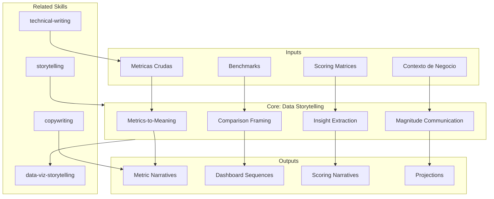

# Data Storytelling — Metrics to Meaning

Transforms raw metrics, scores, and quantitative findings into meaningful narratives that drive understanding and action. Owns insight extraction, comparison framing, magnitude communication, and the bridge between numbers and decisions.

## Guiding Principle

**A number without context is noise. A number with context, comparison, and consequence is an insight.** 92% test coverage means nothing until we know that the uncovered 8% concentrates the payment modules — exactly where risk is highest. Data metodologia-storytelling turns metrics into comprehension.

### Narrative Data Philosophy

1. **Context before number.** Not "coverage is 92%". Yes: "the team invested in quality (92% coverage), but the uncovered 8% concentrates the critical payment modules".
2. **Always compare.** Every metric needs a reference: vs. baseline, vs. industry, vs. target, vs. prior quarter.
3. **Explicit consequence.** So what? → "This means that..." → "Which implies that..." → "Therefore, we recommend..."
4. **Tangible magnitude.** FTE-months → "equivalent to a team of 5 people for 8 months". Abstract → concrete.

## Inputs

- `$1` — Data context: `metrics`, `scoring`, `financial`, `performance`, `coverage` (default: `metrics`)
- `$2` — Audience: `executive`, `technical`, `mixed` (default: `mixed`)

Parse from `$ARGUMENTS`.

## Core Patterns

### Pattern 1: Metrics-to-Meaning

```
Raw metric → Context → Comparison → Insight → Implication → Action

Example:
  Raw: "Deployment frequency: 1/month"
  Context: "El equipo despliega una vez al mes"
  Comparison: "vs. benchmark DORA de equipos elite: múltiples por día"
  Insight: "La brecha de 30x indica proceso manual o miedo al cambio"
  Implication: "Cada feature espera en promedio 15 días de cola antes de llegar a producción"
  Action: "Pipeline CI/CD automatizado puede cerrar la brecha a 1/semana en 3 sprints"
```

### Pattern 2: Insight Extraction

```
Data point → Pattern → Anomaly → Significance → Recommendation

Steps:
1. Observe the data point: "8 de 12 módulos tienen cobertura >90%"
2. Detect the pattern: "Los módulos con alta cobertura comparten equipo senior"
3. Identify the anomaly: "Los 4 módulos sin cobertura son todos del equipo junior"
4. Interpret the significance: "No es un problema de herramientas, es de capacitación"
5. Recommend: "Pair programming cross-team + coverage gates en CI"
```

### Pattern 3: Comparison Framing

| Frame Type | When | Example |
|-----------|------|---------|
| **Before/After** | Projected improvement | "De 12 semanas a 4 semanas de time-to-market" |
| **Peer Benchmark** | Industry comparison | "vs. mediana del sector: 3 deploys/semana" |
| **Industry Standard** | Reference frameworks | "DORA elite: <1 hora lead time" |
| **Internal Baseline** | Historical comparison | "vs. Q1: incidentes reducidos 40%" |
| **Target Gap** | Distance to objective | "A 15 puntos del objetivo de disponibilidad 99.9%" |
| **Cost Equivalence** | Making FTE tangible | "Equivalente a 3 desarrolladores senior durante 6 meses" |

### Pattern 4: Magnitude Communication

```
Abstract → Concrete → Impactful

"40 FTE-meses"
  → "Equivalente a un equipo de 8 personas durante 5 meses"
  → "Es decir, todo el equipo backend dedicado exclusivamente
     desde enero hasta mayo, sin poder hacer nada más"

"99.5% disponibilidad"
  → "43 horas de downtime al año"
  → "Equivalente a casi 2 días completos sin servicio,
     probablemente concentrados en momentos de alta demanda"

"$2M de deuda técnica" → NEVER. Use FTE-month equivalents.
```

## Scoring Matrix Narratives

When presenting scoring tables:

```
1. Lead with the pattern, not individual scores:
   "De las 6 dimensiones evaluadas, 2 están en rojo y comparten causa raíz:
    acoplamiento entre el módulo de autenticación y el core de negocio."

2. Highlight the anomalies:
   "La dimensión de seguridad sorprende en verde dado que el equipo
    no tiene un rol dedicado — evidencia de buenas prácticas orgánicas."

3. Connect to action:
   "Los 2 rojos se resuelven con el escenario B en Fase 1 (Q2);
    los 3 amarillos mejoran orgánicamente con la nueva arquitectura."
```

## Dashboard Narrative Sequences

For multi-chart metodologia-storytelling (presentations, executive summaries):

```
Chart 1: The headline
  "Aquí estamos" — current state summary metric

Chart 2: The context
  "Así llegamos aquí" — trend or historical view

Chart 3: The comparison
  "Así estamos vs. donde deberíamos estar" — benchmark gap

Chart 4: The path
  "Así cerramos la brecha" — roadmap or scenario projection

Each chart builds on the previous. No standalone charts.
```

## Semantic Density Rules

| Type | Guideline |
|------|-----------|
| Table footnotes | Explain methodology, not data (data goes in cells) |
| Semaphore criteria | Define thresholds: >80%, 50-80%, <50% |
| Cross-references | "→ See 03_AS-IS § Cobertura for methodology" |
| Source attribution | Evidence tag inline: "92% cobertura [CÓDIGO]" |

## Output Configuration

- **Language**: Spanish (Latin American, business register — simple, clear, concise, direct)
- **Attribution**: Expert committee of the MetodologIA Discovery Framework
- **Tagline**: *"Construido por profesionales, potenciado por la red agéntica de MetodologIA."*

## Validation Gate

| Criterion | Check |
|-----------|-------|
| Every metric has context | Not just the number — the story around it |
| Every metric has comparison | vs. baseline, benchmark, target, or prior period |
| Insights are actionable | "So what?" answered for every data point |
| Magnitudes are tangible | FTE-months translated to team-equivalents |
| Scoring patterns highlighted | Not just individual scores — the story across dimensions |
| No naked numbers | Zero metrics without interpretation |

## Supuestos y Limites

- Las metricas de input ya estan calculadas; esta skill interpreta y contextualiza, no calcula.
- NUNCA presentar metricas sin contexto y comparacion.
- NUNCA usar valores monetarios para costos. Solo FTE-meses.
- Esta skill posee **interpretacion de metricas y framing narrativo**. NO posee diseno de visualizacion (eso es data-viz-storytelling) ni arco narrativo general (eso es storytelling).

## Casos Borde

| Caso Borde | Estrategia de Manejo |
|---|---|
| No hay benchmarks sectoriales disponibles | Usar linea base interna (trimestre anterior, otro equipo, otro proyecto). Declarar explicitamente: "Sin benchmark sectorial disponible; se usa linea base interna Q1 como referencia [SUPUESTO]". Si tampoco hay baseline interno, usar frameworks estandar (DORA, SRE). |
| Metricas contradictorias entre si | Presentar la contradiccion como hallazgo en si mismo. "La cobertura alta (92%) contradice la tasa de incidentes (8/mes), sugiriendo tests que no cubren escenarios reales [INFERENCIA]". La contradiccion ES la historia. |
| Datos escasos (<10 data points) | Reconocer limitacion explicitamente: "Con [N] datos, la tendencia es indicativa, no concluyente". Usar intervalos de confianza. Recomendar periodo de recoleccion antes de conclusiones definitivas. |
| Metricas que favorecen inaccion (todo en verde) | Buscar la historia debajo de la superficie: tendencias, velocidad de degradacion, costo de oportunidad. "Todo esta en verde hoy, pero la tendencia de los ultimos 3 trimestres muestra..." |

## Decisiones y Trade-offs

| Decision | Justificacion | Alternativa Descartada |
|---|---|---|
| Contexto antes que numero como regla | Un numero sin referencia es ruido. El lector no puede evaluar "92% cobertura" sin saber el target, el baseline, o el benchmark. | Numero primero: el lector forma juicio prematuro antes de tener marco de referencia. |
| Comparacion obligatoria en toda metrica | Toda metrica necesita al menos una referencia: vs baseline, vs industria, vs target, vs trimestre anterior. Sin comparacion no hay insight. | Metrica aislada: informativa pero no accionable; el lector no sabe si es bueno o malo. |
| Magnitudes tangibles sobre abstractas | "40 FTE-meses" no significa nada para un CEO. "Todo el equipo backend dedicado de enero a mayo sin hacer nada mas" genera comprension visceral. | Magnitudes abstractas: precisas pero no comunicativas para audiencia ejecutiva. |
| Secuencia narrativa en dashboards (4 charts) | Cada chart construye sobre el anterior: estado -> tendencia -> benchmark -> camino. Sin secuencia, los charts son datos aislados. | Charts independientes: flexibles pero no construyen argumento acumulativo. |

## Knowledge Graph



## Output Templates

### Template 1: Metrics Narrative Report (Markdown)

**Filename:** `Data_Narrative_{project}_{dimension}_{WIP|Aprobado}.md`

```markdown
# Narrativa de Datos: {project} - {dimension}

## Headline
{Una metrica clave con contexto y comparacion en una linea}

## Estado Actual
| Metrica | Valor | Baseline | Benchmark | Gap | Tendencia |
|---|---|---|---|---|---|

## Interpretacion
{Parrafo denso: patron detectado + anomalia + significancia}

## Implicacion
{So what? Que significa para el negocio en terminos tangibles}

## Recomendacion
{Accion concreta que cierra el gap, con timeline estimado}

## Fuentes
| Dato | Tag de Evidencia | Confianza |
|---|---|---|
```

### Template 3: HTML (bajo demanda)
- Filename: `Data_Narrative_{project}_{dimension}_{WIP}.html`
- Estructura: HTML self-contained branded (Design System MetodologIA v5). Dark-First Executive. Incluye tarjetas de métricas con semáforo, tabla comparativa interactiva y callouts de insight. WCAG AA, responsive, print-ready.

### Template 4: DOCX (circulación formal)
- Filename: `{fase}_{entregable}_{cliente}_{WIP}.docx`
- Generado via python-docx con MetodologIA Design System v5. Portada con metadata del engagement, TOC automático, encabezados/pies de página con marca. Tablas con zebra striping, tipografía Poppins en headings (navy), Montserrat en cuerpo, acentos dorados. Para circulación formal y auditoría.

### Template 5: XLSX (bajo demanda)
- Filename: `{fase}_{entregable}_{cliente}_{WIP}.xlsx`
- Via openpyxl con MetodologIA Design System v5. Headers con fondo navy y tipografía Poppins en blanco, conditional formatting por semáforo y tendencia de métrica, auto-filters en todas las columnas, valores directos sin fórmulas.

### Template 6: PPTX (bajo demanda)
- Filename: `{fase}_{entregable}_{cliente}_{WIP}.pptx`
- Via python-pptx con MetodologIA Design System v5. Navy gradient slide master, Poppins titles, Montserrat body, gold accents. Máx 20 slides ejecutivo / 30 técnico. Speaker notes con referencias de evidencia.

### Template 2: Scoring Matrix Narrative (Markdown)

**Filename:** `Scoring_Narrative_{project}_{WIP|Aprobado}.md`

```markdown
# Scoring Narrative: {project}

## Patron General
{De las N dimensiones evaluadas, X estan en rojo y comparten causa raiz: ...}

## Scoring Matrix
| Dimension | Score | Semaforo | Evidencia Clave | Causa Raiz |
|---|---|---|---|---|

## Anomalias
{Dimensiones que sorprenden -- positiva o negativamente -- con explicacion}

## Conexion a Accion
{Los rojos se resuelven con [escenario] en [fase]; los amarillos mejoran con...}

## Proyeccion
{Si no se actua: tendencia de scores en N trimestres}
```

## Evaluacion

| Dimension | Peso | Criterio |
|---|---|---|
| Trigger Accuracy | 10% | Se activa ante metricas, scores, datos cuantitativos que requieren interpretacion y contexto |
| Completeness | 25% | Toda metrica tiene contexto, comparacion, interpretacion, implicacion, y recomendacion |
| Clarity | 20% | Magnitudes tangibles; secuencia logica dato -> insight -> accion; cero numeros desnudos |
| Robustness | 20% | Produce narrativas utiles sin benchmarks, con datos escasos, con metricas contradictorias |
| Efficiency | 10% | Genera narrativa completa por metrica sin requerir multiples iteraciones |
| Value Density | 15% | Cada metrica interpretada genera insight accionable; ratio signal-to-noise alto |

**Umbral minimo: 7/10**

## Cross-References

- `metodologia-storytelling` — Arco narrativo general que consume las narrativas de datos
- `metodologia-copywriting` — Prosa persuasiva que envuelve los insights de datos
- `metodologia-data-viz-storytelling` — Visualizaciones que representan las narrativas de datos
- `metodologia-technical-writing` — Precision documental de las metricas fuente

## Edge Cases

- **No benchmarks available**: Use internal baseline or state explicitly: "Sin benchmark sectorial disponible; se usa linea base interna Q1 como referencia [SUPUESTO]".
- **Conflicting metrics**: Present the contradiction as a finding: "La cobertura alta (92%) contradice la tasa de incidentes (8/mes), sugiriendo tests que no cubren escenarios reales [INFERENCIA]".
- **Sparse data**: Acknowledge gaps: "Con [N] datos, la tendencia es indicativa, no concluyente".

## Limits

- This skill owns **metric interpretation and narrative framing**. It does NOT own visualization design (that's metodologia-data-viz-storytelling) or overall narrative arc (that's metodologia-storytelling).
- NEVER present metrics without context and comparison.
- NEVER use currency values for costs. FTE-months only.
