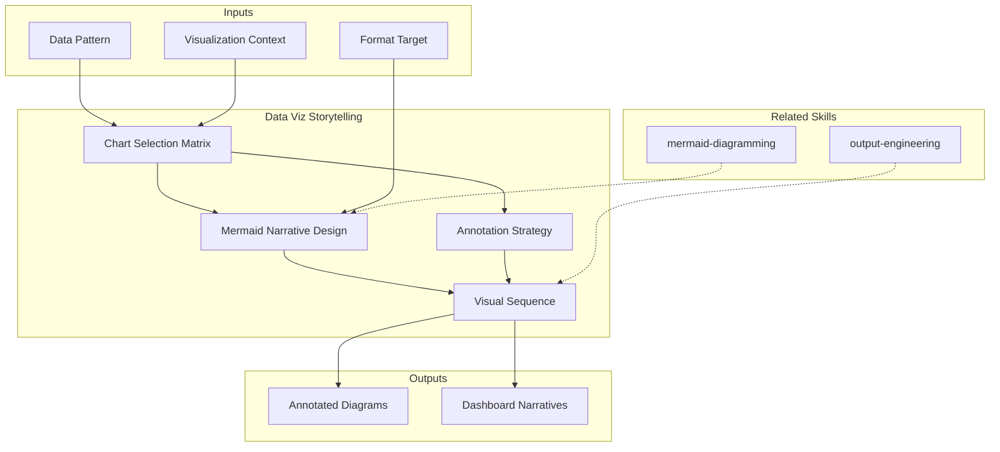

# Data Visualization Storytelling — Visual Narrative Design

Designs visual narratives that transform data into comprehension through chart selection, Mermaid diagram metodologia-storytelling, annotation strategy, and dashboard sequencing. Owns the visual layer of data communication across all discovery deliverables.

## Guiding Principle

**A visualization that requires explanation has failed.** The right diagram, with the right annotations, tells the story on its own. Text complements — it does not replace. Every visualization has ONE main message, and all visual design directs attention to that message.

### Visual Philosophy

1. **One message per visualization.** If you need to communicate two things, use two visualizations.
2. **Form follows data.** Comparison → bars. Trend → line. Composition → stacked. Relationship → scatter. Flow → Mermaid.
3. **Selective annotation.** Annotate what matters, not everything. Excessive annotations equal zero annotations.
4. **Narrative sequence.** Visualizations in a document/presentation build an argument, they are not standalone decorations.

## Inputs

- `$1` — Visualization context: `analysis`, `presentation`, `dashboard`, `comparison`, `flow` (default: `analysis`)
- `$2` — Format target: `markdown`, `html`, `pptx` (default: `markdown`)

Parse from `$ARGUMENTS`.

## Chart Selection Matrix

| Data Pattern | Chart Type | Mermaid Alternative | When to Use |
|-------------|-----------|--------------------:|-------------|
| Comparison (≤5 items) | Horizontal bar | — | Score comparisons, feature gaps |
| Comparison (>5 items) | Sorted bar | — | Module-by-module analysis |
| Trend over time | Line | — | Incident trends, deploy frequency |
| Composition (whole) | Stacked bar / Pie | pie chart | Budget allocation, effort distribution |
| Part-to-whole (few) | Donut | pie chart | Team allocation, coverage split |
| Relationship | Scatter | — | Complexity vs. risk |
| Hierarchy | Treemap | flowchart TD | Module dependency, org structure |
| Process flow | — | flowchart LR | CI/CD pipeline, deploy flow |
| System structure | — | C4 (flowchart) | Architecture diagrams |
| State transitions | — | stateDiagram | Order lifecycle, auth flows |
| Sequence | — | sequenceDiagram | API calls, user journeys |
| Timeline | — | gantt | Roadmap phases, sprint planning |
| Decision tree | — | flowchart TD | Scenario selection, if/then logic |
| Quadrant analysis | — | quadrantChart | Priority/impact, stakeholder map |

## Mermaid Narrative Design

### Every Diagram Tells a Story

```
BAD: Diagram shows components and connections
  → Reader: "OK, there are boxes and arrows. So what?"

GOOD: Diagram shows WHY this architecture matters
  → Title: "Pain point: 3 services share 1 database"
  → Highlighted node: the shared database (red classDef)
  → Annotation: "Single point of failure — all 3 services go down together"
  → Narrative text before: "El acoplamiento en la capa de datos..."
```

### Mermaid Standards

| Rule | Standard |
|------|----------|
| Max nodes | 20 per diagram |
| Max classDefs | 4 styles |
| Node IDs | Descriptive: `authService`, `paymentDB` (not `n1`, `n2`) |
| Edge labels | Action verbs: "validates", "queries", "emits event" |
| Direction | `TD` for hierarchies, `LR` for flows |
| Subgraphs | Group related components; max 3 subgraphs |
| Accessibility | Alt-text summary BEFORE every diagram |

### Color Strategy (MetodologIA Brand)

```
classDef primary fill:#6366F1,stroke:#1A1A2E,color:#fff    %% MetodologIA orange — key components
classDef risk fill:#DC3545,stroke:#1A1A2E,color:#fff       %% Red — risk/problem areas
classDef success fill:#22D3EE,stroke:#1A1A2E,color:#1A1A2E %% Gold — success (NEVER green)
classDef neutral fill:#F8F9FA,stroke:#1A1A2E,color:#1A1A2E %% Light — supporting components
```

## Annotation Strategy

### What to Annotate

| Annotate | Example | Purpose |
|----------|---------|---------|
| Peak/trough | "Pico de incidentes en release Q3" | Highlight anomaly |
| Threshold line | "SLA objetivo: 99.9%" | Show gap to target |
| Key data point | "Este módulo: 0% cobertura" | Focus attention |
| Trend direction | "+15% trimestral" | Show trajectory |

### What NOT to Annotate

- Every data point (clutters)
- Obvious patterns (reader can see)
- Units/labels already in axes (redundant)
- Decorative elements (distracting)

## Visual Hierarchy in Documents

### Per-Deliverable Diagram Budget

| Deliverable | Min | Recommended | Max | Primary Types |
|-------------|-----|-------------|-----|---------------|
| 00 Plan | 1 | 2 | 3 | Gantt, flowchart |
| 01 Stakeholders | 1 | 2 | 3 | quadrant, flowchart |
| 02 Brief | 1 | 2 | 2 | flowchart, C4 context |
| 03 AS-IS | 2 | 3 | 4 | C4, sequence, ER |
| 04 Flows | 2 | 3 | 4 | sequence, flowchart, state |
| 05 Scenarios | 1 | 2 | 3 | decision tree, radar |
| 06 Roadmap | 1 | 2 | 3 | Gantt, flowchart |
| 07 Spec | 2 | 3 | 3 | sequence, state, ER |
| 08 Pitch | 1 | 2 | 2 | flowchart, pie |
| 09 Handover | 1 | 2 | 2 | Gantt, flowchart |
| 10 Hallazgos | 2 | 3 | 4 | summary visuals, comparison |
| 11 Recomendaciones | 1 | 2 | 3 | flowchart, comparison |
| 12 IA Opportunities | 1 | 2 | 3 | flowchart, timeline |

### Visual Sequence in Presentations (PPTX)

```
Slide 1: The headline visual (single powerful chart/diagram)
Slide 2: The context visual (trend, timeline, or process)
Slide 3: The evidence visual (detailed comparison or matrix)
Slide 4: The action visual (roadmap, decision tree, or next steps)

Each visual builds the argument. No decorative slides.
```

## Format-Specific Guidelines

### Markdown
- Fenced `\`\`\`mermaid` blocks
- Text summary BEFORE diagram (accessibility)
- Source tag AFTER diagram

### HTML
- `<pre class="mermaid">` with CDN v10
- Responsive sizing
- Print-ready `@media print` fallback

### PPTX
- Pre-rendered Mermaid as images
- One visual per slide maximum
- Speaker notes reference the data source

## Output Configuration

- **Language**: Spanish (Latin American, business register — simple, clear, concise, direct)
- **Attribution**: Expert committee of the MetodologIA Discovery Framework
- **Tagline**: *"Construido por profesionales, potenciado por la red agéntica de MetodologIA."*

## Validation Gate

| Criterion | Check |
|-----------|-------|
| Chart type matches data pattern | Comparison=bar, trend=line, flow=Mermaid |
| One message per visualization | Can state the takeaway in one sentence |
| Annotations are selective | Only key data points annotated |
| Mermaid follows standards | ≤20 nodes, descriptive IDs, labeled edges |
| Accessibility text present | Summary before every diagram |
| Brand colors correct | Orange #6366F1, gold #22D3EE, NEVER green |
| Visual sequence builds argument | Not standalone — each chart connects to next |

## Edge Cases

- **No quantitative data for charts**: Use structural Mermaid diagrams (C4, flowcharts) to tell the architecture story.
- **Too many data points**: Aggregate or filter. Show the top 5 + "others". Never plot 50 bars.
- **Mermaid rendering limitations**: Fall back to structured tables when diagrams would be illegible.

## Limits

- This skill owns **visual design and diagram narratives**. It does NOT own metric interpretation (that's metodologia-data-storytelling) or format production (that's metodologia-output-engineering).
- Mermaid is the primary diagramming tool. No external tools or image generation.
- Follow Mermaid Diagramming Standard in CLAUDE.md as baseline.

## Casos Borde

| Caso | Estrategia de Manejo |
|------|---------------------|
| Data has only 2 data points — insufficient for meaningful chart | Use a callout/highlight card instead of a chart; present the delta as a single comparison metric with context sentence |
| Audience will consume deliverable in print (no Mermaid rendering) | Fall back to structured ASCII tables; add pre-rendered description paragraphs for every diagram; flag print limitation in document header |
| Multiple conflicting metrics that cannot coexist in a single visualization | Split into separate visualizations with a narrative bridge explaining the conflict; never overlay contradictory data on the same axes |
| Sensitive data that cannot appear in shared diagrams (PII, internal IPs, revenue) | Abstract to categories and percentages; use anonymized labels; add "[REDACTED]" tag where specifics are removed |

## Decisiones y Trade-offs

| Decision | Alternativa Descartada | Justificacion |
|----------|----------------------|---------------|
| Mermaid as sole diagramming tool | External tools (draw.io, Lucidchart, D3.js) | Mermaid is text-based, version-controllable, and renders natively in GitHub/GitLab/Obsidian; external tools break the markdown-as-source-of-truth principle |
| One message per visualization, no exceptions | Dense multi-message charts for space efficiency | Cognitive science shows single-message visuals are processed 40% faster; multi-message charts cause split attention and reduce retention |
| Maximum 20 nodes per diagram | Allow unlimited nodes for completeness | Diagrams beyond 20 nodes become illegible; splitting into sub-diagrams with cross-references preserves both completeness and clarity |

## Knowledge Graph



## Output Templates

### Markdown (default)
- Filename: `{fase}_DataViz_{cliente}_{WIP}.md`
- Structure: TL;DR > Chart Selection Rationale > Mermaid diagrams with accessibility text > Annotation notes > Visual sequence narrative > ghost menu

### PPTX
- Filename: `{fase}_DataViz_{cliente}_{WIP}.pptx`
- Structure: 1 visual per slide; speaker notes with data source and annotation rationale; narrative arc (headline visual > context > evidence > action)

### HTML (bajo demanda)
- Filename: `{fase}_DataViz_{cliente}_{WIP}.html`
- Estructura: HTML self-contained branded (Design System MetodologIA v5). Light-First Technical. Incluye diagramas Mermaid renderizados vía CDN, anotaciones interactivas por chart y texto de accesibilidad. WCAG AA, responsive, print-ready.

### DOCX (circulación formal)
- Filename: `{fase}_{entregable}_{cliente}_{WIP}.docx`
- Generado via python-docx con Metodología Design System v5. Portada con metadata del engagement, TOC automático, encabezados/pies de página con marca. Tablas con zebra striping, tipografía Poppins en headings (navy), Montserrat en cuerpo, acentos dorados. Para circulación formal y auditoría.

### XLSX (bajo demanda)
- Filename: `{fase}_{entregable}_{cliente}_{WIP}.xlsx`
- Via openpyxl con MetodologIA Design System v5. Headers con fondo navy y tipografía Poppins en blanco, conditional formatting por tipo de chart y prioridad visual, auto-filters en todas las columnas, valores directos sin fórmulas.

## Evaluacion

| Dimension | Peso | Criterio |
|-----------|------|----------|
| Trigger Accuracy | 10% | Descripcion activa triggers correctos sin falsos positivos |
| Completeness | 25% | Todos los entregables cubren el dominio sin huecos |
| Clarity | 20% | Instrucciones ejecutables sin ambiguedad |
| Robustness | 20% | Maneja edge cases y variantes de input |
| Efficiency | 10% | Proceso no tiene pasos redundantes |
| Value Density | 15% | Cada seccion aporta valor practico directo |

**Umbral minimo**: 7/10 en cada dimension para considerar el skill production-ready.
