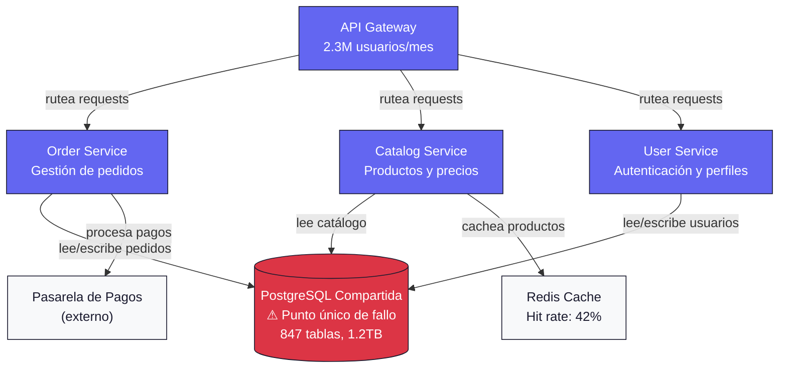
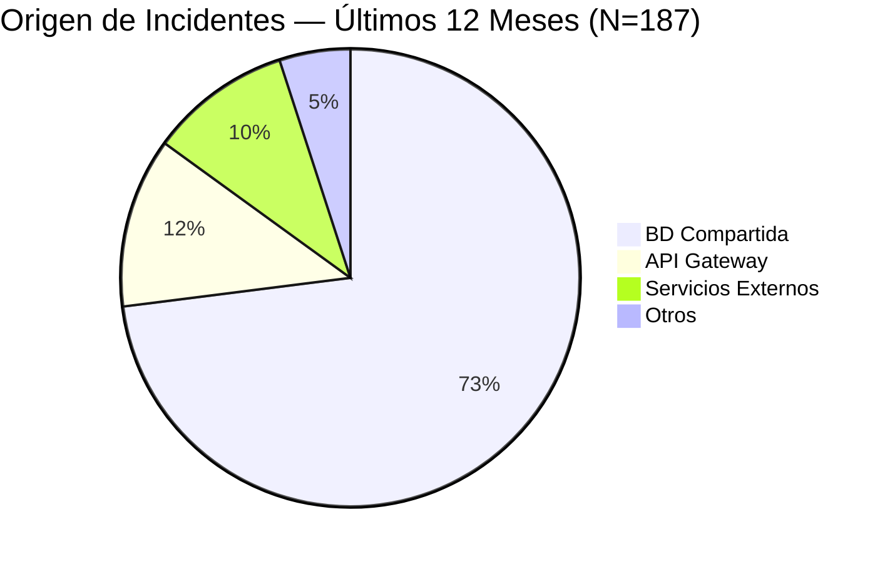
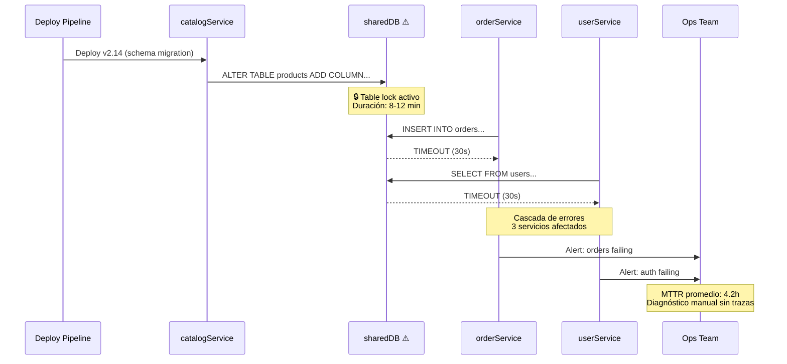
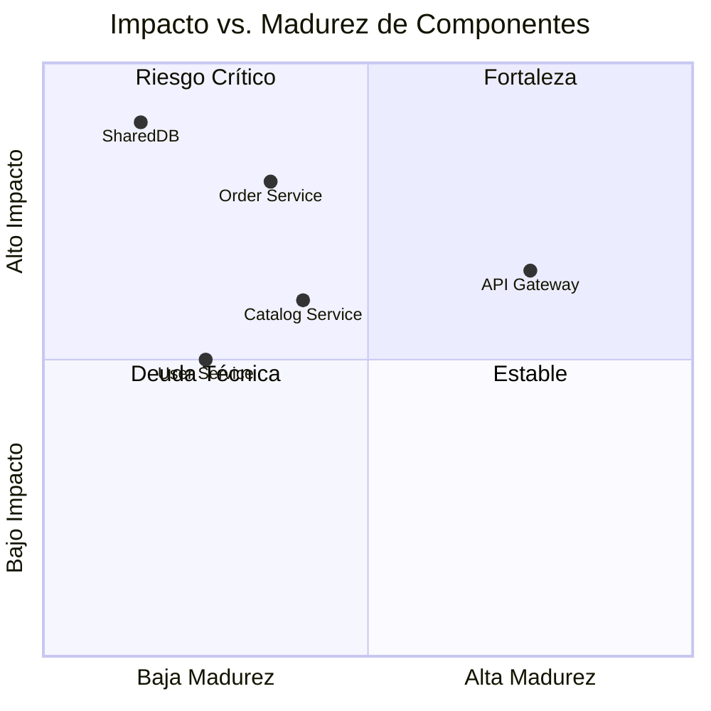
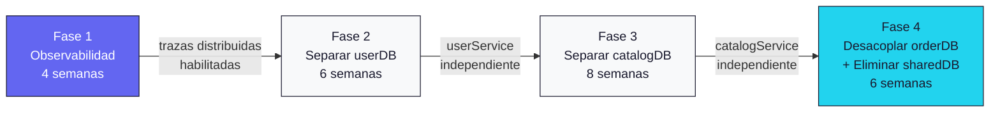

# Narrativa Visual — Análisis Arquitectónico TechMart

> **TL;DR**
> - La arquitectura actual presenta un punto único de fallo: 3 servicios comparten 1 base de datos monolítica.
> - El pipeline de deploy carece de observabilidad — MTTR promedio de 4.2 horas.
> - La secuencia de dashboard revela que el 73% de incidentes se originan en el acoplamiento de datos.
> - Se propone descomposición en 3 bounded contexts con base de datos independiente por servicio.

---

## 1. Contexto de la Narrativa Visual

Este documento aplica **data visualization storytelling** al análisis AS-IS de TechMart, una plataforma e-commerce con 2.3M usuarios activos mensuales. Cada visualización tiene UN mensaje principal, y la secuencia construye el argumento hacia la recomendación de desacoplamiento.

**Audiencia:** Equipo técnico + CTO (variante técnica).
**Secuencia narrativa:** Problema (C4) → Evidencia (métricas) → Impacto (flujo) → Acción (roadmap).

---

## 2. Diagrama C4 Narrativo — El Punto de Dolor

**Mensaje principal:** Tres servicios core dependen de una única base de datos PostgreSQL. Cuando la BD se satura, los tres servicios caen simultáneamente.

> Accesibilidad: Diagrama flowchart TD que muestra 3 servicios (orderService, catalogService, userService) conectados a 1 base de datos compartida (sharedDB) marcada como riesgo. Un API gateway dirige tráfico a los 3 servicios. Un sistema de pagos externo se conecta a orderService.

**Anotación narrativa:** La base de datos compartida (nodo rojo) es el cuello de botella. Con 847 tablas y 1.2TB, cualquier migración de schema bloquea los 3 servicios. El cache Redis con solo 42% de hit rate indica que las queries no están optimizadas para caching — el catálogo hace queries ad-hoc directas a la BD.

---

## 3. Secuencia de Dashboard — Construyendo el Argumento

### 3.1 Headline Visual: Distribución de Incidentes por Origen

**Mensaje principal:** El 73% de los incidentes se originan en la capa de datos compartida.

> Accesibilidad: Diagrama pie que muestra la distribución de incidentes: base de datos compartida 73%, API gateway 12%, servicios externos 10%, otros 5%.

**Anotación narrativa:** De 187 incidentes en 12 meses, 137 se originaron en la base de datos compartida: locks por migrations, connection pool exhaustion, y queries lentas de catálogo que bloquearon transacciones de pedidos.

---

### 3.2 Context Visual: Flujo de un Incidente Típico

**Mensaje principal:** Un lock de migración en catalogService causa cascada de fallos en orderService y userService en menos de 3 minutos.

> Accesibilidad: Diagrama de secuencia que muestra cómo un deploy de catalogService ejecuta una migración que bloquea la BD compartida, causando timeouts en orderService y userService, con un MTTR de 4.2 horas.

**Anotación narrativa:** El patrón se repite cada sprint. Un deploy rutinario de catálogo dispara una migración que bloquea la tabla más consultada. Sin observabilidad distribuida, el equipo de Ops tarda 4.2 horas promedio en diagnosticar la causa raíz — porque las alertas llegan desde 3 servicios distintos sin correlación.

---

### 3.3 Evidence Visual: Scoring de Componentes Arquitectónicos

**Mensaje principal:** La base de datos y el pipeline de deploy son los componentes con peor scoring; el API gateway es el mejor posicionado.

> Accesibilidad: Tabla de scoring con 5 componentes evaluados en 4 dimensiones (acoplamiento, observabilidad, escalabilidad, resiliencia) en escala 1-5.

| Componente | Acoplamiento | Observabilidad | Escalabilidad | Resiliencia | **Score** |
|------------|:---:|:---:|:---:|:---:|:---:|
| API Gateway | 4 | 3 | 4 | 4 | **3.75** |
| Order Service | 2 | 2 | 2 | 2 | **2.00** |
| Catalog Service | 2 | 2 | 3 | 2 | **2.25** |
| User Service | 2 | 1 | 2 | 2 | **1.75** |
| **SharedDB** | **1** | **1** | **1** | **1** | **1.00** |

> Accesibilidad: Diagrama quadrant chart que posiciona los componentes según impacto y madurez. SharedDB está en el cuadrante de alto impacto / baja madurez (zona de riesgo).

**Anotación narrativa:** SharedDB (esquina superior izquierda) concentra el mayor impacto con la menor madurez — el candidato prioritario para intervención. El API Gateway es la única fortaleza real: bien desacoplado, con métricas básicas, y escalable horizontalmente.

---

### 3.4 Action Visual: Roadmap de Desacoplamiento

**Mensaje principal:** La descomposición en 3 bounded contexts con base de datos independiente se ejecuta en 4 fases a lo largo de 6 meses.

> Accesibilidad: Diagrama flowchart LR que muestra 4 fases de desacoplamiento: observabilidad, separar userDB, separar catalogDB, y eliminar sharedDB. Cada fase tiene su duración y entregable principal.

**Anotación narrativa:** La Fase 1 (naranja) es prerequisito: sin observabilidad, las fases de separación serían ciegas. La Fase 4 (dorado) marca el éxito: la eliminación de sharedDB como punto único de fallo. El orden de separación (user → catalog → order) sigue la complejidad ascendente — userService tiene el schema más simple (23 tablas) y orderService el más complejo (312 tablas con FK cruzadas).

---

## 4. Resumen de Decisiones Visuales

| Decisión | Justificación |
|----------|---------------|
| C4 flowchart TD para arquitectura | Muestra jerarquía: gateway → servicios → BD. La dirección top-down refleja el flujo de requests |
| Pie chart para distribución de incidentes | Composición de un todo (100% incidentes). Pocos segmentos (4). Mensaje claro: un segmento domina |
| Sequence diagram para cascada de fallos | Muestra temporalidad y causalidad entre actores. El pattern lock → timeout → cascada es inherentemente secuencial |
| Quadrant chart para scoring | Posiciona componentes en dos dimensiones simultáneamente. Revela clusters y outliers visualmente |
| Flowchart LR para roadmap | Flujo izquierda-derecha = progresión temporal natural. 4 fases = 4 nodos, legible sin zoom |

---

## 5. Validation Gate

| Criterio | Resultado |
|----------|-----------|
| Chart type matches data pattern | Composición=pie, flujo=sequence, posición=quadrant, jerarquía=flowchart TD, timeline=flowchart LR |
| One message per visualization | Cada diagrama tiene un "mensaje principal" declarado antes del diagrama |
| Annotations are selective | Solo se anotan: punto de fallo, MTTR, % dominante, fase crítica |
| Mermaid follows standards | Todos los diagramas: <=20 nodos, IDs descriptivos, edges con labels de acción, max 4 classDefs |
| Accessibility text present | "Accesibilidad:" summary antes de cada diagrama |
| Brand colors correct | Orange #6366F1, gold #22D3EE para success, red #DC3545 para riesgo. Cero uso de verde |
| Visual sequence builds argument | Problema (C4) → Evidencia (pie) → Impacto (sequence) → Scoring (quadrant) → Acción (roadmap) |

---

*Fuente: data-viz-storytelling skill — MetodologIA Discovery Framework*
*Caso: TechMart e-commerce — Análisis AS-IS arquitectónico*
