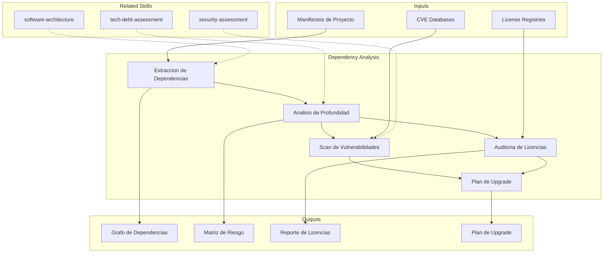

# Analisis de Dependencias

Mapeo exhaustivo de dependencias de sistema y librerias, con evaluacion de vulnerabilidades,
riesgo de upgrade y cumplimiento de licencias.

## TL;DR

- Construye grafo completo de dependencias directas y transitivas del sistema
- Identifica vulnerabilidades conocidas (CVEs) y evalua riesgo de supply chain
- Analiza compatibilidad de licencias y riesgos de compliance
- Evalua riesgo y esfuerzo de upgrades pendientes
- Genera plan de upgrade priorizado con estrategia de mitigacion

## Inputs

Parse `$1` como **nombre del proyecto**, `$2` como **repositorio o sistema a analizar**.

**Parameters:**
- `{MODO}`: `piloto-auto` (default) | `desatendido` | `supervisado` | `paso-a-paso`
- `{FORMATO}`: `markdown` (default) | `html` | `dual`
- `{VARIANTE}`: `ejecutiva` (~40%) | `tecnica` (full, default)

## Entregables

1. **Grafo de Dependencias** — Mapa visual de dependencias directas y transitivas (Mermaid)
2. **Matriz de Riesgo** — Vulnerabilidades, mantenibilidad, bus factor por dependencia
3. **Reporte de Licencias** — Inventario de licencias, compatibilidad, riesgos de compliance
4. **Plan de Upgrade** — Priorizacion de upgrades con estimacion de esfuerzo y riesgo
5. **Supply Chain Assessment** — Evaluacion de riesgo de cadena de suministro

## Proceso

1. **Extraccion de Dependencias** — Parsear manifiestos (package.json, pom.xml, build.gradle, requirements.txt, go.mod, Cargo.toml, etc.) para construir arbol completo
2. **Analisis de Profundidad** — Evaluar cada dependencia:
   | Factor | Indicador Sano | Indicador Riesgo |
   |---|---|---|
   | Ultima actualizacion | <6 meses | >18 meses |
   | Mantenedores activos | >3 | 1 (bus factor critico) |
   | Vulnerabilidades abiertas | 0 criticas | Cualquier CVE critica |
   | Versiones atrasadas | 0-1 major | >2 major versions |
3. **Scan de Vulnerabilidades** — Cruzar dependencias contra bases de datos CVE, identificar severity y exploitability
4. **Auditoria de Licencias** — Clasificar licencias (permissive, open-source, proprietary), detectar incompatibilidades
5. **Evaluacion de Upgrade Risk** — Para cada upgrade pendiente: breaking changes, esfuerzo de migracion, dependencias afectadas
6. **Generacion de Plan** — Priorizar upgrades por riesgo de seguridad, luego mantenibilidad, luego features

## Criterios de Calidad

- [ ] 100% de dependencias directas inventariadas con version actual y latest
- [ ] Dependencias transitivas mapeadas al menos 3 niveles de profundidad
- [ ] Todas las CVEs criticas y altas documentadas con remediacion propuesta
- [ ] Matriz de compatibilidad de licencias completa
- [ ] Plan de upgrade con estimacion de esfuerzo en dias/persona
- [ ] Supply chain risks identificados con mitigacion
- [ ] Diagrama Mermaid del grafo de dependencias generado

## Supuestos y Limites

- Requiere acceso a manifiestos de dependencias (package.json, pom.xml, etc.) para analisis completo
- Scan de CVEs depende de bases de datos publicas; vulnerabilidades zero-day no seran detectadas
- Analisis de licencias no reemplaza revision legal formal — identifica riesgos para escalation
- Dependencias transitivas mas alla de nivel 3 se reportan como resumen, no detalle individual

## Casos Borde

| Escenario | Estrategia de Manejo |
|---|---|
| Monorepo con multiples lenguajes | Analizar cada manifiesto por separado, consolidar riesgos en matriz unificada con tag de lenguaje |
| Dependencias internas (private registry) | Documentar como gap en inventario, evaluar con informacion disponible; recomendar audit interno |
| Dependencia abandonada sin alternativa | Flag como riesgo critico; proponer fork, rewrite o encapsulacion para aislar impacto |
| Licencia ambigua o custom | Flag para revision legal, no asumir compatibilidad; clasificar como riesgo alto hasta resolucion |
| Circular dependencies entre modulos internos | Detectar y reportar ciclos; recomendar refactoring con dependency inversion como remediacion |

## Decisiones y Trade-offs

| Decision | Habilita | Restringe | Justificacion |
|---|---|---|---|
| Profundidad de 3 niveles para transitivas | Balance entre visibilidad y volumen de datos | Puede perder riesgos en niveles profundos | 90% de vulnerabilidades explotables estan en los primeros 3 niveles |
| Priorizacion security-first en plan de upgrade | Remedia riesgos criticos primero | Puede posponer upgrades de features utiles | Vulnerabilidades criticas tienen impacto inmediato en produccion |
| Scan automatizado + revision manual | Velocidad con precision | Requiere expertise para revisar falsos positivos | Herramientas automaticas generan ruido; revision manual filtra lo accionable |

## Knowledge Graph

## Output Templates

**Formato 1 — Markdown (default)**
- Filename: `Dependency_Analysis_{project}_{WIP|Aprobado}.md`
- Estructura: Grafo de Dependencias > Matriz de Riesgo > Vulnerabilidades > Licencias > Supply Chain > Plan de Upgrade
- Incluye diagramas Mermaid del arbol de dependencias y heatmap de riesgo

**Formato 2 — XLSX (inventario operativo)**
- Filename: `Dependency_Inventory_{project}_{WIP|Aprobado}.xlsx`
- Estructura: Sheet 1 (Inventario completo con version, latest, delta) > Sheet 2 (CVEs con severity y remediacion) > Sheet 3 (Licencias con compatibilidad)
- Optimizado para tracking operativo de upgrades y compliance

**Formato 3 — HTML (bajo demanda)**
- Filename: `Dependency_Analysis_{project}_{WIP|Aprobado}.html`
- Estructura: HTML self-contained branded (Design System MetodologIA v5). Light-First Technical. Incluye grafo de dependencias Mermaid, heatmap de severidad con badges CVE y tabla de licencias filtrable. WCAG AA, responsive, print-ready.

**Formato 4 — DOCX (circulación formal)**
- Filename: `{fase}_{entregable}_{cliente}_{WIP}.docx`
- Generado via python-docx con Metodología Design System v5. Portada con metadata del engagement, TOC automático, encabezados/pies de página con marca. Tablas con zebra striping, tipografía Poppins en headings (navy), Montserrat en cuerpo, acentos dorados. Para circulación formal y auditoría.

**Formato 5 — PPTX (bajo demanda)**
- Filename: `{fase}_{entregable}_{cliente}_{WIP}.pptx`
- Via python-pptx con MetodologIA Design System v5. Navy gradient slide master, Poppins titles, Montserrat body, gold accents. Máx 20 slides ejecutivo / 30 técnico. Speaker notes con referencias de evidencia.

## Evaluacion

| Dimension | Peso | Criterio |
|-----------|------|----------|
| Trigger Accuracy | 10% | Activa triggers correctos ante keywords de dependencias, vulnerabilidades, licencias, supply chain |
| Completeness | 25% | Cubre dependencias directas y transitivas, CVEs, licencias y supply chain |
| Clarity | 20% | Matriz de riesgo tiene criterios explicitos; plan de upgrade tiene pasos accionables |
| Robustness | 20% | Maneja monorepos, registries privados, dependencias abandonadas, licencias ambiguas |
| Efficiency | 10% | Proceso combina scan automatizado con revision manual sin redundancia |
| Value Density | 15% | Plan de upgrade priorizado con estimacion de esfuerzo y riesgo por item |

**Umbral minimo**: 7/10 en cada dimension para considerar el skill production-ready.

## Cross-References

- **metodologia-tech-debt-assessment:** Dependencias desactualizadas como categoria de deuda tecnica
- **metodologia-security-assessment:** Vulnerabilidades de dependencias como riesgo de seguridad
- **metodologia-software-architecture:** Grafo de dependencias como input para decisiones arquitectonicas

---
**Autor:** Javier Montaño · Comunidad MetodologIA | **Version:** 1.0.0
