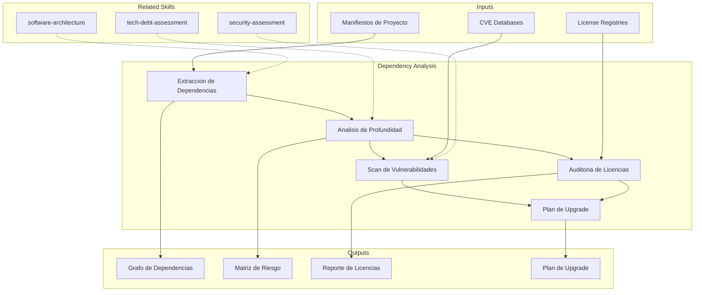

# Analisis de Dependencias

Mapeo exhaustivo de dependencias de sistema y librerias, con evaluacion de vulnerabilidades,
riesgo de upgrade y cumplimiento de licencias.

## Grounding Guideline

> *Invisible dependencies are the number one cause of cascading failures.*

1. **Map before moving.** No transformation can be planned without a complete map of technical and organizational dependencies.
2. **Dependency does not equal risk; unmanaged dependency equals risk.** The problem is not having dependencies — it is not knowing them.
3. **Human dependencies are as critical as technical ones.** Knowledge concentrated in one person is a single point of failure dependency.

## TL;DR

- Builds complete graph of direct and transitive system dependencies
- Identifies known vulnerabilities (CVEs) and evaluates supply chain risk
- Analyzes license compatibility and compliance risks
- Evaluates risk and effort of pending upgrades
- Generates prioritized upgrade plan with mitigation strategy

## Inputs

Parse `$1` como **nombre del proyecto**, `$2` como **repositorio o sistema a analizar**.

**Parameters:**
- `{MODO}`: `piloto-auto` (default) | `desatendido` | `supervisado` | `paso-a-paso`
- `{FORMATO}`: `markdown` (default) | `html` | `dual`
- `{VARIANTE}`: `ejecutiva` (~40%) | `tecnica` (full, default)

## Deliverables

1. **Dependency Graph** — Visual map of direct and transitive dependencies (Mermaid)
2. **Risk Matrix** — Vulnerabilities, maintainability, bus factor per dependency
3. **License Report** — License inventory, compatibility, compliance risks
4. **Upgrade Plan** — Prioritized upgrades with effort and risk estimation
5. **Supply Chain Assessment** — Supply chain risk evaluation

## Process

1. **Dependency Extraction** — Parse manifests (package.json, pom.xml, build.gradle, requirements.txt, go.mod, Cargo.toml, etc.) to build complete tree
2. **Depth Analysis** — Evaluate each dependency:
   | Factor | Healthy Indicator | Risk Indicator |
   |---|---|---|
   | Last update | <6 months | >18 months |
   | Active maintainers | >3 | 1 (critical bus factor) |
   | Open vulnerabilities | 0 critical | Any critical CVE |
   | Versions behind | 0-1 major | >2 major versions |
3. **Vulnerability Scan** — Cross-reference dependencies against CVE databases, identify severity and exploitability
4. **License Audit** — Classify licenses (permissive, open-source, proprietary), detect incompatibilities
5. **Upgrade Risk Evaluation** — For each pending upgrade: breaking changes, migration effort, affected dependencies
6. **Plan Generation** — Prioritize upgrades by security risk, then maintainability, then features

## Quality Criteria

- [ ] 100% de dependencias directas inventariadas con version actual y latest
- [ ] Dependencias transitivas mapeadas al menos 3 niveles de profundidad
- [ ] Todas las CVEs criticas y altas documentadas con remediacion propuesta
- [ ] Matriz de compatibilidad de licencias completa
- [ ] Plan de upgrade con estimacion de esfuerzo en dias/persona
- [ ] Supply chain risks identificados con mitigacion
- [ ] Diagrama Mermaid del grafo de dependencias generado

## Assumptions and Limits

- Requires access to dependency manifests (package.json, pom.xml, etc.) for complete analysis
- CVE scanning depends on public databases; zero-day vulnerabilities will not be detected
- License analysis does not replace formal legal review — it identifies risks for escalation
- Transitive dependencies beyond level 3 are reported as summary, not individual detail

## Edge Cases

| Scenario | Handling Strategy |
|---|---|
| Monorepo with multiple languages | Analyze each manifest separately, consolidate risks in unified matrix with language tag |
| Internal dependencies (private registry) | Document as gap in inventory, evaluate with available information; recommend internal audit |
| Abandoned dependency without alternative | Flag as critical risk; propose fork, rewrite, or encapsulation to isolate impact |
| Ambiguous or custom license | Flag for legal review, do not assume compatibility; classify as high risk until resolution |
| Circular dependencies between internal modules | Detect and report cycles; recommend refactoring with dependency inversion as remediation |

## Decisions and Trade-offs

| Decision | Enables | Constrains | Justification |
|---|---|---|---|
| 3-level depth for transitive dependencies | Balance between visibility and data volume | May miss risks at deeper levels | 90% of exploitable vulnerabilities are in the first 3 levels |
| Security-first prioritization in upgrade plan | Remediates critical risks first | May postpone useful feature upgrades | Critical vulnerabilities have immediate production impact |
| Automated scan + manual review | Speed with precision | Requires expertise to review false positives | Automated tools generate noise; manual review filters actionable items |

## Knowledge Graph

## Output Templates

**Formato 1 — Markdown (default)**
- Filename: `Dependency_Analysis_{project}_{WIP|Aprobado}.md`
- Estructura: Grafo de Dependencias > Matriz de Riesgo > Vulnerabilidades > Licencias > Supply Chain > Plan de Upgrade
- Incluye diagramas Mermaid del arbol de dependencias y heatmap de riesgo

**Formato 2 — XLSX (inventario operativo)**
- Filename: `Dependency_Inventory_{project}_{WIP|Aprobado}.xlsx`
- Estructura: Sheet 1 (Inventario completo con version, latest, delta) > Sheet 2 (CVEs con severity y remediacion) > Sheet 3 (Licencias con compatibilidad)
- Optimizado para tracking operativo de upgrades y compliance

**Formato 3 — HTML (bajo demanda)**
- Filename: `Dependency_Analysis_{project}_{WIP|Aprobado}.html`
- Estructura: HTML self-contained branded (Design System MetodologIA v5). Light-First Technical. Incluye grafo de dependencias Mermaid, heatmap de severidad con badges CVE y tabla de licencias filtrable. WCAG AA, responsive, print-ready.

**Formato 4 — DOCX (circulación formal)**
- Filename: `{fase}_{entregable}_{cliente}_{WIP}.docx`
- Generado via python-docx con Metodología Design System v5. Portada con metadata del engagement, TOC automático, encabezados/pies de página con marca. Tablas con zebra striping, tipografía Poppins en headings (navy), Trebuchet MS en cuerpo, acentos dorados. Para circulación formal y auditoría.

**Formato 5 — PPTX (bajo demanda)**
- Filename: `{fase}_{entregable}_{cliente}_{WIP}.pptx`
- Via python-pptx con MetodologIA Design System v5. Navy gradient slide master, Poppins titles, Trebuchet MS body, gold accents. Máx 20 slides ejecutivo / 30 técnico. Speaker notes con referencias de evidencia.

## Evaluacion

| Dimension | Peso | Criterio |
|-----------|------|----------|
| Trigger Accuracy | 10% | Activa triggers correctos ante keywords de dependencias, vulnerabilidades, licencias, supply chain |
| Completeness | 25% | Cubre dependencias directas y transitivas, CVEs, licencias y supply chain |
| Clarity | 20% | Matriz de riesgo tiene criterios explicitos; plan de upgrade tiene pasos accionables |
| Robustness | 20% | Maneja monorepos, registries privados, dependencias abandonadas, licencias ambiguas |
| Efficiency | 10% | Proceso combina scan automatizado con revision manual sin redundancia |
| Value Density | 15% | Plan de upgrade priorizado con estimacion de esfuerzo y riesgo por item |

**Umbral minimo**: 7/10 en cada dimension para considerar el skill production-ready.

## Cross-References

- **metodologia-tech-debt-assessment:** Dependencias desactualizadas como categoria de deuda tecnica
- **metodologia-security-assessment:** Vulnerabilidades de dependencias como riesgo de seguridad
- **metodologia-software-architecture:** Grafo de dependencias como input para decisiones arquitectonicas

---
**Autor:** Javier Montaño · Comunidad MetodologIA | **Version:** 1.0.0
