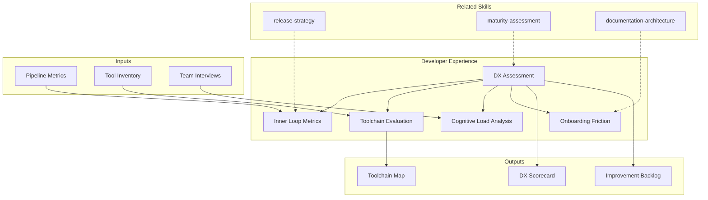

# Evaluacion de Developer Experience

Assessment integral de la experiencia del desarrollador, optimizacion del inner loop,
evaluacion de toolchain y analisis de friccion en onboarding.

## TL;DR

- Evalua DX actual con metricas de inner loop (code-build-test-debug cycle time)
- Identifica puntos de friccion en toolchain, procesos y cognitive load
- Benchmarca contra estandares de industria (DORA, SPACE framework)
- Prioriza mejoras por impacto en productividad y satisfaccion
- Genera scorecard DX con improvement backlog accionable

## Inputs

Parse `$1` como **nombre del proyecto/organizacion**, `$2` como **equipo o plataforma a evaluar**.

**Parameters:**
- `{MODO}`: `piloto-auto` (default) | `desatendido` | `supervisado` | `paso-a-paso`
- `{FORMATO}`: `markdown` (default) | `html` | `dual`
- `{VARIANTE}`: `ejecutiva` (~40%) | `tecnica` (full, default)

## Entregables

1. **DX Scorecard** — Evaluacion cuantitativa por dimension (inner loop, toolchain, docs, onboarding, CI/CD)
2. **Improvement Backlog** — Lista priorizada de mejoras con impacto estimado
3. **Toolchain Map** — Mapa visual de herramientas actuales con gaps y redundancias
4. **Friction Analysis** — Puntos de friccion identificados con root cause y solucion propuesta
5. **Benchmark Report** — Comparacion contra estandares DORA/SPACE

## Proceso

1. **Medicion de Inner Loop** — Evaluar tiempos de ciclo:
   | Metrica | Excelente | Aceptable | Problema |
   |---|---|---|---|
   | Build time (local) | <30s | 30s-3min | >3min |
   | Test suite (unit) | <1min | 1-5min | >5min |
   | Hot reload | <2s | 2-10s | >10s o inexistente |
   | PR to merge | <4h | 4-24h | >24h |
   | Deploy to staging | <15min | 15-60min | >60min |
2. **Evaluacion de Toolchain** — Inventariar herramientas por categoria (IDE, VCS, CI/CD, observability, collaboration), detectar gaps y redundancias
3. **Analisis de Cognitive Load** — Evaluar complejidad de setup local, numero de herramientas, context switching, documentacion disponible
4. **Assessment de Onboarding** — Medir tiempo de primer commit productivo, gaps en documentacion, dependencia de conocimiento tribal
5. **Benchmarking DORA/SPACE** — Comparar metricas clave contra percentiles de industria
6. **Priorizacion de Mejoras** — Scoring por impacto en productividad x esfuerzo de implementacion

## Criterios de Calidad

- [ ] Metricas de inner loop medidas o estimadas con evidencia
- [ ] Toolchain completo mapeado con gaps identificados
- [ ] Puntos de friccion documentados con root cause analysis
- [ ] Mejoras priorizadas con impacto estimado en tiempo de desarrollador
- [ ] Benchmark DORA/SPACE con posicionamiento del equipo
- [ ] Scorecard con scoring reproducible por dimension
- [ ] Diagrama Mermaid del toolchain y flujo de desarrollo

## Supuestos y Limites

- Metricas de inner loop son estimadas si no existen herramientas de medicion instaladas
- Benchmarks DORA/SPACE son referenciales; la posicion exacta del equipo requiere medicion continua
- No reemplaza encuestas de satisfaccion de desarrolladores — las complementa con datos objetivos
- Evaluacion de cognitive load es cualitativa salvo que existan datos de context switching

## Casos Borde

| Escenario | Estrategia de Manejo |
|---|---|
| Equipo full-remote con toolchains heterogeneos | Evaluar por developer archetype (frontend, backend, mobile) en lugar de un solo inner loop; documentar variaciones |
| Organizacion sin CI/CD pipeline | Clasificar como nivel 0 en esas dimensiones; priorizar setup basico antes de optimizacion |
| Monorepo con +50 desarrolladores | Evaluar build times segmentados por modulo; friction de code ownership y merge conflicts como dimension adicional |
| Equipo en transicion de tecnologia | Medir DX de stack actual y target por separado; plan de mejora enfocado en reducir dual-stack friction |

## Decisiones y Trade-offs

| Decision | Habilita | Restringe | Justificacion |
|---|---|---|---|
| DORA/SPACE como benchmark default | Comparabilidad con industria | Metricas pueden no capturar contexto local | Son los frameworks mas adoptados y con mayor base de datos comparativa |
| Scorecard cuantitativo por dimension | Priorizacion objetiva de mejoras | Requiere estimacion donde no hay datos | Permite tracking de progreso en assessments sucesivos |
| Inner loop como eje central | Foco en lo que mas impacta productividad diaria | Puede sub-representar DX de procesos (PR review, on-call) | El inner loop es donde el desarrollador pasa 60-80% del tiempo productivo |

## Knowledge Graph

## Output Templates

**Formato 1 — Markdown (default)**
- Filename: `DX_Assessment_{project}_{WIP|Aprobado}.md`
- Estructura: Scorecard > Inner Loop Metrics > Toolchain Map > Friction Analysis > Improvement Backlog > Benchmark DORA/SPACE
- Incluye tablas de scoring y diagramas Mermaid inline

**Formato 2 — HTML (dashboard ejecutivo)**
- Filename: `DX_Assessment_{project}_{WIP|Aprobado}.html`
- Estructura: Scorecard radar visual > Top 5 friction points > Quick wins > Roadmap de mejoras
- Optimizado para presentacion a engineering leadership

**Formato 3 — DOCX (circulación formal)**
- Filename: `{fase}_{entregable}_{cliente}_{WIP}.docx`
- Generado via python-docx con MetodologIA Design System v5. Portada con metadata del engagement, TOC automático, encabezados/pies de página con marca. Tablas con zebra striping, tipografía Poppins en headings (navy), Montserrat en cuerpo, acentos dorados. Para circulación formal y auditoría.

**Formato 4 — XLSX (bajo demanda)**
- Filename: `{fase}_{entregable}_{cliente}_{WIP}.xlsx`
- Via openpyxl con MetodologIA Design System v5. Headers con fondo navy y tipografía Poppins en blanco, conditional formatting por DX score y nivel de fricción, auto-filters en todas las columnas, valores directos sin fórmulas.

**Formato 5 — PPTX (bajo demanda)**
- Filename: `{fase}_{entregable}_{cliente}_{WIP}.pptx`
- Via python-pptx con MetodologIA Design System v5. Navy gradient slide master, Poppins titles, Montserrat body, gold accents. Máx 20 slides ejecutivo / 30 técnico. Speaker notes con referencias de evidencia.

## Evaluacion

| Dimension | Peso | Criterio |
|-----------|------|----------|
| Trigger Accuracy | 10% | Activa triggers correctos ante keywords de DX, inner loop, toolchain, onboarding |
| Completeness | 25% | Cubre todas las dimensiones: inner loop, toolchain, cognitive load, onboarding, CI/CD |
| Clarity | 20% | Metricas con thresholds claros; mejoras con impacto estimado en tiempo |
| Robustness | 20% | Maneja equipos sin CI/CD, monorepos, transiciones de stack |
| Efficiency | 10% | Proceso no duplica pasos entre dimensiones de evaluacion |
| Value Density | 15% | Improvement backlog es directamente accionable con ROI estimado |

**Umbral minimo**: 7/10 en cada dimension para considerar el skill production-ready.

## Cross-References

- **metodologia-release-strategy:** Pipeline CI/CD y deployment patterns que impactan inner loop
- **metodologia-maturity-assessment:** Evaluacion de madurez complementa DX scorecard
- **metodologia-documentation-architecture:** Documentacion como dimension clave de onboarding DX

---
**Autor:** Javier Montaño · Comunidad MetodologIA | **Version:** 1.0.0
