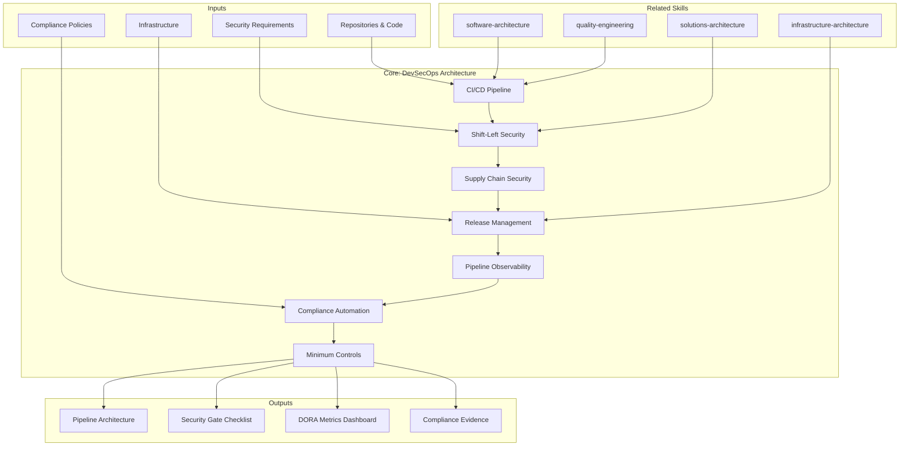

> **Scope:** This skill applies to `{TIPO_SERVICIO}=SDA` and `{TIPO_SERVICIO}=Cloud`. CI/CD pipelines and development lifecycle security are inherent to these service lines. For security in other contexts, see `security-architecture`.

# DevSecOps Architecture: Delivery & Security Pipeline

DevSecOps architecture designs how software is built, tested, secured, and released to production. It integrates security into every stage of the delivery pipeline, ensuring code quality, compliance, and supply chain integrity.

## Grounding Guideline

**Security added at the end is security that gets forgotten.** DevSecOps integrates security into every pipeline stage: from commit to production. SAST before merge, SCA on every build, DAST in staging, and runtime protection in production. The pipeline is the last line of defense before the customer.

### DevSecOps Philosophy

1. **Shift-left, but not only-left.** Security starts in the IDE but does not end there. Every pipeline stage has its own security gate.
2. **Supply chain integrity.** SBOM, artifact signing, dependency scanning — the software supply chain is an attack vector. It is verified, not assumed.
3. **DORA metrics as North Star.** Deployment frequency, lead time, failure rate, MTTR — measure to improve, not to report.

## Inputs

The user provides a system or pipeline name as `$ARGUMENTS`. Parse `$1` as the **system/pipeline name** used throughout all output artifacts.

**Parameters:**
- `{MODO}`: `piloto-auto` (default) | `desatendido` | `supervisado` | `paso-a-paso`
  - **piloto-auto**: Auto para análisis de pipeline y security gates, HITL para decisiones de deployment strategy y compliance policies.
  - **desatendido**: Zero interruptions. Pipeline documentado automáticamente. Assumptions documented.
  - **supervisado**: Autónomo con checkpoint en security gates, deployment strategy, y compliance automation.
  - **paso-a-paso**: Confirma cada stage, security gate, deployment strategy, y compliance policy.
- `{FORMATO}`: `markdown` (default) | `html` | `dual`
- `{VARIANTE}`: `ejecutiva` (~40% — S1 CI/CD pipeline + S2 shift-left security + S5 DORA metrics) | `técnica` (full 7 sections, default)

Before generating architecture, detect pipeline context:

```
!find . -name "*.yml" -path "*/.github/*" -o -name "Jenkinsfile" -o -name ".gitlab-ci.yml" -o -name "Dockerfile" | head -20
```

If reference materials exist, load them:

```
Read ${CLAUDE_SKILL_DIR}/references/security-gates.md
Read ${CLAUDE_SKILL_DIR}/references/compliance-policies.md
```

---

## When to Use

- Designing CI/CD pipelines (build, test, deploy stages, environments)
- Integrating security into delivery (shift-left: SAST, SCA, secrets scanning)
- Designing supply chain security (SBOM, dependency verification, artifact signing)
- Implementing release management (versioning, feature flags, canary deployments)
- Building pipeline observability (DORA metrics)
- Automating compliance (policy-as-code, audit trails, evidence collection)
- Establishing minimum controls (security gates per pipeline stage)

## When NOT to Use

- Internal software structure → **metodologia-software-architecture**
- End-to-end solution design → **metodologia-solutions-architecture**
- Enterprise portfolio alignment → **metodologia-enterprise-architecture**
- Infrastructure and platform → **metodologia-infrastructure-architecture**

---

## Delivery Structure: 7 Sections

### S1: CI/CD Pipeline Architecture

Design of build, test, and deployment stages.

**Commit Stage (5-10 min):** Git push -> compile -> unit tests -> lint -> build artifact -> publish to artifact repository

**Acceptance Test Stage (10-30 min):** Deploy to staging -> integration tests -> smoke tests -> contract tests -> performance baseline

**UAT/Preview (optional):** Production-like environment -> user acceptance -> business stakeholder validation

**Production Stage:** Deployment strategy (blue-green, canary, rolling) -> health checks -> automated rollback -> traffic shift

**Post-Deployment:** Smoke tests in production -> metrics monitoring -> incident response

**Branching Strategy:**
- Trunk-based: main always deployable, shorter feedback, high discipline
- Feature branches: isolation, higher ceremony, merge delay risk
- Release branches: long-lived for production patches

**Artifact Management:** Semantic versioning, immutable artifacts (once published never change), secured/replicated registries, retention policies

**Environment Promotion:** Same artifact through dev -> staging -> prod (no rebuild); env-specific config injected at deploy; secrets from vault; rollback: previous artifact always available

### S2: Shift-Left Security (SAST/SCA/DAST/Secrets/IaC)

Security controls embedded throughout the pipeline.

**SAST (Static Analysis):** Scans source code for vulnerabilities (SQLi, XSS, hard-coded creds). Tools: SonarQube, Semgrep, Checkmarx. Gate: block merge on critical/high.

**SCA (Software Composition Analysis):** Scans dependencies for CVEs, creates SBOM. Tools: Snyk, Dependabot, Trivy. Gate: flag high-severity, allow with justification.

**Container Image Scanning:** OS and app vulnerabilities in Docker images. Signed images for provenance. Tools: Trivy, Aqua, Clair. Base image policy: approved, minimal, regularly updated.

**DAST (Dynamic Testing):** Tests running application for web exploits, misconfigurations. Tools: OWASP ZAP, Burp Suite. When: staging (safe to break), limited to critical paths.

**Secrets Scanning:** Detect leaked credentials in code. Pre-commit hooks prevent secrets from committing. Post-commit audit. Tools: GitGuardian, TruffleHog, git-secrets. Gate: block + rotate exposed credentials.

**License Compliance:** Scan for license obligations (GPL requires source release). Tools: FOSSA, FOSSology. Gate: allow only approved licenses.

**IaC Scanning:** Check Terraform/CloudFormation for misconfigurations (public S3, missing encryption, permissive security groups). Tools: Checkov, TFLint. Gate: prevent non-compliant infrastructure deployment.

### S3: Supply Chain Security (SBOM, Signing)

Ensures code and artifact integrity end-to-end.

**SBOM:** Complete component list (SPDX/CycloneDX format), generated at build time, used for vulnerability tracking and compliance.

**Artifact Signing:** Sign with private key (cosign, Notary, sigstore), verify before deployment. Keys separate per environment.

**Dependency Verification:** Checksum verification, PGP signatures, provenance attestation, pinned versions (not latest).

**Build Reproducibility:** Same source + same environment = identical artifact. Detect tampering or build system compromise.

**Build System Security:** Immutable build agents (fresh per build), isolated build networks, signed commits, peer code review.

### S4: Release Management

Strategy for version management and production deployment.

**Versioning:** Semantic versioning (MAJOR.MINOR.PATCH), conventional commits, automated changelog generation.

**Feature Flags:** Enable/disable at runtime without redeploy. Gradual rollout (5% -> 25% -> 50% -> 100%). Kill switch for broken features. Tools: LaunchDarkly, Unleash.

**Deployment Strategies:**
- **Blue-Green:** Two identical environments, switch router. Instant rollback, zero downtime. 2x infrastructure cost.
- **Canary:** Gradual traffic shift, monitor for errors/latency. Lower risk. Longer deployment time.
- **Rolling:** Update one instance at a time. No double capacity. Harder to rollback (mixed versions temporarily).

**Hotfixes:** Code freeze before release; hotfix branch for emergency fixes applied to main and release branches with expedited testing.

### S5: Pipeline Observability (DORA Metrics)

Tracking and visibility into build/deployment process.

**DORA Metrics:**
- **Deployment Frequency:** Target: on-demand, multiple per day
- **Lead Time for Changes:** Target: <1 hour from commit to production
- **Change Failure Rate:** Target: <15% of deployments cause incident
- **MTTR:** Target: <1 hour to restore service

**Pipeline Observability:** Build duration, stage bottlenecks, success/failure rate, flaky test detection, artifact size trends

**Deployment Tracking:** Record each deployment (timestamp, version, who, environment), track frequency trends, rollback tracking

**Production Health Post-Deployment:** Error rate spikes, latency regression, resource utilization changes, business metric impact

**Incident Correlation:** Link deployments to incidents, identify problematic features, rollback timing measurement

### S6: Compliance Automation

Enforcement of compliance requirements through automated controls.

**Policy-as-Code:** Define rules in code (YAML, Rego, Jinja). Enforce at build time, deploy time, runtime. Tools: OPA, Kyverno, HashiCorp Sentinel.

**Example Policies:**
- All containers must scan with zero high-severity vulnerabilities
- All logs must include correlation IDs
- All APIs must require authentication
- All databases encrypted at rest
- All deployments approved by security team

**Audit Trail:** Every deployment logged (who, what, when, where). Immutable, cryptographically signed. Retention per compliance requirement (3-7 years).

**Evidence Collection:** Vulnerability scan results, test results/coverage, code review approvals, security gate pass/fail, deployment approvals.

**Compliance Dashboard:** Real-time status per application (red/yellow/green), drill-down to failing policies, trends over time.

**Automated Remediation:** Auto-patch security dependencies (if tests pass), auto-fix IaC violations, approval workflow before applying.

### S7: Minimum Controls & Risk Matrix

Security gates: non-negotiable vs. optional by risk classification.

**Commit Stage (Always Required):** Code compiles, unit tests pass (>=80% coverage), linting passes, no secrets in code.

**Build Stage (Always Required):** SAST (no critical/high), SCA (dependencies scanned), container image scan (approved base, no high-severity), artifact signed.

**Acceptance Stage (Always Required):** Integration tests pass, contract tests pass, DAST on critical endpoints, performance baseline collected.

**Production Stage (Risk-Dependent):**

| Risk Level | Examples | Deployment | Approval | Gates |
|---|---|---|---|---|
| **Low** | Docs, UI changes, config | Continuous, any time | Automated or single engineer | Commit stage only |
| **Medium** | New features, perf improvements, patch deps | Business hours, monitoring required | Engineer + tech lead | Commit + build + acceptance |
| **High** | Auth changes, DB schema, infra, security fixes, breaking APIs | Canary only, gradual rollout | Security + architect + tech lead | All stages + security review + CAB |

**Risk Mitigation:** Canary with monitoring, instant rollback, runbook prepared, incident response on-call, blameless postmortem.

---

## Trade-off Matrix

| Decision | Enables | Constrains | When to Use |
|---|---|---|---|
| **Continuous Deployment** | Rapid feedback, fast rollback, low batch size | High ops burden, strong automation required | Mature org, simple systems |
| **Staged Releases (Canary)** | Risk mitigation, early issue detection | Longer deployment, complex monitoring | Critical systems, large user base |
| **Feature Flags** | Decouple deploy from enablement | Code complexity, state management | Rapid iteration, experimentation |
| **Blue-Green** | Zero-downtime, instant rollback | 2x infrastructure cost | Mission-critical, hard-to-rollback |
| **Automated Security Gates** | Consistency, prevents manual bypasses | False positives, developer friction | Regulated systems, large teams |
| **Lenient (Dev) vs. Strict (Prod)** | Speed in dev, safety in prod | Inconsistency, late surprises | Different risk tolerance by environment |
| **Compliance Automation** | Evidence collection, audit efficiency | Initial setup complexity, ongoing policy maintenance | Regulated industries, large orgs |

---

## Assumptions

- Software development process in place (teams, repositories, tools)
- Containerization (Docker) is the deployment unit
- Infrastructure provisioned (cloud or on-premises)
- Compliance and security requirements known
- Team has pipeline/DevOps expertise (or is building it)

## Limits

- Pipeline architecture constrained by application architecture (see **metodologia-software-architecture**)
- Deployment safety depends on infrastructure availability (see **metodologia-infrastructure-architecture**)
- Security policies must align with enterprise governance (see **metodologia-enterprise-architecture**)
- Supply chain security is only as good as the weakest link (developer machine, dependencies)

---

## Edge Cases

| Case | Handling Strategy |
|---|---|
| Sistema legacy sin pipeline | Construir pipeline incrementalmente: tests primero, luego automatizacion, luego gates; no intentar todo de una vez |
| Sistema de alta compliance (financiero, salud) | Cada cambio requiere audit trail, aprobacion y evidencia; security gates mandatorios; automatizar coleccion de evidencia de compliance |
| Startup con innovacion rapida | Velocidad sobre perfeccion; tolerancia al riesgo alta; gates minimos; automatizar solo seguridad critica; canary por defecto con rollback |
| Microservicios distribuidos (cientos de servicios) | Pipeline monolitico no escala; platform team provee template compartido; service teams customizar; contratos de integracion validados en pipeline |
| Riesgo de compromiso de supply chain | Artefactos firmados, build environment inmutable, provenance attestation; verificar integridad end-to-end desde commit hasta produccion |

## Decisions & Trade-offs

| Decision | Discarded Alternative | Justification |
|---|---|---|
| Seguridad integrada en cada stage del pipeline | Seguridad como gate final antes de produccion | La seguridad que se agrega al final es la que se olvida; shift-left con SAST, SCA y secrets scanning en cada etapa reduce costo de remediacion |
| Supply chain integrity (SBOM + signing) obligatorio | Confiar en dependencias sin verificacion | La cadena de suministro de software es un vector de ataque creciente; verificar integridad es mas barato que remediar un compromiso |
| DORA metrics como North Star del pipeline | Metricas ad-hoc o sin metricas | Deployment frequency, lead time, failure rate y MTTR son los 4 indicadores que correlacionan con rendimiento organizacional; medir para mejorar |
| Risk-based deployment gates (bajo/medio/alto) | Mismos gates para todo tipo de cambio | Un cambio de docs no necesita security review + CAB; un cambio de auth si; gates proporcionales al riesgo evitan friction innecesaria |

## Knowledge Graph



## Output Templates

| Formato | Nombre | Contenido |
|---|---|---|
| **Markdown** | `A-05_DevSecOps_Architecture_Deep.md` | Documento completo con CI/CD pipeline, shift-left security, supply chain, release management, pipeline observability, compliance automation y risk matrix. Diagramas Mermaid de pipeline stages y security gates. |
| **HTML** | `A-05_DevSecOps_Architecture_Deep.html` | Mismo contenido en HTML branded (Design System MetodologIA). Pipeline diagram interactivo, DORA metrics dashboard template, y compliance evidence tracker. |
| **DOCX** | `{fase}_{entregable}_{cliente}_{WIP}.docx` | Generado via python-docx con MetodologIA Design System v5. Portada con metadata del engagement, TOC automático, encabezados/pies de página con marca. Tablas con zebra striping, tipografía Poppins en headings (navy), Trebuchet MS en cuerpo, acentos dorados. Para circulación formal y auditoría. |
| **XLSX** | `{fase}_{entregable}_{cliente}_{WIP}.xlsx` | Generado via openpyxl con MetodologIA Design System v5. Encabezados con fondo navy y texto blanco Poppins, formato condicional por severidad/estado, auto-filtros en todas las columnas, valores calculados (sin fórmulas). Hojas: DORA Metrics Tracker, Security Gates Matrix, Pipeline Stage Checklist, Risk Matrix. |
| **PPTX** | `{fase}_{entregable}_{cliente}_{WIP}.pptx` | Generado via python-pptx con MetodologIA Design System v5. Slide master con gradiente navy, títulos Poppins, cuerpo Trebuchet MS, acentos dorados. Máx 30 slides técnico / 20 ejecutivo. Notas del orador con referencias de evidencia. Secciones: CI/CD Pipeline Overview, Shift-Left Security Gates, Supply Chain Integrity, Release Management, DORA Metrics Dashboard, Compliance Automation, Risk Matrix. |

## Evaluacion

| Dimension | Peso | Criterio |
|---|---|---|
| Trigger Accuracy | 10% | Descripcion activa triggers correctos (CI/CD, SAST, SCA, DAST, SBOM, DORA, canary, policy-as-code) sin falsos positivos con software-architecture o infrastructure-architecture |
| Completeness | 25% | Las 7 secciones cubren pipeline, security, supply chain, release, observability, compliance y controls sin huecos; todos los stages con gates definidos |
| Clarity | 20% | Instrucciones ejecutables sin ambiguedad; cada gate con criterio de pass/fail, timeout y escalation; DORA targets numericos; risk classification con ejemplos |
| Robustness | 20% | Maneja legacy sin pipeline, alta compliance, startup rapido, microservicios distribuidos y supply chain compromise con estrategias diferenciadas |
| Efficiency | 10% | Proceso no tiene pasos redundantes; variante ejecutiva reduce a S1+S2+S5 sin perder pipeline core y metricas |
| Value Density | 15% | Cada seccion aporta valor practico directo; risk matrix y minimum controls son herramientas de decision inmediata para security y release |

**Umbral minimo: 7/10.**

---

## Validation Gate

Before finalizing delivery, verify:

- [ ] CI/CD pipeline builds and tests automatically on every commit
- [ ] Security gates prevent vulnerable code/artifacts from reaching production
- [ ] Developers have fast feedback (<10 min from commit to build result)
- [ ] Deployments are safe (canary, blue-green, feature flags, instant rollback)
- [ ] Compliance automated (audit trails, evidence collection, policy enforcement)
- [ ] Observability shows pipeline health and deployment impact
- [ ] Incident response enabled (deployment-to-incident correlation)
- [ ] Team confidence in deployment process is high
- [ ] Mean time to production deployment <1 hour
- [ ] Change failure rate <15% (DORA)

---

## Cross-References

- **metodologia-software-architecture:** Defines what to test and where controls apply; pipeline validates architecture decisions
- **metodologia-solutions-architecture:** Integration contracts validated by pipeline; observability validates integration patterns
- **metodologia-infrastructure-architecture:** Infrastructure supports pipeline and deployment patterns; monitoring tools run on infra
- **metodologia-enterprise-architecture:** Technology radar guides tool selection; governance policies enforced via pipeline gates

## Output Format Protocol

| Format | Default | Description |
|--------|---------|-------------|
| `markdown` | Yes | Rich Markdown + Mermaid diagrams. Token-efficient. |
| `html` | On demand | Branded HTML (Design System). Visual impact. |
| `dual` | On demand | Both formats. |

Default output is Markdown with embedded Mermaid diagrams. HTML generation requires explicit `{FORMATO}=html` parameter.

## Output Artifact

**Primary:** `A-05_DevSecOps_Architecture_Deep.html` — Executive summary, CI/CD pipeline, security controls, supply chain security, release management, pipeline observability, compliance automation, risk matrix.

**Secondary:** Pipeline stage diagram, security gate checklist, deployment playbook, DORA metrics dashboard, compliance evidence template.

---
**Autor:** Javier Montaño | **Última actualización:** 12 de marzo de 2026
