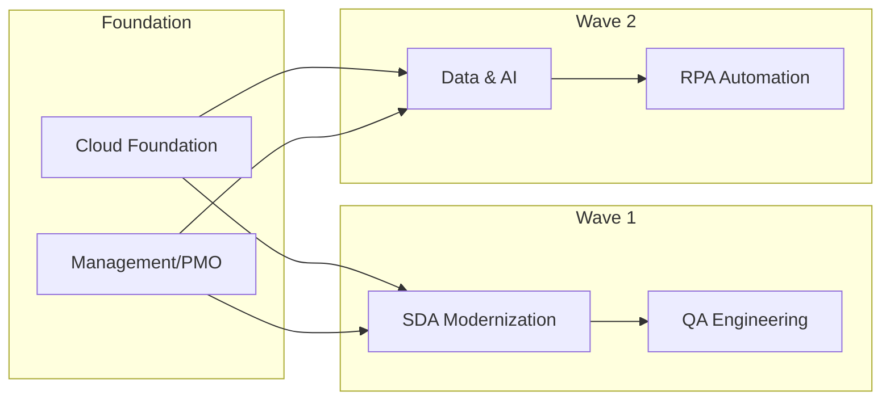
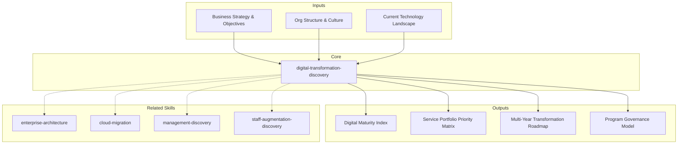

# Digital Transformation Discovery — Program-Level Assessment & Roadmap

Genera un discovery integral a nivel de programa de transformación digital que cubre digital maturity assessment, service portfolio mapping, program architecture, change readiness, multi-service integration, program governance, y transformation roadmap. Diseñado para engagements complejos donde múltiples servicios MetodologIA convergen en un programa unificado de transformación.

## Grounding Guideline

> *Digital transformation is not a project — it is a program of programs. Without a holistic vision, each workstream optimizes its own corner while the whole fragments.*

1. **Holistic vision over local optimization.** Each workstream (SDA, QA, Cloud, Data, RPA, Management) must contribute to program objectives, not just its own metrics. Integration between workstreams is where real value is generated (or destroyed).
2. **Maturity before ambition.** The organization's digital maturity level determines which transformations are viable. Skipping maturity levels produces initiatives the organization cannot absorb. Quick wins first to build momentum and credibility.
3. **Organizational change is the true enabler.** Technology is the means, not the end. Without change readiness — sponsorship, communication, training, resistance management — the best technology becomes shelfware.

## Inputs

The user provides a program or client name as `$ARGUMENTS`. Parse `$1` as the **program/client name** used throughout all output artifacts.

**Parameters:**
- `{MODO}`: `piloto-auto` (default) | `desatendido` | `supervisado` | `paso-a-paso`
  - **piloto-auto**: Auto para maturity assessment y service mapping, HITL para program architecture decisions y governance model.
  - **desatendido**: Zero interruptions. Discovery completo automatizado. Assumptions documented.
  - **supervisado**: Autónomo con checkpoint al completar cada sección.
  - **paso-a-paso**: Confirms before cada sección del discovery.
- `{FORMATO}`: `markdown` (default) | `html` | `dual`
- `{VARIANTE}`: `ejecutiva` (~40% — S1 + S3 + S7 only) | `técnica` (full 7 sections, default)

If reference materials exist, load them:

```
Read ${CLAUDE_SKILL_DIR}/references/
```

---

## When to Use

- El cliente busca una transformación digital integral que involucra múltiples dominios (desarrollo, QA, cloud, data, RPA, management)
- Se necesita evaluar la madurez digital de la organización antes de definir el programa
- El programa requiere coordinación entre múltiples workstreams con interdependencias
- Se necesita un governance model para un programa multi-servicio
- El cliente requiere un roadmap de transformación multi-año con sequencing de servicios

## When NOT to Use

- Proyectos de un solo dominio (solo cloud migration, solo QA) --> use el skill específico del dominio
- Assessment de estado actual sin intención de transformación --> use asis-analysis
- Staffing para un proyecto específico --> use staff-augmentation-discovery
- Diseño técnico de arquitectura --> use architecture-tobe o el skill de arquitectura correspondiente

---

## Delivery Structure: 7 Sections

### S1: Digital Maturity Assessment

Assessment de madurez digital de la organización en 5 dimensiones.

**5 Dimensiones de Madurez Digital:**

| Dimensión | Evalúa | Indicadores clave |
|---|---|---|
| **Strategy & Leadership** | Visión digital, liderazgo, inversión, alineación estratégica | Presupuesto digital como % del total, sponsor ejecutivo, digital strategy document |
| **Culture & People** | Mindset de innovación, skills digitales, change readiness | Training digital, experimentación permitida, resistencia al cambio |
| **Technology & Infrastructure** | Modernidad del stack, cloud adoption, integración, automation | Cloud adoption %, legacy systems count, API coverage |
| **Operations & Processes** | Digitalización de procesos, automatización, data-driven decisions | Procesos digitalizados %, automation ratio, data usage en decisiones |
| **Customer & Market** | Experiencia digital del cliente, canales digitales, analytics | Digital channels %, NPS digital, customer data integration |

**Niveles de madurez (1-5):**

| Nivel | Nombre | Descripción |
|---|---|---|
| 1 | Ad-hoc | Sin estrategia digital. Iniciativas aisladas y reactivas |
| 2 | Exploratorio | Proyectos piloto en algunos dominios. Sin governance unificado |
| 3 | Definido | Estrategia digital articulada. Governance establecido. Algunos workstreams activos |
| 4 | Gestionado | Métricas de progreso. Integración entre workstreams. Cultura data-driven emergente |
| 5 | Optimizado | Innovación continua. Transformación embebida en la cultura. Agilidad organizacional |

**Digital Maturity Index:** Promedio ponderado de las 5 dimensiones. Peso sugerido: Strategy (25%), Culture (20%), Technology (25%), Operations (20%), Customer (10%).

**Output:** Radar chart de madurez con score por dimensión y overall digital maturity index.

### S2: Service Portfolio Mapping

Mapeo de qué servicios MetodologIA aplican a qué necesidades del cliente.

**Servicios MetodologIA disponibles:**
- **SDA (Software Development & Architecture):** Desarrollo de software, modernización, arquitectura
- **QA (Quality Assurance):** Testing, quality engineering, automation testing
- **Cloud:** Migración cloud, cloud-native, DevOps, SRE, FinOps
- **Data & AI:** Data engineering, analytics, BI, machine learning, AI
- **RPA:** Automatización de procesos robóticos, intelligent automation
- **Management:** PMO, delivery management, agile transformation
- **SAS (Staff Augmentation Services):** Augmentation de equipos
- **UX-Design:** Diseño de experiencia, design systems, research

**Mapping exercise:**
- **Service-to-capability mapping:** Qué capacidades del cliente fortalece cada servicio
- **Gap identification:** Necesidades del cliente que no están cubiertas por el portfolio actual
- **Priority matrix:** Scoring `impacto x urgencia x readiness` por servicio

| Prioridad | Impacto | Urgencia | Readiness | Acción |
|---|---|---|---|---|
| P1 | Alto | Alta | Alta | Activar inmediatamente |
| P2 | Alto | Alta | Baja | Preparar readiness, luego activar |
| P3 | Alto | Baja | Alta | Planificar para siguiente fase |
| P4 | Bajo | — | — | Evaluar si aporta al programa |

**Output:** Matriz de servicios con priority scoring y sequencing recomendado.

### S3: Program Architecture

Diseño de la estructura del programa de transformación.

**Workstreams definition:**
- Cada workstream corresponde a un dominio de servicio activo (del S2)
- Definición de scope, objetivos, entregables clave, y timeline por workstream
- Dependencies entre workstreams (e.g., Cloud landing zone antes de migración de apps)

**Dependency mapping:**


**Governance structure:**
- Program Director, Workstream Leads, PMO, Steering Committee
- Milestone framework con phase gates entre waves

**Program-level Gantt:**
- Multi-year view con workstreams, milestones, dependencies, y phase gates
- Visualización de paralelismo y secuenciación

**Output:** Program architecture diagram con workstreams, dependencies, governance, y milestone framework.

### S4: Change Readiness Assessment

Evaluación de la capacidad de la organización para absorber el cambio.

**Tres dimensiones de readiness:**

**Organizational Readiness:**
- Sponsorship ejecutivo: ¿Hay un champion con autoridad y presupuesto?
- Comunicación: ¿Existen canales para comunicar la transformación?
- Training: ¿Hay presupuesto y tiempo asignado para capacitación?
- Historial de cambio: ¿Cómo han salido las transformaciones anteriores?

**Technical Readiness:**
- Infraestructura: ¿La infraestructura actual soporta la transformación?
- Data: ¿Los datos están accesibles, limpios, y gobernados?
- Integration: ¿Existen APIs, middleware, o integration patterns?
- Tooling: ¿Las herramientas actuales se alinean con la visión?

**Cultural Readiness:**
- Innovation mindset: ¿Se permite experimentar y fallar?
- Risk tolerance: ¿La organización tolera la incertidumbre?
- Collaboration: ¿Los equipos colaboran entre silos?
- Learning culture: ¿Se invierte en desarrollo profesional?

**Resistance mapping:**
- Identificación de stakeholders resistentes y sus motivaciones
- Estrategias de mitigación por tipo de resistencia (miedo, inercia, pérdida de poder, escepticismo)

**Output:** Assessment de readiness con scores por dimensión y resistance map con estrategias de mitigación.

### S5: Multi-Service Integration Points

Cómo interactúan los diferentes servicios MetodologIA dentro del programa.

**Integration matrix:**

| Servicio A | Servicio B | Punto de Integración | Dependencia | Riesgo |
|---|---|---|---|---|
| SDA | QA | Pipelines CI/CD, test automation, quality gates | SDA provee código, QA valida | Alto si no se alinean estándares |
| SDA | Cloud | Deployment targets, IaC, monitoring | Cloud provee plataforma, SDA consume | Alto si landing zone no está lista |
| Data | Cloud | Data platform, storage, compute | Cloud provee infra, Data construye pipelines | Medio — secuencia clara |
| RPA | Data | Data feeds, process outputs como input de analytics | Data consume outputs de RPA | Bajo — interfaz definida |
| Management | All | Governance, reporting, risk management | Transversal | Alto si PMO no tiene visibilidad |

**Integration contracts:**
- Definición de interfaces entre workstreams (APIs, datos, procesos, artefactos)
- SLAs entre workstreams (tiempos de respuesta, calidad de entregables)
- Escalation paths cuando un workstream bloquea a otro

**Shared resources:**
- Recursos que participan en múltiples workstreams (architects, DevOps, data engineers)
- Allocation model para evitar contención

**Output:** Integration matrix con contratos entre workstreams y modelo de recursos compartidos.

### S6: Program Governance Model

Modelo de governance para el programa de transformación.

**Governance structure:**

| Rol | Responsabilidad | Cadencia |
|---|---|---|
| **Steering Committee** | Decisiones estratégicas, aprobación de fase, budget | Mensual |
| **Program Director** | Coordinación de workstreams, gestión de riesgos, reporting | Semanal |
| **Workstream Leads** | Ejecución del workstream, entregables, escalación | Diario |
| **PMO** | Tracking, reporting, quality assurance, risk register | Continuo |
| **Change Manager** | Comunicación, training, resistance management | Semanal |

**Escalation paths:**
- Level 1: Workstream Lead resuelve (< 24 horas)
- Level 2: Program Director media entre workstreams (< 48 horas)
- Level 3: Steering Committee decide (siguiente sesión o extraordinary)

**Reporting cadence:**
- **Diario:** Stand-up de workstream leads (15 min, blockers only)
- **Semanal:** Program status report (progress, risks, decisions needed)
- **Mensual:** Steering committee con dashboard ejecutivo
- **Trimestral:** Business review con ROI tracking

**Decision rights (RACI):**
- Presupuesto: Steering Committee (A), Program Director (R), PMO (C)
- Technical decisions: Workstream Lead (A/R), Program Director (I)
- Scope changes: Steering Committee (A), Program Director (R), Workstream Lead (C)

**Phase-gate funding model:**
- Presupuesto aprobado por fase, no por programa completo
- Gate review al final de cada fase para aprobar funding de la siguiente
- Kill criteria: condiciones bajo las cuales se detiene o pivotea un workstream

**Output:** Governance model con RACI, escalation paths, reporting cadence, y phase-gate funding model.

### S7: Transformation Roadmap

Plan de transformación multi-año con sequencing de activación de servicios.

**Phased plan:**

**Fase 0 — Foundation (Meses 1-3):**
- Governance: PMO establecido, steering committee activo
- Quick wins: 3-5 iniciativas de alto impacto y bajo esfuerzo (identificadas en S1-S2)
- Cloud foundation: Landing zone, connectivity, security baseline
- Change: Comunicación del programa, training plan

**Fase 1 — Activation (Meses 4-9):**
- Workstreams P1 activos (del S2)
- Primeros entregables tangibles
- Métricas de programa establecidas
- Feedback loop con steering committee

**Fase 2 — Acceleration (Meses 10-18):**
- Workstreams P2 activos
- Integración entre workstreams operativa
- Optimización basada en métricas
- Scale del equipo según staffing plan

**Fase 3 — Optimization (Meses 19-36):**
- Workstreams P3 activos
- Advanced capabilities (AI, advanced analytics, intelligent automation)
- Transferencia de conocimiento al equipo del cliente
- Sustentabilidad y ownership transfer

**Per phase:**
- Active workstreams y sus milestones
- Team composition (roles, headcount, seniority)
- Budget magnitude indicators (FTE-meses por workstream, NOT prices)
- Success metrics y exit criteria

**Quick wins en primeros 90 días:**
- Identificar 3-5 iniciativas que demuestren valor rápidamente
- Criterios: alto visibilidad, bajo riesgo, resultados medibles en <90 días
- Construyen credibilidad y momentum para el programa

**Output:** Roadmap visual multi-año con phases, workstream activation, milestones, y quick wins.

---

## Trade-off Matrix

| Decisión | Habilita | Restringe | Cuándo Usar |
|---|---|---|---|
| **Big-bang activation** | Velocidad, momentum | Riesgo alto, change fatigue | Solo con organización madura (nivel 4+) |
| **Phased activation** | Aprendizaje, riesgo reducido | Más lento, dual-run costs | Default para la mayoría de organizaciones |
| **Technology-first** | Resultados técnicos rápidos | Change debt acumulado | Cuando el bottleneck es técnico, no cultural |
| **People-first** | Adopción sostenible | Resultados técnicos más lentos | Cuando la resistencia al cambio es el riesgo principal |
| **Centralized PMO** | Control, visibilidad | Bottleneck en decisiones | Programas >5 workstreams, organización jerárquica |
| **Federated governance** | Agilidad, ownership | Menos consistencia | Organización madura, equipos autónomos |

---

## Assumptions

- Existe sponsorship ejecutivo con autoridad para aprobar presupuesto y cambios organizacionales
- El cliente está dispuesto a invertir en un programa multi-año (no busca resultados de proyecto en 3 meses)
- Los stakeholders clave están disponibles para entrevistas y workshops de discovery
- Hay acceso a información de la organización (procesos, tecnología, métricas, estructura)
- El mercado permite cubrir los perfiles necesarios para los diferentes workstreams

## Limits

- No reemplaza la definición técnica detallada de cada workstream (use los skills específicos: cloud-migration, software-architecture, etc.)
- No incluye diseño organizacional completo (restructuración, re-org)
- No define precios — solo magnitudes de esfuerzo (FTE-meses por workstream)
- No ejecuta la transformación — produce el discovery y roadmap para su aprobación
- El change readiness assessment es basado en entrevistas y documentacion — no es un organizational development engagement completo

## Edge Cases

| Case | Handling Strategy |
|---|---|
| Organizacion con madurez digital nivel 1 (ad-hoc) y ambicion de transformacion completa | No intentar programa completo. Disenar Foundation-only (governance, cloud basics, un workstream piloto). Construir musculo de cambio en 6-12 meses antes de escalar. Quick wins obligatorios para generar credibilidad. |
| Programa ya en marcha con workstreams descoordinados y sin governance unificado | Enfocarse en S5 (Integration Points) y S6 (Governance) primero. Establecer contracts entre workstreams existentes. No reiniciar — alinear y orquestar lo que ya existe. Assessment retroactivo de S1-S2. |
| Budget limitado que no permite activar todos los workstreams recomendados | Disenar programa modular donde cada fase es auto-contenida y entrega valor independiente. Phase-gate funding permite avanzar solo si hay presupuesto. Priorizar P1 workstreams unicamente. |
| Transformacion post-M&A con dos organizaciones de stacks y culturas diferentes | Assessment de madurez por organizacion separada. Priorizar integracion de datos y unified governance antes de transformacion. Domain model unificado gradual, no big-bang. |

## Decisions & Trade-offs

| Decision | Discarded Alternative | Justification |
|---|---|---|
| Phased activation (waves) como default sobre big-bang | Activacion simultanea de todos los workstreams | Big-bang requiere organizacion nivel 4+ de madurez. Phased permite aprendizaje iterativo, reduce riesgo de change fatigue, y habilita phase-gate funding. |
| People-first sobre technology-first cuando resistencia al cambio es alta | Technology-first con adoption posterior | Sin change readiness, la mejor tecnologia se convierte en shelfware. La adopcion sostenible genera resultados duraderos vs. resultados tecnicos rapidos que se revierten. |
| Centralized PMO para programas >5 workstreams sobre federated governance | Governance federada descentralizada | En programas complejos con muchas interdependencias, un PMO centralizado provee visibilidad y control que governance federada no puede garantizar. Federated solo para organizaciones muy maduras. |

## Knowledge Graph



## Output Templates

**Formato MD (default):**
```
# Digital Transformation Discovery: {client_name}
## S1: Digital Maturity Assessment
  - Radar chart (5 dimensiones, scores 1-5)
  - Digital Maturity Index (promedio ponderado)
## S2: Service Portfolio Mapping
  - Priority matrix (impacto x urgencia x readiness)
## S3-S7: [remaining sections]
## Anexos: Maturity evidence, resistance map, integration contracts
```

**Formato PPTX (secondary):**
- Slide 1: Executive summary con Digital Maturity Index
- Slide 2: Radar chart de madurez (5 dimensiones)
- Slide 3: Service portfolio priority matrix
- Slide 4: Program architecture con workstream dependencies
- Slide 5: Transformation roadmap multi-year (Gantt visual)
- Slide 6: Quick wins primeros 90 dias

**Formato HTML (bajo demanda):**
- Filename: `Digital_Transformation_Discovery_{client}_{WIP}.html`
- Estructura: HTML self-contained branded (Design System MetodologIA v5). Dark-First Executive. Incluye radar chart de madurez interactivo, Gantt de roadmap multi-año (Mermaid CDN) y matriz de prioridad de servicios. WCAG AA, responsive, print-ready.

**Formato DOCX (circulación formal):**
- Filename: `{fase}_{entregable}_{cliente}_{WIP}.docx`
- Generado via python-docx con MetodologIA Design System v5. Portada con metadata del engagement, TOC automático, encabezados/pies de página con marca. Tablas con zebra striping, tipografía Poppins en headings (navy), Trebuchet MS en cuerpo, acentos dorados. Para circulación formal y auditoría.

**Formato XLSX (tracking y análisis):**
- Filename: `{fase}_{entregable}_{cliente}_{WIP}.xlsx`
- Generado via openpyxl con MetodologIA Design System v5. Encabezados con fondo navy y texto blanco Poppins, formato condicional por nivel de madurez/prioridad, auto-filtros en todas las columnas, valores calculados (sin fórmulas). Hojas: Digital Maturity Assessment (5 dimensiones con scoring), Service Portfolio Priority Matrix (impacto x urgencia x readiness), Transformation Roadmap Tracker, Change Readiness Register.

## Evaluacion

| Dimension | Peso | Criterio | Umbral Minimo |
|---|---|---|---|
| Trigger Accuracy | 10% | El skill se activa correctamente ante menciones de transformacion digital, madurez digital, programa multi-servicio | 7/10 |
| Completeness | 25% | Las 7 secciones cubren assessment, portfolio, arquitectura, change readiness, integracion, governance, y roadmap | 7/10 |
| Clarity | 20% | Cada workstream con scope, objetivos, y timeline claros. Dependencies explicitas. RACI sin ambiguedad. | 7/10 |
| Robustness | 20% | Edge cases de madurez baja, post-M&A, budget limitado cubiertos. Phase-gate funding con kill criteria. | 7/10 |
| Efficiency | 10% | Output proporcional al contexto (ejecutiva vs tecnica). Sin repeticion entre secciones. | 7/10 |
| Value Density | 15% | Quick wins accionables, priority scoring cuantitativo, resistance map con estrategias concretas. | 7/10 |

**Umbral minimo global:** 7/10. Deliverables por debajo requieren re-work antes de entrega.

---

## Edge Cases

**Organización con madurez digital nivel 1:**
No intentar transformación completa. Enfocarse en foundation (governance, cloud basics, un workstream piloto). Construir músculo de cambio antes de escalar.

**Transformación post-M&A (fusión/adquisición):**
Dos organizaciones con stacks, culturas, y procesos diferentes. Priorizar integración de datos y unified governance antes de transformación. Assessment de madurez por organización separada.

**Programa ya en marcha con workstreams descoordinados:**
Enfocarse en S5 (Integration Points) y S6 (Governance) primero. Establecer contracts entre workstreams existentes. No reiniciar — alinear y orquestar lo que ya existe.

**Budget limitado para programa completo:**
Diseñar programa modular donde cada fase es auto-contenida y entrega valor independiente. Phase-gate funding permite avanzar solo si hay presupuesto.

**Resistencia ejecutiva a governance formal:**
Presentar governance como enabler, no como burocracia. Mostrar costo de no tener governance (duplicación, conflictos, re-work). Quick wins primero para construir confianza.

---

## Validation Gate

Before finalizing delivery, verify:

- [ ] Digital maturity assessment cubre las 5 dimensiones con scoring 1-5
- [ ] Service portfolio mapping incluye priority matrix (impacto x urgencia x readiness)
- [ ] Program architecture tiene workstreams con dependencies claramente mapeadas
- [ ] Change readiness assessment cubre las 3 dimensiones (organizational, technical, cultural)
- [ ] Resistance mapping identifica stakeholders resistentes con estrategias de mitigación
- [ ] Multi-service integration points documentados con contracts entre workstreams
- [ ] Governance model incluye RACI, escalation paths, y reporting cadence
- [ ] Phase-gate funding model definido con kill criteria
- [ ] Transformation roadmap es multi-año con phased activation y sequencing
- [ ] Quick wins identificados para primeros 90 días (3-5 iniciativas)
- [ ] Budget expresado en magnitudes (FTE-meses), NUNCA en precios
- [ ] Cross-references entre secciones son consistentes (S2 priorities reflejadas en S7 sequencing)

---

## Output Format Protocol

| Format | Default | Description |
|--------|---------|-------------|
| `markdown` | Yes | Rich Markdown + Mermaid diagrams. Token-efficient. |
| `html` | On demand | Branded HTML (Design System). Visual impact. |
| `dual` | On demand | Both formats. |

Default output is Markdown with embedded Mermaid diagrams. HTML generation requires explicit `{FORMATO}=html` parameter.

## Output Artifact

**Primary:** `Digital_Transformation_Discovery_{project}.md` -- Digital maturity assessment, service portfolio mapping, program architecture, change readiness, multi-service integration, governance model, and multi-year transformation roadmap with phased activation and quick wins.

**Diagramas incluidos:**
- Digital maturity radar chart: 5 dimensions scored 1-5
- Program architecture: workstreams with dependencies
- Service portfolio priority matrix: impact x urgency x readiness
- Transformation roadmap: multi-year Gantt with workstream activation
- Governance structure: org chart with reporting lines

---
**Autor:** Javier Montaño | **Última actualización:** 14 de marzo de 2026
