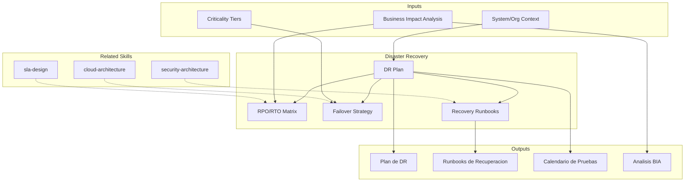

# Disaster Recovery: Business Continuity & Recovery Planning

Disaster recovery planning ensures organizational resilience through defined recovery objectives, failover designs, and tested recovery procedures. The skill produces DR plans, recovery runbooks, and test schedules that minimize downtime and data loss during disruptive events.

## Grounding Guideline

> *A recovery plan that is never tested is a documented illusion.*

1. **RPO and RTO are defined by the business, not by technology.** Recovery objectives stem from business needs; technology implements them.
2. **Resilience is designed, not improvised.** Every critical component needs an explicit and tested failover plan.
3. **Drill or fail.** A DR plan without regular simulations is paper — not protection.

## TL;DR

- Define RPO (Recovery Point Objective) and RTO (Recovery Time Objective) per system and criticality
- Design failover strategies (active-active, active-passive, pilot light, warm standby)
- Produce step-by-step recovery runbooks with roles, contacts, and procedures
- Establish DR test schedule (tabletop, partial failover, full failover)
- Integrate BCP (Business Continuity Plan) with business impact analysis (BIA)

## Inputs

The user provides a system or organization context as `$ARGUMENTS`. Parse `$1` as the **system/organization name**.

**Parameters:**
- `{MODO}`: `piloto-auto` (default) | `desatendido` | `supervisado` | `paso-a-paso`
- `{FORMATO}`: `markdown` (default) | `html` | `dual`
- `{VARIANTE}`: `ejecutiva` (~40%) | `tecnica` (full, default)
- `{TIER}`: `mission-critical` | `business-critical` | `business-operational` | `all` (default)

## Deliverables

1. **DR Plan** — Comprehensive disaster recovery plan with scope, roles, communication tree, and recovery procedures
2. **Recovery Runbook** — Step-by-step recovery procedures per system tier with validation checks
3. **Test Schedule** — DR test schedule with exercise types, scope, and success criteria
4. **Business Impact Analysis (BIA)** — Business impact analysis mapping systems to business processes with downtime cost
5. **RPO/RTO Matrix** — Recovery objectives per system with current vs. target gaps

## Process

1. **Perform BIA** — Identify critical business processes, map supporting systems, quantify downtime impact per hour/day
2. **Classify systems by tier** — Assign criticality tiers: mission-critical (RPO<1h, RTO<1h), business-critical (RPO<4h, RTO<4h), operational (RPO<24h, RTO<24h)
3. **Define RPO/RTO** — Set recovery objectives per system based on business impact and cost tolerance
4. **Design failover strategy** — Select failover pattern per tier: active-active, active-passive, pilot light, warm standby, cold standby
5. **Design backup strategy** — Define backup frequency, retention, encryption, off-site storage, and restoration procedures
6. **Create runbooks** — Document step-by-step recovery procedures with roles, validation checks, and escalation paths
7. **Establish crisis communication** — Define communication tree, notification channels, stakeholder updates, and public communication templates
8. **Plan tests** — Schedule tabletop exercises (quarterly), partial failover (semi-annual), and full failover (annual)

## Quality Criteria

- [ ] BIA covers all critical business processes with quantified downtime impact
- [ ] RPO/RTO defined for every in-scope system with gap analysis (current vs. target)
- [ ] Failover strategy matched to system tier and budget constraints
- [ ] Runbooks tested or reviewed by operations team
- [ ] Communication tree includes backup contacts and external stakeholders
- [ ] Test schedule includes escalating complexity (tabletop → partial → full)
- [ ] Backup strategy includes encryption, off-site storage, and restoration validation
- [ ] Evidence tags applied: [DOC], [CONFIG], [INFERENCIA], [SUPUESTO]

## Assumptions & Limits

- Assumes infrastructure team can implement recommended failover patterns
- RPO/RTO targets must be validated against budget — lower targets cost more
- Does not implement DR infrastructure — produces plans and runbooks
- Regulatory requirements (data residency, retention) may constrain DR design

## Edge Cases

1. **Sistemas legacy sin APIs de backup** — Cuando los sistemas no soportan snapshots o replicacion nativa, el skill disena estrategias de backup a nivel de filesystem/DB dump con scripts de automatizacion y tiempos de recuperacion mas largos.
2. **Restricciones de residencia de datos** — Si regulaciones exigen que los datos permanezcan en una region especifica, el plan de DR se limita a multi-AZ dentro de la misma region y documenta el riesgo residual de desastre regional.
3. **Presupuesto insuficiente para active-active** — El skill genera escenarios con diferentes niveles de inversion (cold standby, warm standby, pilot light) con analisis de costo vs. RTO alcanzable para facilitar la decision.
4. **DR nunca probado (deuda de pruebas)** — Se prioriza un plan de pruebas incremental: tabletop primero (semana 1), failover de componente no critico (mes 1), failover parcial (trimestre 1).

## Decisions & Trade-offs

1. **4 tiers de criticidad vs. 2 (critico/no-critico)** — Se usan 3-4 tiers porque la dicotomia critico/no-critico genera sobre-inversion en sistemas operacionales y sub-inversion en business-critical.
2. **Failover automatico vs. manual** — Se recomienda failover automatico solo para mission-critical con mecanismos probados; manual para el resto, porque failover automatico mal configurado puede causar mas dano que el incidente original.
3. **Pruebas trimestrales tabletop vs. anuales** — Trimestral para tabletop porque el equipo rota y la memoria institucional se pierde; el costo es bajo (2-4 horas por sesion).
4. **BIA como primer paso vs. en paralelo con DR** — BIA primero porque sin cuantificar impacto al negocio, los RPO/RTO son arbitrarios y no justificables ante stakeholders.

## Knowledge Graph

## Output Templates

### Markdown (default)
- Filename: `ops_dr-plan_{organizacion}_{WIP}.md`
- Structure: TL;DR -> BIA resumen -> Matriz RPO/RTO (tabla) -> Estrategia de failover (Mermaid) -> Runbooks -> Calendario de pruebas

### DOCX
- Filename: `ops_dr-plan_{organizacion}_{WIP}.docx`
- Via Pandoc: portada -> TOC -> BIA ejecutivo -> matrices RPO/RTO -> diagramas de failover -> runbooks detallados -> anexos de contacto

### HTML (bajo demanda)
- Filename: `ops_dr-plan_{organizacion}_{WIP}.html`
- Estructura: HTML self-contained branded (Design System MetodologIA v5). Light-First Technical. Incluye matriz RPO/RTO con semáforo por tier, diagrama de failover Mermaid y runbook colapsable por sección. WCAG AA, responsive, print-ready.

### XLSX (bajo demanda)
- Filename: `{fase}_{entregable}_{cliente}_{WIP}.xlsx`
- Generado via openpyxl con MetodologIA Design System v5. Encabezados con fondo navy y texto blanco Poppins, formato condicional por criticidad de tier (mission-critical/business-critical/operational), auto-filtros en todas las columnas, valores calculados (sin fórmulas). Hojas: RPO/RTO Matrix por sistema, BIA Impact Register, Failover Strategy Tracker, DR Test Calendar.

### PPTX (bajo demanda)
- Filename: `{fase}_{entregable}_{cliente}_{WIP}.pptx`
- Generado via python-pptx con MetodologIA Design System v5. Slide master con gradiente navy, títulos Poppins, cuerpo Trebuchet MS, acentos dorados. Máx 20 slides ejecutivo / 30 técnico. Notas del orador con referencias de evidencia. Secciones: BIA Resumen Ejecutivo, Matriz RPO/RTO por Tier, Estrategia de Failover, Runbooks de Recuperación (resumen), Calendario de Pruebas DR.

## Evaluacion

| Dimension | Peso | Criterio |
|-----------|------|----------|
| Trigger Accuracy | 10% | Activa ante "disaster recovery", "BCP", "RPO/RTO", "failover" sin confundir con backup operacional o incident management |
| Completeness | 25% | Cubre BIA, RPO/RTO, failover, runbooks, comunicacion de crisis y calendario de pruebas |
| Clarity | 20% | Runbooks son paso-a-paso ejecutables por operaciones sin interpretacion |
| Robustness | 20% | Maneja legacy sin APIs, restricciones de residencia y presupuesto limitado |
| Efficiency | 10% | 8 pasos donde BIA alimenta todo lo demas; sin pasos redundantes |
| Value Density | 15% | Runbooks y calendario de pruebas son directamente operacionalizables |

**Umbral minimo**: 7/10 en cada dimension para considerar el skill production-ready.

## Cross-References

- **metodologia-cloud-architecture:** Cloud infrastructure that enables DR capabilities (multi-region, multi-AZ)
- **metodologia-security-architecture:** Security controls for backup encryption and DR environment access
- **metodologia-sla-design:** SLA commitments that drive RPO/RTO requirements

---
**Autor:** Javier Montaño · Comunidad MetodologIA | **Version:** 1.0.0
