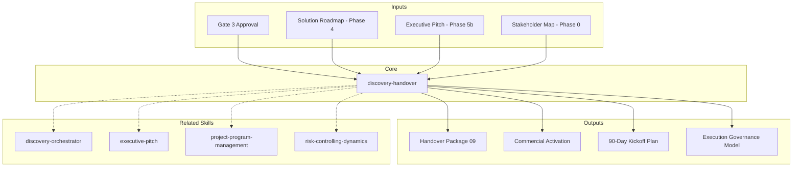

# Discovery Handover — Phase 6: Transición a Ejecución

Genera el paquete de transición operativa que traduce los entregables de descubrimiento (Fases 0-5) en artefactos de ejecución listos para Operaciones y/o Comercial.

## Principio Rector

**Un discovery sin handover es un informe guardado en un cajón.** La transición de descubrimiento a ejecución es donde el valor se materializa o se pierde. Cada insight, cada riesgo, cada decisión del discovery debe traducirse en una acción operativa con owner, fecha, y criterio de éxito. El handover no es un resumen — es un plan de activación.

### Filosofía de Transición

1. **Continuidad > documentación.** El handover no es "entregar documentos" — es transferir entendimiento. Los roles cambian, el conocimiento se preserva.
2. **Supuestos son deuda.** Cada supuesto no validado del discovery se hereda como riesgo en ejecución. El handover los hace explícitos con owners y deadlines.
3. **El primer sprint es el más importante.** Sprint 0 valida si el plan sobrevive el contacto con la realidad. El handover diseña Sprint 0, no solo lo menciona.

## Inputs (Consumidos de Fases Anteriores)

El handover REQUIERE que Gate 3 esté aprobado. Antes de generar, validar que existen:

| Fuente | Entregable Requerido | Archivo Esperado |
|--------|---------------------|------------------|
| Phase 0 | Mapa de stakeholders + RACI | `01_Stakeholder_Map.html` |
| Phase 1 | Análisis AS-IS (10 secciones) | `03_Analisis_AS-IS.html` |
| Phase 2 | Mapeo de flujos + DDD | `04_Mapeo_Flujos.html` |
| Phase 3 | Escenarios + scoring | `05_Escenarios_ToT.html` |
| Phase 4 | Roadmap + costeo | `06_Solution_Roadmap.html` |
| Phase 5a | Especificación funcional | `07_Especificacion_Funcional.html` |
| Phase 5b | Pitch ejecutivo + financiero | `08_Pitch_Ejecutivo.html` |

Si algún entregable falta, DETENER y listar qué falta antes de proceder.

**Parameters:**
- `{MODO}`: `piloto-auto` (default) | `desatendido` | `supervisado` | `paso-a-paso`
  - **piloto-auto**: Auto para compilación de entregables y plan de 90 días, HITL para validación de pricing y asignación de owners.
  - **desatendido**: Cero interrupciones. Handover completo auto-generado. Owners marcados como {Asignar}.
  - **supervisado**: Autónomo con checkpoint en paquete comercial y governance.
  - **paso-a-paso**: Confirma cada sección del handover y cada asignación de owner.
- `{FORMATO}`: `markdown` (default) | `html` | `dual`
- `{VARIANTE}`: `ejecutiva` (~40% — S1 resumen + S2 comercial + S6 tracker) | `técnica` (full 8 sections, default)

## Destinatarios del Handover

El skill debe preguntar al usuario cuál es el receptor primario:

| Receptor | Enfoque del Paquete |
|----------|-------------------|
| **Operaciones** | Checklist de readiness, kickoff Phase 1, governance, riesgos operativos |
| **Comercial** | Propuesta comercial derivada del pitch, pricing, narrativa de venta |
| **Ambos** | Paquete completo (default) |

## S1: Resumen Ejecutivo de Transición

Sintetizar en máximo 1 página:
- **Estado del descubrimiento**: Fases completadas, gates aprobados, fecha de cierre
- **Escenario aprobado**: Nombre + score final del escenario seleccionado (de Phase 3)
- **Inversión aprobada**: Rango presupuestal + timeline (de Phase 4/5b)
- **Próximos pasos inmediatos**: 3-5 acciones con owner y deadline (primeras 2 semanas)
- **Riesgos críticos activos**: Top 3 riesgos heredados del discovery con status

## S2: Paquete de Activación Comercial

Derivar del `08_Pitch_Ejecutivo.html`:

### 2.1 Narrativa de Propuesta
- **Contexto del cliente**: Pain points cuantificados (de Problem Statement)
- **Propuesta de valor**: 4 pilares (Cost Reduction, Revenue, Risk, Modernization)
- **Diferenciadores**: Por qué nosotros vs. alternativas (de Approach Comparison)
- **Modelo financiero simplificado**: NPV, IRR, payback en formato ejecutivo

### 2.2 Estructura de Pricing
```
┌─────────────────────────────────────────────────────┐
│ ESTRUCTURA DE PRICING                               │
├─────────────────┬──────────┬────────┬───────────────┤
│ Fase            │ Duración │ Equipo │ Inversión     │
├─────────────────┼──────────┼────────┼───────────────┤
│ Foundation      │ X meses  │ N FTE  │ $XXX,XXX      │
│ Build           │ X meses  │ N FTE  │ $XXX,XXX      │
│ Integrate       │ X meses  │ N FTE  │ $XXX,XXX      │
│ Optimize        │ X meses  │ N FTE  │ $XXX,XXX      │
│ Scale           │ X meses  │ N FTE  │ $XXX,XXX      │
├─────────────────┼──────────┼────────┼───────────────┤
│ TOTAL           │ XX meses │        │ $X,XXX,XXX    │
│ Contingencia    │          │        │ XX%           │
└─────────────────┴──────────┴────────┴───────────────┘
```

### 2.3 Condiciones Comerciales
- Modelo de facturación: por fase / mensual / hitos
- Gates de inversión: puntos de go/no-go por fase
- Kill criteria: condiciones de salida anticipada
- SLAs propuestos: tiempos de respuesta, calidad, gobernanza

### 2.4 Cronograma de Cierre Comercial
| Semana | Actividad | Responsable | Entregable |
|--------|-----------|-------------|------------|
| 1 | Revisión propuesta con sponsor | Comercial | Propuesta v1 |
| 2 | Negociación términos | Comercial + Legal | Term sheet |
| 3 | Aprobación interna | Steering | SOW firmado |
| 4 | Kick-off operativo | Operaciones | Plan Phase 1 |

## S3: Checklist de Readiness Operacional

Mapear los 9+ prerrequisitos del roadmap (Phase 4) a tareas operativas:

### 3.1 Equipo
| Rol | Cantidad | Status | Owner de Contratación | Fecha Límite |
|-----|----------|--------|----------------------|-------------|
| {Rol de Phase 4} | N | Pendiente/Listo | {Nombre} | {Fecha} |

### 3.2 Infraestructura
| Componente | Especificación | Status | Owner | Fecha Límite |
|-----------|----------------|--------|-------|-------------|
| {De AS-IS + Roadmap} | {Specs} | Pendiente/Listo | {Nombre} | {Fecha} |

### 3.3 Accesos y Permisos
- Repositorios de código fuente
- Ambientes (dev, staging, prod)
- Herramientas de CI/CD
- Acceso a datos y APIs
- VPN / acceso remoto

### 3.4 Documentación Base
- [ ] Roadmap aprobado compartido con equipo de ejecución
- [ ] Especificación funcional accesible al equipo técnico
- [ ] Riesgos y mitigaciones asignados a owners operativos
- [ ] RACI de ejecución (diferente al RACI de discovery) definido
- [ ] Canales de comunicación establecidos (Slack, JIRA, Confluence)

## S4: Plan de Kickoff — Primeros 90 Días

Derivar de Phase 1 (Foundation) del `06_Solution_Roadmap.html`:

### 4.1 Sprint 0 (Semanas 1-2): Setup
| Día | Actividad | Responsable | Output |
|-----|-----------|-------------|--------|
| 1-2 | Onboarding equipo técnico | Delivery Manager | Equipo operativo |
| 3-4 | Setup ambientes dev/staging | Tech Lead | Ambientes listos |
| 5 | Workshop de arquitectura objetivo | Architect | Decisiones técnicas |
| 6-7 | Configuración CI/CD pipeline | DevOps | Pipeline base |
| 8-10 | Primer spike técnico (mayor riesgo) | Dev Team | PoC validado/invalidado |

### 4.2 Sprint 1-3 (Semanas 3-8): Foundation Execution
- Módulo MVP #1 (mayor valor / menor riesgo de la matriz 3x3)
- Implementar 2-3 use cases core (de Phase 5a)
- Validar 2+ business rules críticas (severity CRITICAL)
- First deployment a staging
- Retrospectiva + ajuste de velocidad

### 4.3 Sprint 4-6 (Semanas 9-14): Foundation Completion
- Módulos MVP restantes
- Integration testing contra sistemas identificados en Phase 2
- Performance baseline vs. NFRs del AS-IS
- Gate de Foundation: evaluación go/no-go para Phase Build

### 4.4 Métricas de Seguimiento (Primeros 90 Días)
| Métrica | Target | Fuente | Frecuencia |
|---------|--------|--------|-----------|
| Velocidad del equipo | Estabilizar en Sprint 3 | JIRA/Linear | Semanal |
| Defectos críticos | 0 en producción | Bug tracker | Diario |
| Cobertura de tests | >80% unit, >70% integration | CI pipeline | Por PR |
| Budget burn rate | ≤110% del plan | Finance | Quincenal |
| Riesgo materializado | 0 de top-3 | Risk register | Semanal |

## S5: Protocolo de Transición de Gobernanza

### 5.1 De Discovery Governance → Execution Governance

| Rol Discovery | Transiciona a | Nuevo Responsable |
|---------------|--------------|-------------------|
| Discovery Conductor | PMO Lead / Scrum Master | {Asignar} |
| Technical Architect | Solution Architect (ejecución) | {Mismo o nuevo} |
| Domain Analyst | Product Owner / BA | {Asignar} |
| Quality Guardian | QA Lead | {Asignar} |
| Delivery Manager | Project Manager / Engineering Manager | {Mismo o nuevo} |
| Data Strategist | Data Architect (ejecución) | {Mismo o nuevo} |
| Change Catalyst | Change Manager | {Asignar} |

### 5.2 Estructura de Reuniones (Ejecución)
| Ceremonia | Frecuencia | Participantes | Propósito |
|-----------|-----------|---------------|-----------|
| Standup | Diario | Dev team | Impedimentos + progreso |
| Sprint Planning | Quincenal | PO + Dev team | Scope del sprint |
| Sprint Review | Quincenal | Stakeholders + Dev | Demo + feedback |
| Retrospectiva | Quincenal | Dev team | Mejora continua |
| Steering Committee | Mensual | Sponsors + PMO | Go/no-go, budget, riesgos |
| Architecture Review | Quincenal | Architects | Decisiones técnicas |

### 5.3 Escalation Path
```
Nivel 1: Dev Team → Tech Lead (resolución < 4h)
Nivel 2: Tech Lead → PM / PO (resolución < 24h)
Nivel 3: PM → Steering Committee (resolución < 1 semana)
Nivel 4: Steering → Executive Sponsor (decisiones de scope/budget/timeline)
```

## S6: Tracker de Validación de Supuestos y Riesgos

Operacionalizar los pivot points del Phase 4:

### 6.1 Supuestos Críticos (de Phase 4 Estimation Pivots)
| # | Supuesto | Validación Propuesta | Deadline | Owner | Status |
|---|----------|---------------------|----------|-------|--------|
| 1 | {Del roadmap} | {PoC / spike / vendor eval} | Semana X | {Nombre} | Pendiente |
| 2 | ... | ... | ... | ... | ... |

**Regla**: Si un supuesto se invalida, activar el conditional switching logic del Phase 3 (escenario alternativo).

### 6.2 Riesgos Heredados (de Phase 4 Risk Register)
| # | Riesgo | Probabilidad | Impacto | Mitigación | Early Warning | Owner |
|---|--------|-------------|---------|-----------|---------------|-------|
| 1 | {Del risk register} | Alta/Media/Baja | Alto/Medio/Bajo | {Acción} | {Indicador} | {Nombre} |

**Regla**: Revisar en cada Steering Committee. Si early warning se activa, ejecutar mitigación inmediata.

### 6.3 Kill Criteria (de Phase 4 Governance)
| Condición | Threshold | Acción | Decision Maker |
|-----------|-----------|--------|---------------|
| Budget overrun | >130% del plan | Pause + re-scope | Executive Sponsor |
| Timeline overrun | >150% de Foundation | Re-evaluate approach | Steering Committee |
| Quality failure | >3 defectos críticos en producción | Stop + quality sprint | QA Lead + PM |
| Team attrition | >40% turnover | Pause + re-staff | HR + PM |

## S7: Matriz de Transición de Stakeholders

Transformar el mapa de stakeholders de Phase 0 en roles de ejecución:

| Stakeholder | Rol Discovery (Phase 0) | Rol Ejecución | Engagement Shift | Comunicación |
|-------------|------------------------|---------------|-----------------|-------------|
| {Nombre} | Sponsor | Executive Sponsor | Mensual steering | Dashboard + report |
| {Nombre} | Champion | Product Owner | Diario/semanal | Sprint reviews |
| {Nombre} | Informado | Consumidor | Por release | Release notes |
| {Nombre} | Resistente | Early adopter target | Post-MVP | Training + soporte |

## S8: Entregable Final

### Archivo Output
`09_Handover_Operaciones_{project}.md` (o `.html` si `{FORMATO}=html|dual`)

### Estructura del Documento
Producir un documento con las 8 secciones anteriores, usando el sistema de diseño de la marca (READ `references/handover-templates.md` para la estructura HTML cuando `{FORMATO}=html|dual`).

## Validation Gate

- [ ] Todas las tablas tienen datos reales (no placeholders genéricos)
- [ ] Owners asignados a todas las tareas operativas
- [ ] Fechas absolutas (no "Semana X" sino "2026-04-15")
- [ ] Riesgos heredados tienen early warning indicators
- [ ] Kill criteria definidos con thresholds numéricos
- [ ] Estructura de pricing completa (si receptor = Comercial o Ambos)
- [ ] Plan de 90 días alineado con Phase 1 (Foundation) del roadmap
- [ ] RACI de ejecución es diferente al RACI de discovery
- [ ] Escalation path documentado
- [ ] Ceremonia structure definida

## Trade-off Matrix

| Dimensión | Opción A | Opción B | Regla de Decisión |
|-----------|----------|----------|-------------------|
| Alcance del handover | Solo Operaciones | Comercial + Operaciones | Ambos si el deal no está cerrado; solo Ops si ya está firmado |
| Nivel de detalle 90 días | Sprint-level | Week-level | Sprint-level para equipos ágiles; week-level para waterfall |
| Governance | Ligera (standup + steering) | Completa (todas las ceremonias) | Completa si equipo > 5; ligera si ≤ 5 |
| Financial tracking | Mensual | Quincenal | Quincenal si budget > $500K; mensual si menor |
| Stakeholder transition | Mapeo 1:1 | Taller de transición | Taller si > 10 stakeholders; mapeo si ≤ 10 |

## Edge Cases

| Escenario | Respuesta |
|-----------|----------|
| Gate 3 no aprobado | NO generar handover. Listar gaps. |
| Solo se ejecutó Quick Reference (Phases 1→3→5b) | Handover simplificado: solo S1 + S2 + S6. Sin 90-day plan. |
| Minimal Pipeline (sin Phase 0 ni 5a) | Omitir S7 (no hay stakeholder map). S4 simplificado sin use cases. |
| Cliente quiere solo propuesta comercial | Generar solo S1 + S2. Marcar S3-S7 como "pendiente post-cierre". |
| Equipo de ejecución es diferente al de discovery | Incluir sesión de knowledge transfer (2-4 horas) en Sprint 0. |
| Multi-vendor execution | Agregar sección de vendor coordination en S5 Governance. |

## Assumptions & Limits

- Este skill NO negocia términos comerciales — solo estructura la propuesta
- Los precios y márgenes deben ser validados por el área comercial antes de enviar al cliente
- El plan de 90 días es una guía — el equipo de ejecución debe ajustar en Sprint 0
- Los roles de transición son sugerencias — el receptor final asigna los nombres reales
- Este skill asume que el discovery se ejecuto con el framework MetodologIA completo

## Casos Borde

| Caso | Estrategia de Manejo |
|---|---|
| Gate 3 no aprobado pero el cliente necesita propuesta comercial urgente | NO generar handover completo. Generar solo S1 + S2 con disclaimer explicito de que el discovery no esta cerrado. Listar gaps pendientes como condiciones para activacion. |
| Equipo de ejecucion completamente diferente al equipo de discovery | Incluir sesion obligatoria de knowledge transfer (2-4 horas) en Sprint 0. Documentar decisiones de arquitectura con ADRs. Grabar walkthrough de entregables clave. |
| Multi-vendor execution con 3+ proveedores en el programa | Agregar seccion de vendor coordination en S5 Governance. Definir integration contracts entre vendors. Establecer single point of contact por vendor. Escalation path cross-vendor. |
| Solo se ejecuto Quick Reference (Phases 1-3-5b) sin phases intermedias | Handover simplificado: solo S1 + S2 + S6. Sin plan de 90 dias (no hay roadmap detallado). Marcar S3-S5, S7 como pendientes post-cierre comercial. |

## Decisiones y Trade-offs

| Decision | Alternativa Descartada | Justificacion |
|---|---|---|
| Sprint 0 de 2 semanas como buffer obligatorio antes de ejecucion | Arrancar Sprint 1 directamente post-handover | Sprint 0 valida si el plan sobrevive el contacto con la realidad. Sin setup de ambientes, onboarding y spike tecnico, Sprint 1 fracasa por impedimentos evitables. |
| Governance completa (todas las ceremonias) para equipos >5 personas | Governance ligera (solo standup + steering) | Equipos >5 necesitan estructura para coordinacion. Sin retrospectivas ni sprint reviews, el feedback loop se rompe y los problemas se acumulan silenciosamente. |
| Phase-gate funding sobre presupuesto completo aprobado upfront | Aprobacion de presupuesto total del programa desde el inicio | Phase-gate reduce riesgo financiero del cliente. Kill criteria en cada gate permiten salida controlada. Presupuesto upfront genera compromiso sin validacion de resultados. |

## Knowledge Graph



## Output Templates

**Formato MD (default):**
```
# Handover Operaciones: {project_name}
## S1: Resumen Ejecutivo de Transicion
  - Estado del descubrimiento, escenario aprobado, inversion
## S2: Paquete de Activacion Comercial
  - Narrativa, pricing structure, condiciones, cronograma cierre
## S3: Checklist de Readiness Operacional
  - Equipo, infraestructura, accesos, documentacion
## S4: Plan de Kickoff — Primeros 90 Dias
  - Sprint 0, Sprints 1-3, Sprints 4-6, metricas
## S5-S8: [remaining sections]
```

**Formato DOCX (secondary):**
- Documento formal con branding para firma del cliente
- Tabla de contenidos auto-generada
- Secciones con headers numerados y firmas de aprobacion
- Anexo: cronograma de cierre comercial como tabla editable

**Formato HTML (bajo demanda):**
- Filename: `09_Handover_Operaciones_{project}_{WIP}.html`
- Estructura: HTML self-contained branded (Design System MetodologIA v5). Dark-First Executive. Incluye Gantt de plan de 90 días (Mermaid CDN), checklist de readiness operacional interactivo y tracker de supuestos con semáforo. WCAG AA, responsive, print-ready.

**Formato XLSX (bajo demanda):**
- Filename: `{fase}_{entregable}_{cliente}_{WIP}.xlsx`
- Generado via openpyxl con MetodologIA Design System v5. Encabezados con fondo navy y texto blanco Poppins, formato condicional por estado (Pendiente/En Progreso/Listo), auto-filtros en todas las columnas, valores calculados (sin fórmulas). Hojas: Operational Readiness Checklist, 90-Day Kickoff Plan (sprint por sprint), Assumption & Risk Tracker, Stakeholder Transition Matrix.

**Formato PPTX (bajo demanda):**
- Filename: `{fase}_{entregable}_{cliente}_{WIP}.pptx`
- Generado via python-pptx con MetodologIA Design System v5. Slide master con gradiente navy, títulos Poppins, cuerpo Montserrat, acentos dorados. Máx 20 slides ejecutivo / 30 técnico. Notas del orador con referencias de evidencia. Secciones: Resumen Ejecutivo de Transición, Paquete de Activación Comercial, Checklist de Readiness Operacional, Plan de Kickoff 90 Días, Governance y Escalation, Tracker de Riesgos y Supuestos.

## Evaluacion

| Dimension | Peso | Criterio | Umbral Minimo |
|---|---|---|---|
| Trigger Accuracy | 10% | El skill se activa correctamente ante menciones de handover, transicion, kickoff, cierre de discovery | 7/10 |
| Completeness | 25% | Las 8 secciones cubren transicion ejecutiva, comercial, operacional, governance, y tracking | 7/10 |
| Clarity | 20% | Owners asignados a todas las tareas. Fechas absolutas. RACI de ejecucion diferenciado del de discovery. | 7/10 |
| Robustness | 20% | Kill criteria con thresholds numericos. Early warning indicators para riesgos heredados. Rollback path documentado. | 7/10 |
| Efficiency | 10% | Output proporcional al receptor (Ops, Comercial, Ambos). Sin seccion redundante con deliverables previos. | 7/10 |
| Value Density | 15% | Plan de 90 dias con actividades dia-a-dia en Sprint 0. Metricas de seguimiento con targets concretos. | 7/10 |

**Umbral minimo global:** 7/10. Deliverables por debajo requieren re-work antes de entrega.

## Output Format Protocol

| Format | Default | Description |
|--------|---------|-------------|
| `markdown` | ✅ | Rich Markdown + Mermaid diagrams. Token-efficient. |
| `html` | On demand | Branded HTML (Design System). Visual impact. |
| `dual` | On demand | Both formats. |

Default output is Markdown with embedded Mermaid diagrams. HTML generation requires explicit `{FORMATO}=html` parameter.

## Output Artifact

**Primary:** `09_Handover_Operaciones_{project}.md` (o `.html` si `{FORMATO}=html|dual`) — Executive transition summary, commercial activation package, operational readiness checklist, 90-day kickoff plan, governance transition, assumption tracker, stakeholder transition matrix.

**Diagramas incluidos:**
- Flowchart: governance and escalation flow
- Gantt chart: 90-day plan (first month week-by-week)
- State diagram: discovery-to-execution transition lifecycle

---
**Autor:** Javier Montaño | **Última actualización:** 12 de marzo de 2026
