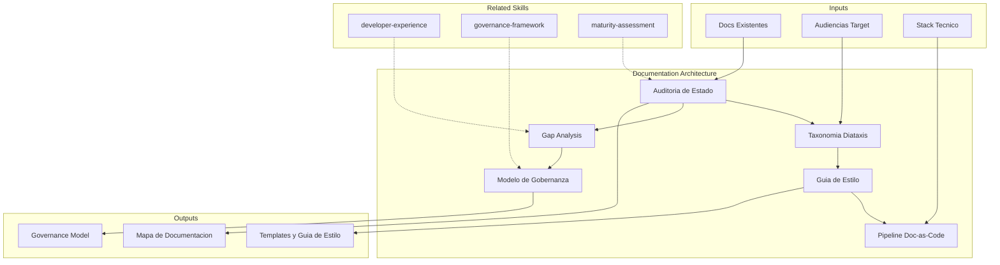

# Arquitectura de Documentacion

Diseno de estrategia doc-as-code, taxonomia de contenido, modelo de gobernanza
y arquitectura de base de conocimiento para organizaciones de tecnologia.

## Grounding Guideline

> *Documentation that is not maintained is worse than no documentation — it generates false confidence.*

1. **Docs as Code.** Documentation lives alongside code, is versioned with code, and is reviewed like code.
2. **The best document is one that does not need to exist.** Self-describing code and ADRs reduce the need for narrative documentation.
3. **Document decisions, not just states.** An ADR that explains the why is worth more than a diagram that shows the what.

## TL;DR

- Assess current documentation state and detect critical gaps
- Design documentation taxonomy aligned with Diataxis framework (tutorials, how-to, reference, explanation)
- Define doc-as-code pipeline integrated with existing CI/CD
- Establish governance model with roles, review cycles, and health metrics
- Produce complete documentation map with ownership and priorities

## Inputs

Parse `$1` como **nombre del proyecto/organizacion**, `$2` como **scope de documentacion**.

**Parameters:**
- `{MODO}`: `piloto-auto` (default) | `desatendido` | `supervisado` | `paso-a-paso`
- `{FORMATO}`: `markdown` (default) | `html` | `dual`
- `{VARIANTE}`: `ejecutiva` (~40%) | `tecnica` (full, default)

## Deliverables

1. **Documentation Map** — Inventory of existing docs, gaps, priorities
2. **Style Guide** — Writing standards, templates, conventions
3. **Governance Model** — Roles, review cycles, health metrics, escalation
4. **Content Taxonomy** — Diataxis classification adapted to context
5. **Doc-as-Code Pipeline** — Technical architecture for generation, validation, and publishing

## Process

1. **Current State Audit** — Inventory existing documentation, assess coverage, freshness, and accessibility
2. **Gap Analysis** — Identify critical missing documentation by audience:
   | Audiencia | Necesita | Formato Preferido |
   |---|---|---|
   | Developers | API refs, architecture decisions, runbooks | Markdown en repo |
   | Ops/SRE | Runbooks, troubleshooting, infra docs | Wiki + automation |
   | Product | Specs, user stories, release notes | Confluence/Notion |
   | Nuevos miembros | Onboarding guides, architecture overview | Structured tutorials |
3. **Taxonomy Design** — Apply Diataxis framework:
   - Tutorials (learning-oriented): step-by-step guides for learning
   - How-to guides (task-oriented): recipes for solving problems
   - Reference (information-oriented): precise technical description
   - Explanation (understanding-oriented): discussion and context
4. **Style Guide Definition** — Templates, naming conventions, file structure, tone of voice
5. **Doc-as-Code Pipeline** — Linting (markdownlint, vale), build (MkDocs, Docusaurus), deploy, link checking
6. **Governance Model** — Ownership by area, review cadence, freshness metrics, retirement policy

## Quality Criteria

- [ ] Inventario completo de documentacion existente con scoring de frescura
- [ ] Gaps criticos identificados y priorizados por impacto
- [ ] Taxonomia Diataxis aplicada con ejemplos por categoria
- [ ] Guia de estilo con templates reutilizables
- [ ] Pipeline doc-as-code disenado con herramientas especificas
- [ ] Modelo de gobernanza con roles, cadencia y metricas
- [ ] Diagrama Mermaid de flujo de documentacion

## Assumptions & Limits

- Asume acceso al repositorio y herramientas de documentacion existentes para auditoria
- No produce la documentacion en si — disena la arquitectura, taxonomia y gobernanza para que el equipo la ejecute
- Recomendaciones de tooling (MkDocs, Docusaurus, Vale) son sugerencias; la seleccion final depende del stack del equipo
- Freshness scoring es estimado si no existe metadata de ultima actualizacion en los documentos

## Edge Cases

| Escenario | Estrategia de Manejo |
|---|---|
| Organizacion sin documentacion formal (solo conocimiento tribal) | Priorizar onboarding guide y architecture overview como quick wins; usar entrevistas como fuente primaria [INFERENCIA] |
| Documentacion dispersa en +5 plataformas (Confluence, Notion, Google Docs, README, Wiki) | Mapear todas las fuentes en inventario unificado; recomendar consolidacion progresiva con redirects |
| Equipo que resiste escribir documentacion | Proponer docs-as-code integrado en PR workflow (templates obligatorios); minimizar friction con snippets y automation |
| Documentacion regulada (compliance, auditoria) | Separar docs regulados de docs tecnicos; aplicar versionamiento estricto y approval workflow |

## Decisions & Trade-offs

| Decision | Habilita | Restringe | Justificacion |
|---|---|---|---|
| Diataxis como framework de taxonomia | Estructura clara por tipo de contenido y audiencia | Requiere training para que el equipo clasifique correctamente | Es el framework mas adoptado para docs tecnicas; separa preocupaciones de forma natural |
| Doc-as-code como approach default | Docs viven junto al codigo, revisados en PR | Requiere tooling de build y deploy | Reduce drift entre codigo y documentacion; aprovecha workflows existentes |
| Gobernanza con ownership explicito | Cada doc tiene responsable de freshness | Overhead de asignacion y tracking | Sin ownership, la documentacion decae en meses |

## Knowledge Graph

## Output Templates

**Formato 1 — Markdown (default)**
- Filename: `Documentation_Architecture_{project}_{WIP|Aprobado}.md`
- Estructura: Inventario > Gap Analysis > Taxonomia Diataxis > Guia de Estilo > Pipeline Design > Modelo de Gobernanza > Roadmap
- Incluye diagramas Mermaid de pipeline y taxonomia

**Formato 2 — XLSX (inventario y tracking)**
- Filename: `Doc_Inventory_{project}_{WIP|Aprobado}.xlsx`
- Estructura: Sheet 1 (Inventario con scoring de freshness) > Sheet 2 (Gap Matrix por audiencia) > Sheet 3 (Ownership y review schedule)
- Optimizado para tracking operativo y reporting de gobernanza

**Formato 3 — HTML (bajo demanda)**
- Filename: `Documentation_Architecture_{project}_{WIP|Aprobado}.html`
- Estructura: HTML self-contained branded (Design System MetodologIA v5). Light-First Technical. Incluye diagrama de pipeline doc-as-code (Mermaid CDN), taxonomía Diataxis visual y mapa de ownership con indicadores de freshness. WCAG AA, responsive, print-ready.

**Formato 4 — DOCX (circulación formal)**
- Filename: `{fase}_{entregable}_{cliente}_{WIP}.docx`
- Generado via python-docx con Metodología Design System v5. Portada con metadata del engagement, TOC automático, encabezados/pies de página con marca. Tablas con zebra striping, tipografía Poppins en headings (navy), Trebuchet MS en cuerpo, acentos dorados. Para circulación formal y auditoría.

**Formato 5 — PPTX (presentación ejecutiva)**
- Filename: `{fase}_{entregable}_{cliente}_{WIP}.pptx`
- Generado via python-pptx con MetodologIA Design System v5. Slide master con gradiente navy, títulos Poppins, cuerpo Trebuchet MS, acentos dorados. Máx 20 slides ejecutivo / 30 técnico. Notas del orador con referencias de evidencia. Secciones: Estado Actual de Documentación, Gap Analysis por Audiencia, Taxonomía Diataxis, Pipeline Doc-as-Code, Modelo de Gobernanza y Roadmap.

## Evaluacion

| Dimension | Peso | Criterio |
|-----------|------|----------|
| Trigger Accuracy | 10% | Activa triggers correctos ante keywords de documentacion, doc-as-code, knowledge base |
| Completeness | 25% | Cubre inventario, gaps, taxonomia, guia de estilo, pipeline y gobernanza |
| Clarity | 20% | Templates son reutilizables directamente; pipeline tiene pasos especificos de tooling |
| Robustness | 20% | Maneja organizaciones sin docs, docs dispersas, resistencia a documentar |
| Efficiency | 10% | Proceso no duplica esfuerzo entre auditoria y gap analysis |
| Value Density | 15% | Gobernanza es accionable con roles, cadencia y metricas concretas |

**Umbral minimo**: 7/10 en cada dimension para considerar el skill production-ready.

## Cross-References

- **metodologia-developer-experience:** Documentacion como dimension clave de DX y onboarding
- **metodologia-governance-framework:** Gobernanza de docs alineada con governance general de TI
- **metodologia-maturity-assessment:** Documentacion como capacidad evaluable en assessment de madurez

---
**Autor:** Javier Montaño · Comunidad MetodologIA | **Version:** 1.0.0
