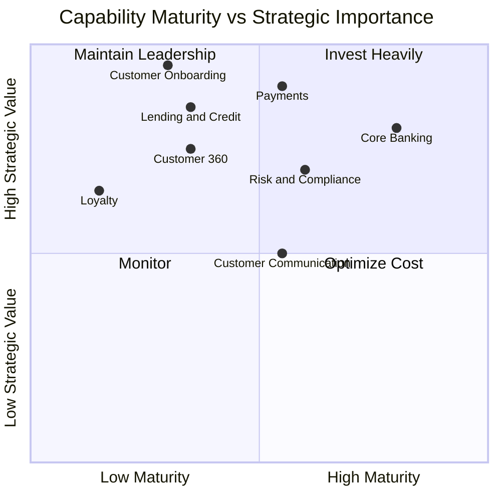
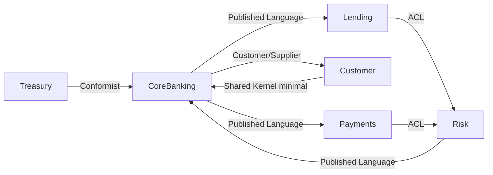
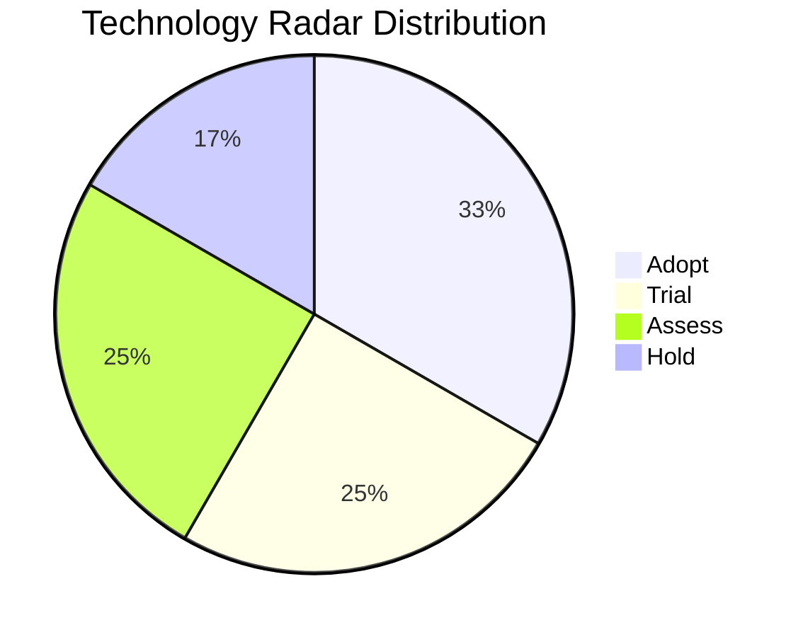
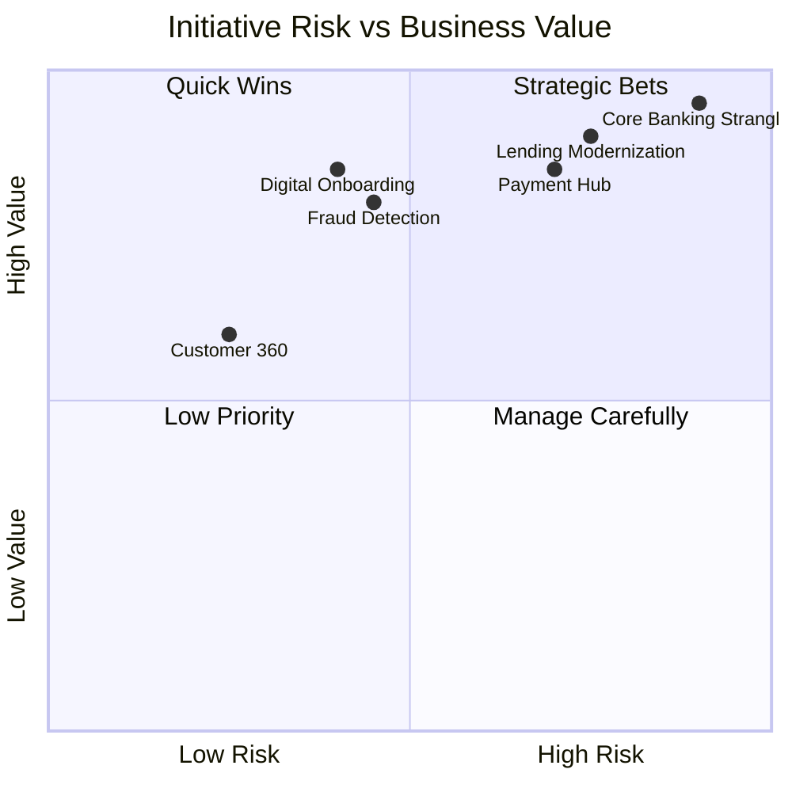

# Enterprise Architecture — Acme Corp Banking Modernization

**Proyecto:** Acme Corp Banking Modernization
**Variante:** Tecnica (full)
**Fecha:** 12 de marzo de 2026
**Industria:** Financial Services (Retail Banking, Lending, Payments)

---

## Executive Summary

Acme Corp is a mid-size Colombian bank with 2.1M retail customers, 85 branches, and a growing digital channel (42% of transactions). This enterprise architecture maps 5 L1 business capabilities with maturity assessments, decomposes the organization into 6 DDD bounded contexts, establishes a technology radar with 12 entries, defines ARB governance aligned with SFC regulatory requirements, prioritizes 6 strategic initiatives for the 2026-2027 horizon, and designs a target operating model with team topologies and DORA metrics.

---

## S1: Capability Map (Maturity 1-5)

### Level 1 Capabilities

| L1 Capability | Current | Target | Gap | Owner | Key Systems |
|---|---|---|---|---|---|
| **Customer Management** | 3 | 5 | +2 | Chief Customer Officer | CRM, KYC Platform, Customer Portal |
| **Core Banking** | 4 | 5 | +1 | VP Retail Banking | Core Banking System (Temenos), Account Management |
| **Lending & Credit** | 2 | 4 | +2 | Director Credit Risk | Legacy Loan Origination, Credit Scoring (manual) |
| **Payments & Transfers** | 3 | 5 | +2 | Head of Payments | Payment Gateway, SWIFT, ACH, PSE Integration |
| **Risk & Compliance** | 3 | 4 | +1 | Chief Risk Officer | AML/SARLAFT, Regulatory Reporting, Fraud Detection |

### Level 2 Decomposition -- Customer Management

| L2 Capability | Current | Target | Systems | Gap Action |
|---|---|---|---|---|
| Customer Onboarding | 2 | 5 | Legacy portal, manual KYC | Digital KYC + biometric verification |
| Customer 360 View | 2 | 4 | Fragmented across 4 systems | Unified customer data platform |
| Customer Communication | 3 | 4 | Email + SMS (no omnichannel) | Add push notifications, WhatsApp |
| Customer Analytics | 2 | 5 | Basic reports in Excel | Real-time analytics platform |
| Loyalty & Retention | 1 | 4 | None (ad-hoc campaigns) | Design loyalty program from scratch |

### Capability Heat Map

---

## S2: Domain Model (DDD)

### Bounded Contexts

| # | Context | Type | Owner Team | Key Aggregates |
|---|---|---|---|---|
| 1 | **Core Banking** | Core | Stream-Aligned: Core Banking Squad | Account, Balance, Statement, Product |
| 2 | **Customer** | Core | Stream-Aligned: Customer Squad | Customer Profile, KYC, Preferences, Consent |
| 3 | **Lending** | Core | Stream-Aligned: Lending Squad | Loan Application, Credit Decision, Amortization, Collateral |
| 4 | **Payments** | Core | Stream-Aligned: Payments Squad | Transfer, SWIFT Message, ACH Batch, FX Rate |
| 5 | **Risk** | Supporting | Complicated Subsystem: Risk Team | Risk Score, AML Alert, Regulatory Report, Fraud Signal |
| 6 | **Treasury** | Supporting | Stream-Aligned: Treasury Squad | Position, Hedge, Liquidity, Interest Rate |

### Context Map

**Key architectural decisions:**

- **Core Banking - Customer:** Customer/Supplier relationship. Core Banking consumes customer data under formal data contract. Customer domain owns PII.
- **Lending/Payments - Risk:** Anti-Corruption Layer. Risk domain runs legacy AML engine (SARLAFT); ACL isolates modern domains from legacy data model.
- **Treasury - Core Banking:** Conformist. Treasury conforms to Core Banking's account/balance model to avoid duplication.
- **Customer - Core Banking:** Shared Kernel (minimal). Only `customer_id` and `account_id` shared; all other data accessed via APIs.

### Team Topology Alignment

| Domain | Team Type | Rationale |
|---|---|---|
| Core Banking | Stream-aligned | End-to-end ownership of core transaction processing |
| Customer | Stream-aligned | Owns customer lifecycle, KYC, and consent management |
| Lending | Stream-aligned | Full loan lifecycle from application to collections |
| Payments | Stream-aligned | Real-time payment processing, integrations with PSE/SWIFT |
| Risk | Complicated Subsystem | Specialized AML/fraud expertise, regulatory knowledge |
| Treasury | Stream-aligned | Liquidity management, FX, interest rate positions |

---

## S3: Technology Radar

| Technology | Ring | Dimension | Rationale |
|---|---|---|---|
| **PostgreSQL 16 (RDS)** | Adopt | Data | Primary OLTP for new services. ACID, JSON, partitioning. |
| **Kafka (MSK)** | Adopt | Integration | Event backbone. 4 domains publishing events. CDC from legacy. |
| **Kubernetes (EKS)** | Adopt | Platform | Container orchestration. 14 microservices in production. |
| **Spring Boot 3.2** | Adopt | Framework | Backend standard. Team expertise, security patches. |
| **React 18 + Next.js** | Trial | Framework | Customer portal migration. Performance validated in POC. |
| **Temporal** | Trial | Platform | Saga orchestration for lending workflow. Pilot in Q2. |
| **Feast (Feature Store)** | Trial | Data | ML feature management. Fraud detection use case. |
| **CockroachDB** | Assess | Data | Multi-region consistency for future regional expansion. |
| **Apache Flink** | Assess | Data | Real-time stream processing for fraud detection. |
| **GraphQL Federation** | Assess | Integration | API composition for mobile app. Evaluating vs REST BFF. |
| **Temenos T24 (on-prem)** | Hold | Platform | Legacy core banking. Modernization planned via strangler fig. |
| **Oracle 12c (on-prem)** | Hold | Data | Legacy lending database. Migration to PostgreSQL in progress. |

---

## S4: Architectural Governance (ARB)

### Architectural Principles

| # | Principle | Rationale | Implications |
|---|---|---|---|
| P1 | **Cloud-first, Colombia-resident** | SFC data sovereignty requirements; AWS sa-east-1 | All data stored in-country; cross-border requires SIC authorization |
| P2 | **API-first** | Every capability exposed via APIs; no shared databases | Enables channel agnosticism (branch, web, mobile, API banking) |
| P3 | **Event-driven by default** | Domains communicate via Kafka events | Synchronous only for real-time transaction processing |
| P4 | **Security non-negotiable** | Financial services regulatory burden | Every service must pass security gates before production |
| P5 | **Data ownership per domain** | Prevents coupling, enables domain autonomy | Each bounded context owns and publishes its data products |

### ARB Composition & Process

| Role | Name | Authority |
|---|---|---|
| Chair | CTO (Ana Restrepo) | Final decision on contested items |
| Domain Architects | 3 (Core Banking, Digital, Data) | Technical assessment and recommendation |
| Lead Engineers | 2 (Backend, Platform) | Implementation feasibility |
| CISO | Security lead | Security and compliance veto |
| Compliance Officer | Regulatory alignment | SFC/SIC regulatory veto |

**Review triggers:**
- New microservice or bounded context boundary change
- Technology outside radar (Trial/Assess/Hold ring)
- Infrastructure cost > $20K/month
- Cross-domain data sharing or integration pattern
- Any change to authentication or payment processing

**Process:** Bi-weekly sync (Thursdays); async ADR submission 5 days before; decision within 10 business days; exception: CTO fast-track for P1 production issues.

---

## S5: Initiative Portfolio

### Strategic Initiatives (2026-2027)

| # | Initiative | Value | Effort | Risk | Timeline | Capabilities Improved |
|---|---|---|---|---|---|---|
| 1 | **Digital Customer Onboarding** | High | L | Medium | Q2-Q3 2026 | Customer Onboarding (+3), KYC (+2) |
| 2 | **Lending Platform Modernization** | High | XL | High | Q2 2026 - Q1 2027 | Lending & Credit (+2), Credit Scoring (+3) |
| 3 | **Real-Time Fraud Detection** | High | L | Medium | Q2-Q4 2026 | Fraud Detection (+2), Risk Scoring (+2) |
| 4 | **Payment Hub Consolidation** | High | XL | High | Q3 2026 - Q2 2027 | Payments (+2), FX (+1), SWIFT (+1) |
| 5 | **Customer 360 Data Platform** | Medium | M | Low | Q3-Q4 2026 | Customer 360 (+2), Analytics (+2) |
| 6 | **Core Banking Strangler Fig** | Very High | XXL | Very High | Q1 2027 - Q4 2028 | Core Banking modernization (Temenos decoupling) |

### Portfolio Analysis

### Capacity Planning

| Resource | Available | Committed | Buffer |
|---|---|---|---|
| Stream-aligned engineers | 32 | 28 | 12.5% |
| Platform engineers | 6 | 5 | 16.7% |
| Data engineers | 4 | 4 | 0% (hiring 2 in Q2) |
| QA engineers | 5 | 4 | 20% |
| Budget (annual) | $4.2M | $3.6M | 14.3% |

### Portfolio Balance

| Category | Target | Actual | Status |
|---|---|---|---|
| Strategic / Transformational | 60% | 65% | Slightly over (Core Banking Strangler) |
| Operational Improvement | 20% | 20% | On target |
| Technical Debt | 20% | 15% | Under -- add Oracle migration acceleration |

---

## S6: Target Operating Model

### Team Topologies

| Team | Type | Domain | Size | Key Responsibilities |
|---|---|---|---|---|
| Core Banking Squad | Stream-Aligned | Core Banking BC | 7 | Account management, transaction processing, statements |
| Customer Squad | Stream-Aligned | Customer BC | 6 | KYC, customer portal, consent management, 360 view |
| Lending Squad | Stream-Aligned | Lending BC | 6 | Loan origination, credit scoring, collections |
| Payments Squad | Stream-Aligned | Payments BC | 6 | Transfers, SWIFT, ACH, PSE, FX |
| Risk Team | Complicated Subsystem | Risk BC | 4 | AML/SARLAFT, fraud detection, regulatory reporting |
| Treasury Squad | Stream-Aligned | Treasury BC | 3 | Liquidity, positions, hedging |
| Platform Engineering | Platform | Cross-cutting | 6 | Kubernetes, CI/CD, observability, security tooling |
| Data Platform | Enabling | Cross-cutting | 4 | Data pipelines, feature store, analytics infrastructure |

### DORA Metrics -- Current vs. Target

| Metric | Current | Target (12 mo) | Industry Benchmark (Financial) |
|---|---|---|---|
| Deployment Frequency | 1x/week | 3x/week | Elite: Daily |
| Lead Time for Changes | 5 days | 1 day | Elite: < 1 hour |
| Change Failure Rate | 18% | < 10% | Elite: 0-5% |
| MTTR | 6 hours | < 1 hour | Elite: < 15 min |

### Decision Rights

| Level | Who | Scope | Cadence |
|---|---|---|---|
| Strategic | CTO + ARB | Technology radar, cross-domain initiatives, >$20K/month | Bi-weekly |
| Tactical | Domain Architects | Pattern selection, service boundaries, data model | Weekly within domain |
| Operational | Squad Leads | Implementation approach, sprint priorities, tooling within radar | Daily |

### Funding Model

| Category | Model | Budget Source |
|---|---|---|
| Stream-aligned teams | Product funding per domain | Business unit P&L |
| Platform team | Shared cost, allocated by usage | Technology cost center |
| Enabling team (Data) | Project-based + baseline | Technology cost center |
| Innovation | 5% discretionary budget | CTO office |

---

## Conclusions

### Architecture Maturity Assessment

| Dimension | Current Level | Target (18 mo) | Key Gap |
|---|---|---|---|
| Business capability coverage | Level 2.8 (avg) | Level 4.2 | Customer, Lending, Payments underinvested |
| Domain autonomy | Level 2 | Level 4 | Shared databases, coupled deployments |
| Technology modernization | Level 3 | Level 4 | 2 systems on Hold ring (Temenos, Oracle) |
| Governance maturity | Level 3 | Level 4 | ARB process defined but inconsistently followed |
| Delivery performance | Level 2 (DORA) | Level 3 | Pipeline security gates adding friction (being resolved) |

### Critical Success Factors

1. **Executive sponsorship** for Core Banking Strangler Fig -- longest, highest-risk initiative
2. **Data platform investment** -- zero buffer in data engineering capacity is a bottleneck
3. **SFC regulatory alignment** -- all architecture decisions must pass compliance review
4. **Cultural shift** -- from project-based to product-based funding and team structure
5. **Technical debt allocation** -- increase from 15% to 20% to address Oracle migration

---

**Autor:** Javier Montano — MetodologIA Discovery Framework v6.0
