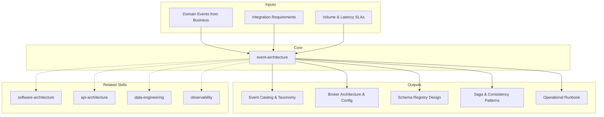

# Event Architecture: Catalog, Consistency Patterns & Operational Excellence

Event-driven architecture decouples producers from consumers through asynchronous messaging — enabling scalability, resilience, and temporal flexibility. The skill covers event catalog design, broker selection, schema governance, consistency patterns (sagas, CQRS, event sourcing), and the operational practices that keep event systems reliable.

## Principio Rector

**Los eventos son hechos inmutables — no mensajes descartables.** Un evento publicado es historia del sistema. El catálogo de eventos es el system of record, el schema registry previene breaking changes, y la consistencia eventual es una feature, no un bug.

### Filosofía de Event Architecture

1. **El catálogo de eventos ES el sistema.** Si un evento no está catalogado, no existe. El catálogo es la fuente de verdad que conecta dominios, equipos y contratos.
2. **Schema registry previene breaking changes.** Sin schema registry, cada deploy es una ruleta rusa. La compatibilidad se valida en CI, no en producción a las 3am.
3. **Eventual consistency es una feature, no un bug.** Los sistemas distribuidos son eventualmente consistentes por naturaleza. Diseñarlo explícitamente (sagas, outbox, idempotencia) transforma un problema en una ventaja.

## Inputs

The user provides a system or platform name as `$ARGUMENTS`. Parse `$1` as the **system/platform name** used throughout all output artifacts.

**Parameters:**
- `{MODO}`: `piloto-auto` (default) | `desatendido` | `supervisado` | `paso-a-paso`
  - **piloto-auto**: Auto para event catalog y broker config, HITL para saga design y schema compatibility decisions.
  - **desatendido**: Cero interrupciones. Event architecture documentada automáticamente. Supuestos documentados.
  - **supervisado**: Autónomo con checkpoint en broker selection y consistency pattern design.
  - **paso-a-paso**: Confirma cada event definition, schema, saga flow, y operational procedure.
- `{FORMATO}`: `markdown` (default) | `html` | `dual`
- `{VARIANTE}`: `ejecutiva` (~40% — S1 catalog + S3 schema registry + S4 consistency) | `técnica` (full 6 sections, default)

Before generating event architecture, detect the codebase context:

```
!find . -name "*.yaml" -o -name "*.json" -o -name "*.avro" -o -name "*.proto" -o -name "*event*" -o -name "*kafka*" -o -name "*rabbit*" | head -30
```

Use detected event definitions, broker configurations, and schema files to tailor catalog structure, pattern recommendations, and operational guidance.

If reference materials exist, load them:

```
Read ${CLAUDE_SKILL_DIR}/references/event-patterns.md
```

---

## When to Use

- Designing event-driven communication between services
- Building an event catalog with taxonomy and schema governance
- Selecting message broker technology (Kafka, RabbitMQ, Pulsar)
- Implementing consistency patterns (sagas, compensating transactions)
- Designing CQRS with event sourcing for complex domains
- Establishing operational practices for event systems (DLQ, monitoring, replay)
- Migrating from synchronous to asynchronous communication

## When NOT to Use

- Internal module structure and code organization — use software-architecture
- REST/GraphQL/gRPC API design — use api-architecture
- Data pipeline and ETL/ELT design — use data-engineering
- Infrastructure and compute platform design — use infrastructure-architecture

---

## Delivery Structure: 6 Sections

### S1: Event Catalog & Taxonomy

Establish naming conventions, event types, and a discoverable catalog of all events.

**Event naming:** `<Domain>.<Entity>.<Action>` (e.g., `Order.Payment.Completed`)

**Event type classification:**
- **Domain events:** Business-meaningful occurrences (OrderPlaced, InvoiceGenerated)
- **Integration events:** Cross-boundary communication (UserSynced, InventoryReserved)
- **System events:** Operational signals (ServiceStarted, HealthCheckFailed)

**CloudEvents Standard (CNCF)** — vendor-neutral event envelope for interoperability:
- Required attributes: `id`, `source`, `specversion` (1.0), `type`
- Recommended: `time`, `datacontenttype`, `dataschema`, `subject`
- Protocol bindings: HTTP, Kafka (header mapping), AMQP, MQTT, NATS
- Supported by: AWS EventBridge, Azure Event Grid, GCP Eventarc, Knative
- Adopt when: multi-cloud, multi-broker, or events crossing organizational boundaries
- Without CloudEvents, each team invents its own structure — adopt early to avoid format chaos

**Event Granularity Decision Matrix:**

| Type | Payload | Coupling | Latency | When to use |
|---|---|---|---|---|
| **Notification (thin)** | Signal only: `{ orderId }` | Low (consumer fetches via API) | Higher (API callback) | Default starting point; consumer has API access |
| **State Transfer (fat)** | Full state: `{ orderId, items[], total }` | Higher (schema dependency) | Lower (self-contained) | Consumer needs embedded data; API callback adds unacceptable latency |
| **Delta** | Changed fields only: `{ orderId, status: "shipped" }` | Medium | Lowest | Consumer maintains local state; bandwidth-constrained |

Rule of thumb: start thin, fatten only when consumers demonstrably need embedded data.

**Key decisions:**
- Envelope vs. embedded metadata: separate header from payload (recommended) or merge
- Catalog governance: mandatory registration before publishing (recommended) or passive discovery
- Schema design: envelope (metadata) + payload (business data) with correlationId and causationId

### S2: Message Broker Architecture

Select and configure the message broker for reliability, throughput, and operational simplicity.

**Broker Selection Matrix:**

| Criterion | Apache Kafka | RabbitMQ | Apache Pulsar | Cloud-native (SNS+SQS, Event Grid, Pub/Sub) |
|---|---|---|---|---|
| Throughput | Millions msg/sec | Tens of thousands | Millions msg/sec | Varies by service |
| Replay | Native (log-based) | Not built-in | Native (tiered storage) | Limited |
| Latency | Low-medium (batching) | Sub-millisecond | Low | Medium |
| Ordering | Per-partition | Per-queue | Per-partition | Varies |
| Multi-tenancy | Topic-level | Vhost-level | Native | Native |
| Ops complexity | High (ZK/KRaft) | Low-medium | Medium-high | Managed |
| Best for | High-volume, event sourcing | Task queues, RPC, simple routing | Multi-tenant, geo-replicated | Serverless, low ops budget |

**Critical Kafka Configurations for Reliability:**
- `acks=all` — wait for all in-sync replicas to acknowledge (mandatory for durability)
- `min.insync.replicas=2` — require at least 2 replicas in sync before accepting writes
- `enable.idempotence=true` — prevent duplicate messages from producer retries
- `max.in.flight.requests.per.connection=5` — safe with idempotence enabled
- Replication factor: 3 minimum for production topics

**Consumer Group Strategies:**
- One group per downstream service (independent offsets, independent scaling)
- Scale consumers by adding instances (max instances = number of partitions)
- Use **cooperative sticky rebalancing** (`partition.assignment.strategy=cooperative-sticky`) to minimize partition shuffling during scaling
- Create temporary groups with `auto.offset.reset=earliest` for isolated replay
- Separate groups for real-time vs. batch consumers on the same topic

**Partitioning:** By entity ID (ordering guarantee), by tenant (isolation), round-robin (max throughput)
**Retention:** Time-based (7-30 days typical) or log compaction for latest-state topics

### S3: Event Schema Registry

Govern schema evolution to prevent producer-consumer contract breaks.

**Platforms:** Confluent Schema Registry, AWS Glue Schema Registry, Apicurio
**Formats:** Avro (compact, best Kafka integration), Protobuf (strong typing, gRPC bridge), JSON Schema (readable, flexible)

**Compatibility Modes:**

| Mode | Rule | Safe changes | Use when |
|---|---|---|---|
| **Backward** (recommended default) | New schema reads old data | Add optional fields, remove fields with defaults | Consumers upgrade before producers |
| **Forward** | Old schema reads new data | Remove optional fields, add fields with defaults | Producers upgrade before consumers |
| **Full** | Both directions | Only add/remove optional fields with defaults | Maximum safety, most restrictive |
| **None** | No checks | Anything | Never in production |

**CI/CD integration:** Block deployments that break schema compatibility. Run schema validation on every PR that modifies event definitions.

### S4: Consistency Patterns

Manage distributed consistency without distributed transactions.

**Saga Pattern Comparison:**

| Aspect | Orchestration | Choreography |
|---|---|---|
| Coordination | Central orchestrator | Decentralized, event-driven |
| Visibility | Clear flow, centralized state | Emergent, hard to trace |
| Coupling | Orchestrator depends on all services | Services loosely coupled |
| Error handling | Centralized compensation logic | Distributed, each service handles own |
| Best for | Complex multi-step (4+ services), financial | Simple 2-3 step workflows |

**Outbox Pattern for Reliable Publishing:**
1. Write domain change + event to `outbox` table in **one DB transaction** (atomicity guaranteed)
2. Relay process reads outbox rows and publishes to broker, marks as sent
3. Purge published rows after retention (e.g., 7 days)

Outbox table schema: `id, aggregate_type, aggregate_id, event_type, payload, created_at, published_at`

**Relay Options:**

| Method | Latency | Complexity | When to use |
|---|---|---|---|
| **Polling** | Higher (poll interval) | Low (simple query) | Small-medium volume, ops simplicity |
| **CDC (Debezium)** | Near-real-time | Higher (Kafka Connect, connector config) | High volume, low-latency requirement |

Debezium reads the database WAL/binlog and streams outbox rows to Kafka. Use the `outbox.event.router` SMT to transform CDC records into clean business events.

**Inbox pattern:** Consumer writes received event to inbox table, deduplicates by event ID, processes idempotently.

**Idempotency:** Every consumer must safely process the same event twice. Use idempotency keys stored in a deduplication table with TTL.

### S5: CQRS & Event Sourcing

Separate read and write models; optionally store state as a sequence of events.

**CQRS:**
- Command side: validates writes, emits domain events
- Query side: optimized read models (denormalized views, materialized projections)
- Sync: domain events update query-side projections asynchronously

**Event Sourcing:**
- State stored as immutable event sequence, not current state
- Aggregates reconstruct state by replaying events
- Snapshots: capture state every N events (100-500) to avoid full replay
- Temporal queries: "what was the state at time T?"
- Event upcasting: transform old event formats during replay

**Decision criteria:**
- CQRS without event sourcing: simpler, valuable for read/write optimization
- Event sourcing without CQRS: possible but loses optimized-reads benefit
- Full event sourcing: only when audit trail, temporal queries, or replay are hard requirements
- Event store options: EventStoreDB (purpose-built), Kafka (with compaction), PostgreSQL, DynamoDB

### S6: Operational Excellence

Ensure event systems are reliable, observable, and recoverable in production.

**Dead-Letter Topic (DLT) Management:**
- Route events that fail after max retries (3-5 attempts with exponential backoff)
- DLT schema: original event + error metadata (reason, timestamp, consumer, attempt count)
- Monitor: alert on DLT depth >0 (new), age of oldest message >1h (stale)
- Categorize failures: schema mismatch (fix schema), business rule (fix logic), transient (auto-retry)
- Replay workflow: fix consumer -> replay DLT to original topic -> verify processing

**Poison Pill Detection:**
- Circuit breaker: stop processing after 3 consecutive failures on same partition
- Quarantine: move poison pills to separate topic for manual analysis

**Consumer Lag Monitoring:**
- Warning threshold: 1000 messages behind
- Critical threshold: 10000 messages behind
- Auto-scale trigger: add consumer instances when lag exceeds warning for >5 minutes
- Tool: Burrow, Kafka Lag Exporter, or built-in consumer group describe

**Event Replay:**
- Selective: by aggregate ID, time range, or event type
- Isolation: replay into separate projection, validate, then switch
- Safety: idempotent handlers prevent side effects; use replay flag header

**Observability:** Distributed tracing with correlationId through entire event chain. Metrics: producer rate, consumer rate, lag, DLT depth, processing duration histograms.

---

## Trade-off Matrix

| Decision | Enables | Constrains | When to Use |
|---|---|---|---|
| **Kafka** | High throughput, replay, persistence | Ops complexity, partition management | High-volume, event sourcing, log-based |
| **RabbitMQ** | Flexible routing, low latency, simpler ops | No replay, limited persistence | Task queues, RPC, moderate volume |
| **Orchestrated Saga** | Clear flow, centralized error handling | Coordinator coupling | Complex multi-step, financial transactions |
| **Choreographed Saga** | Loose coupling, independent deployment | Hard to trace, debug | Simple 2-3 service workflows |
| **Event Sourcing** | Full audit, temporal queries, replay | Complexity, storage growth, schema evolution | Financial, compliance, audit-critical domains |
| **CQRS without ES** | Read/write optimization, simpler | Projection sync, eventual consistency | Reporting-heavy, different read/write patterns |
| **Outbox Pattern** | Reliable publishing, transactional guarantee | Additional table, relay infrastructure | Any event system needing reliability |

---

## Assumptions

- System has multiple services needing asynchronous communication
- Team understands distributed systems trade-offs (CAP, eventual consistency)
- Infrastructure supports message broker deployment (managed or self-hosted)
- Event volume and latency requirements are quantifiable

## Limits

- Focuses on event-driven architecture patterns, not infrastructure provisioning
- Does not design REST/GraphQL APIs
- Does not implement data pipelines
- Event sourcing adds significant complexity — not recommended unless audit/temporal queries required
- Distributed tracing across event chains requires dedicated tooling investment

## Casos Borde

| Caso | Estrategia de Manejo |
|---|---|
| Migracion de comunicacion sincrona a event-driven en sistema en produccion | Strangler fig pattern. Identificar boundaries de mayor valor asincrono primero (long-running processes, fan-out). Dual-write sync+async durante transicion. Validar con shadow traffic antes de cutover. |
| Schema evolution con consumidores en versiones diferentes (N, N-1, N-2) | Schema registry con backward compatibility obligatorio. Deploy consumidores antes que productores cuando se agregan campos required. Upcasting para transformar eventos legacy durante replay. Max 2 versiones en paralelo. |
| Event storm de alto volumen (>100K msgs/sec burst) que desborda consumidores | Backpressure via consumer throttling. Auto-scaling de instancias por consumer lag >1000 msgs. Circuit breaker para poison pills. DLT previene que un evento malo bloquee el stream. Pre-provision para picos conocidos. |
| Multi-region con latencia de replicacion cross-region >200ms | Definir eventos globales vs regionales. Eventos globales: replicacion async con CRDTs o last-writer-wins. Eventos regionales: procesamiento local sin dependencia cross-region. Conflict resolution explicito. |

## Decisiones y Trade-offs

| Decision | Alternativa Descartada | Justificacion |
|---|---|---|
| Outbox pattern con CDC (Debezium) sobre publicacion directa al broker | Publish al broker dentro de la transaccion de negocio | Publicacion directa no es atomica: si el broker falla post-commit, se pierde el evento. Outbox + CDC garantiza exactly-once semantics a nivel de negocio. Complejidad adicional justificada por confiabilidad. |
| Backward compatibility como default en schema registry sobre full compatibility | Full compatibility (mas restrictivo) | Full compatibility bloquea cambios validos como eliminar campos opcionales. Backward permite evolucion controlada mientras consumidores mantienen compatibilidad. Full solo para dominios criticos (pagos, compliance). |
| Orquestacion de sagas para workflows >4 servicios sobre coreografia | Coreografia descentralizada | Coreografia en workflows complejos genera flows emergentes imposibles de rastrear. Orquestacion centraliza visibilidad del estado, simplifica error handling y compensacion. Coreografia solo para 2-3 servicios simples. |

## Knowledge Graph



## Output Templates

**Formato MD (default):**
```
# Event Architecture: {system_name}
## S1: Event Catalog & Taxonomy
  - Event listing (Domain.Entity.Action)
  - CloudEvents envelope spec
  - Granularity decisions per event
## S2: Broker Architecture
  - Selection matrix, configs, partitioning
## S3-S6: [remaining sections]
## Anexos: AsyncAPI specs, DLT handling procedures, consumer lag dashboards
```

**Formato HTML (secondary):**
- Event catalog interactivo con filtros por dominio/tipo
- Broker topology diagram (Mermaid rendered)
- Saga flow visualizations con compensating transactions
- DLT monitoring dashboard layout
- Filename: `A-01_Event_Architecture_{cliente}_{WIP}.html`
- Branded (Design System MetodologIA v5). Light-First Technical page con event catalog navegable, saga flow diagrams, y DLT status panel. WCAG AA, responsive, print-ready.

**Formato DOCX (bajo demanda):**
- Filename: `A-01_Event_Architecture_{cliente}_{WIP}.docx`
- Generado con python-docx bajo MetodologIA Design System v5: portada, TOC automático, encabezados/pies de página con marca, tablas zebra, tipografía Poppins (headings navy), Montserrat (body), acentos dorados

**Formato XLSX (bajo demanda):**
- Filename: `{fase}_{entregable}_{cliente}_{WIP}.xlsx`
- Generado via openpyxl con MetodologIA Design System v5. Encabezados con fondo navy y texto blanco Poppins, formato condicional por tipo de evento (Domain/Integration/System) y compatibilidad de schema (Backward/Forward/Full), auto-filtros en todas las columnas, valores calculados (sin fórmulas). Hojas: Event Catalog, Schema Registry, DLT Monitoring Dashboard, Consumer Lag Tracker.

**Formato PPTX (bajo demanda):**
- Filename: `{fase}_{entregable}_{cliente}_{WIP}.pptx`
- Generado via python-pptx con MetodologIA Design System v5. Slide master con gradiente navy, títulos Poppins, cuerpo Montserrat, acentos dorados. Máx 20 slides ejecutivo / 30 técnico. Notas del orador con referencias de evidencia. Secciones: Event Catalog & Taxonomy, Broker Architecture, Schema Registry, Consistency Patterns (Sagas/CQRS), Operational Excellence (DLT/Lag), Trade-off Matrix.

## Evaluacion

| Dimension | Peso | Criterio | Umbral Minimo |
|---|---|---|---|
| Trigger Accuracy | 10% | El skill se activa correctamente ante menciones de event-driven, Kafka, CQRS, saga, schema registry, event sourcing | 7/10 |
| Completeness | 25% | Las 6 secciones cubren catalogo, broker, schema, consistency, CQRS/ES, y operaciones | 7/10 |
| Clarity | 20% | Cada evento catalogado con schema, naming, granularity. Broker configs con valores concretos. Sagas con flujo explicito. | 7/10 |
| Robustness | 20% | Edge cases de migracion, schema evolution, event storms cubiertos. DLT con categorization y replay. Poison pill detection. | 7/10 |
| Efficiency | 10% | Output proporcional al contexto. Sin documentar patterns no relevantes al sistema. Catalogo scoped al dominio. | 7/10 |
| Value Density | 15% | Configs de broker listos para produccion. AsyncAPI specs generables. Operational runbook con thresholds concretos. | 7/10 |

**Umbral minimo global:** 7/10. Deliverables por debajo requieren re-work antes de entrega.

---

## Edge Cases

**Migrating from Synchronous to Event-Driven:** Strangler fig pattern. Identify highest-value async boundaries first (long-running processes, fan-out notifications). Run sync and async in parallel during transition.

**Schema Evolution in Production:** Consumers at different versions. Backward-compatible changes only. Deploy consumers before producers when adding required fields. Schema registry enforces compatibility.

**Event Ordering Across Partitions:** Global ordering is expensive. Most systems need per-entity ordering (same partition key). If cross-entity ordering matters, single partition (throughput trade-off) or timestamp-based reconciliation.

**High-Volume Event Storms:** Burst traffic overwhelms consumers. Use backpressure, consumer auto-scaling, circuit breakers. DLT prevents one bad event from blocking the stream.

**Multi-Region:** Cross-region replication adds latency. Define global vs. regional events. Use CRDTs or last-writer-wins for cross-region consistency.

---

## Validation Gate

Before finalizing delivery, verify:

- [ ] Event catalog covers all domain and integration events with schemas
- [ ] CloudEvents envelope adopted or justified alternative documented
- [ ] Naming conventions consistent (`Domain.Entity.Action`)
- [ ] Broker selection justified with specific configs (acks, replication, retention)
- [ ] Schema registry enforces backward compatibility with CI/CD gating
- [ ] Saga type matches workflow complexity (orchestration vs. choreography)
- [ ] Outbox pattern specified for reliable publishing with relay choice justified
- [ ] Idempotency designed into every consumer
- [ ] DLT monitoring, categorization, and replay procedures defined
- [ ] Consumer lag alerting configured with auto-scaling triggers

---

## Output Format Protocol

| Format | Default | Description |
|--------|---------|-------------|
| `markdown` | ✅ | Rich Markdown + Mermaid diagrams. Token-efficient. |
| `html` | On demand | Branded HTML (Design System). Visual impact. |
| `dual` | On demand | Both formats. |

Default output is Markdown with embedded Mermaid diagrams. HTML generation requires explicit `{FORMATO}=html` parameter.

## Output Artifact

**Primary:** `A-01_Event_Architecture.html` — Executive summary, event catalog, broker architecture, schema registry design, consistency patterns, CQRS/event sourcing design, operational runbook.

**Secondary:** AsyncAPI specifications, event schema definitions, saga flow diagrams, DLT handling procedures, consumer lag dashboard configuration.

---
**Autor:** Javier Montaño | **Última actualización:** 12 de marzo de 2026
