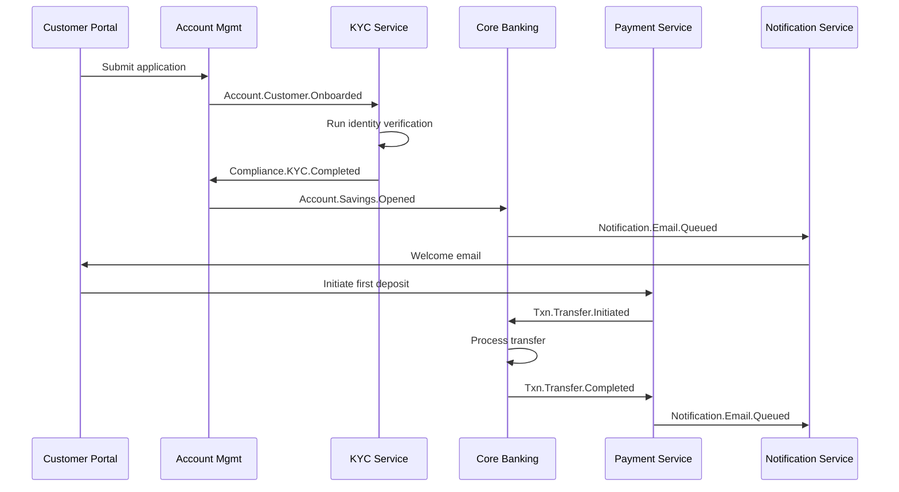
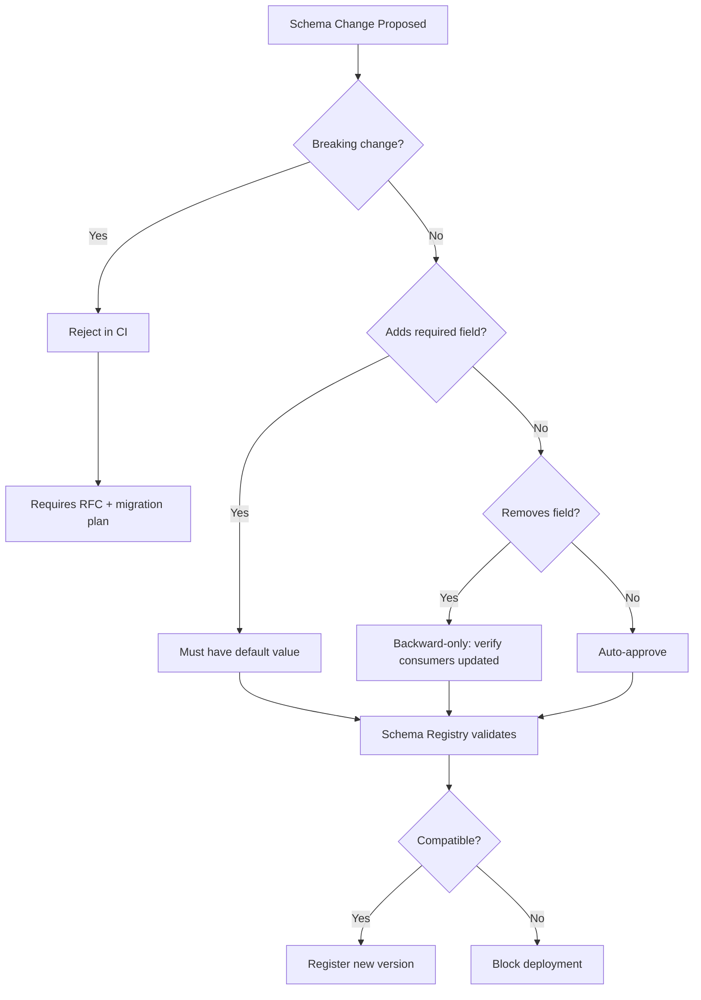
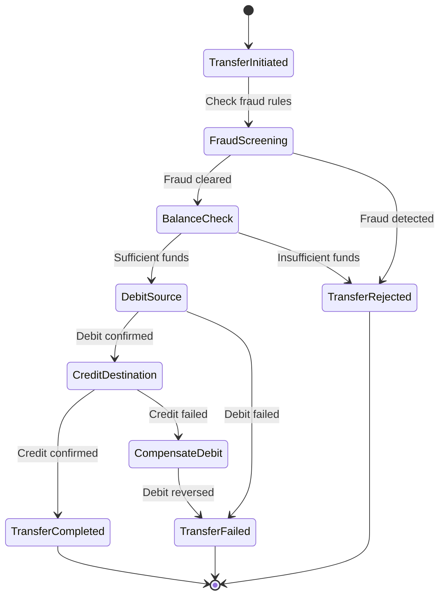

# Event Architecture — Acme Corp Banking Modernization

Event-driven architecture design for Acme Corp's core banking modernization initiative. This document covers the event catalog, broker architecture, schema registry, consistency patterns, CQRS design, and operational excellence for the new platform serving 2.4M retail and commercial banking customers.

---

## S1: Event Catalog & Taxonomy

### Naming Convention

All events follow the `<Domain>.<Entity>.<Action>` pattern with CloudEvents v1.0 envelope.

### Domain Events

| # | Event Name | Type | Aggregate | Bounded Context | Payload Style |
|---|-----------|------|-----------|----------------|---------------|
| 1 | Account.Customer.Onboarded | Domain | Customer | Customer Mgmt | State Transfer |
| 2 | Account.Savings.Opened | Domain | Account | Account Lifecycle | State Transfer |
| 3 | Account.Checking.Opened | Domain | Account | Account Lifecycle | State Transfer |
| 4 | Txn.Transfer.Initiated | Domain | Transaction | Payments | Notification |
| 5 | Txn.Transfer.Completed | Domain | Transaction | Payments | Delta |
| 6 | Txn.Transfer.Failed | Domain | Transaction | Payments | State Transfer |
| 7 | Txn.Payment.Scheduled | Domain | ScheduledPayment | Payments | State Transfer |
| 8 | Fraud.Alert.Raised | Domain | FraudCase | Fraud Detection | State Transfer |
| 9 | Fraud.Alert.Resolved | Domain | FraudCase | Fraud Detection | Delta |
| 10 | Loan.Application.Submitted | Domain | LoanApplication | Lending | State Transfer |
| 11 | Loan.Decision.Rendered | Domain | LoanDecision | Lending | State Transfer |
| 12 | Compliance.KYC.Completed | Integration | KYCProfile | Compliance | State Transfer |
| 13 | Compliance.AML.Flagged | Integration | AMLCase | Compliance | State Transfer |
| 14 | Notification.Email.Queued | Integration | Notification | Notifications | Notification |
| 15 | System.HealthCheck.Failed | System | ServiceHealth | Platform Ops | State Transfer |

### Event Flow — Account Opening to First Transaction



### CloudEvents Envelope

```json
{
  "specversion": "1.0",
  "id": "evt-2026-0312-a1b2c3",
  "source": "/acme/payments/transfer-service",
  "type": "Txn.Transfer.Completed",
  "time": "2026-03-12T14:30:00Z",
  "datacontenttype": "application/json",
  "subject": "acct-00482910",
  "correlationid": "corr-9f8e7d6c",
  "causationid": "evt-2026-0312-x9y8z7",
  "data": {
    "transactionId": "txn-20260312-001",
    "fromAccount": "acct-00482910",
    "toAccount": "acct-00193847",
    "amount": 2500.00,
    "currency": "USD",
    "status": "COMPLETED"
  }
}
```

---

## S2: Message Broker Architecture

### Broker Selection: Apache Kafka (Confluent Cloud)

| Criterion | Requirement | Kafka Fit |
|-----------|------------|-----------|
| Throughput | 12,000 txn/sec peak | Millions msg/sec capacity |
| Replay | Audit trail, regulatory replay | Native log-based retention |
| Ordering | Per-account ordering required | Per-partition guarantee |
| Multi-tenancy | Retail + Commercial isolation | Topic-level separation |
| Durability | Zero message loss for financial txns | acks=all, replication=3 |
| Ops | Small platform team (4 engineers) | Confluent Cloud managed |

### Topic Architecture

| Topic | Partitions | Retention | Compaction | Key |
|-------|-----------|-----------|------------|-----|
| `acme.account.lifecycle` | 24 | 90 days | No | accountId |
| `acme.txn.payments` | 48 | 365 days | No | accountId |
| `acme.fraud.alerts` | 12 | 365 days | No | caseId |
| `acme.compliance.kyc` | 12 | 7 years | Log compaction | customerId |
| `acme.notifications` | 24 | 7 days | No | customerId |
| `acme.system.health` | 6 | 30 days | No | serviceId |

### Kafka Configuration

```yaml
# Producer (financial transactions)
acks: all
min.insync.replicas: 2
enable.idempotence: true
max.in.flight.requests.per.connection: 5
retries: 2147483647
delivery.timeout.ms: 120000

# Consumer (payment processing)
partition.assignment.strategy: cooperative-sticky
auto.offset.reset: earliest
enable.auto.commit: false
max.poll.records: 100
session.timeout.ms: 45000
```

---

## S3: Event Schema Registry

### Registry: Confluent Schema Registry (Avro)

| Schema | Version | Compatibility | Fields |
|--------|---------|--------------|--------|
| `Txn.Transfer.Initiated` | v3 | Backward | transactionId, fromAccount, toAccount, amount, currency, timestamp, metadata |
| `Txn.Transfer.Completed` | v2 | Backward | transactionId, status, completedAt, balanceAfter |
| `Fraud.Alert.Raised` | v4 | Full | caseId, accountId, alertType, riskScore, triggeredBy, details |
| `Account.Savings.Opened` | v2 | Backward | accountId, customerId, accountType, initialDeposit, currency, branch |

### Schema Evolution Rules



### CI/CD Integration

- Every PR modifying `.avsc` files triggers schema compatibility check
- Backward compatibility enforced for all consumer-facing schemas
- Full compatibility enforced for compliance schemas (KYC, AML)
- Schema validation runs in under 3 seconds per schema

---

## S4: Consistency Patterns

### Fund Transfer Saga (Orchestrated)

The core banking transfer flow uses an orchestrated saga with the Transfer Orchestrator coordinating 5 services.



### Compensation Table

| Step | Action | Compensation | Timeout |
|------|--------|-------------|---------|
| 1 | Fraud screening | No compensation needed | 5s |
| 2 | Balance check | No compensation needed | 2s |
| 3 | Debit source account | Credit source account (reverse debit) | 10s |
| 4 | Credit destination account | Debit destination + credit source | 10s |
| 5 | Send confirmation | Queue for retry | 30s |

### Outbox Pattern

All services use the transactional outbox pattern with Debezium CDC relay.

```sql
CREATE TABLE outbox (
    id              UUID PRIMARY KEY DEFAULT gen_random_uuid(),
    aggregate_type  VARCHAR(100) NOT NULL,
    aggregate_id    VARCHAR(100) NOT NULL,
    event_type      VARCHAR(200) NOT NULL,
    payload         JSONB NOT NULL,
    created_at      TIMESTAMPTZ NOT NULL DEFAULT now(),
    published_at    TIMESTAMPTZ NULL
);

CREATE INDEX idx_outbox_unpublished ON outbox (created_at) WHERE published_at IS NULL;
```

### Idempotency

Every consumer implements inbox-based deduplication:

| Consumer | Dedup Key | TTL | Storage |
|----------|----------|-----|---------|
| Payment Processor | transactionId | 72h | PostgreSQL |
| Fraud Engine | alertId + accountId | 24h | Redis |
| Notification Service | eventId + channel | 48h | Redis |
| KYC Processor | customerId + checkType | 7d | PostgreSQL |

---

## S5: CQRS & Event Sourcing

### CQRS for Account Balances

- **Command side:** Account Service processes debits/credits, emits domain events
- **Query side:** Balance Projection Service maintains denormalized balance views

| Read Model | Source Events | Storage | Refresh |
|------------|-------------|---------|---------|
| Account Balance | Transfer.Completed, Transfer.Failed | Redis (hot), PostgreSQL (warm) | Real-time (<500ms) |
| Transaction History | Transfer.* | PostgreSQL + Elasticsearch | Real-time |
| Monthly Statement | Transfer.Completed | S3 (PDF) | Batch (nightly) |
| Fraud Dashboard | Fraud.Alert.* | Elasticsearch | Real-time |

### Event Sourcing: Loan Application Lifecycle

Loan applications use event sourcing for full audit trail (regulatory requirement).

| Event | State Transition | Snapshot Interval |
|-------|-----------------|-------------------|
| Application.Submitted | NEW -> SUBMITTED | - |
| CreditCheck.Completed | SUBMITTED -> ASSESSED | - |
| Decision.Rendered | ASSESSED -> APPROVED/REJECTED | Every 5 events |
| Terms.Generated | APPROVED -> OFFERED | - |
| Offer.Accepted | OFFERED -> ACTIVE | Snapshot |

---

## S6: Operational Excellence

### Dead-Letter Topic Management

| DLT | Source Topic | Alert Threshold | Replay Process |
|-----|-------------|----------------|----------------|
| `acme.txn.payments.DLT` | `acme.txn.payments` | >0 messages (immediate) | Fix consumer -> manual replay -> verify balances |
| `acme.fraud.alerts.DLT` | `acme.fraud.alerts` | >0 messages (immediate) | Escalate to fraud team -> replay after fix |
| `acme.notifications.DLT` | `acme.notifications` | >10 messages (5 min) | Auto-retry 3x -> manual investigation |

### Consumer Lag Monitoring

| Consumer Group | Warning (msgs behind) | Critical | Auto-Scale |
|----------------|----------------------|----------|------------|
| payment-processor | 500 | 2,000 | Yes (max 48 instances) |
| fraud-engine | 200 | 1,000 | Yes (max 12 instances) |
| balance-projection | 1,000 | 5,000 | Yes (max 24 instances) |
| notification-sender | 5,000 | 20,000 | No (rate-limited by email provider) |

### Observability Stack

- **Distributed tracing:** OpenTelemetry with correlationId propagated through Kafka headers
- **Metrics:** Prometheus + Grafana dashboards for producer rate, consumer lag, DLT depth
- **Alerting:** PagerDuty integration for DLT > 0 on financial topics
- **Log aggregation:** ELK stack with structured JSON logging, event replay audit trail

---

## Conclusions

Acme Corp's event-driven architecture handles 12,000 transactions/second at peak with guaranteed ordering per account, zero message loss, and full regulatory audit capability. The orchestrated saga pattern for fund transfers provides clear error handling with automatic compensation. Schema registry with backward compatibility enforcement in CI prevents contract breaks across 14 consumer services.

Key risks to monitor: consumer lag on payment-processor during month-end batch processing, and schema evolution velocity as new product teams onboard.

---

**Autor:** Javier Montano | MetodologIA | 12 de marzo de 2026
