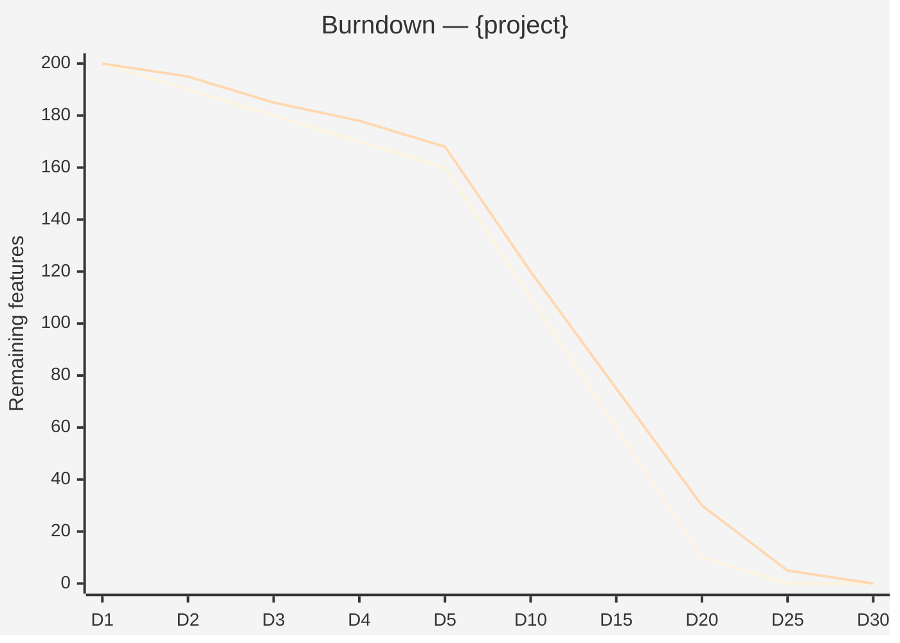
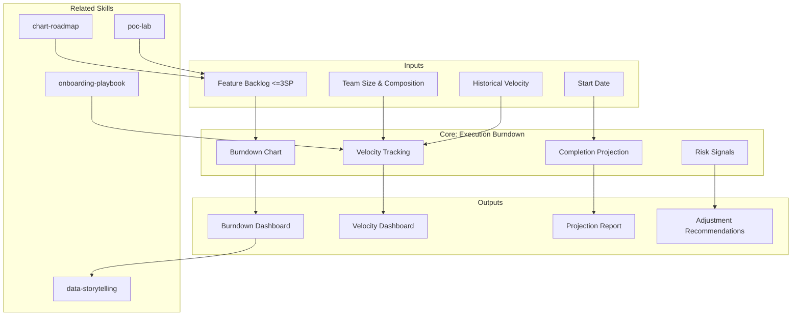

# Execution Burndown: MetodologIA Execution Model

Instruments the MetodologIA productivity model (1 FTE = 1 shippable feature/day) into burndown dashboards,
velocity tracking, and completion projections. Operates at daily sprint level per developer.

## Guiding Principle

**What is not measured is not managed. What is not decomposed is not estimated.**

The burndown is not a pressure tool — it is a **visibility** tool. It enables detecting
deviations early (day 3, not month 3) and adjusting before the project goes off track.

### Execution Philosophy

1. **1-day sprint.** Each developer has 1 day to deliver 1 shippable feature. If they do not deliver, it is a signal — not a failure.
2. **Onboarding is investment, not overhead.** Sprint 1 produces 0.3 features, Sprint 2 produces 0.7, Sprint 3+ produces 1.0. This is NOT slowness — it is a planned learning curve.
3. **Burndown is forecast, not deadline.** The burndown slope projects completion date. If the slope diverges from the plan, scope or team is adjusted — not "squeezed".
4. **Features ≤3 SP or they get decomposed.** The model collapses with large features. The Feature Decomposition Checklist is a prerequisite.

## Inputs

Parse `$1` as **project name**, `$2` as **team size** (number of developers).
Requires: feature backlog (decomposed, ≤3 SP each), team composition, start date.
Optional: historical velocity data, complexity distribution, dependency map.

## Delivery Structure

### S1: Team & Backlog Setup

| Parameter | Value |
|-----------|-------|
| Team | {N} developers |
| Total features | {N} (post-decomposition, ≤3 SP) |
| Start date | {date} |
| Onboarding sprints | {N} days |
| Base productivity factor | 1.0 |

### S2: Burndown Chart (Mermaid)



### S3: Velocity Dashboard

| Sprint (Day) | Planned Features | Delivered Features | Actual Velocity | Factor vs Plan | Status |
|---|---|---|---|---|---|
| Sprint 1 (D1-D5) | {N×0.3/day} | {actual} | {actual/plan} | {factor} | green/yellow/red |
| Sprint 2 (D6-D10) | {N×0.7/day} | {actual} | {actual/plan} | {factor} | green/yellow/red |
| Sprint 3+ (D11+) | {N×1.0/day} | {actual} | {actual/plan} | {factor} | green/yellow/red |

Semaphores: green ≥90% of plan, yellow 70-89%, red <70%

### S4: Completion Projection

```
COMPLETION PROJECTION
═══════════════════════
Remaining backlog: {N} features
Current velocity: {V} features/day (team)
Planned velocity: {N_devs} features/day
Ratio: {V/N_devs × 100}%

Estimated date (actual): {date}
Estimated date (plan): {date}
Deviation: {+/- N} days

Confidence: HIGH (>85% plan) | MEDIUM (70-85%) | LOW (<70%)
```

### S5: Risk Signals

Early deviation signals:
- **Day 3**: If velocity < 50% of plan → FLAG (may be normal onboarding)
- **Day 5**: If velocity < 70% of plan → ALERT (review impediments)
- **Day 10**: If velocity < 80% of plan → ESCALATION (adjust scope or team)
- **Feature blocked >1 day**: IMPEDIMENT — escalate immediately

### S6: Adjustment Recommendations

If burndown diverges from plan:
1. **Scope adjustment**: Which features can be deferred? (MoSCoW reprioritization)
2. **Team adjustment**: Can 1 developer be added? (onboarding cost = 3-5 days)
3. **Feature decomposition**: Are there features >3 SP that slipped through? (re-decompose)
4. **Impediment removal**: What is blocking? (dependencies, environment, knowledge)

## Ramp-up Model

```
Productivity per FTE:
  Sprint 1 (onboarding):  0.3 features/day
  Sprint 2 (ramp-up):     0.7 features/day
  Sprint 3+ (cruise):     1.0 features/day

Team productivity (N devs):
  Sprint 1:  N × 0.3 = {N×0.3} features/day
  Sprint 2:  N × 0.7 = {N×0.7} features/day
  Sprint 3+: N × 1.0 = {N} features/day
```

## When to Use

- After roadmap defines feature backlog (Phase 4)
- When client asks "how long will it take?" or "how many developers do I need?"
- When tracking execution velocity during project delivery
- When projecting completion date from current velocity

## When NOT to Use

- Discovery-only engagements (no execution phase)
- Research/exploration projects (features not decomposable)
- Projects with >50% unknowns (use spikes first)

## Trade-off Matrix

| Decision | Enables | Constrains | When to Use |
|---|---|---|---|
| 1-day sprints | Maximum visibility, fast feedback | Higher ceremony overhead | Teams ≥3 developers, features well-decomposed |
| Weekly sprints | Less overhead | Delayed signal detection | Small teams (1-2), complex features |
| Factor 1.0 baseline | Simple, optimistic | May underestimate complex domains | Greenfield projects, well-known stack |
| Factor 0.7 baseline | Realistic for brownfield | More conservative estimate | Legacy modernization, unfamiliar stack |

## Output Configuration

- **Language**: Spanish (Latin American, business register — simple, clear, concise, direct)
- **Attribution**: Expert committee of the MetodologIA Discovery Framework
- **Tagline**: *"Construido por profesionales, potenciado por la red agéntica de MetodologIA."*

## Validation Gate

- [ ] All features decomposed to ≤3 SP
- [ ] Team size and composition documented
- [ ] Ramp-up curve specified (default or custom)
- [ ] Burndown chart generated with plan vs actual
- [ ] Velocity tracking per sprint
- [ ] Completion projection with confidence level
- [ ] Risk signals defined with thresholds

## Supuestos y Limites

- Todas las features deben estar descompuestas a <=3 SP antes de usar esta skill.
- El modelo de productividad (1 FTE = 1 feature/dia) aplica desde Sprint 3. Sprints 1-2 tienen factores de ramp-up.
- NUNCA usar el burndown como herramienta de presion. Es una herramienta de visibilidad.
- NUNCA producir precios. Solo FTE-meses, magnitudes, cost drivers.

## Casos Borde

| Caso Borde | Estrategia de Manejo |
|---|---|
| Features no descompuestas (>3 SP encontradas en backlog) | Detener la proyeccion. Ejecutar Feature Decomposition Checklist como prerequisito. Re-estimar despues de descomposicion. Documentar features bloqueantes. |
| Equipo con alta rotacion durante ejecucion (>20% turnover) | Ajustar factor de productividad: cada nuevo integrante reinicia en Sprint 1 (0.3). Recalcular proyeccion con equipo efectivo. Recomendar overlap de 1 semana con saliente. |
| Velocity real <50% del plan por mas de 5 dias consecutivos | Activar protocolo de escalacion: revisar impedimentos, dependencias bloqueantes, y complejidad subestimada. No asumir "el equipo se pondra al dia". Proponer scope adjustment o team adjustment inmediato. |
| Proyecto con >50% de features con dependencias externas | El modelo de 1 feature/dia/dev no aplica directamente. Separar features independientes de dependientes. Proyectar solo independientes con burndown; dependientes van a risk register con SLA de resolucion. |

## Decisiones y Trade-offs

| Decision | Justificacion | Alternativa Descartada |
|---|---|---|
| Sprints de 1 dia sobre sprints semanales | Visibilidad maxima: desviaciones se detectan en dia 3, no en semana 3. Feedback loop ultra-rapido. | Sprints semanales: menor ceremonia pero señal de desviacion tardada; proyectos cortos pierden semanas antes de detectar problemas. |
| Factor 1.0 como baseline (1 feature/dia/dev) | Simple, optimista, facil de comunicar. Funciona para greenfield con stack conocido. Se ajusta con factores si la realidad difiere. | Factores complejos por rol/seniority: mas preciso en teoria pero dificil de mantener y comunicar. |
| Ramp-up de 3 sprints (0.3 / 0.7 / 1.0) | Refleja curva de aprendizaje real. Sprint 1 es inversion, no overhead. Establece expectativas realistas desde el dia 1. | Sin ramp-up: sobreestima capacidad inicial; genera frustacion y metricas rojas en primeras semanas. |

## Knowledge Graph



## Output Templates

### Template 1: Execution Burndown Dashboard (Markdown)

**Filename:** `A-04_Execution_Burndown_{project}_{WIP|Aprobado}.md`

```markdown
# Execution Burndown: {project}

## Parametros
| Parametro | Valor |
|---|---|
| Equipo | {N} developers |
| Total features | {N} (post-decomposition, <=3 SP) |
| Fecha inicio | {date} |
| Factor base | 1.0 |

## Burndown Chart
{Mermaid xychart-beta: plan vs actual}

## Velocity Dashboard
| Sprint | Planned | Delivered | Velocity | Factor | Status |
|---|---|---|---|---|---|

## Completion Projection
- Backlog restante: {N} features
- Velocity actual: {V} features/dia
- Fecha estimada: {date}
- Desviacion: {+/- N} dias
- Confianza: HIGH / MEDIUM / LOW

## Risk Signals
| Dia | Signal | Severidad | Accion Recomendada |
|---|---|---|---|

## Ajustes Recomendados
{Scope, team, decomposition, o impediment removal segun corresponda}
```

### Template 3: HTML Dashboard (bajo demanda)
- Filename: `A-04_Execution_Burndown_{project}_{WIP}.html`
- Estructura: HTML self-contained branded (Design System MetodologIA v5). Timeline page con burndown chart interactivo (plan vs actual), velocity semáforo por sprint, y completion projection en tiempo real. WCAG AA, responsive, print-ready.

### Template 4: DOCX Report (bajo demanda)
- Filename: `A-04_Execution_Burndown_{project}_{WIP}.docx`
- Generado con python-docx bajo MetodologIA Design System v5: portada, TOC automático, encabezados/pies de página con marca, tablas zebra, tipografía Poppins (headings navy), Montserrat (body), acentos dorados

### Template 5: PPTX Dashboard (bajo demanda)
- Filename: `{fase}_{entregable}_{cliente}_{WIP}.pptx`
- Generado via python-pptx con MetodologIA Design System v5. Slide master con gradiente navy, títulos Poppins, cuerpo Montserrat, acentos dorados. Máx 20 slides ejecutivo / 30 técnico. Notas del orador con referencias de evidencia. Secciones: Team & Backlog Setup, Burndown Chart (plan vs actual), Velocity Dashboard por Sprint, Completion Projection, Risk Signals & Ajustes Recomendados.

### Template 2: Velocity Report (XLSX-compatible Markdown)

**Filename:** `Velocity_Report_{project}_{sprint}_{WIP|Aprobado}.md`

```markdown
# Velocity Report: {project} - Sprint {N}

## Resumen
| Metrica | Valor |
|---|---|
| Features planeadas | {N} |
| Features entregadas | {N} |
| Velocity ratio | {%} |
| Developers activos | {N} |
| Impedimentos | {N} |

## Detalle por Developer
| Developer | Planeadas | Entregadas | Bloqueadas | Notas |
|---|---|---|---|---|

## Tendencia de Velocity
{Mermaid xychart: velocity por sprint, ultimos 5 sprints}

## Impedimentos Activos
| Impedimento | Desde | Owner | ETA Resolucion |
|---|---|---|---|
```

## Evaluacion

| Dimension | Peso | Criterio |
|---|---|---|
| Trigger Accuracy | 10% | Se activa ante solicitudes de burndown, velocity, tracking de ejecucion, proyeccion de completitud |
| Completeness | 25% | Incluye burndown chart, velocity dashboard, completion projection, risk signals, y ajustes |
| Clarity | 20% | Semaforos con umbrales definidos; proyecciones con nivel de confianza; signals con acciones concretas |
| Robustness | 20% | Maneja features no descompuestas, rotacion de equipo, velocity baja sostenida, dependencias externas |
| Efficiency | 10% | Genera dashboard completo con parametros minimos (proyecto + team size + backlog) |
| Value Density | 15% | Cada metrica tiene interpretacion y accion sugerida; cero datos sin contexto |

**Umbral minimo: 7/10**

## Cross-References

- `metodologia-chart-roadmap` — Produce el feature backlog que alimenta el burndown
- `metodologia-onboarding-playbook` — Modelo de ramp-up (0.3/0.7/1.0) alineado con onboarding
- `metodologia-data-storytelling` — Interpreta las metricas de velocity para audiencia ejecutiva
- `metodologia-poc-lab` — Valida feasibility tecnica antes de comprometer backlog

## Output Artifact

**Primary:** `A-04_Execution_Burndown_{project}.md`

### Diagrams (Mermaid)
- xychart-beta: burndown (plan vs actual)
- Gantt: sprint timeline by developer

---
