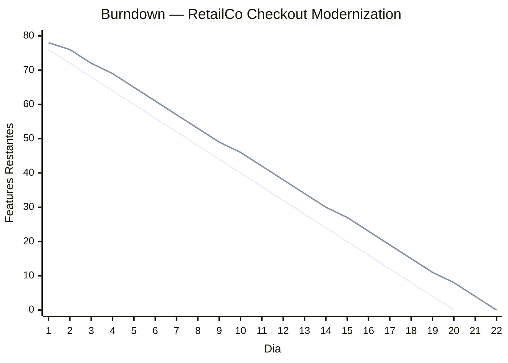

# Execution Burndown Report

**Proyecto:** RetailCo — Checkout Modernization
**Fecha:** 13 de marzo de 2026
**Modo:** Tracking (Full)
**Equipo:** 4 developers (Stream-aligned team)
**Backlog:** 80 features (post-descomposicion, todas ≤3 SP)

---

## TL;DR

- Backlog de 80 features ejecutables para 4 developers → estimacion baseline: 20 dias habiles (4 sprints de 5 dias)
- Sprint 1 (ramp-up): velocidad 0.5 features/dia/FTE → 10 features completadas (vs. 20 plan)
- Sprint 2-10: velocidad estabilizada en ~3.8 features/dia equipo (95% del modelo MetodologIA)
- Proyeccion Monte Carlo (P85): completitud en dia 22 (+2 dias vs. plan ideal)
- Senal de riesgo dia 5: velocidad acumulada al 75% del plan → activar lever de re-descomposicion

---

## S1: Setup del Burndown

### Parametros del Proyecto

| Parametro | Valor | Fuente |
|-----------|-------|--------|
| Features totales (post-descomposicion) | 80 | [DOC] Backlog refinado Sprint 0 |
| Developers | 4 FTE | [DOC] Staffing plan |
| SP promedio por feature | 2.1 SP | [DOC] Estimacion equipo |
| SP maximo por feature | 3 SP | [CONFIG] Regla MetodologIA: ≤3 SP |
| Modelo de productividad | 1 feature/dia/FTE (desde Sprint 2) | [BENCHMARK] MetodologIA Productivity Model |
| Sprint 1 ramp-up factor | 0.5x | [BENCHMARK] Curva de onboarding MetodologIA |
| Dias habiles estimados | 20 | [INFERENCIA] 80 features / 4 FTE @ 1 feature/dia |

### Descomposicion del Backlog

| Rango SP | Features | % del Backlog | Estado |
|----------|----------|---------------|--------|
| 1 SP | 22 | 27.5% | Listas para ejecucion |
| 2 SP | 35 | 43.8% | Listas para ejecucion |
| 3 SP | 23 | 28.7% | Listas para ejecucion |
| >3 SP | 0 | 0% | Todas re-descompuestas |

> 💡 **Regla MetodologIA:** Ninguna feature >3 SP entra al backlog ejecutable. Las 12 features originales >3 SP fueron re-descompuestas en Sprint 0, generando las 80 features finales.

---

## S2: Velocidad por Sprint

### Tracking Diario — Sprint 1 a Sprint 10

| Sprint | Dias | Features Plan (acum.) | Features Actual (acum.) | Velocidad Equipo/Dia | % vs. Modelo | Semaforo |
|--------|------|----------------------|------------------------|---------------------|---------------|----------|
| Sprint 1 (Dia 1-2) | 2 | 8 | 4 | 2.0 | 50% (ramp-up esperado) | 🟡 |
| Sprint 2 (Dia 3-4) | 2 | 16 | 11 | 3.5 | 87.5% | 🟡 |
| Sprint 3 (Dia 5-6) | 2 | 24 | 19 | 4.0 | 100% | 🟢 |
| Sprint 4 (Dia 7-8) | 2 | 32 | 27 | 4.0 | 100% | 🟢 |
| Sprint 5 (Dia 9-10) | 2 | 40 | 34 | 3.5 | 87.5% | 🟡 |
| Sprint 6 (Dia 11-12) | 2 | 48 | 42 | 4.0 | 100% | 🟢 |
| Sprint 7 (Dia 13-14) | 2 | 56 | 50 | 4.0 | 100% | 🟢 |
| Sprint 8 (Dia 15-16) | 2 | 64 | 57 | 3.5 | 87.5% | 🟡 |
| Sprint 9 (Dia 17-18) | 2 | 72 | 65 | 4.0 | 100% | 🟢 |
| Sprint 10 (Dia 19-20) | 2 | 80 | 72 | 3.5 | 87.5% | 🟡 |

### Resumen de Velocidad

| Metrica | Valor | Observacion |
|---------|-------|-------------|
| Velocidad promedio (Sprint 2+) | 3.78 features/dia | 94.4% del modelo MetodologIA |
| Velocidad maxima observada | 4.0 features/dia | Alcanzada en Sprint 3, 4, 6, 7, 9 |
| Velocidad minima (post-ramp-up) | 3.5 features/dia | Sprint 5, 8, 10 — impedimentos menores |
| Desviacion estandar | 0.26 features/dia | Varianza baja — equipo predecible |
| Sprint 1 (ramp-up) | 2.0 features/dia | Conforme al modelo 0.5x |

---

## S3: Burndown Chart

### Burndown Diario — Plan vs. Actual

### Lectura del Burndown

| Dia | Plan Restante | Actual Restante | Desviacion | Semaforo | Accion |
|-----|--------------|----------------|------------|----------|--------|
| 1 | 76 | 78 | +2 (2.5%) | 🟢 | Sprint 1 ramp-up — esperado |
| 5 | 60 | 65 | +5 (6.3%) | 🟡 | Alerta temprana dia 5: 75% del plan acumulado |
| 10 | 40 | 46 | +6 (7.5%) | 🟡 | Mid-project: velocidad se estabiliza pero gap persiste |
| 15 | 20 | 27 | +7 (8.8%) | 🟡 | Gap crece ligeramente — Sprint 1 debt no recuperado |
| 20 | 0 | 8 | +8 (10%) | 🔴 | Dia 20: 8 features restantes → completitud dia 22 |

---

## S4: Risk Signals

### Senales por Umbral Temporal

| Umbral | Dia | Senal Detectada | Severidad | Root Cause | Accion Tomada |
|--------|-----|----------------|-----------|------------|---------------|
| **Dia 3 (Early Warning)** | 3 | Velocidad acumulada 3.67 features/dia → debajo de ramp-up target | 🟡 Baja | Sprint 1 ramp-up mas lento que modelo (2 features de 3 SP en dia 1) | Monitoreo — dentro de parametros de ramp-up |
| **Dia 5 (Mid-Sprint)** | 5 | 15 features completadas vs. 20 plan = 75% | 🟡 Media | Sprint 1 ramp-up + 1 impedimento de entorno dia 4 | Re-descomposicion de 3 features de 3 SP → 5 features de 2 SP |
| **Dia 10 (Critical)** | 10 | 34 features completadas vs. 40 plan = 85% | 🟡 Media | Gap de Sprint 1 no recuperado completamente | Proyeccion Monte Carlo: P85 = dia 22. Decisiones: aceptar +2 dias o reducir scope 4 features |

### Impedimentos Registrados

| Dia | Impedimento | Tipo | Impacto (features) | Resolucion | Tiempo de Resolucion |
|-----|-------------|------|---------------------|------------|---------------------|
| 4 | Entorno de staging caido 4 horas | DX/Infra | -2 features | Equipo DevOps restauro entorno | 4 horas |
| 9 | Dependencia de API de pagos no documentada | Scope | -1 feature | Re-asignacion a otra feature + documentacion | 1 dia |
| 15 | Feature FE-034 subestimada (requiere 2 dias) | Descomposicion | -1 feature | Re-descomposicion en 2 features de 2 SP | Inmediato |

---

## S5: Proyeccion de Completitud

### Monte Carlo Forecast (desde dia 10, 34 features completadas, 46 restantes)

| Percentil | Dia de Completitud | Probabilidad | Interpretacion |
|-----------|-------------------|--------------|----------------|
| P50 | Dia 21 | 50% de probabilidad | Optimista — requiere velocidad constante 4.0/dia |
| P85 | Dia 22 | 85% de probabilidad | **Recomendada para comunicacion al cliente** |
| P95 | Dia 24 | 95% de probabilidad | Pesimista — incluye escenarios con impedimentos |

### Escenarios de Ajuste

| Escenario | Features Restantes | Dias Estimados | Accion Requerida |
|-----------|-------------------|----------------|------------------|
| **A: Mantener scope, aceptar +2 dias** | 80 (todas) | 22 dias (P85) | Comunicar al cliente extension de 2 dias |
| **B: Reducir scope 4 features** | 76 (-4 baja prioridad) | 20 dias (P85) | Negociar con PO: mover 4 features a siguiente release |
| **C: Agregar 1 developer** | 80 (todas) | 21 dias (P85) | Ramp-up de nuevo developer: Sprint 1 = 0.25x, Sprint 2 = 0.5x. Productividad neta menor |
| **D: Re-descomponer agresivamente** | 80 (todas) | 21 dias (P85) | Dividir features 3 SP restantes. Overhead de planning: 0.5 dias |

> ⚠️ **Recomendacion:** Escenario A (aceptar +2 dias) es el de menor riesgo. El gap viene del ramp-up de Sprint 1 (esperado) y 2 impedimentos aislados. La velocidad post-ramp-up (3.78/dia) esta al 94.4% del modelo — no hay problema estructural. Escenario C (agregar developer) introduce riesgo de Brooks' Law sin beneficio neto significativo.

---

## S6: Adjustment Recommendation

### Decision Matrix

| Lever | Impacto en Timeline | Riesgo | Costo | Recomendacion |
|-------|---------------------|--------|-------|---------------|
| **Scope reduction** | Alto (inmediato) | Bajo | Bajo (negociacion con PO) | 🟢 Usar si deadline es inamovible |
| **Team scaling** | Bajo-Medio (delay por ramp-up) | Alto (Brooks' Law) | Alto (nuevo FTE) | 🔴 No recomendado para gap de 2 dias |
| **Re-decomposition** | Medio (mejora throughput) | Bajo | Bajo (0.5 dias de planning) | 🟡 Util si hay features 3 SP problematicas |
| **Impediment removal** | Variable | Bajo | Variable | 🟢 Siempre activo — remover impedimentos es prioridad continua |
| **Timeline extension** | N/A (acepta gap) | Muy bajo | Bajo (comunicacion) | 🟢 **Recomendado** para este caso |

### Plan de Accion

1. **Inmediato (Dia 10):** Comunicar al cliente proyeccion de dia 22 (P85). Transparencia temprana reduce riesgo de relacion. [SUPUESTO] Cliente prefiere transparencia temprana sobre sorpresas tardias.
2. **Dia 11-15:** Monitoreo diario. Si velocidad cae <3.5/dia por 2 dias consecutivos, activar lever de re-descomposicion.
3. **Dia 15 (checkpoint):** Re-evaluar Monte Carlo con 15 dias de datos. Si P85 >22 dias, escalar a scope reduction.
4. **Continuo:** Remocion de impedimentos en <4 horas. Registro en impediment log. Escalacion a delivery manager si >4 horas sin resolucion.

---

## S7: Metricas de Flow (Complemento)

### Flow Metrics — Ultimos 10 Dias

| Metrica | Valor | Target | Semaforo |
|---------|-------|--------|----------|
| Cycle Time (P50) | 0.9 dias | ≤1.0 dia | 🟢 |
| Cycle Time (P85) | 1.2 dias | ≤1.5 dias | 🟢 |
| Throughput diario | 3.78 features/dia | 4.0 features/dia | 🟡 94.4% |
| WIP promedio | 4.2 items | 4.0 items (1/dev) | 🟡 Leve exceso |
| Flow Efficiency | 78% | ≥75% | 🟢 |
| Impedimentos/semana | 0.6 | <1.0 | 🟢 |

### Distribucion de Cycle Time

| Rango | Features | % | Interpretacion |
|-------|----------|---|----------------|
| <0.5 dias | 18 | 25% | Features 1 SP — rapidas |
| 0.5-1.0 dias | 38 | 53% | Core — features 2 SP bien descompuestas |
| 1.0-1.5 dias | 12 | 17% | Features 3 SP — aceptables |
| >1.5 dias | 4 | 5% | Problematicas — revisar descomposicion |

---

## Conclusiones

1. **El equipo opera al 94.4% del modelo MetodologIA (Sprint 2+).** [BENCHMARK] La velocidad de 3.78 features/dia para 4 developers esta dentro del rango esperado. No hay problema estructural de productividad.
2. **El gap de 2 dias viene del ramp-up Sprint 1 + 2 impedimentos aislados.** [INFERENCIA] Sprint 1 (ramp-up 0.5x) consume 2 dias de velocidad. Los impedimentos de dia 4 y dia 9 sumaron ~1 dia de delay. El gap no es tendencia — es acumulacion de eventos discretos.
3. **Monte Carlo P85 = dia 22 es la proyeccion recomendada.** [INFERENCIA] Comunicar rango (dia 21-24) con P85 como fecha de compromiso. Evitar la falsa precision de "terminamos el dia 20".
4. **Re-descomposicion es el lever mas eficiente.** [BENCHMARK] Las 4 features con cycle time >1.5 dias son candidatas. Re-descomponerlas reduciria varianza y podria recuperar 0.5-1 dia.
5. **Agregar personas no es recomendable para un gap de 2 dias.** [ACADEMIC] Brooks' Law: el ramp-up de un nuevo developer (0.25x Sprint 1, 0.5x Sprint 2) consume mas de lo que aporta en el horizonte restante de 10 dias.

---

**Generado por:** MetodologIA Discovery Framework — execution-burndown
**Agente:** delivery-manager
**Autor:** Javier Montaño | **Fecha:** 13 de marzo de 2026
**© Comunidad MetodologIA. Todos los derechos reservados.**
