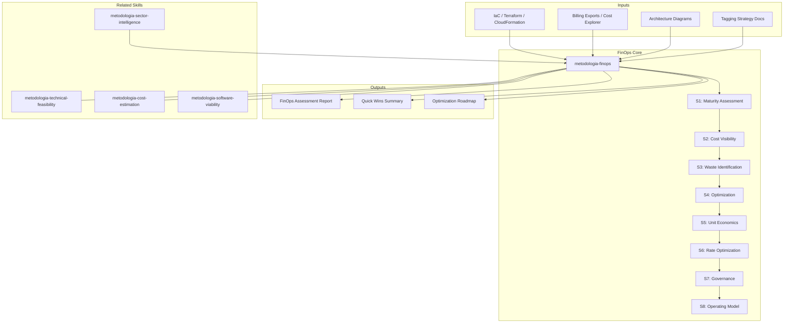

# FinOps — Cloud Financial Operations

Generates cloud financial operations assessment and strategy: FinOps maturity evaluation (Crawl/Walk/Run), cost visibility analysis, optimization opportunity identification, governance model design, and unit economics framework.

## Guiding Principle

> *Cloud cost is not an infrastructure problem — it is a business problem. Every cloud unit of spend must trace to a business value or be eliminated.*

1. **Visibility before optimization.** You cannot optimize what you do not measure. The first step is always: who spends how much on what and why?
2. **Unit economics over absolute spend.** "Large monthly cloud spend" says nothing. "Cost per transaction processed" is actionable. All spend must be expressed in business units.
3. **FinOps is culture, not tooling.** Cost management tools without distributed accountability only produce dashboards nobody looks at.

## Inputs

- `$1` — Path to cloud infrastructure analysis (IaC, billing exports, architecture diagrams)
- `$2` — Assessment scope: `full` (default), `assessment` (current state only), `optimization` (recommendations only)

Parse from `$ARGUMENTS`.

**Parameters:**
- `{MODO}`: `piloto-auto` (default) | `desatendido` | `supervisado` | `paso-a-paso`
- `{FORMATO}`: `markdown` (default) | `html` | `dual` | `xlsx` (cost breakdowns)
- `{MODO_OPERACIONAL}`: `assessment` (default, current cloud cost analysis) | `optimization` (cost reduction plan with ROI) | `framework` (FinOps practice design from scratch)
- `{VARIANTE}`: `ejecutiva` (~40% — cost summary + top 5 optimizations) | `técnica` (full, default)

## Input Requirements

**Mandatory:**
- Cloud provider(s) in use (AWS, Azure, GCP, multi-cloud)
- Infrastructure-as-Code or architecture description (Terraform, CloudFormation, ARM, diagrams)

**Recommended:**
- Billing data or Cost Explorer exports (last 3-6 months)
- Resource tagging strategy documentation
- Current cost allocation model
- Cloud architecture diagrams
- Reserved instance / savings plan inventory
- Auto-scaling configurations

## Assumptions & Limits

**Assumptions:**
- At least one major cloud provider (AWS/Azure/GCP)
- Monthly cloud spend above the threshold where FinOps overhead produces net savings
- Organization has engineering teams managing cloud resources

**Cannot do:**
- Access live billing APIs (works with exported data or IaC analysis)
- Negotiate contracts with cloud providers
- Implement changes in cloud accounts
- Provide exact monetary predictions (provides magnitude estimates and percentages)

## Workarounds When Inputs Missing

| Missing Input | Impact | Workaround |
|---|---|---|
| No billing data | Cannot quantify waste | Analyze IaC for anti-patterns (oversized instances, no auto-scaling, no spot); flag as [INFERENCIA] |
| No tagging strategy | Cannot allocate costs | Propose tagging taxonomy based on org structure |
| No architecture diagrams | Cannot identify optimization targets | Reverse-engineer from IaC; flag confidence level |
| No reservation data | Cannot assess commitment coverage | Analyze usage patterns from IaC for commitment recommendations |

## Edge Cases

- **Multi-cloud:** Separate analysis per provider + cross-cloud optimization (workload placement).
- **Startup/fast growth:** Focus on unit economics and auto-scaling, not reservations (demand unpredictable).
- **Regulated industry:** Data residency constraints limit optimization options. Document compliance impact on cost.
- **Kubernetes/containerized:** Focus on cluster rightsizing, namespace cost allocation, spot/preemptible for stateless.
- **Serverless-heavy:** Focus on invocation optimization, memory/duration tuning, cold start cost.
- **No engineering ownership:** FinOps framework mode — establish accountability first, optimize second.

## Trade-off Matrix

| Decision | Enables | Constrains | When to Use |
|---|---|---|---|
| **Full assessment** | Complete visibility + optimization plan | 4-6 days, requires billing data | Annual FinOps review, cloud migration planning |
| **Optimization-only** | Quick wins, immediate savings | Misses governance/culture gaps | Known waste, need fast ROI |
| **Framework design** | Sustainable practice, long-term value | No immediate savings | Greenfield FinOps, post-reorg |

## 8-Section Framework

### S1: FinOps Maturity Assessment
Evaluate against FinOps Foundation Crawl/Walk/Run model across 6 domains:
- **Understand:** Cost visibility, allocation, reporting
- **Quantify:** Budgeting, forecasting, benchmarking
- **Optimize:** Rightsizing, rate optimization, usage optimization
- **Govern:** Policies, guardrails, anomaly detection
- **Organize:** Team structure, RACI, training
- **Culture:** Accountability, collaboration between engineering/finance/business

Score each domain 1-5. Composite maturity level.

### S2: Cost Visibility & Allocation
Current cost breakdown: by service, by team/product, by environment (prod/staging/dev). Untagged spend %. Cost allocation model assessment. Tagging taxonomy recommendation.

### S3: Waste Identification
Per category: idle resources, oversized instances, unattached storage, unused reservations, over-provisioned databases, zombie resources. Estimated monthly waste per category. Total waste as % of spend.

### S4: Optimization Opportunities
Three tiers:
- **Quick Wins (0-30 days):** Rightsizing, delete unused, schedule non-prod. Expected savings %.
- **Medium-term (1-3 months):** Reserved instances/savings plans, spot/preemptible adoption, architecture changes.
- **Strategic (3-12 months):** Multi-cloud arbitrage, serverless migration, platform consolidation.

Per opportunity: estimated savings, implementation effort, risk, ROI timeline.

### S5: Unit Economics Framework
Define cost-per-business-unit metrics: cost per transaction, cost per user, cost per API call, cost per GB processed. Map infrastructure cost to business value. Trend analysis if historical data available.

### S6: Rate Optimization Strategy
Reservation/savings plan coverage analysis. Commitment vs. on-demand ratio. Spot/preemptible strategy for eligible workloads. EDP/PPA (Enterprise Discount Program/Private Pricing Agreement) assessment.

### S7: Governance & Guardrails
Budget policies, alerting thresholds, anomaly detection rules, approval workflows for high-cost resources, tagging enforcement, cost review cadence, escalation matrix.

### S8: FinOps Operating Model
Team structure (centralized, embedded, federated). RACI for cost decisions. Reporting cadence and audience. Tool recommendations. Training plan for engineering teams.

## Casos Borde

| Caso | Estrategia de Manejo |
|------|---------------------|
| Organizacion con zero tagging y zero billing exports | Analisis basado exclusivamente en IaC; toda recomendacion marcada [INFERENCIA]; proponer tagging taxonomy como prerequisito antes de optimizacion |
| Migracion multi-cloud activa (workloads moviendose entre proveedores) | Congelar analisis en snapshot temporal; separar recomendaciones por cloud destino; agregar capa de arbitraje cross-cloud |
| Startup en hyper-growth con costos duplicandose cada trimestre | Priorizar unit economics y auto-scaling sobre reservaciones; enfocar en costo por transaccion, no en gasto absoluto |
| Organizacion con contratos enterprise (EDP/PPA) ya firmados | Analizar dentro de restricciones contractuales; enfocar optimizacion en rightsizing y waste, no en rate optimization |

## Decisiones y Trade-offs

| Decision | Alternativa Descartada | Justificacion |
|----------|----------------------|---------------|
| Expresar costos en magnitudes y porcentajes, nunca en valores exactos | Reportar cifras exactas de billing | Los valores exactos caducan rapidamente y crean compromisos contractuales implicitos; las magnitudes son accionables sin ser vinculantes |
| Evaluar madurez FinOps con el modelo Crawl/Walk/Run de FinOps Foundation | Crear modelo de madurez propietario | El framework de FinOps Foundation es el estandar de la industria; usar otro reduce comparabilidad con benchmarks externos |
| Incluir unit economics como seccion mandatoria | Limitarse a analisis de gasto absoluto | El gasto absoluto sin contexto de negocio no permite tomar decisiones; costo por transaccion es la metrica que conecta infra con valor |
| Separar modos operacionales (assessment/optimization/framework) | Un unico flujo monolitico para todos los casos | Cada modo tiene audiencia y profundidad distintas; forzar el analisis completo cuando solo se necesita quick wins desperdicia tiempo |

## Knowledge Graph



## Output Templates

**Formato MD (default):**

```
# FinOps Assessment — {proyecto}
## Resumen Ejecutivo
> Hallazgo clave en 3 lineas.
## S1: Evaluacion de Madurez FinOps
| Dominio | Score (1-5) | Evidencia | Recomendacion |
|---------|-------------|-----------|---------------|
## S2-S8: [secciones completas]
## Roadmap de Optimizacion
```mermaid
gantt
    title Roadmap FinOps
    section Quick Wins
    ...
```
## Apendice: Datos de Soporte
```

**Formato XLSX (para audiencia financiera):**

```
Hoja 1: Resumen Ejecutivo (madurez + top 5 optimizaciones)
Hoja 2: Desglose de Costos por Servicio/Equipo/Ambiente
Hoja 3: Inventario de Waste con Ahorro Estimado (%)
Hoja 4: Oportunidades de Optimizacion (esfuerzo x impacto)
Hoja 5: Unit Economics (costo por transaccion/usuario/API call)
Hoja 6: Roadmap de Implementacion con Timeline
```

**Formato HTML (bajo demanda):**
- Filename: `FinOps_Assessment_{project}_{WIP}.html`
- Estructura: HTML self-contained branded (Design System MetodologIA v5). Light-First Technical page con maturity radar chart, waste breakdown interactivo, y optimization roadmap con filtros por tier. WCAG AA, responsive, print-ready.

**Formato DOCX (bajo demanda):**
- Filename: `FinOps_Assessment_{project}_{WIP}.docx`
- Generado con python-docx bajo Metodología Design System v5: portada, TOC automático, encabezados/pies de página con marca, tablas zebra, tipografía Poppins (headings navy), Montserrat (body), acentos dorados

**Formato PPTX (bajo demanda):**
- Filename: `{fase}_{entregable}_{cliente}_{WIP}.pptx`
- Generado via python-pptx con MetodologIA Design System v5. Slide master con gradiente navy, títulos Poppins, cuerpo Montserrat, acentos dorados. Máx 20 slides ejecutivo / 30 técnico. Notas del orador con referencias de evidencia. Secciones: FinOps Maturity Assessment, Cost Visibility & Waste Identification, Top Optimization Opportunities (Quick Wins / Medium / Strategic), Unit Economics, Governance & Operating Model, Roadmap de Implementación.

## Evaluacion

| Dimension | Peso | Criterio | Umbral Minimo |
|-----------|------|----------|---------------|
| Trigger Accuracy | 10% | El skill se activa correctamente ante prompts de FinOps, cloud cost, rightsizing | 7/10 |
| Completeness | 25% | Las 8 secciones estan pobladas con contenido basado en evidencia; unit economics definidos | 7/10 |
| Clarity | 20% | Ejecutivos no tecnicos pueden entender el resumen; costos expresados en magnitudes con contexto | 7/10 |
| Robustness | 20% | Edge cases cubiertos (multi-cloud, serverless, no billing data); workarounds documentados | 7/10 |
| Efficiency | 10% | El modo operacional correcto se selecciona segun contexto; no se genera analisis innecesario | 7/10 |
| Value Density | 15% | Cada optimizacion tiene ahorro estimado (%), esfuerzo, y timeline; zero recomendaciones genericas | 7/10 |

**Umbral minimo global: 7/10.** Si alguna dimension cae por debajo, el entregable requiere revision antes de entrega.

## Cross-Section Traceability

- S1 Maturity → S8 Operating Model (maturity gaps drive practice design)
- S2 Visibility → S3 Waste (visibility enables waste identification)
- S3 Waste → S4 Optimization (waste categories map to optimization actions)
- S4 Optimization → S5 Unit Economics (optimizations improve unit economics)
- S5 Unit Economics → S7 Governance (unit economics define budget thresholds)
- S6 Rate Optimization → S4 Optimization (rate optimization is a subset)
- S7 Governance → S8 Operating Model (governance requires organizational support)

## Escalation to Human

- Cloud spend at enterprise scale (enterprise-grade negotiation needed)
- Multi-cloud with no centralized visibility (requires FinOps platform selection)
- Engineering teams resistant to cost accountability (organizational change needed)
- Compliance constraints that conflict with optimization (legal review needed)
- Contract renegotiation opportunity (commercial/legal expertise)

## Execution Workflow

1. **Data Collection (1-2 hours):** Gather billing exports, IaC, architecture docs, tagging info
2. **Maturity & Visibility (2-3 hours):** Score maturity, map cost allocation, identify gaps
3. **Analysis (3-5 hours):** Waste identification, optimization opportunities, rate analysis, unit economics
4. **Strategy (2-3 hours):** Governance model, operating model, implementation roadmap

**Typical engagement:** 3-5 days for organizations with moderate cloud spend.

## Output Configuration

- **Language**: Spanish (Latin American, business register — simple, clear, concise, direct)
- **Attribution**: Expert committee of the MetodologIA Discovery Framework
- **Tagline**: *"Construido por profesionales, potenciado por la red agéntica de MetodologIA."*

## Output Artifact

**Primary:** `FinOps_Assessment_{project}.md` (or `.html` if `{FORMATO}=html|dual`) — Full 8-section FinOps assessment with cost breakdowns, optimization roadmap, and governance model.

**Secondary:** `FinOps_QuickWins_{project}.md` — Executive summary (S3 waste + S4 quick wins + estimated savings).

**Diagrams included:**
- Quadrant chart: optimization opportunities (savings potential x implementation effort)
- Mindmap: cost allocation taxonomy
- Gantt chart: optimization implementation timeline

## Validation Gate

- [ ] All 8 sections populated with evidence-based content
- [ ] Cost figures expressed in magnitudes, NEVER exact prices
- [ ] Every optimization opportunity has estimated savings % and effort level
- [ ] Unit economics defined with business-relevant metrics
- [ ] Governance model is actionable (not just "tag resources")
- [ ] FinOps maturity scored with observable evidence
- [ ] Cross-section traceability complete

## Output Format Protocol

| Format | Default | Description |
|--------|---------|-------------|
| `markdown` | Yes | Rich Markdown + Mermaid diagrams. Token-efficient. |
| `html` | On demand | Branded HTML (Design System). Visual impact. |
| `dual` | On demand | Both formats. |
| `xlsx` | On demand | Cost breakdown sheets (recommended for finance audience). |

## Operational Modes

| Mode | Focus | Best For |
|---|---|---|
| `assessment` (default) | Full 8-section analysis | Annual review, Phase 1/4 input |
| `optimization` | S3 + S4 + S6 deep, ROI-focused | Known waste, need quick savings |
| `framework` | S1 + S7 + S8 deep, practice design | Greenfield FinOps implementation |

## Additional Resources

### References (Progressive Disclosure — Level 3)
- `Read ${CLAUDE_SKILL_DIR}/references/knowledge-graph.mmd` — Domain knowledge graph
- `Read ${CLAUDE_SKILL_DIR}/references/body-of-knowledge.md` — Academic and industry sources
- `Read ${CLAUDE_SKILL_DIR}/references/state-of-the-art.md` — Trends 2024-2026

### Examples
- `Read ${CLAUDE_SKILL_DIR}/examples/sample-output.md` — Golden reference output
- `Read ${CLAUDE_SKILL_DIR}/examples/sample-output.html` — Branded HTML
- `Read ${CLAUDE_SKILL_DIR}/examples/sample-output.xlsx-spec.md` — Excel spec for cost data

### Prompts
- `Read ${CLAUDE_SKILL_DIR}/prompts/use-case-prompts.md` — Ready-to-use prompts
- `Read ${CLAUDE_SKILL_DIR}/prompts/metaprompts.md` — Meta-strategies

---
