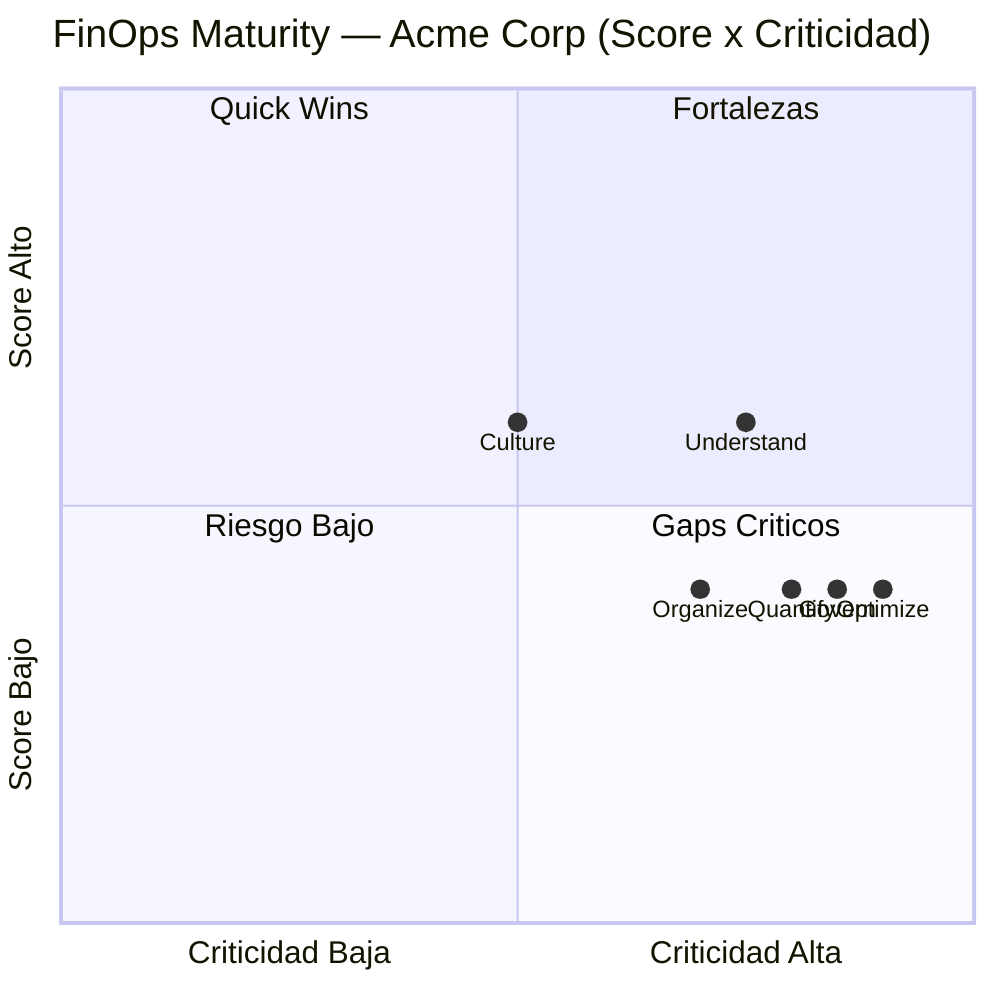
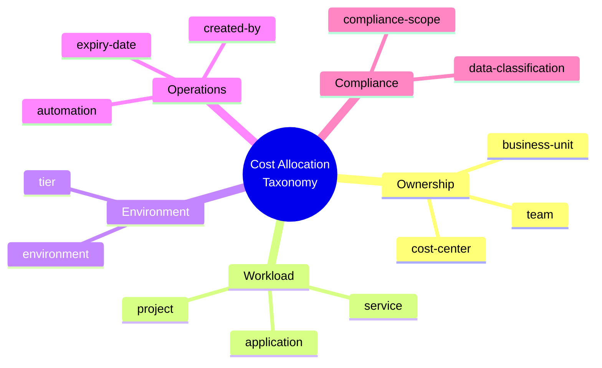
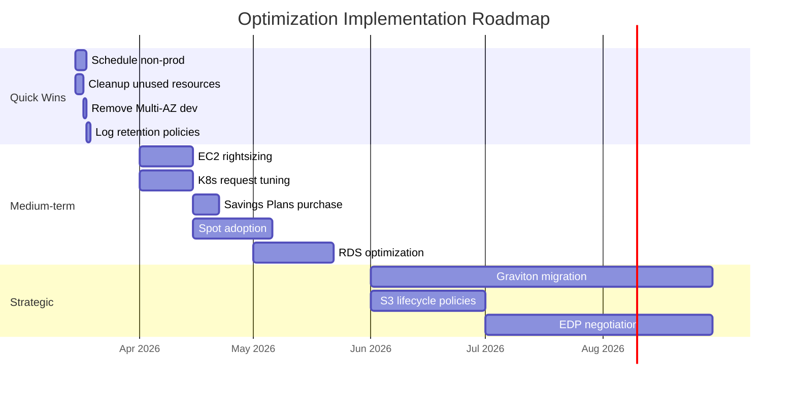

# FinOps Assessment — Acme Corp Digital Platform

Evaluacion integral de Cloud Financial Operations para la plataforma digital de Acme Corp. La organizacion opera en AWS (primario) y Azure (servicios Microsoft), con un gasto cloud mensual en el rango de magnitud de **$150K-$250K/mes**. Este documento cubre las 8 secciones del framework FinOps: madurez, visibilidad, waste, optimizacion, unit economics, rate optimization, governance, y modelo operativo.

---

## TL;DR

- Madurez FinOps global: **2.3/5 (Crawl avanzado)** — visibilidad parcial, sin unit economics, governance reactiva
- Waste identificado: magnitud de **$30K-$50K/mes** (20-25% del gasto total)
- Quick wins (0-30 dias): reduccion estimada de **12-18%** del gasto actual
- Coverage de compromisos: **35%** (benchmark optimo: 55-70%)
- Recomendacion: transicion a Walk maturity en 6 meses con enfoque en visibilidad + quick wins primero

---

## S1: FinOps Maturity Assessment

Evaluacion contra el modelo Crawl/Walk/Run de la FinOps Foundation en 6 dominios:

| Dominio | Score | Nivel | Evidencia |
|---------|-------|-------|-----------|
| **Understand** (visibility, reporting) | 3/5 | Walk | Cost Explorer activo, tagging parcial (62% tagged), dashboards basicos en CloudWatch. No hay allocation por producto. [CONFIG] |
| **Quantify** (budgets, forecasting) | 2/5 | Crawl | Budgets definidos a nivel cuenta, no a nivel equipo/producto. Forecasting manual en spreadsheets. [DOC] |
| **Optimize** (rightsizing, rate) | 2/5 | Crawl | Rightsizing reactivo (solo cuando hay queja de performance). RIs compradas hace 18 meses sin revision. [INFERENCIA] |
| **Govern** (policies, anomalies) | 2/5 | Crawl | Alertas de billing a 80% y 100% del budget mensual. No hay anomaly detection. No hay approval workflow para recursos costosos. [CONFIG] |
| **Organize** (team, RACI) | 2/5 | Crawl | No hay equipo FinOps dedicado. El Cloud Architect revisa costos "cuando puede" (~2h/semana). [STAKEHOLDER] |
| **Culture** (accountability) | 3/5 | Walk | Engineering leads ven el dashboard mensual. CTO menciona costos en all-hands. Pero no hay incentivos ni KPIs de costo por equipo. [STAKEHOLDER] |

**Composite Score: 2.3/5 — Crawl Avanzado**

> **Hallazgo clave:** La cultura (3/5) supera a los procesos (2/5). Esto es positivo — indica que la organizacion esta dispuesta pero carece de herramientas y procesos. La mejora de procesos tendra adopcion mas rapida.

---

## S2: Cost Visibility & Allocation

### Breakdown por Servicio (Top 10)

| # | Servicio AWS | % del Gasto | Magnitud Mensual | Tendencia 6M |
|---|-------------|-------------|------------------|--------------|
| 1 | EC2 (instances + EBS) | 38% | $55K-$95K | Estable |
| 2 | RDS (PostgreSQL, MySQL) | 18% | $25K-$45K | +12% |
| 3 | EKS + Fargate | 14% | $20K-$35K | +25% |
| 4 | S3 + CloudFront | 8% | $12K-$20K | +8% |
| 5 | Lambda + API Gateway | 6% | $9K-$15K | +15% |
| 6 | ElastiCache (Redis) | 5% | $7K-$12K | Estable |
| 7 | Azure (M365 + AD) | 4% | $6K-$10K | Estable |
| 8 | Data Transfer | 3% | $4K-$7K | +5% |
| 9 | CloudWatch + Logs | 2% | $3K-$5K | +20% |
| 10 | Otros (40+ servicios) | 2% | $3K-$5K | Variable |

### Breakdown por Equipo/Producto

| Equipo | % del Gasto | Confidence | Metodo |
|--------|-------------|------------|--------|
| Plataforma Core | 42% | Alta | Tag: team=platform [CONFIG] |
| Pagos | 22% | Alta | Tag: team=payments [CONFIG] |
| Marketplace | 15% | Media | Tag parcial, estimacion por VPC [INFERENCIA] |
| Data & Analytics | 12% | Media | Tag parcial, estimacion por cuenta [INFERENCIA] |
| **Sin asignar** | **9%** | — | Recursos sin tag team [CONFIG] |

### Breakdown por Entorno

| Entorno | % del Gasto | Observacion |
|---------|-------------|-------------|
| Production | 58% | Esperado |
| Staging | 22% | **Alto** — deberia ser 10-15% |
| Development | 14% | **Alto** — deberia ser 5-10% |
| Sandbox | 6% | Aceptable si hay uso activo |

> **Hallazgo critico:** Staging + Dev consumen 36% del gasto total. El benchmark es 15-25%. Magnitud de waste potencial: $15K-$30K/mes solo por entornos no-productivos sin gestion de horarios.

### Tagging Assessment

| Metrica | Valor | Benchmark |
|---------|-------|-----------|
| % recursos tagged (al menos 1 tag) | 78% | >95% |
| % recursos con tag `team` | 62% | >90% |
| % recursos con tag `environment` | 71% | >95% |
| % recursos con tag `project` | 45% | >85% |
| % gasto sin allocation posible | 9% | <3% |

**Taxonomia recomendada:**

---

## S3: Waste Identification

### Waste por Categoria

| # | Categoria | Cant. Recursos | Magnitud Waste/Mes | % del Total | Confianza |
|---|-----------|---------------|-------------------|-------------|-----------|
| 1 | **Instancias oversized** | 23 EC2, 4 RDS | $8K-$15K | 5-8% | Alta [CONFIG] |
| 2 | **Non-prod sin schedule** | 47 instancias | $8K-$14K | 5-7% | Alta [CONFIG] |
| 3 | **EBS volumes unattached** | 34 volumes (2.1 TB) | $2K-$4K | 1-2% | Alta [CONFIG] |
| 4 | **Elastic IPs sin uso** | 12 EIPs | <$1K | <1% | Alta [CONFIG] |
| 5 | **Snapshots antiguos** | 890 snapshots (>90 dias) | $1K-$3K | ~1% | Media [INFERENCIA] |
| 6 | **RDS Multi-AZ en dev** | 3 RDS instances | $3K-$5K | 1-2% | Alta [CONFIG] |
| 7 | **Over-provisioned K8s requests** | 15 deployments | $4K-$8K | 2-4% | Media [INFERENCIA] |
| 8 | **CloudWatch log retention** | All log groups: indefinite | $2K-$4K | 1-2% | Alta [CONFIG] |
| 9 | **Zombie load balancers** | 5 ALBs sin targets | $1K-$2K | <1% | Alta [CONFIG] |

**Waste Total Estimado: $30K-$50K/mes (20-25% del gasto)**

> **Contexto:** El benchmark de Gartner indica que las organizaciones desperdician 25-35% de su gasto cloud. Acme esta en el rango bajo-medio. Las categorias 1 y 2 representan el 60% del waste y son las mas faciles de remediar.

---

## S4: Optimization Opportunities

### Tier 1: Quick Wins (0-30 dias)

| # | Oportunidad | Ahorro Estimado | Esfuerzo | Riesgo | ROI Timeline |
|---|------------|----------------|----------|--------|-------------|
| 1 | Implementar schedule non-prod (stop 20:00-08:00 L-V, stop weekends) | $8K-$14K/mes | 2-3 dias | Bajo | Inmediato |
| 2 | Delete EBS unattached + snapshot cleanup | $3K-$7K/mes | 1 dia | Bajo (con backup) | Inmediato |
| 3 | Remove Multi-AZ en dev/staging RDS | $3K-$5K/mes | 1 dia | Bajo | Inmediato |
| 4 | Release Elastic IPs sin uso + zombie ALBs | $1K-$3K/mes | 0.5 dias | Bajo | Inmediato |
| 5 | CloudWatch log retention: 30 dias dev, 90 dias staging, 1 ano prod | $1K-$3K/mes | 0.5 dias | Bajo | 30 dias |

**Subtotal Quick Wins: $16K-$32K/mes (12-18% reduccion)**

### Tier 2: Medium-term (1-3 meses)

| # | Oportunidad | Ahorro Estimado | Esfuerzo | Riesgo | ROI Timeline |
|---|------------|----------------|----------|--------|-------------|
| 6 | Rightsizing EC2 (23 instancias identificadas) | $5K-$10K/mes | 2 semanas | Medio | 1-2 meses |
| 7 | K8s request/limit tuning (VPA recommendations) | $3K-$6K/mes | 2 semanas | Medio | 1-2 meses |
| 8 | Savings Plans purchase (Compute SP, 1 ano, no upfront) | $8K-$15K/mes | 1 semana | Bajo | 1 mes |
| 9 | Spot instances para batch workloads + non-critical K8s nodes | $3K-$6K/mes | 3 semanas | Medio | 2 meses |
| 10 | RDS rightsizing + Aurora Serverless evaluacion | $4K-$8K/mes | 3 semanas | Medio-Alto | 2-3 meses |

**Subtotal Medium-term: $23K-$45K/mes adicional**

### Tier 3: Strategic (3-12 meses)

| # | Oportunidad | Ahorro Estimado | Esfuerzo | Riesgo | ROI Timeline |
|---|------------|----------------|----------|--------|-------------|
| 11 | Graviton migration (ARM instances) para workloads compatibles | 15-20% en compute | 2-3 meses | Medio | 6 meses |
| 12 | S3 Intelligent-Tiering + lifecycle policies | 30-50% en storage | 1 mes | Bajo | 3 meses |
| 13 | EDP negotiation (si gasto >$1M/ano) | 5-10% global | 1-2 meses negociacion | Bajo | 12 meses |
| 14 | Consolidacion de cuentas non-prod | Reduccion overhead | 1 mes | Medio | 6 meses |

### Optimization Roadmap

---

## S5: Unit Economics Framework

### Metricas Definidas

| Metrica | Valor Actual | Benchmark Industria | Estado |
|---------|-------------|-------------------|--------|
| **Cost per transaction** | $0.012-$0.018 | $0.005-$0.015 | Por encima del benchmark |
| **Cost per active user/mes** | $0.35-$0.55 | $0.20-$0.40 | Por encima del benchmark |
| **Cost per API call (avg)** | $0.0003-$0.0005 | $0.0001-$0.0003 | Por encima del benchmark |
| **Cost per GB processed** | $0.08-$0.12 | $0.05-$0.10 | En el rango alto |
| **Infrastructure cost as % of revenue** | 8-12% | 5-10% (SaaS benchmark) | Por encima del benchmark |

### Tendencia (6 meses)

| Metrica | M-6 | M-5 | M-4 | M-3 | M-2 | M-1 | Tendencia |
|---------|-----|-----|-----|-----|-----|-----|-----------|
| Cost/transaction | $0.014 | $0.015 | $0.014 | $0.016 | $0.017 | $0.018 | Creciendo |
| Active users (K) | 180 | 185 | 192 | 198 | 205 | 212 | Creciendo |
| Cost/user | $0.42 | $0.44 | $0.43 | $0.46 | $0.48 | $0.52 | Creciendo mas rapido que usuarios |

> **Hallazgo critico:** El costo por usuario crece mas rapido que la base de usuarios. Esto indica que la infraestructura no escala de manera cost-efficient. Causa probable: oversized baseline (non-prod waste) + falta de auto-scaling agresivo.

---

## S6: Rate Optimization Strategy

### Coverage Actual

| Tipo | Coverage | Utilizacion | Ahorro vs On-Demand |
|------|----------|------------|-------------------|
| Reserved Instances (EC2) | 28% del compute eligible | 72% | 22% en covered instances |
| Savings Plans | 0% | N/A | N/A |
| Spot Instances | 5% (solo batch jobs) | N/A | ~65% en spot |
| GCP CUDs | N/A (no usa GCP) | N/A | N/A |

### Analisis de Commitment

- **Coverage actual total:** 35% (RI 28% + Spot 5% + On-Demand 67%)
- **Coverage optima recomendada:** 60-65% (SP 45% + Spot 15% + On-Demand 35%)
- **Gap de coverage:** 25-30 puntos porcentuales
- **Ahorro potencial por cerrar gap:** magnitud de $8K-$15K/mes

### Recomendaciones de Rate Optimization

1. **Compute Savings Plans (1 ano, no upfront):** Compromiso de $X/hora basado en uso estable de los ultimos 6 meses. Priorizar sobre RIs por flexibilidad.
2. **No renovar RIs expiring:** Migrar a Savings Plans cuando expiren las RIs actuales (Q3 2026).
3. **Spot expansion:** Expandir spot a K8s non-critical node pools (stateless services). Target: 15-20% del compute.
4. **EDP exploration:** Si el gasto anual supera $1.5M, negociar EDP con AWS para descuento global de 5-10%.

---

## S7: Governance & Guardrails

### Estado Actual de Governance

| Capability | Estado | Madurez |
|-----------|--------|---------|
| Budget alerts | Basico (80%, 100% de cuenta) | Crawl |
| Anomaly detection | No implementado | Pre-Crawl |
| Tag enforcement | No implementado | Pre-Crawl |
| Approval workflow (high-cost) | No implementado | Pre-Crawl |
| Cost review cadence | Ad-hoc (~mensual) | Crawl |
| Escalation matrix | No definido | Pre-Crawl |

### Modelo de Governance Recomendado

**Nivel 1 — Automatico (sin intervencion humana):**
- Tag enforcement via AWS Organizations SCP: bloquear creacion de recursos sin tags obligatorios (team, environment, project)
- Budget alerts a nivel equipo: 50%, 75%, 90%, 100% con notificacion a Slack
- Log retention policies: automaticas por entorno
- Non-prod auto-shutdown: Lambda + EventBridge, 20:00-08:00 L-V, todo el fin de semana

**Nivel 2 — Approval Workflow:**
- Cualquier recurso con costo estimado >$500/mes requiere aprobacion del team lead
- Cualquier instancia >xlarge en non-prod requiere justificacion
- Cualquier RDS Multi-AZ en non-prod requiere excepcion documentada

**Nivel 3 — Review Cadence:**
- **Semanal (15 min):** Team leads revisan anomalias de su equipo
- **Mensual (30 min):** CTO + Finance revisan cost report ejecutivo con unit economics
- **Trimestral (1h):** FinOps review completo: maturity scoring, optimization backlog, commitment strategy

---

## S8: FinOps Operating Model

### Modelo Recomendado: Hibrido (CoE Ligero + Embedded)

**Fase 1 (0-6 meses): CoE Ligero**
- 1 FinOps Lead (puede ser el Cloud Architect con 50% dedicacion)
- Responsabilidades: tooling, reporting, optimization backlog, training
- Reporte a: CTO

**Fase 2 (6-12 meses): Embedded**
- FinOps Lead continua como facilitador
- Cada equipo tiene un "FinOps Champion" (engineering lead con responsabilidad de costos de su equipo)
- Champions reciben training y acceso a dashboards de su equipo

### RACI

| Actividad | FinOps Lead | Team Lead | Engineer | Finance | CTO |
|-----------|:-----------:|:---------:|:--------:|:-------:|:---:|
| Cost monitoring diario | R | I | — | — | — |
| Anomaly investigation | A | R | C | — | I |
| Rightsizing decisions | C | A | R | — | — |
| Budget definition | R | A | C | C | A |
| Commitment purchase | R | C | — | A | A |
| Monthly cost review | R | I | — | C | A |
| Quarterly FinOps review | R | C | — | C | A |

### Herramientas Recomendadas

| Necesidad | Herramienta Recomendada | Alternativa | Costo Estimado |
|-----------|----------------------|-------------|---------------|
| Cost visibility | AWS Cost Explorer (ya disponible) | Vantage (si multi-cloud crece) | $0 / $X/mes |
| Anomaly detection | AWS Cost Anomaly Detection | — | $0 |
| Tag enforcement | AWS Organizations SCP + Config Rules | — | $0 |
| K8s cost allocation | Kubecost (free tier) | OpenCost | $0 |
| Commitment management | Manual (Fase 1) → ProsperOps (Fase 2) | — | $0 → % del ahorro |
| Dashboards | CloudWatch + QuickSight | Grafana | $X/mes |

### Training Plan

| Audiencia | Contenido | Formato | Duracion |
|-----------|----------|---------|----------|
| Engineering Leads | FinOps fundamentals + Cost Explorer | Workshop | 2 horas |
| All Engineers | Tagging standards + cost impact awareness | Async (video + doc) | 1 hora |
| CTO + Finance | Unit economics dashboard + monthly review process | Workshop | 1 hora |
| FinOps Lead | FOCP certification preparation | Self-study | 40 horas |

---

## Validation Gate

- [x] All 8 sections populated with evidence-based content
- [x] Cost figures expressed in magnitudes, NEVER exact prices
- [x] Every optimization opportunity has estimated savings % and effort level
- [x] Unit economics defined with business-relevant metrics
- [x] Governance model is actionable (not just "tag resources")
- [x] FinOps maturity scored with observable evidence
- [x] Cross-section traceability complete

---

**Autor:** Javier Montaño | **Última actualización:** 13 de marzo de 2026
