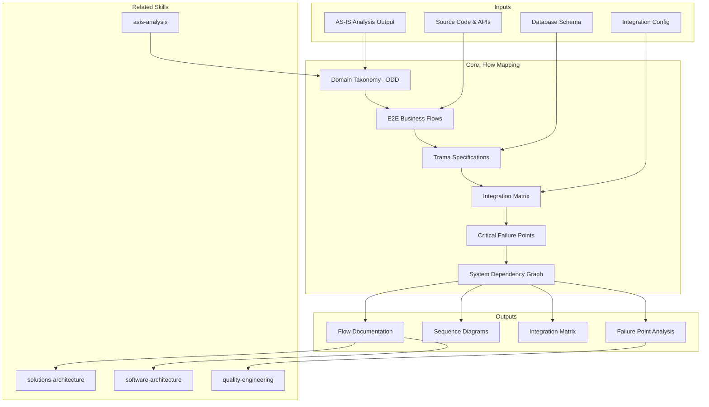

# Flow Mapping — DDD Domains & Business Flows

Translates AS-IS architecture findings into business flow documentation. Delivers DDD domain taxonomy, 8-12 primary E2E business flows with sequence diagrams and trama specifications, integration matrix, critical failure point analysis, and system dependency graph.

## Principio Rector

**Sin flujos documentados, la arquitectura es un mapa sin rutas.** Los flujos de negocio son la prueba viva de cómo el sistema realmente opera — no cómo alguien pensó que operaría. Este skill traduce código en recorridos de negocio trazables, desde el trigger hasta la completación, pasando por cada integración, cada transformación, cada punto de fallo.

### Filosofía de Mapeo

1. **La fuente de verdad depende del contexto.** Para SDA, el código no miente. Para RPA, los procesos BPMN son la verdad. Para Management, los ceremonies y workflows son la verdad. Para Data-AI, los pipelines y catálogos son la verdad. El skill adapta su fuente de extracción al tipo de servicio.
2. **Dominios antes que flujos.** Sin taxonomía DDD, los flujos son secuencias sin contexto. Primero los bounded contexts, luego los recorridos que los cruzan.
3. **Cada flecha es un contrato.** Cada integración documentada incluye protocolo, payload, SLA, y comportamiento ante fallo. Una flecha sin etiqueta es deuda de documentación.

## Inputs

- `$1` — Path to codebase root (default: current working directory)
- `$2` — Target flow count (default: 8, range: 4-12)

Parse from `$ARGUMENTS`.

**Parameters:**
- `{MODO}`: `piloto-auto` (default) | `desatendido` | `supervisado` | `paso-a-paso`
  - **piloto-auto**: Auto para extracción de flujos y análisis de integraciones, HITL para validación de taxonomía de dominios y puntos de fallo críticos.
  - **desatendido**: Cero interrupciones. Flujos extraídos automáticamente. Supuestos documentados.
  - **supervisado**: Autónomo con reportes al completar taxonomía y cada grupo de flujos.
  - **paso-a-paso**: Confirma taxonomía, cada flujo individual, y análisis de fallos.
- `{FORMATO}`: `markdown` (default) | `html` | `dual`
- `{VARIANTE}`: `ejecutiva` (~40% — S1 taxonomy + S7 integration matrix + S8 failure points) | `técnica` (full, default)
- `{TIPO_SERVICIO}`: `SDA` (default) | `QA` | `Management` | `RPA` | `Data-AI` | `Cloud` | `SAS` | `UX-Design`
  - Determines flow extraction sources, domain models, and context injection patterns
  - When omitted, defaults to SDA (backward compatible)

## Dynamic Context Injection

Auto-detect API surface and integration points before analysis:

```bash
# API specification discovery
find . -name "*.yaml" -path "*/api/*" -o -name "openapi*" -o -name "swagger*" -o -name "*.proto" | head -10

# Message broker configuration
find . -name "*.yaml" -o -name "*.properties" | xargs grep -l "kafka\|rabbitmq\|amqp\|nats\|pulsar" 2>/dev/null | head -5

# Database connection discovery
find . -name "*.yaml" -o -name "*.properties" -o -name "*.env*" | xargs grep -l "datasource\|database\|mongodb\|redis\|postgres" 2>/dev/null | head -5

# Controller/endpoint mapping
find . -name "*Controller*" -o -name "*Handler*" -o -name "*Route*" -o -name "*Endpoint*" | head -15
```

Use discovered APIs, message brokers, databases, and endpoints to scope flow analysis.

### QA Context Injection (when {TIPO_SERVICIO}=QA)
- Test process flows: requirement → test design → execution → defect management → regression
- CI/CD quality gates: commit → build → unit test → integration → E2E → deploy
- Defect lifecycle: detection → triage → assignment → fix → verification → closure

### Management Context Injection (when {TIPO_SERVICIO}=Management)
- Delivery workflows: intake → planning → execution → review → retrospective
- Decision flows: proposal → analysis → committee → approval → execution
- Ceremony flows: daily → sprint review → retrospective → planning → backlog refinement

### RPA Context Injection (when {TIPO_SERVICIO}=RPA)
- Process flows: trigger → data extraction → transformation → system interaction → validation → completion
- Exception handling: error detection → classification → escalation → resolution → re-execution
- Bot orchestration: scheduling → resource allocation → execution → monitoring → reporting

### Data-AI Context Injection (when {TIPO_SERVICIO}=Data-AI)
- Data pipeline flows: ingestion → transformation → validation → loading → serving
- ML lifecycle: data collection → feature engineering → training → evaluation → deployment → monitoring
- Dashboard refresh: source extraction → aggregation → calculation → visualization → alerting

### Cloud Context Injection (when {TIPO_SERVICIO}=Cloud)
- Deployment flows: commit → build → test → stage → approve → deploy → verify
- Scaling flows: metric trigger → evaluation → scale decision → execution → stabilization
- Incident flows: alert → triage → investigation → remediation → postmortem

## Input Requirements

**Mandatory:**
- AS-IS Analysis Output (especially S1 Stack, S2 Structure, S3 Architecture, S9 Risks)
- Source code with integration points and API contracts
- Database schema and data contracts

**Recommended:**
- Existing swimlane or sequence diagrams
- Integration configuration (message brokers, API endpoints, protocols)
- Incident history (failures indicating critical paths)
- Performance baseline data (latency-sensitive flows)

## Assumptions & Limits

**Assumptions:**
- Phase 1 (AS-IS) completed with validated findings
- Business stakeholder access for flow validation
- Primary flows represent 80% of system value (Pareto: 8-12 flows)

**Cannot do:**
- Runtime tracing under production load (requires APM access)
- Flows through compiled/obfuscated code (approximate only)
- User behavior analysis (requires analytics data)
- Guarantee completeness of undocumented integration paths

## Workarounds When Inputs Missing

| Missing Input | Impact | Workaround |
|---|---|---|
| No API specs | Less precise flows | Reverse-engineer from HTTP clients, REST annotations, gRPC stubs. Flag confidence. |
| No incident history | Cannot infer failure probability | Derive from architecture (high fan-in, no fallback). Flag as theoretical. |
| No business docs | Cannot validate business intent | Interview stakeholders during extraction. Document inferred rules. |
| Limited stakeholder access | Cannot validate correctness | Validate against code + config. Document assumptions. Recommend post-analysis walkthrough. |
| No message broker config | Cannot trace async flows | Infer from code (producer/consumer patterns, event classes). Flag completeness risk. |

## DDD Heuristics for Domain Identification

1. **Code Structure:** Package/namespace boundaries indicate domains
2. **Database Schema:** Separate databases or table groupings suggest domains
3. **Team Ownership:** Org structure mirrors domain boundaries
4. **Deployment Units:** Independently deployed services = likely bounded contexts
5. **Ubiquitous Language:** Business terminology clusters that don't cross domains

**Classification:**
- **Core Domain:** Revenue-generating, competitive advantage, complex business logic. Build in-house.
- **Supporting Domain:** Enables core, industry-standard with customization. Build or customize.
- **Generic Domain:** Commodity solution exists, non-differentiating. Buy off-the-shelf.

## 9-Section Analytical Framework

### S1: Domain Taxonomy (DDD)
Domain card grid (color-coded by type). Per domain: name, type (Core/Supporting/Generic), purpose, responsibilities, aggregates, business value. Domain interaction map. Boundary specifications. Context mapping patterns (Shared Kernel, Customer-Supplier, Conformist, Anti-Corruption Layer). **Minimum:** 4 domains identified.

#### Service-Type Domain Models

When `{TIPO_SERVICIO}` ≠ SDA, use the appropriate domain model:

- **QA**: Quality Domain Model — Test domains (functional, non-functional, regression), coverage domains, defect domains
- **Management**: Delivery Domain Model — Project/program/portfolio domains, ceremony domains, governance domains
- **RPA**: Process Domain Model — Automation candidates, automated processes, monitored processes, exception domains
- **Data-AI**: Data Domain Model — Source domains, transformation domains, consumption domains, governance domains
- **Cloud**: Infrastructure Domain Model — Compute, network, storage, security, cost domains

### S2-S6: E2E Business Flows (8-12)

**Selection criteria:** Cover all Core domains + highest transaction volume + highest risk + strategic importance.

**Per flow (5-8 pages):**

**2.1 ASCII Sequence Diagram (Swimlane)**
Columns: Actor/System participants. Timeline: top to bottom, numbered 1-N. Notation: arrow-right sync, arrow-left response, long-arrow async. Branching: alt [condition], par [parallel], loop [iteration].

**2.2 Trama Specification Table**
| Seq | Msg ID | Source | Destination | Type | Protocol | Content | Sync/Async | SLA |

**2.3 Step-by-Step Narrative**
Per step: business action, data transformation, validation rules, error handling. Decision branches (IF/THEN). Preconditions + postconditions.

**2.4 Error Scenarios**
| Error | Root Cause | Handling | User Feedback | Recovery |

**2.5 Integration Dependencies**
External systems, protocols, timeout/retry logic, fallback strategies, data contracts, circuit breaker patterns.

### S7: Integration Matrix
Rows: systems. Columns: transaction types. Cells: integration type (sync/conditional/async) + protocol. Complexity color-coded. Critical integrations called out. Data volume indicators per transaction.

### S8: Critical Failure Points
Per failure point: FP-ID, description + business consequence, affected flows/systems, probability, impact, current mitigation (MTTR, residual risk), recommended improvement. **Minimum:** Top-10. Includes cascade failure diagram and mitigation roadmap.

### S9: System Dependency Graph
Nodes: systems. Edges: dependency arrows with type labels (sync API, async event, data replication, batch). Criticality color-coded. Circular dependencies marked. Single points of failure identified. Recovery order documented.

## Conditional Logic

```
IF system is event-driven (message queues, pub/sub):
  -> Event flow diagrams (events to handlers to async completion)
  -> Track event payload evolution + eventual consistency SLAs

IF system has >20 integration points:
  -> Group by domain (Finance, Customer, Risk, etc.)
  -> Detail top 12 flows by criticality
  -> Summarize others in matrix only

IF no incident history:
  -> Derive failure points from architecture (high fan-in, no fallback)
  -> Flag as "theoretical risk" (requires validation)

IF legacy system with no API specs:
  -> Reverse-engineer from DB triggers, stored procedures, scheduled jobs
  -> Document inference confidence level
  -> Recommend API spec creation as post-phase deliverable

IF single system handles multiple bounded contexts:
  -> Document monolith flows
  -> Highlight context boundaries (where logic for one context depends on another)
  -> Recommend future microservices seams
```

## Trade-off Matrix

| Decision | Enables | Constrains | When to Use |
|---|---|---|---|
| **Full 9-section analysis** | Complete E2E traceability, failure analysis | 4-6 days, high detail | Full pipeline, regulated environments |
| **Executive variant** (S1+S7+S8) | Quick integration overview | Misses individual flow detail | Time-constrained, architecture focus |
| **8 flows** (default) | Good coverage without overload | May miss secondary flows | Most engagements |
| **12 flows** (max) | Comprehensive coverage | Longer delivery, diminishing returns | Complex systems with >20 integrations |
| **Reverse-engineering mode** (no API specs) | Works without documentation | Lower confidence, more assumptions | Legacy systems with no docs |

## Edge Cases

- **Event-driven systems:** Map as event flow diagrams. Document event contracts + timing + ordering guarantees.
- **Batch processing:** Document as scheduled triggers + transformation pipeline. Include batch SLA and failure recovery.
- **Multi-tenant:** Document single-tenant flow, then overlay isolation points and tenant resolution.
- **No clear entry points:** Identify trigger sources (queues, cron, webhooks). Trace from trigger to completion.
- **CQRS/Event Sourcing:** Separate command flows from query flows. Document event store projection patterns.
- **Legacy COBOL/mainframe:** Map at job/program level. Document JCL/batch sequences as flows.

## Casos Borde

| Caso | Estrategia de Manejo |
|---|---|
| Sistema event-driven sin entry points claros | Identificar trigger sources (queues, cron, webhooks); trazar desde trigger hasta completion; documentar event contracts, timing y ordering guarantees |
| Procesamiento batch sin flujos interactivos | Documentar como scheduled triggers + transformation pipeline; incluir batch SLA y recovery ante fallo; mapear dependencias entre jobs |
| CQRS/Event Sourcing | Separar command flows de query flows; documentar event store projection patterns; trazar eventual consistency boundaries |
| Legacy COBOL/mainframe sin API specs | Mapear a nivel job/programa; documentar secuencias JCL/batch como flujos; reverse-engineer desde DB triggers, stored procedures y scheduled jobs; flag confianza reducida |
| >20 puntos de integracion | Agrupar por dominio (Finance, Customer, Risk); detallar top 12 flujos por criticidad; resumir el resto solo en integration matrix |

## Decisiones y Trade-offs

| Decision | Alternativa Descartada | Justificacion |
|---|---|---|
| Dominios DDD antes que flujos | Mapear flujos sin taxonomia previa | Sin taxonomia DDD, los flujos son secuencias sin contexto; los bounded contexts dan el marco semantico para interpretar las interacciones |
| Cada flecha de integracion es un contrato documentado | Flechas sin etiqueta entre sistemas | Una flecha sin protocolo, payload, SLA y comportamiento ante fallo es deuda de documentacion que se convierte en riesgo operativo |
| Fuente de verdad adaptada al tipo de servicio | Usar codigo como unica fuente de verdad siempre | Para SDA el codigo es verdad, pero para RPA los BPMN son la verdad, para Management los ceremonies, y para Data-AI los pipelines; la fuente se adapta al contexto |

## Knowledge Graph



## Output Templates

| Formato | Nombre | Contenido |
|---|---|---|
| **Markdown** | `04_Mapeo_Flujos_{TIPO_SERVICIO}_{project}.md` | Documento completo con taxonomia DDD, 8-12 flujos E2E con sequence diagrams y trama specs, integration matrix, failure points, dependency graph. Diagramas Mermaid embebidos. |
| **DOCX** | `04_Mapeo_Flujos_{TIPO_SERVICIO}_{project}.docx` | Documento ejecutivo con diagramas exportados como imagenes, tablas de trama formateadas, y analisis de failure points para revision con stakeholders no tecnicos. |
| **HTML** | `04_Mapeo_Flujos_{TIPO_SERVICIO}_{project}_{WIP}.html` | Mismo contenido en HTML branded (Design System MetodologIA v5). Light-First Technical page con sequence diagrams navegables, integration matrix con filtros, y failure points con severity semáforo. WCAG AA, responsive, print-ready. |
| **XLSX** | `{fase}_{entregable}_{cliente}_{WIP}.xlsx` | Generado via openpyxl con MetodologIA Design System v5. Encabezados con fondo navy y texto blanco Poppins, formato condicional por tipo de dominio (Core/Supporting/Generic) y severidad de fallo, auto-filtros en todas las columnas, valores calculados (sin fórmulas). Hojas: Domain Taxonomy, Integration Matrix, Critical Failure Points (Top-10), System Dependency Register. |
| **PPTX** | `{fase}_{entregable}_{cliente}_{WIP}.pptx` | Generado via python-pptx con MetodologIA Design System v5. Slide master con gradiente navy, títulos Poppins, cuerpo Montserrat, acentos dorados. Máx 20 slides ejecutivo / 30 técnico. Notas del orador con referencias de evidencia. Secciones: Domain Taxonomy (DDD), E2E Business Flows Overview, Integration Matrix, Critical Failure Points (Top-10), System Dependency Graph, Recomendaciones. |

## Evaluacion

| Dimension | Peso | Criterio |
|---|---|---|
| Trigger Accuracy | 10% | Descripcion activa triggers correctos (map flows, DDD, integration matrix, business process) sin falsos positivos con asis-analysis o solutions-architecture |
| Completeness | 25% | Las 9 secciones cubren taxonomia DDD, 8+ flujos E2E, trama specs, integration matrix, failure points y dependency graph; todos los Core domains cubiertos |
| Clarity | 20% | Instrucciones ejecutables sin ambiguedad; cada flujo tiene sequence diagram, trama table, narrative y error handling; SLAs explicitos |
| Robustness | 20% | Maneja event-driven, batch, CQRS, legacy COBOL, y sistemas con >20 integraciones con estrategias diferenciadas por tipo de servicio |
| Efficiency | 10% | Proceso no tiene pasos redundantes; variante ejecutiva reduce a S1+S7+S8 sin perder vision de integraciones criticas |
| Value Density | 15% | Cada seccion aporta valor practico directo; integration matrix y failure points son herramientas de decision inmediata para mitigacion de riesgos |

**Umbral minimo: 7/10.**

---

## Escalation to Human Architect

- Unclear domain boundaries despite analysis
- Conflicting flow documentation (code vs business docs)
- Circular integration dependency (A to B to A)
- Business process not reflected in code
- Non-standard event/async patterns beyond standard tooling

## Output Artifact

**Primary:** `04_Mapeo_Flujos_{TIPO_SERVICIO}_{project}.md` (o `.html` si `{FORMATO}=html|dual`) — Domain taxonomy, 8-12 E2E business flows with sequence diagrams and trama specs, integration matrix, critical failure points, system dependency graph.

**Diagramas incluidos:**
- Sequence diagrams: top 3-5 E2E business flows
- Flowchart with subgraphs: integration map showing system boundaries
- Flowchart: dependency graph between bounded contexts

## Validation Gate

- [ ] 4+ domains identified and classified (Core/Supporting/Generic) with rationale
- [ ] 8+ primary flows documented E2E (all Core domains covered)
- [ ] Each flow: sequence diagram, trama table, narrative, error handling, pre/postconditions
- [ ] Integration matrix 100% complete for critical transactions
- [ ] Top-10 failure points with probability/impact scoring + mitigations
- [ ] Dependency graph: all systems, types (sync/async), criticality, circular deps
- [ ] All recommendations linked to AS-IS findings with traceability
- [ ] Performance SLA targets for every critical flow (p95, p99, error rate)
- [ ] Context mapping patterns documented for domain interactions

## Output Format Protocol

| Format | Default | Description |
|--------|---------|-------------|
| `markdown` | ✅ | Rich Markdown + Mermaid diagrams. Token-efficient. |
| `html` | On demand | Branded HTML (Design System). Visual impact. |
| `dual` | On demand | Both formats. |

Default output is Markdown with embedded Mermaid diagrams. HTML generation requires explicit `{FORMATO}=html` parameter.

### Diagrams (Mermaid)
- Sequence diagrams: top 3-5 E2E business flows (happy path + exceptions)
- Flowchart with subgraphs: integration map showing system boundaries
- Flowchart: dependency graph between bounded contexts

---
**Autor:** Javier Montaño | **Última actualización:** 12 de marzo de 2026
