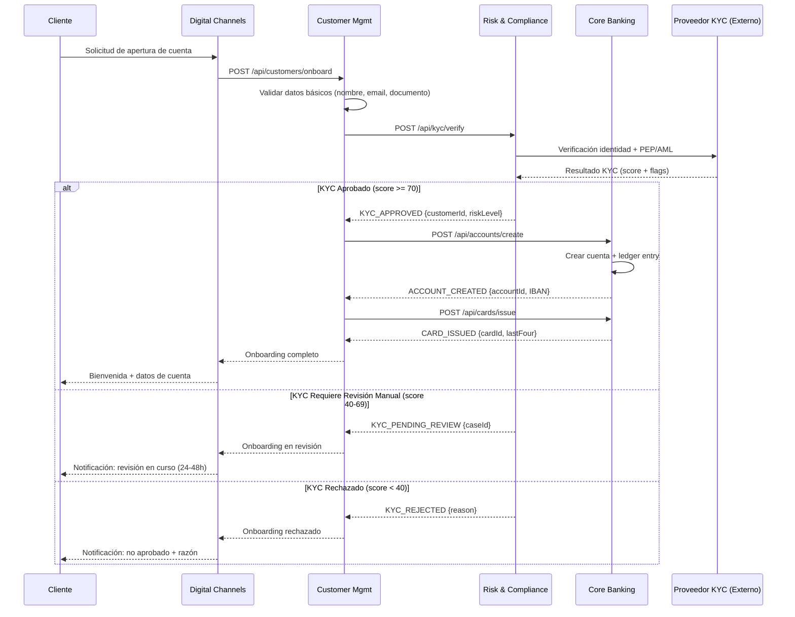
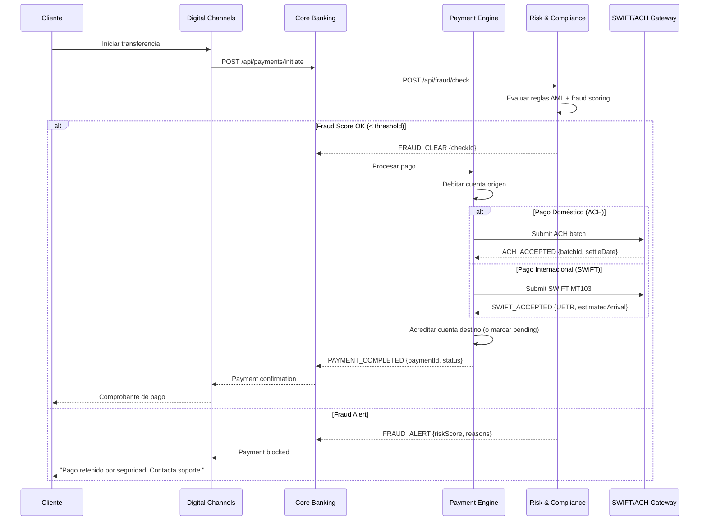
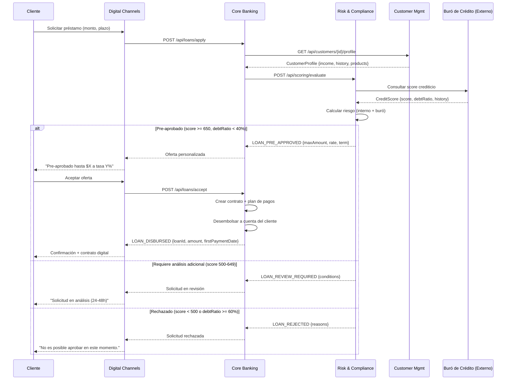

# 04 — Mapeo de Flujos: Acme Corp Banking Modernization

**Proyecto:** Acme Corp Banking Modernization
**Fecha:** 12 de marzo de 2026
**Variante:** Técnica (completa)
**Flujos documentados:** 3 de 8 (muestra representativa)

---

## S1: Taxonomía de Dominios (DDD)

| # | Dominio | Tipo | Propósito | Agregados Clave | Valor de Negocio |
|---|---------|------|-----------|-----------------|------------------|
| 1 | **Core Banking** | Core | Gestión de cuentas, transacciones y productos financieros | Account, Transaction, Product, Ledger | Motor principal de ingresos. Procesa 2.4M transacciones/día. |
| 2 | **Digital Channels** | Core | Interfaz cliente (web, móvil, API partners) | Session, UserProfile, Notification | Canal principal de adquisición. 78% de transacciones originan aquí. |
| 3 | **Risk & Compliance** | Supporting | Evaluación de riesgo, KYC/AML, reportes regulatorios | RiskAssessment, ComplianceRule, AuditTrail | Habilitador regulatorio. Sin esto, no hay operación. |
| 4 | **Customer Management** | Supporting | CRM, onboarding, lifecycle management | Customer, KYCDocument, Relationship | Soporte al ciclo de vida del cliente. Alimenta Core Banking y Channels. |
| 5 | **Infrastructure** | Generic | Mensajería, logging, monitoreo, autenticación | Event, LogEntry, HealthCheck | Commodity. Candidato a soluciones off-the-shelf. |

### Patrones de Context Mapping

- **Core Banking <-> Digital Channels:** Customer-Supplier (Core Banking es upstream)
- **Core Banking <-> Risk & Compliance:** Shared Kernel (comparten modelo de Transaction)
- **Customer Management <-> Core Banking:** Anti-Corruption Layer (CRM legacy con adapter)
- **Infrastructure <-> todos:** Open Host Service (APIs genéricas consumidas por todos)

---

## S2: Flujo 1 — Customer Onboarding (KYC -> Account Creation -> Card Issuance)

**Dominio primario:** Customer Management
**Dominios cruzados:** Risk & Compliance, Core Banking, Digital Channels
**Volumen:** ~1,200 onboardings/día
**SLA objetivo:** < 15 min (happy path), < 48h (manual review)

### Sequence Diagram

### Trama Specification

| Seq | Msg ID | Source | Destination | Type | Protocol | Content | Sync/Async | SLA |
|-----|--------|--------|-------------|------|----------|---------|------------|-----|
| 1 | ONB-001 | Digital Channels | Customer Mgmt | Command | REST/HTTPS | CustomerOnboardRequest (name, doc, email, phone) | Sync | 200ms |
| 2 | ONB-002 | Customer Mgmt | Risk & Compliance | Command | REST/HTTPS | KYCVerifyRequest (docType, docNumber, fullName, dob) | Sync | 2s |
| 3 | ONB-003 | Risk & Compliance | Proveedor KYC | Query | REST/HTTPS (mTLS) | ExternalKYCRequest (document, biometrics) | Sync | 8s |
| 4 | ONB-004 | Risk & Compliance | Customer Mgmt | Event | Kafka | KYCResult {status, score, riskLevel, flags} | Async | 500ms |
| 5 | ONB-005 | Customer Mgmt | Core Banking | Command | REST/HTTPS | CreateAccountRequest {customerId, productType, currency} | Sync | 1s |
| 6 | ONB-006 | Customer Mgmt | Core Banking | Command | REST/HTTPS | IssueCardRequest {accountId, cardType} | Sync | 3s |

### Error Scenarios

| Error | Root Cause | Handling | User Feedback | Recovery |
|-------|-----------|----------|---------------|----------|
| Proveedor KYC timeout (>10s) | Latencia proveedor externo | Retry 2x con backoff exponencial. Fallback: cola manual. | "Verificación en proceso, te notificaremos." | Reintentar automáticamente cada 30 min (max 3). |
| Documento duplicado | Cliente ya existe en sistema | Validar uniqueness pre-KYC. Retornar 409 Conflict. | "Ya tienes una cuenta. ¿Olvidaste tu contraseña?" | N/A — flujo alterno (recuperación). |
| Core Banking no disponible | Mantenimiento o fallo del core | Encolar creación de cuenta. Completar cuando core vuelva. | "Tu cuenta está siendo procesada (máx 2h)." | Retry con idempotency key. Alerta Ops si >1h. |
| Fallo emisión de tarjeta | Integración con proveedor de tarjetas caída | Cuenta creada sin tarjeta. Cola para emisión posterior. | "Cuenta lista. Tarjeta en camino (24-48h)." | Job batch nocturno reintenta emisiones fallidas. |

---

## S3: Flujo 2 — Real-Time Payment (Channel -> Payment Engine -> Core -> SWIFT/ACH)

**Dominio primario:** Core Banking
**Dominios cruzados:** Digital Channels, Risk & Compliance, Infrastructure
**Volumen:** ~85,000 pagos/día
**SLA objetivo:** < 3s (doméstico), < 30s (internacional)

### Sequence Diagram

### Trama Specification

| Seq | Msg ID | Source | Destination | Type | Protocol | Content | Sync/Async | SLA |
|-----|--------|--------|-------------|------|----------|---------|------------|-----|
| 1 | PAY-001 | Digital Channels | Core Banking | Command | REST/HTTPS | PaymentInitRequest {from, to, amount, currency, concept} | Sync | 200ms |
| 2 | PAY-002 | Core Banking | Risk & Compliance | Query | gRPC | FraudCheckRequest {amount, origin, destination, customerHistory} | Sync | 800ms |
| 3 | PAY-003 | Core Banking | Payment Engine | Command | Kafka | ProcessPayment {paymentId, debitAccount, creditAccount, amount} | Async | 1s |
| 4 | PAY-004 | Payment Engine | SWIFT/ACH Gateway | Command | ISO 20022/MQ | PaymentInstruction {MT103 or ACH format} | Async | 5s |
| 5 | PAY-005 | Payment Engine | Core Banking | Event | Kafka | PaymentResult {paymentId, status, reference} | Async | 500ms |

### Error Scenarios

| Error | Root Cause | Handling | User Feedback | Recovery |
|-------|-----------|----------|---------------|----------|
| Fondos insuficientes | Balance menor que monto + comisión | Validar pre-débito. Rechazar con código específico. | "Fondos insuficientes. Saldo disponible: $X." | N/A — usuario debe fondear. |
| SWIFT Gateway timeout | Red SWIFT congestionada o caída | Encolar con TTL 4h. Retry automático. | "Pago en proceso. Confirmación en máx 4h." | Retry cada 15 min. Escalar a Ops si >2h. |
| Fraud false positive | Reglas demasiado agresivas | Retener pago. Notificar a equipo de fraude para revisión manual. | "Pago en revisión de seguridad (máx 2h)." | Equipo fraude libera o confirma bloqueo. |
| Doble débito | Race condition en procesamiento paralelo | Idempotency key obligatoria. Distributed lock en cuenta. | N/A — prevenido por diseño. | Si ocurre: reconciliación batch detecta y revierte. |

---

## S4: Flujo 3 — Loan Origination (Application -> Scoring -> Approval -> Disbursement)

**Dominio primario:** Core Banking
**Dominios cruzados:** Customer Management, Risk & Compliance, Digital Channels
**Volumen:** ~800 solicitudes/día
**SLA objetivo:** < 5 min (pre-aprobación), < 24h (desembolso)

### Sequence Diagram

### Trama Specification

| Seq | Msg ID | Source | Destination | Type | Protocol | Content | Sync/Async | SLA |
|-----|--------|--------|-------------|------|----------|---------|------------|-----|
| 1 | LOA-001 | Digital Channels | Core Banking | Command | REST/HTTPS | LoanApplication {customerId, amount, term, purpose} | Sync | 300ms |
| 2 | LOA-002 | Core Banking | Customer Mgmt | Query | REST/HTTPS | GetCustomerProfile {customerId} | Sync | 500ms |
| 3 | LOA-003 | Core Banking | Risk & Compliance | Command | REST/HTTPS | ScoringRequest {customerId, amount, income, products} | Sync | 2s |
| 4 | LOA-004 | Risk & Compliance | Buró de Crédito | Query | SOAP/HTTPS | CreditBureauQuery {docType, docNumber} | Sync | 5s |
| 5 | LOA-005 | Risk & Compliance | Core Banking | Event | Kafka | ScoringResult {decision, score, maxAmount, rate} | Async | 500ms |
| 6 | LOA-006 | Core Banking | Core Banking | Command | Internal | DisburseLoan {loanId, accountId, amount} | Sync | 1s |

### Error Scenarios

| Error | Root Cause | Handling | User Feedback | Recovery |
|-------|-----------|----------|---------------|----------|
| Buró de crédito no disponible | Proveedor externo caído | Fallback: scoring solo con datos internos. Flag de confianza reducida. | "Pre-aprobación basada en tu historial con nosotros." | Reconsultar buró cuando vuelva. Actualizar decisión si difiere. |
| Desembolso fallido | Error en ledger o cuenta bloqueada | Revertir estado de préstamo a "aprobado pendiente". Reintentar. | "Desembolso en proceso. Máximo 2h." | Retry automático 3x. Escalar a Ops si persiste. |
| Race condition en scoring | Dos solicitudes simultáneas del mismo cliente | Distributed lock por customerId durante evaluación. | Segunda solicitud: "Ya tienes una solicitud en proceso." | Liberar lock tras timeout (30s). |

---

## S7: Integration Matrix (Parcial)

| Sistema | Onboarding | Pagos | Préstamos | Protocolo Principal | Volumen/día |
|---------|-----------|-------|-----------|---------------------|-------------|
| **Digital Channels** | Sync (inicia) | Sync (inicia) | Sync (inicia) | REST/HTTPS | 87,000 |
| **Core Banking** | Sync (crea cuenta) | Async (procesa) | Sync+Async | REST + Kafka | 170,000 |
| **Risk & Compliance** | Sync (KYC) | Sync (fraud) | Sync (scoring) | REST + gRPC | 87,000 |
| **Customer Management** | Sync (gestiona) | — | Sync (consulta) | REST/HTTPS | 2,000 |
| **Payment Engine** | — | Async (ejecuta) | Async (desembolso) | Kafka + ISO 20022 | 85,000 |
| **SWIFT/ACH Gateway** | — | Async (envía) | — | ISO 20022/MQ | 12,000 |
| **Proveedor KYC (ext)** | Sync (verifica) | — | — | REST/mTLS | 1,200 |
| **Buró de Crédito (ext)** | — | — | Sync (consulta) | SOAP/HTTPS | 800 |

### Integraciones Críticas

1. **Core Banking <-> Payment Engine** (Kafka): 85K msgs/día. Punto de fallo = doble débito.
2. **Risk & Compliance <-> Proveedores externos** (REST/SOAP): Dependencia de terceros. SLA no controlable.
3. **Payment Engine <-> SWIFT Gateway** (MQ): Regulado. Fallo = incumplimiento normativo.

---

## S8: Puntos Críticos de Fallo (Top 3)

### FP-001: Proveedor KYC Externo No Disponible

- **Consecuencia de negocio:** Onboarding detenido. Pérdida de clientes potenciales.
- **Flujos afectados:** Customer Onboarding
- **Probabilidad:** Media (2-3 incidentes/mes históricos)
- **Impacto:** Alto (bloquea adquisición de clientes)
- **Mitigación actual:** Retry manual. MTTR: 2-4 horas.
- **Mejora recomendada:** Implementar segundo proveedor KYC como fallback. Cache de verificaciones recientes (TTL 24h). Reduce MTTR a <5 min.

### FP-002: Race Condition en Payment Engine (Doble Débito)

- **Consecuencia de negocio:** Pérdida financiera directa. Riesgo regulatorio.
- **Flujos afectados:** Real-Time Payment, Loan Disbursement
- **Probabilidad:** Baja (diseño actual usa idempotency keys)
- **Impacto:** Crítico (pérdida monetaria + confianza)
- **Mitigación actual:** Idempotency key + reconciliación batch nocturna. MTTR: 12h (detección batch).
- **Mejora recomendada:** Distributed lock con Redis + detección real-time vía event sourcing. Reduce MTTR a <1 min.

### FP-003: SWIFT Gateway Timeout en Pagos Internacionales

- **Consecuencia de negocio:** Pagos internacionales retenidos. Incumplimiento SLA con clientes corporativos.
- **Flujos afectados:** Real-Time Payment (internacional)
- **Probabilidad:** Media (red SWIFT tiene ventanas de mantenimiento programadas)
- **Impacto:** Alto (reputacional + contractual con corporativos)
- **Mitigación actual:** Cola con TTL 4h + retry cada 15 min. MTTR: variable (depende de SWIFT).
- **Mejora recomendada:** Implementar ruta alternativa vía corresponsal bancario para montos <$50K. Notificación proactiva al cliente con ETA actualizado.

---

**Autor:** Javier Montaño | **Generado por:** flow-mapping skill v6.0
