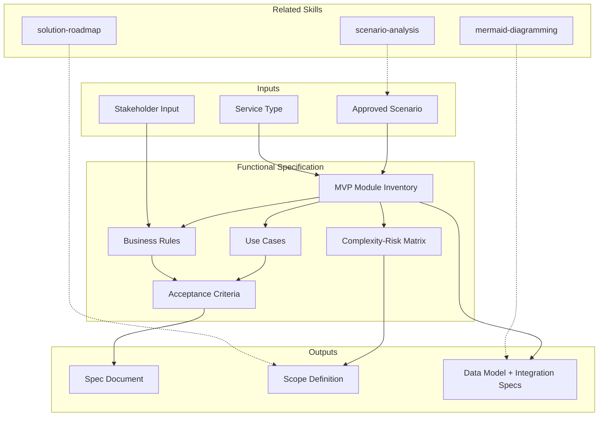

# Functional Specification — Universal Deliverable Specification

Generates detailed functional specifications: MVP modules, 8+ use cases with complete flows, 6+ business rules with validation logic, complexity/risk matrix, explicit scope boundaries, data model overview, integration specs, and per-module acceptance criteria.

> **Nota de universalidad:** Este skill genera especificaciones funcionales para CUALQUIER tipo de servicio MetodologIA. Para SDA produce especificaciones de software (módulos, casos de uso, modelos de datos). Para otros tipos de servicio, adapta la estructura a los entregables propios de cada línea.

## Grounding Guideline

**An ambiguous specification is a promise of rework.** The functional spec is the contract between business and technology: each use case defines WHAT the system does, each business rule defines HOW it decides, and each acceptance criterion defines WHEN it is ready. If it is not in the spec, it is not built. If it is ambiguous in the spec, it is built wrong.

### Specification Philosophy

1. **WHAT, not HOW.** The spec describes observable behavior, not implementation. "The system validates the customer's age" — not "use an IF/ELSE in the controller."
2. **Every rule has an owner.** Unvalidated business rules are ticking time bombs. UNVALIDATED is a status, not permission to proceed.
3. **Explicit scope > exhaustive scope.** A clear list of what is IN and what is OUT prevents 80% of scope creep.

## Inputs

- `$1` — MVP module count target (default: 3-5)
- `$2` — Use case depth: `actor-goal` (1 page, fast) or `cockburn` (5+ pages, detailed; default)

Parse from `$ARGUMENTS`. Use `actor-goal` for MVP speed; `cockburn` for critical/complex flows.

**Parameters:**
- `{MODO}`: `piloto-auto` (default) | `desatendido` | `supervisado` | `paso-a-paso`
  - **piloto-auto**: Auto para inventario de módulos y use cases, HITL para validación de business rules y scope boundaries.
  - **desatendido**: Zero interruptions. Spec completa auto-generada. Reglas marcadas UNVALIDATED.
  - **supervisado**: Autónomo con checkpoint en scope definition y business rules.
  - **paso-a-paso**: Confirma cada módulo, cada use case, y cada business rule.
- `{FORMATO}`: `markdown` (default) | `html` | `dual`
- `{VARIANTE}`: `ejecutiva` (~40% — S1 modules + S4 risk matrix + S5 scope) | `técnica` (full 8 sections, default)
- `{TIPO_SERVICIO}`: `SDA` (default) | `QA` | `Management` | `RPA` | `Data-AI` | `Cloud` | `SAS` | `UX-Design`
  - Determines deliverable types, acceptance criteria, and module decomposition patterns
  - When omitted, defaults to SDA (backward compatible)

## Assumptions & Limits

**Requirements:**
- Prior analysis phases completed (architecture approved by steering committee)
- Designated business owner available for rule validation within 48 hours
- Use cases describe WHAT (behavior), not HOW (implementation)

**Cannot replace:**
- User acceptance testing (UAT validates implementation matches spec)
- Architecture decisions (belong in earlier analysis phases)

**All unvalidated business rules** marked "UNVALIDATED -- requires stakeholder approval before implementation" with risk flag.

## Conditional Logic

```
IF module has >5 use cases:
  -> Create sub-module decomposition with clear ownership

IF use case has >3 primary actors:
  -> Model as system use case or split into actor-specific use cases

IF use case has >10 alternative flows:
  -> Break into sub-use-cases
  -> Keep each use case <200 lines

IF business rule severity is CRITICAL:
  -> Must have automated test in acceptance criteria
  -> Cannot be waived without steering committee approval

IF integration dependency is external (3rd-party API):
  -> Add SLA contract to specification
  -> Identify failure modes and fallback behavior

IF no business stakeholder available:
  -> Document ALL rules as "UNVALIDATED" with risk flag
  -> Do not proceed to development until validation complete
```

## Edge Cases

- **Business rule conflicts (Rule A contradicts Rule B):** Flag for immediate stakeholder resolution. Document conflict with reconciliation timeline. Do not proceed until resolved.
- **Module with zero use cases:** Mark as "infrastructure-only" and document purpose. If genuinely orphan, remove from scope.
- **>3 primary actors on single use case:** Refactor as system use case or split.
- **No stakeholder for validation:** Document rules as UNVALIDATED. Flag risk. Block development on critical rules.
- **Cross-module business rules:** Document in both modules with single source of truth. Flag coupling risk.
- **Implicit business rules in code:** Extract, document explicitly, and mark for stakeholder validation.

## Trade-off Matrix

| Decision | Enables | Constrains | When to Use |
|---|---|---|---|
| **Cockburn use cases** (5+ pages) | Deep detail, unambiguous | Time-intensive, heavy | Critical/complex flows |
| **Actor-goal use cases** (1 page) | Fast, scannable | May miss edge cases | MVP, simple flows |
| **Natural language rules** | Readable, accessible | Ambiguous | Non-technical audience |
| **Pseudo-code rules** | Precise, testable | Harder to read | Complex validation logic |
| **3x3 complexity grid** | Forces binary decisions | Coarse | MVP prioritization |

## 8-Section Delivery Structure

### Section 1: MVP Module Inventory (3-5 modules)
Card grid. Per card: module name, description (1-2 sentences), key features (3+), related use case IDs, business rule IDs, complexity rating (1-5 with explanation), risk rating (1-5 with factors), upstream/downstream dependencies.

#### Service-Type Deliverable Inventory

| Service Type | "Modules" Become | Examples |
|---|---|---|
| SDA | Software modules | Authentication, Payments, Notifications |
| QA | Test suites / QA workstreams | Functional Testing, Performance Testing, Security Testing |
| Management | Delivery workstreams | Sprint Management, Governance, Stakeholder Communication |
| RPA | Automation modules | Invoice Processing Bot, Data Entry Bot, Report Generation Bot |
| Data-AI | Data products / pipelines | Customer 360 Pipeline, Revenue Dashboard, Churn Prediction Model |
| Cloud | Migration workstreams / platform components | Landing Zone, CI/CD Pipeline, Monitoring Stack |
| SAS | Staffing packages | Frontend Team Package, QA Team Package, DevOps Team Package |
| UX-Design | Design deliverables | Design System, User Research Program, Prototype Suite |

### Section 2: Use Cases (8-12 minimum)
Per use case structured table: ID, name (verb-noun), primary actor, preconditions, main flow (numbered steps), alternative flows (2+ per use case), exception flows (1+ per use case), postconditions, linked business rules, data entities, priority (High/Medium/Low), frequency (Daily/Session/Ad-hoc).

### Section 3: Business Rules (6+ minimum)
| ID | Rule Name | Description | Validation Logic | Severity | Module | Validation Status |
Severity: CRITICAL (blocks release), HIGH (major impact), MEDIUM (nice-to-have), LOW (documentation).

### Section 4: Complexity & Risk Matrix
3x3 heatmap. X-axis: complexity (Low/Mid/High). Y-axis: risk (Low/Mid/High). Each feature positioned with rationale. Bottom-left = quick wins first. Top-right = detailed planning + spike required.

### Section 5: Scope Definition
**In Scope (MVP):** checklist with rationale per feature.
**Out of Scope (Future):** explicit list with reason per exclusion.
**Boundary Conditions:** max records/query, concurrent users, API SLA, data retention, uptime target.

### Section 6: Acceptance Criteria per Module
Per module: Functional completeness (use cases tested, rules validated, alternative/exception flows working, data consistency). Non-functional (response time, load tested, no SPOF, audit trail). Security & compliance (auth, authz, encryption, PII handling). Quality (code review zero critical, coverage >80% unit / >70% integration). Sign-offs (business owner, QA lead, tech lead).

#### Service-Type Acceptance Criteria

| Service Type | Key Acceptance Criteria |
|---|---|
| SDA | Code review passed, unit test coverage >80%, integration tests green, security scan clear |
| QA | Test case pass rate >95%, defect detection rate >85%, automation coverage >60%, zero P1 escapes |
| Management | Milestone on time, stakeholder NPS >7, team velocity stable ±10%, zero unresolved blockers |
| RPA | Bot success rate >98%, exception rate <2%, processing time within SLA, audit trail complete |
| Data-AI | Data quality score >95%, model accuracy above threshold, pipeline SLA met, dashboard adoption >70% |
| Cloud | Zero downtime migration, performance parity, security compliance verified, cost within budget |
| SAS | Position filled within SLA, ramp-up completed, stakeholder satisfaction >8/10, retention >90% at 90 days |
| UX-Design | Usability score >80 (SUS), accessibility WCAG AA compliant, design system adoption >70%, stakeholder approval |

### Section 7: Data Model Overview
Per entity: fields (name, type, constraints), relationships (belongs-to, has-many), lifecycle (create/update/delete conditions). Entity-to-business-rule mapping.

### Section 8: Integration Specifications
Per external system: endpoint, method, payload, response, SLA. Failure modes and fallback documented. Circuit breaker and retry policies.

## Output Artifact

`07_Especificacion_Funcional_{TIPO_SERVICIO}_{project}.md` (default) | `.html` (when `{FORMATO}=html`) | both (when `{FORMATO}=dual`)

### Diagrams Included
- **ER diagram**: core data model / entity relationships
- **Flowchart**: top 3 use case flows (happy path + alternatives)
- **Flowchart**: module dependency map

## Validation Gate

- [ ] 3-5 MVP modules defined with complexity/risk indicators and ownership
- [ ] 8-12 use cases with main flow, 2+ alternative flows, 1+ exception flow each
- [ ] 6+ business rules with ID, validation logic, severity, affected module
- [ ] Complexity/risk matrix positions features in 3x3 grid with rationale
- [ ] Scope has explicit in-scope / out-of-scope lists with justification
- [ ] Acceptance criteria measurable and per-module
- [ ] Data model shows entities, relationships, constraints, mapped to business rules
- [ ] Integration specs define SLAs, contracts, and failure handling
- [ ] All cross-references complete and bidirectional (use cases to rules to entities to modules)
- [ ] No orphan modules or use cases; every item justifies its inclusion
- [ ] Unvalidated items flagged with risk indicator

## Output Format Protocol

| Format | Default | Description |
|--------|---------|-------------|
| `markdown` | ✅ | Rich Markdown + Mermaid diagrams. Token-efficient. |
| `html` | On demand | Branded HTML (Design System). Visual impact. |
| `dual` | On demand | Both formats. |

Default output is Markdown with embedded Mermaid diagrams. HTML generation requires explicit `{FORMATO}=html` parameter.

## Edge Cases

| Case | Handling Strategy |
|------|---------------------|
| Business rules discovered during spec writing contradict rules from a prior discovery phase | Flag the contradiction with [CONFLICT] tag; document both versions; escalate to business owner with 48-hour resolution SLA; block dependent use cases until resolved |
| Service type is hybrid (e.g., SDA + Data-AI in the same engagement) | Produce separate module inventories per service type; use a shared data model section; flag cross-type dependencies explicitly in integration specs |
| Stakeholder requests >12 MVP modules ("everything is critical") | Apply the 3x3 complexity/risk matrix to force prioritization; present the top-right quadrant (high complexity + high risk) as "Phase 2" candidates; escalate if stakeholder refuses to prioritize |
| No business stakeholder available for the entire spec cycle | Mark ALL business rules as UNVALIDATED; produce the spec with [SUPUESTO] tags on every rule; add a mandatory validation sprint before development can start |

## Decisions & Trade-offs

| Decision | Discarded Alternative | Justification |
|----------|----------------------|---------------|
| Default to Cockburn use case format for critical flows | Use actor-goal format universally for speed | Actor-goal format misses alternative/exception flows, which is where 70% of implementation bugs originate; Cockburn's rigor prevents downstream rework |
| Require explicit scope boundaries (IN/OUT lists) | Allow implicit scope through use case coverage | Implicit scope invites scope creep; explicit IN/OUT lists create a contractual reference point between business and technology teams |
| Unvalidated rules carry UNVALIDATED status and risk flag | Allow unvalidated rules to proceed to development with assumptions | Building on unvalidated rules creates technical debt that compounds; the risk flag forces organizational attention on validation before investment |

## Knowledge Graph



## Output Templates

### Markdown (default)
- Filename: `07_Especificacion_Funcional_{tipo_servicio}_{cliente}_{WIP}.md`
- Structure: TL;DR > Module Inventory cards > Use Cases (Cockburn) > Business Rules table > Complexity-Risk heatmap > Scope IN/OUT > Acceptance Criteria > Data Model (Mermaid ER) > Integration Specs > ghost menu

### DOCX
- Filename: `07_Especificacion_Funcional_{tipo_servicio}_{cliente}_{WIP}.docx`
- Structure: Cover page > TOC > Module cards > Use case structured tables > Business rules with validation status > Scope boundaries > Acceptance criteria per module > Data model diagram (described) > Integration SLA tables; signature block for business owner approval

### HTML (bajo demanda)
- Filename: `07_Especificacion_Funcional_{tipo_servicio}_{cliente}_{WIP}.html`
- Estructura: HTML self-contained branded (Design System MetodologIA v5). Light-First Technical page con module cards navegables, use case flows expandibles, y business rules con severity semáforo. WCAG AA, responsive, print-ready.

### XLSX (bajo demanda)
- Filename: `07_Especificacion_Funcional_{tipo_servicio}_{cliente}_{WIP}.xlsx`
- Generado con openpyxl bajo MetodologIA Design System v5. Headers con fondo navy y tipografía Poppins blanca, formato condicional, auto-filtros activados, valores sin fórmulas. Hojas: Módulos, Casos de Uso, Reglas de Negocio, Matriz Complejidad-Riesgo, Criterios de Aceptación.

### PPTX (bajo demanda)
- Filename: `{fase}_{entregable}_{cliente}_{WIP}.pptx`
- Generado con python-pptx bajo MetodologIA Design System v5. Slide master con degradado navy, títulos Poppins, cuerpo Trebuchet MS, acentos dorados. Máx 20 slides variante ejecutiva / 30 variante técnica. Notas de orador con referencias de evidencia ([CODIGO], [DOC], [INFERENCIA], [SUPUESTO]).

## Evaluacion

| Dimension | Peso | Criterio |
|-----------|------|----------|
| Trigger Accuracy | 10% | Descripcion activa triggers correctos sin falsos positivos |
| Completeness | 25% | Todos los entregables cubren el dominio sin huecos |
| Clarity | 20% | Instrucciones ejecutables sin ambiguedad |
| Robustness | 20% | Maneja edge cases y variantes de input |
| Efficiency | 10% | Proceso no tiene pasos redundantes |
| Value Density | 15% | Cada seccion aporta valor practico directo |

**Umbral minimo**: 7/10 en cada dimension para considerar el skill production-ready.

---
**Autor:** Javier Montaño | **Ultima actualizacion:** 15 de marzo de 2026
