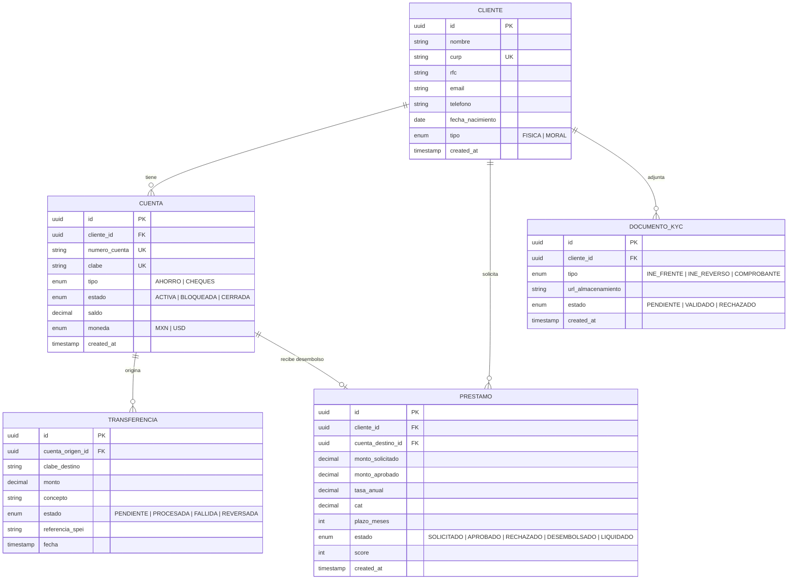

# Especificacion Funcional Deep -- Acme Digital Banking

> **Cliente:** Acme Corp | **Fecha:** 12 de marzo de 2026
> **Variante:** tecnica | **Formato:** markdown
> **Modulos MVP:** 4 | **Use cases:** 4 | **Business rules:** 4

---

## Section 1: MVP Module Inventory

### MOD-01 Account Management

- **Descripcion:** Gestion del ciclo de vida de cuentas bancarias -- apertura, actualizacion, cierre y consultas de saldo.
- **Features:** Apertura digital, KYC automatizado, multi-moneda, estados de cuenta PDF.
- **Use Cases:** UC-01
- **Business Rules:** BR-01, BR-02
- **Complejidad:** 3/5 -- KYC integrado con proveedor externo.
- **Riesgo:** 3/5 -- Regulacion bancaria, cumplimiento PLD.
- **Dependencias upstream:** Ninguna (modulo raiz).
- **Dependencias downstream:** MOD-02, MOD-03.

### MOD-02 Payment Processing

- **Descripcion:** Transferencias nacionales e internacionales, pagos de servicios, y procesamiento batch nocturno.
- **Features:** SPEI en tiempo real, pagos programados, limites dinamicos, notificaciones push.
- **Use Cases:** UC-02
- **Business Rules:** BR-03
- **Complejidad:** 4/5 -- Integracion SPEI + conciliacion batch.
- **Riesgo:** 4/5 -- Transacciones financieras criticas, reversiones.
- **Dependencias upstream:** MOD-01.
- **Dependencias downstream:** MOD-04.

### MOD-03 Loan Origination

- **Descripcion:** Solicitud, evaluacion crediticia, aprobacion y desembolso de prestamos personales y PyME.
- **Features:** Scoring automatizado, documentacion digital, firma electronica, simulador de pagos.
- **Use Cases:** UC-03
- **Business Rules:** BR-04
- **Complejidad:** 4/5 -- Motor de scoring + multiples productos crediticios.
- **Riesgo:** 3/5 -- Riesgo crediticio modelado, regulacion CNBV.
- **Dependencias upstream:** MOD-01.
- **Dependencias downstream:** MOD-02 (desembolso).

### MOD-04 Customer Portal

- **Descripcion:** Dashboard unificado para el cliente: resumen de cuentas, movimientos, notificaciones y soporte.
- **Features:** Dashboard responsivo, exportacion CSV/PDF, chat de soporte, preferencias de notificacion.
- **Use Cases:** UC-04
- **Business Rules:** Ninguna propia (consume reglas de MOD-01 a MOD-03).
- **Complejidad:** 2/5 -- Lectura y presentacion de datos existentes.
- **Riesgo:** 2/5 -- No transaccional, bajo impacto regulatorio.
- **Dependencias upstream:** MOD-01, MOD-02, MOD-03.
- **Dependencias downstream:** Ninguna.

---

## Section 2: Use Cases

### UC-01 Abrir Cuenta Digital

| Campo | Detalle |
|---|---|
| **ID** | UC-01 |
| **Nombre** | Abrir Cuenta Digital |
| **Actor primario** | Cliente nuevo |
| **Precondiciones** | Cliente no tiene cuenta activa en Acme. Dispositivo con camara para INE. |
| **Prioridad** | High |
| **Frecuencia** | Daily |

**Flujo principal:**

1. Cliente selecciona "Abrir Cuenta" en la app.
2. Sistema solicita datos personales (nombre, CURP, RFC, correo, telefono).
3. Cliente captura foto de INE (frente y reverso).
4. Sistema ejecuta verificacion KYC con proveedor externo.
5. Sistema valida CURP contra RENAPO.
6. Sistema aplica BR-01 (edad minima) y BR-02 (duplicados).
7. Sistema genera numero de cuenta y CLABE.
8. Sistema envia correo de confirmacion con contrato digital.

**Flujos alternativos:**

- **4a.** KYC rechazado por calidad de imagen: Sistema solicita recaptura (max 3 intentos).
- **6a.** Cliente menor de edad: Sistema muestra mensaje de rechazo con razon. Caso termina.

**Flujos de excepcion:**

- **4x.** Proveedor KYC no disponible: Sistema encola solicitud, notifica al cliente que se procesara en 24h.

**Postcondiciones:** Cuenta creada con estado ACTIVA. Cliente puede operar.
**Reglas vinculadas:** BR-01, BR-02
**Entidades:** Cliente, Cuenta, DocumentoKYC

### UC-02 Transferir Fondos via SPEI

| Campo | Detalle |
|---|---|
| **ID** | UC-02 |
| **Nombre** | Transferir Fondos via SPEI |
| **Actor primario** | Cliente titular |
| **Precondiciones** | Cuenta activa con saldo suficiente. Beneficiario registrado o nuevo. |
| **Prioridad** | High |
| **Frecuencia** | Daily |

**Flujo principal:**

1. Cliente selecciona "Transferir" y elige cuenta origen.
2. Sistema muestra saldo disponible.
3. Cliente ingresa CLABE destino, monto y concepto.
4. Sistema aplica BR-03 (limites de transferencia).
5. Sistema solicita autenticacion de segundo factor (token/biometrico).
6. Sistema envia orden SPEI a Banxico.
7. Sistema confirma transferencia y actualiza saldo.
8. Sistema envia notificacion push y correo.

**Flujos alternativos:**

- **3a.** CLABE invalida: Sistema muestra error de validacion. Cliente corrige.
- **4a.** Monto excede limite diario: Sistema muestra limite restante. Cliente ajusta monto.

**Flujos de excepcion:**

- **6x.** SPEI no disponible: Sistema encola transferencia, notifica al cliente, reintenta en ventana batch.

**Postcondiciones:** Saldo actualizado. Movimiento registrado. Comprobante disponible.
**Reglas vinculadas:** BR-03
**Entidades:** Cuenta, Transferencia, Beneficiario

### UC-03 Solicitar Prestamo Personal

| Campo | Detalle |
|---|---|
| **ID** | UC-03 |
| **Nombre** | Solicitar Prestamo Personal |
| **Actor primario** | Cliente titular |
| **Precondiciones** | Cuenta activa con minimo 3 meses de antiguedad. Sin prestamos vencidos. |
| **Prioridad** | High |
| **Frecuencia** | Session |

**Flujo principal:**

1. Cliente selecciona "Solicitar Prestamo" en portal.
2. Sistema muestra productos disponibles segun perfil.
3. Cliente selecciona producto, monto y plazo.
4. Sistema ejecuta simulacion de pagos (monto, tasa, CAT, pago mensual).
5. Cliente confirma solicitud.
6. Sistema ejecuta motor de scoring (BR-04).
7. Sistema genera resolucion: aprobado/rechazado/requiere documentacion adicional.
8. Si aprobado: sistema genera contrato digital y programa desembolso.

**Flujos alternativos:**

- **6a.** Score insuficiente: Sistema ofrece monto menor o plazo extendido como contrapropuesta.
- **7a.** Requiere documentacion: Sistema solicita comprobantes y pausa evaluacion.

**Flujos de excepcion:**

- **6x.** Motor de scoring no disponible: Sistema notifica al analista de credito para evaluacion manual.

**Postcondiciones:** Solicitud registrada con resolucion. Si aprobada, desembolso programado a cuenta del cliente.
**Reglas vinculadas:** BR-04
**Entidades:** Cliente, Prestamo, SolicitudCredito, Scoring

### UC-04 Consultar Dashboard

| Campo | Detalle |
|---|---|
| **ID** | UC-04 |
| **Nombre** | Consultar Dashboard |
| **Actor primario** | Cliente titular |
| **Precondiciones** | Sesion autenticada activa. |
| **Prioridad** | Medium |
| **Frecuencia** | Daily |

**Flujo principal:**

1. Cliente accede al portal/app.
2. Sistema muestra resumen: saldos por cuenta, ultimos 5 movimientos, alertas pendientes.
3. Cliente selecciona cuenta para detalle.
4. Sistema muestra movimientos con filtros (fecha, tipo, monto).
5. Cliente exporta movimientos en CSV o PDF.

**Flujos alternativos:**

- **2a.** Cliente sin movimientos recientes: Sistema muestra mensaje "Sin movimientos en los ultimos 30 dias."
- **5a.** Exportacion mayor a 1000 registros: Sistema genera archivo asincrono y notifica cuando este listo.

**Flujos de excepcion:**

- **2x.** Servicio de saldos no disponible: Sistema muestra ultimo saldo conocido con timestamp y advertencia.

**Postcondiciones:** Informacion consultada. Archivo exportado si aplica.
**Reglas vinculadas:** Ninguna propia
**Entidades:** Cuenta, Movimiento, Exportacion

---

## Section 3: Business Rules

| ID | Rule Name | Description | Validation Logic | Severity | Module | Status |
|---|---|---|---|---|---|---|
| BR-01 | Edad minima para apertura | Cliente debe tener 18+ anos al momento de apertura | `IF edad_cliente < 18 THEN REJECT("Menor de edad")` | CRITICAL | MOD-01 | VALIDATED |
| BR-02 | Cuenta duplicada | No se permite mas de una cuenta del mismo tipo por cliente | `IF EXISTS cuenta WHERE cliente_id = X AND tipo = Y AND estado = 'ACTIVA' THEN REJECT("Cuenta duplicada")` | HIGH | MOD-01 | VALIDATED |
| BR-03 | Limites de transferencia | Limite diario $50,000 MXN (personas fisicas), $500,000 MXN (morales) | `IF sum(transferencias_dia) + monto > limite_tipo_cliente THEN REJECT("Limite excedido. Restante: $Z")` | CRITICAL | MOD-02 | VALIDATED |
| BR-04 | Scoring crediticio minimo | Score minimo 650 para aprobacion automatica; 500-649 requiere analisis manual | `IF score >= 650 THEN AUTO_APPROVE; IF score >= 500 THEN MANUAL_REVIEW; ELSE REJECT` | CRITICAL | MOD-03 | UNVALIDATED -- requiere aprobacion del comite de credito |

---

## Section 4: Complexity & Risk Matrix

```
           Complejidad
           Low        Mid        High
    High  |          | MOD-03   | MOD-02   |
R   Mid   |          | MOD-01   |          |
i   Low   | MOD-04   |          |          |
e
s
g
o
```

| Modulo | Posicion | Rationale |
|---|---|---|
| MOD-01 | Mid/Mid | KYC externo agrega complejidad; regulacion PLD agrega riesgo moderado. |
| MOD-02 | High/High | SPEI + conciliacion batch + reversiones = alta complejidad; transacciones criticas = alto riesgo. |
| MOD-03 | Mid/High | Motor de scoring es complejo pero acotado; riesgo crediticio requiere validacion regulatoria. |
| MOD-04 | Low/Low | Lectura de datos existentes, sin logica de negocio propia. Quick win. |

**Recomendacion:** Iniciar con MOD-04 (quick win) + MOD-01 (habilitador), luego MOD-02, finalmente MOD-03.

---

## Section 5: Scope Definition

### In Scope (MVP)

- [x] Apertura de cuenta digital con KYC automatizado
- [x] Transferencias SPEI en tiempo real
- [x] Solicitud y evaluacion de prestamos personales
- [x] Dashboard de consulta con exportacion
- [x] Autenticacion de segundo factor (token/biometrico)
- [x] Notificaciones push y correo transaccional

### Out of Scope (Future)

- Prestamos PyME (requiere motor de scoring diferenciado) -- **Phase 2**
- Pagos de servicios (CFE, agua, telefonia) -- **Phase 2**
- Tarjeta de debito virtual -- **Phase 3**
- Inversion y CETES directos -- **Phase 3**
- Chat de soporte con IA -- **Phase 2**

### Boundary Conditions

| Parametro | Valor |
|---|---|
| Max registros por consulta | 1,000 |
| Usuarios concurrentes | 5,000 |
| SLA SPEI | 99.5% disponibilidad |
| Retencion de datos | 5 anos (regulacion CNBV) |
| Uptime objetivo | 99.9% |

---

## Section 6: Acceptance Criteria per Module

### MOD-01 Account Management

- [ ] UC-01 probado con flujo principal + 2 alternativos + 1 excepcion
- [ ] BR-01 y BR-02 validados con casos positivos y negativos
- [ ] KYC responde en <5s (p95)
- [ ] Datos PII encriptados en reposo (AES-256)
- [ ] Sign-off: Business Owner, QA Lead, Tech Lead

### MOD-02 Payment Processing

- [ ] UC-02 probado con flujo principal + 2 alternativos + 1 excepcion
- [ ] BR-03 validado con limites personas fisicas y morales
- [ ] SPEI procesa en <3s (p95)
- [ ] Conciliacion batch completa sin discrepancias en test
- [ ] Sign-off: Business Owner, QA Lead, Tech Lead, Compliance

### MOD-03 Loan Origination

- [ ] UC-03 probado con aprobacion, rechazo y contrapropuesta
- [ ] BR-04 validado -- pendiente aprobacion comite de credito
- [ ] Simulador calcula CAT correctamente segun regulacion
- [ ] Sign-off: Business Owner, QA Lead, Tech Lead, Riesgos

### MOD-04 Customer Portal

- [ ] UC-04 probado con datos y sin datos
- [ ] Exportacion CSV/PDF hasta 1,000 registros en <10s
- [ ] Dashboard responsivo (mobile, tablet, desktop)
- [ ] Sign-off: Business Owner, QA Lead

---

## Section 7: Data Model Overview



### Entity-to-Business-Rule Mapping

| Entidad | Business Rules |
|---|---|
| CLIENTE | BR-01 (edad minima), BR-02 (duplicados) |
| CUENTA | BR-02 (una cuenta activa por tipo) |
| TRANSFERENCIA | BR-03 (limites diarios) |
| PRESTAMO | BR-04 (scoring minimo) |

---

## Section 8: Integration Specifications

### SPEI (Banxico)

| Campo | Detalle |
|---|---|
| Endpoint | API SPEI Banxico (participante directo) |
| Metodo | POST (envio), GET (confirmacion) |
| SLA | 99.5% disponibilidad, <3s respuesta |
| Fallback | Encolamiento con reintentos cada 5 min, max 3 intentos. Notificacion al cliente. |
| Circuit breaker | Abierto tras 5 fallos consecutivos. Reset manual. |

### Proveedor KYC (Mati/Truora)

| Campo | Detalle |
|---|---|
| Endpoint | REST API v2 |
| Metodo | POST (verificacion), GET (resultado) |
| SLA | 99.0% disponibilidad, <5s respuesta |
| Fallback | Cola asincrona, procesamiento en 24h. |
| Retry | 3 intentos con backoff exponencial. |

### Motor de Scoring Crediticio (interno)

| Campo | Detalle |
|---|---|
| Endpoint | gRPC interno |
| Metodo | ScoreRequest / ScoreResponse |
| SLA | 99.9% (servicio interno) |
| Fallback | Escalacion a analista de credito para evaluacion manual. |

---

**Autor:** Javier Montano | **Generado:** 12 de marzo de 2026
