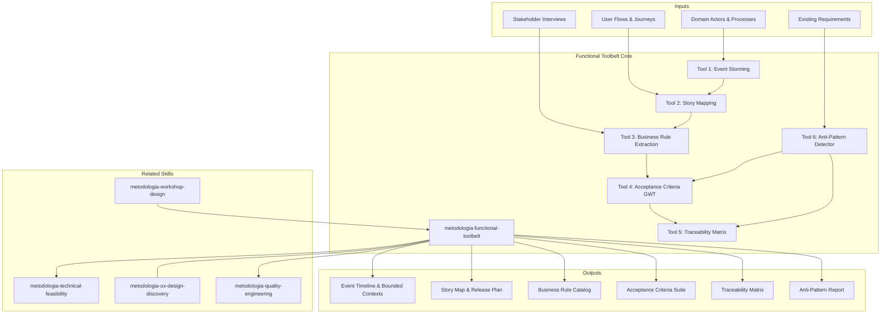

# Functional Toolbelt

Mental models, techniques, and validation tools for producing better functional analysis. NOT a deliverable skill — a **toolbelt** that enhances output quality of any requirements or specification work.

## Principio Rector

**Las herramientas no producen calidad — la disciplina en su uso sí.** El functional toolbelt no es un deliverable — es un kit de técnicas que eleva la calidad de cualquier trabajo de análisis funcional. Event storming sin disciplina es brainstorming caótico. Acceptance criteria sin estructura es prosa ambigua.

### Filosofía del Toolbelt

1. **Técnica correcta para el contexto.** Event storming para descubrir dominios, story mapping para planificar releases, acceptance criteria para validar. No usar martillo para todo.
2. **Formalismo proporcional.** Business rules críticas en pseudo-código. Rules simples en lenguaje natural. El nivel de formalismo depende de la severidad.
3. **Traceability end-to-end.** Cada requirement tiene un origen (stakeholder, rule, flow) y un destino (test, acceptance criteria). Sin trazabilidad, los requirements son declaraciones sueltas.

## $ARGUMENTS

```
$ARGUMENTS format: [tool-name-or-number] [context]
Examples:
  "event-storming loan-origination"     → Tool 1, domain=loan-origination
  "acceptance-criteria user-registration" → Tool 4, story=user-registration
  "anti-patterns scan requirements.md"   → Tool 6, input=requirements.md
  "3 business rules from interviews"     → Tool 3, source=interview notes
```

- If no tool specified → show 6-tool menu with one-line descriptions
- If tool specified without context → ask for the input artifact

### Parámetros de Pipeline

| Parámetro | Valores | Default | Efecto |
|-----------|---------|---------|--------|
| `MODO` | `piloto-auto`, `desatendido`, `supervisado`, `paso-a-paso` | `piloto-auto` | Nivel de intervención humana durante ejecución de herramienta |
| `FORMATO` | `markdown`, `html`, `dual` | `markdown` | Formato de salida del artefacto generado |
| `VARIANTE` | `ejecutiva`, `técnica` | `técnica` | Ejecutiva (~40% contenido, resumen visual) vs técnica (full detail + matrices) |

- `MODO=paso-a-paso` → pausa después de cada tool output para revisión
- `FORMATO=html` → aplica design-system tokens al output
- `VARIANTE=ejecutiva` → solo resumen de hallazgos, sin matrices detalladas

## Output Format Protocol

| FORMATO | Estructura | Uso Principal |
|---------|-----------|---------------|
| `markdown` | Tablas MD, code blocks para GWT, matrices en texto | Wikis, repos, documentación interna |
| `html` | Styled con design-system tokens, tablas responsive, callouts | Presentaciones a stakeholders, deliverables formales |
| `dual` | Ambos generados; MD como fuente, HTML como render | Cuando el equipo necesita editar (MD) y presentar (HTML) |

- Markdown siempre incluye front-matter con metadata (tool used, domain, date)
- HTML aplica brand-config.json si disponible

## Tool 1: Event Storming (Lightweight — 90 min)

**Inputs:** Domain actors, key processes
**Process:** Identify domain events (temporal markers) > Group by aggregate > Identify commands + actors > Surface policies/rules > Mark hot spots (unknowns)
**Output:** Event timeline > domain events > aggregates > bounded contexts

**Edge Cases:**
- Circular events (Order Placed > Payment > Order Placed): surface business rule preventing cycle
- God-aggregate (5+ events): signals context boundary issue — recommend splitting
- Missing actors (events without source): mark as hot spot requiring stakeholder clarification

**Trade-offs:** Speed (90 min) vs completeness (full domain modeling) — prioritize critical paths. Visual (sticky board) vs structured (spreadsheet) — visual aids creativity, spreadsheet aids traceability.

**Conditional Logic:**
- IF events unclear → trace 1 user journey end-to-end first
- IF no process flows exist → generate basic flow from stakeholder interviews
- IF aggregate boundaries disputed → document multiple hypotheses, defer to architecture team

---

## Tool 2: Story Mapping

**Process:** Extract user activities from flows > Decompose to tasks > Write user stories > Assign acceptance criteria > Plot backbone (activities, horizontal) vs detail (stories, vertical) > Slice into releases (MVP, phases 2-3)
**Output:** Backbone > Walking Skeleton (MVP) > Release Plan with story counts

**Edge Cases:**
- Epic masquerading as story (too large): split into 2-3 stories per variant
- Technical story without user value: reframe as infrastructure epic or reject
- Missing happy path: prioritize nominal flow in early release, edge cases later

**Trade-offs:** Granularity (tiny stories, many) vs manageability (fewer, less traceable) — target 8-13 stories per release. Detail (full AC now) vs speed (AC during sprint) — write basic AC now, refine during sprint planning.

**Conditional Logic:**
- IF multiple actors → separate story maps per actor, merge at integration points
- IF story > 13 points → decompose into 2 stories
- IF no metrics for priority → use business risk (revenue loss if not delivered) as proxy

---

## Tool 3: Business Rule Extraction

**Techniques:** Decision Table (conditions > actions > rows = rules), Decision Tree (condition > branches > leaf = outcome), Rule Catalog (name, classification, condition, action, exception, data, owner)

**Classification:** Constraint (what cannot happen), Derivation (what is calculated), Inference (what is deduced), Action-Enabling (what triggers a process)

**Validation:** Completeness (all condition combinations covered?), Consistency (no contradicting rules?), Necessity (traces to business objective?)

**Edge Cases:**
- Ambiguous conditions ("customer is qualified"): decompose into measurable sub-conditions
- Untestable actions ("notify relevant stakeholders"): specify exactly who, when, how
- Hidden exceptions: surface via stakeholder questioning

**Trade-offs:** Formality (decision tables) vs readability (narrative) — use both. Completeness (all rules) vs speed (80% important rules) — prioritize rules tied to business risk.

**Conditional Logic:**
- IF rule involves time → document temporal constraints
- IF rule has >5 conditions → decompose into sub-rules or decision tree
- IF rules conflict → document conflict, escalate to business stakeholder

---

## Tool 4: Acceptance Criteria (Given/When/Then)

**Pattern:** Given [precondition], When [action], Then [expected result]
**Variations:** Basic (single behavior), Extended (+And), Negative (Then = failure), Boundary (edge values)

**Quality Rules (Non-Negotiable):**
1. One behavior per scenario
2. Measurable outcomes (no "works correctly")
3. No implementation details (no "onClick handler fires")
4. Testable preconditions (specific values)
5. Use specific values ("income $75K" not "income")

**Anti-Patterns:** Vague Then ("handle appropriately"), Missing Given, Implementation leakage ("API endpoint called"), Untestable conditions ("under load" without metric), Conjunctive action (3 outcomes = 3 scenarios)

**Edge Cases:**
- Conditional actions (different Then per data): separate scenarios per condition
- Async outcomes: specify max acceptable delay in Then
- Third-party deps ("email delivered"): define acceptable failure mode

**Conditional Logic:**
- IF AC mentions external system → add "system unavailable" scenario
- IF scenarios > 8 per story → split across multiple stories
- IF AC references business rule → link back to rule catalog

---

## Tool 5: Traceability Matrix

**Structure:** Requirement ID | Requirement | Linked Use Cases | Linked Flows | Test Cases | AC Covered

**Validation Rules:**
1. Every requirement has >= 1 use case (else orphaned)
2. Every use case has >= 1 flow (else abstract)
3. Every flow has >= 1 test case (else untested)
4. Every test case traces to >= 1 AC (else invalid)

**Coverage Metrics:** % traced requirements, % untested flows, % AC without tests

**Gap Detection:** Requirements without UCs (disconnected), Flows without UCs (orphaned), Orphan test cases (no AC), AC without tests (unvalidated)

**Edge Cases:**
- Many-to-many (one flow covers multiple requirements): signals decomposition issue
- Matrix > 50 requirements: filter by domain or split
- Regulatory requirements: trace with 100% coverage rigor

**Conditional Logic:**
- IF regulatory → require 100% traceability coverage
- IF critical path flow → ensure >= 2 test cases (happy + error)
- IF gap found → assign to owner (requirements > product, flows > design, tests > QA)

---

## Tool 6: Anti-Pattern Detector

**Categories:**
1. **Ambiguity:** "handle appropriately" (no measurable outcome) → specify exact behavior
2. **Untestability:** "system should be user-friendly" (no metric) → provide measurable criteria
3. **Over-Specification:** "use MySQL 8.0.32" (how not what) → state requirement, let design choose
4. **Missing Exceptions:** "user logs in" (no failure path) → add negative scenarios
5. **Scope Creep:** Requirements not tracing to business objectives → defer or reject
6. **Gold Plating:** Features nobody asked for → require explicit business driver

**Detection Process:** Scan requirements (missing measurements) > Scan AC (implementation details, missing negatives) > Scan rules (untestable conditions) > Scan flows (missing error paths) > Cross-check traceability

**Edge Cases:**
- Intentional underspecification (innovation/exploration phase): mark as exploration story, exempt
- Phase-dependent strictness: lenient in early phases, strict at phase gates
- Regulatory over-specification ("must use FIPS 140-2"): document as compliance constraint, not anti-pattern

**Conditional Logic:**
- IF ambiguity in executive summary → escalate (high visibility)
- IF multiple anti-patterns in same requirement → likely incomplete understanding, request clarification
- IF severity = blocker (missing negative scenario on critical path) → must fix before phase exit

---

## Assumptions & Limits

- Toolbelt is reference, not prescriptive — projects adapt or skip tools based on context
- Tools 1-3 need domain expert input; async facilitation possible but slower
- Output quality depends on input quality — ensure upstream artifacts are solid
- Not a replacement for domain knowledge — surfaces structure, business logic expertise still required
- Event storming assumes access to at least one domain expert; pure documentation-based analysis is weaker
- Traceability matrix scales to ~200 requirements before tooling (Jira, Azure DevOps) becomes necessary
- GWT acceptance criteria assume BDD-aware team; teams unfamiliar with BDD need coaching first

## Edge Cases

| Scenario | Adaptation |
|----------|-----------|
| No domain expert available | Use existing documentation + anti-pattern detector to surface gaps; flag as risk |
| Legacy system with no documentation | Start with reverse event storming (trace from outputs back to events) |
| Regulatory domain (healthcare, finance) | Use full 6-tool suite; traceability matrix mandatory with 100% coverage |
| Agile team resisting formal AC | Start with Tool 4 only (GWT); demonstrate value before introducing full suite |
| Microservices with shared bounded contexts | Event storming per service, then cross-reference at integration points |
| Multi-language stakeholders | Standardize domain glossary first (Tool 3 extraction includes terminology) |

## Macro Trade-offs

| Dimension | Full Suite (6 tools) | Core Set (3-4 tools) | Decision Rule |
|-----------|---------------------|---------------------|---------------|
| Coverage | Robust requirements | Acceptable for low-risk | Use full suite for regulated/complex; core for standard |
| Depth vs breadth | Deep on 2 tools | Surface all 6 | Deep dive for complex domains; surface for known domains |
| Facilitation | In-person (high quality) | Async/tool-driven (scalable) | Hybrid recommended |
| Formalism | Decision tables + pseudo-code | Natural language rules | Pseudo-code for critical/financial rules; NL for UI/UX rules |

## Validation Gate

Before delivering toolbelt output, verify:
- [ ] Tool selection justified for project context
- [ ] Inputs identified and available (or gaps flagged)
- [ ] Edge cases for the selected tool explicitly addressed
- [ ] Output format matches downstream consumer needs
- [ ] Anti-patterns checked on own output (recursive quality)
- [ ] MODO/FORMATO/VARIANTE params respected in output
- [ ] Traceability links present (requirement origin → test destination)
- [ ] Domain glossary terms used consistently across all outputs

## Casos Borde

| Caso | Estrategia de Manejo |
|------|---------------------|
| No hay domain expert disponible para event storming o story mapping | Usar documentacion existente + anti-pattern detector para surfacear gaps; marcar output como developer assumptions, no domain knowledge; flag como riesgo |
| Sistema legacy sin documentacion alguna | Comenzar con reverse event storming (trazar desde outputs hacia atras hasta eventos); combinar con Tool 6 anti-pattern detector para identificar gaps estructurales |
| Dominio regulado (healthcare, finance) requiere trazabilidad 100% | Usar suite completa de 6 herramientas; traceability matrix obligatoria con cobertura 100%; cada requirement trazado desde origen a test case |
| Equipo agile resiste formalizacion de acceptance criteria | Comenzar solo con Tool 4 (GWT); demostrar valor con ejemplos concretos antes de introducir suite completa; no forzar adopcion simultanea |

## Decisiones y Trade-offs

| Decision | Alternativa Descartada | Justificacion |
|----------|----------------------|---------------|
| Disenar como toolbelt de 6 herramientas independientes (no un flujo secuencial) | Pipeline secuencial obligatorio de las 6 herramientas | Los proyectos adaptan o saltan herramientas segun contexto; forzar las 6 en secuencia desperdicia esfuerzo en proyectos simples |
| Formalismo proporcional (pseudo-codigo para reglas criticas, lenguaje natural para reglas simples) | Mismo nivel de formalismo para todas las reglas | El formalismo excesivo en reglas simples genera overhead; el formalismo insuficiente en reglas criticas genera ambiguedad |
| GWT acceptance criteria con regla de un comportamiento por escenario | Permitir multiples comportamientos por escenario GWT | Multiples comportamientos en un escenario hacen los tests fragiles y los resultados ambiguos; un comportamiento = un escenario = un test |

## Knowledge Graph



## Output Templates

**Formato MD (default):**

```
# Functional Toolbelt — {proyecto} — Tool {N}: {nombre}
## Resumen
> Herramienta aplicada: {nombre}. Dominio: {contexto}. Hallazgos: X items generados, Y gaps identificados.
## Output de la Herramienta
[Contenido especifico del tool seleccionado: event timeline, story map, rule catalog, GWT, matrix, o anti-pattern report]
## Gaps Identificados
| Gap | Severidad | Owner Sugerido | Accion |
## Cross-Reference
[Trazabilidad hacia herramientas upstream/downstream]
```

**Formato HTML (para presentacion a stakeholders):**

```
Header: Logo + proyecto + tool seleccionado
Section 1: Tool Output (visualizacion interactiva segun tool)
  - Event Storming: timeline visual con stickies de colores
  - Story Map: backbone horizontal + stories verticales
  - Rule Catalog: tabla expandible con decision trees
  - GWT: scenarios formateados con syntax highlighting
  - Traceability: matrix interactiva con filtros
  - Anti-Patterns: report con semaforo de severidad
Section 2: Gaps & Action Items
Section 3: Cross-References to Related Tools
Footer: Attribution MetodologIA + fecha
```
- Filename: `D-01_Functional_Toolbelt_{project}_{WIP}.html`
- Branded (Design System MetodologIA v5). Light-First Technical page con tool output interactivo adaptado al tool seleccionado (event timeline, story map, traceability matrix, etc.), gaps en semáforo, y cross-references navegables. WCAG AA, responsive, print-ready.

**Formato DOCX (bajo demanda):**
- Filename: `D-01_Functional_Toolbelt_{project}_{WIP}.docx`
- Generado con python-docx bajo MetodologIA Design System v5: portada, TOC automático, encabezados/pies de página con marca, tablas zebra, tipografía Poppins (headings navy), Montserrat (body), acentos dorados

**Formato XLSX (bajo demanda):**
- Filename: `D-01_Functional_Toolbelt_{project}_{WIP}.xlsx`
- Generado con openpyxl bajo MetodologIA Design System v5. Headers con fondo navy y tipografía Poppins blanca, formato condicional, auto-filtros activados, valores sin fórmulas. Hojas: Event Storming, Story Map, Business Rules, Acceptance Criteria, Traceability Matrix, Anti-Patterns.

**Formato PPTX (bajo demanda):**
- Filename: `{fase}_{entregable}_{cliente}_{WIP}.pptx`
- Generado con python-pptx bajo MetodologIA Design System v5. Slide master con degradado navy, títulos Poppins, cuerpo Montserrat, acentos dorados. Máx 20 slides variante ejecutiva / 30 variante técnica. Notas de orador con referencias de evidencia ([CODIGO], [DOC], [INFERENCIA], [SUPUESTO]).

## Evaluacion

| Dimension | Peso | Criterio | Umbral Minimo |
|-----------|------|----------|---------------|
| Trigger Accuracy | 10% | El skill se activa ante prompts de event storming, story map, business rules, GWT, traceability, anti-patterns | 7/10 |
| Completeness | 25% | Tool seleccionado ejecutado completamente; edge cases del tool abordados; output incluye gaps identificados y cross-references | 7/10 |
| Clarity | 20% | Output es consumible por el rol downstream (dev, QA, product); GWT sigue las 5 quality rules; event timeline es cronologica | 7/10 |
| Robustness | 20% | Edge cases cubiertos (sin domain expert, legacy sin docs, regulado, equipo resiste formalizacion); conditional logic aplicada | 7/10 |
| Efficiency | 10% | Tool correcto seleccionado para el contexto; no se ejecuta suite completa cuando una herramienta es suficiente | 7/10 |
| Value Density | 15% | Trazabilidad end-to-end presente; anti-patterns detectados con fix concreto; domain glossary consistente across outputs | 7/10 |

**Umbral minimo global: 7/10.** Si alguna dimension cae por debajo, el entregable requiere revision antes de entrega.

## Cross-References

- `functional-spec` — consumes toolbelt outputs to build formal specification document
- `quality-engineering` — testing strategy informed by traceability matrix (Tool 5)
- `flow-mapping` — process flows feed into event storming (Tool 1) and story mapping (Tool 2)
- `design-system` — when FORMATO=html, applies brand tokens to toolbelt outputs

## Output Artifact

**Primary:** `D-01_Functional_Toolbelt_{project}.md` (o `.html` si `{FORMATO}=html|dual`) — Functional patterns catalog, composition strategies, implementation guidelines.

**Diagramas incluidos:**
- Pattern composition diagram
- Function pipeline flowchart
- Type hierarchy visualization

---
**Autor:** Javier Montaño | **Última actualización:** 12 de marzo de 2026
