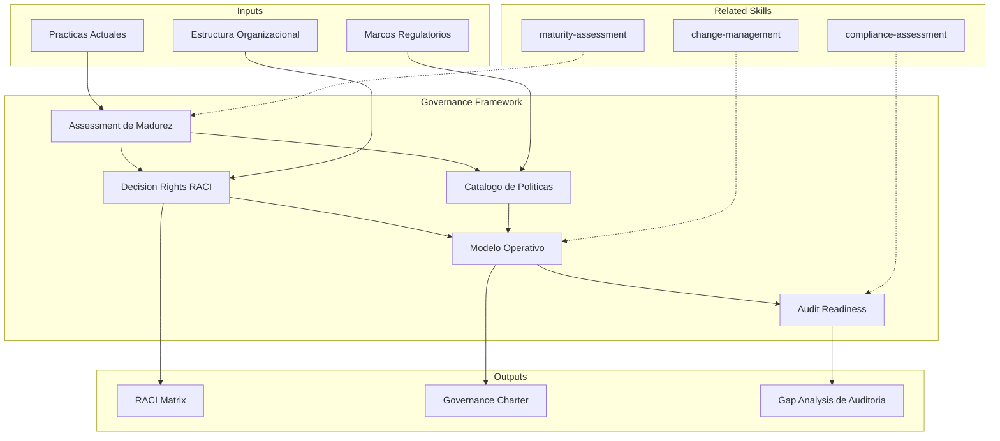

# Framework de Gobernanza TI

Diseno de framework de gobernanza de TI con alineacion a COBIT/ITIL,
definicion de derechos de decision, catalogo de politicas y evaluacion de audit readiness.

## Grounding Guideline

> *Governance without enforcement is suggestion. Governance without flexibility is bureaucracy.*

1. **Proportional governance.** Controls must be proportional to risk — not everything needs the same level of scrutiny.
2. **Clear RACI, defined escalation.** If nobody knows who decides, nobody decides. If nobody knows how to escalate, everything gets escalated.
3. **Automate the repeatable.** Manual controls degrade — automated ones persist.

## TL;DR

- Assess current governance maturity against reference frameworks (COBIT, ITIL)
- Define decision rights structure with RACI matrix per domain
- Design IT policy catalog with lifecycle and enforcement
- Assess readiness for internal and external audits
- Generate governance charter with complete operating model

## Inputs

Parse `$1` como **nombre de la organizacion**, `$2` como **scope de gobernanza**.

**Parameters:**
- `{MODO}`: `piloto-auto` (default) | `desatendido` | `supervisado` | `paso-a-paso`
- `{FORMATO}`: `markdown` (default) | `html` | `dual`
- `{VARIANTE}`: `ejecutiva` (~40%) | `tecnica` (full, default)

## Deliverables

1. **Governance Charter** — Principles, structure, roles, meeting cadence
2. **RACI Matrix** — Decision rights per domain and organizational level
3. **Policy Catalog** — Inventory of required policies with priority and status
4. **Audit Readiness Assessment** — Gaps against common audit requirements
5. **Operating Model** — Governance processes, escalation paths, metrics

## Process

1. **Maturity Assessment** — Assess current governance against COBIT domains:
   | Dominio | Descripcion | Nivel Actual | Nivel Target |
   |---|---|---|---|
   | APO (Align, Plan, Organize) | Estrategia y planificacion de TI | 1-5 | 1-5 |
   | BAI (Build, Acquire, Implement) | Gestion de cambios y proyectos | 1-5 | 1-5 |
   | DSS (Deliver, Service, Support) | Operaciones y soporte | 1-5 | 1-5 |
   | MEA (Monitor, Evaluate, Assess) | Monitoreo y compliance | 1-5 | 1-5 |
2. **Decision Rights Definition** — Map key decisions to roles with RACI:
   - Architecture: who approves architectural changes
   - Security: who defines and enforces policies
   - Data: who governs quality, access, retention
   - Investments: who approves technology spend
3. **Policy Catalog Design** — Identify required policies per domain, prioritize, define templates
4. **Audit Readiness Assessment** — Verify evidence, controls, traceability against standards (ISO 27001, SOC 2, etc.)
5. **Operating Model** — Define governance cadence, committees, escalation, KPIs
6. **Implementation Roadmap** — Progressive implementation plan per quarter

## Quality Criteria

- [ ] Assessment de madurez con scoring por dominio COBIT
- [ ] RACI matrix completa para decisiones clave de TI
- [ ] Catalogo de politicas con priorizacion y templates
- [ ] Gaps de audit readiness documentados con remediacion
- [ ] Modelo operativo con cadencia, roles y metricas definidas
- [ ] Roadmap de implementacion realista con quick wins
- [ ] Diagrama Mermaid de estructura de gobernanza

## Assumptions & Limits

- Asume sponsor ejecutivo con autoridad para definir decision rights
- No reemplaza asesoria legal o de compliance — complementa con estructura operativa
- Niveles de madurez COBIT son evaluaciones cualitativas salvo que existan auditorias previas
- Politicas disenadas son templates; requieren revision legal antes de enforcement formal

## Edge Cases

| Escenario | Estrategia de Manejo |
|---|---|
| Organizacion sin gobernanza formal (startup en crecimiento) | Disenar governance lite: 3-5 politicas criticas, RACI minimo, reunion mensual; escalar progresivamente |
| Gobernanza existente pero no enforced | Diagnosticar root cause (falta de ownership, complejidad excesiva); simplificar antes de agregar |
| Multiples marcos regulatorios simultaneos (SOC 2 + ISO 27001 + GDPR) | Mapear controles comunes (common controls framework) para evitar duplicacion de esfuerzo |
| Resistencia organizacional a gobernanza formal | Enmarcar como enablement (acelerar decisiones) no como control; empezar con quick wins visibles |

## Decisions & Trade-offs

| Decision | Habilita | Restringe | Justificacion |
|---|---|---|---|
| COBIT como framework de referencia default | Cobertura integral de dominios de TI | Puede ser excesivo para organizaciones pequenas | Es el framework mas completo; se adapta seleccionando dominios relevantes |
| RACI como modelo de decision rights | Claridad de roles sin ambiguedad | Requiere mantenimiento cuando cambian roles | Es el modelo mas entendido; alternativas (DACI, RAPID) se usan cuando RACI no es suficiente |
| Implementacion progresiva por trimestre | Reduce resistencia al cambio | Beneficios completos tardan 9-12 meses | Evita big-bang que fracasa por sobrecarga; permite ajustes basados en feedback |

## Knowledge Graph

## Output Templates

**Formato 1 — Markdown (default)**
- Filename: `Governance_Framework_{org}_{WIP|Aprobado}.md`
- Estructura: Charter > Assessment COBIT > RACI Matrix > Catalogo de Politicas > Modelo Operativo > Audit Readiness > Roadmap
- Incluye diagramas Mermaid de estructura de comites y flujo de escalation

**Formato 2 — XLSX (RACI y tracking operativo)**
- Filename: `Governance_RACI_{org}_{WIP|Aprobado}.xlsx`
- Estructura: Sheet 1 (RACI Matrix por dominio) > Sheet 2 (Catalogo de Politicas con status) > Sheet 3 (Audit checklist con evidencia)
- Optimizado para uso operativo y seguimiento de implementacion

**Formato 3 — HTML (bajo demanda)**
- Filename: `Governance_Framework_{org}_{WIP}.html`
- Estructura: HTML self-contained branded (Design System MetodologIA v5). Dark-First Executive page con COBIT maturity radar, RACI matrix navegable, y roadmap de implementacion con quick wins destacados. WCAG AA, responsive, print-ready.

**Formato 4 — DOCX (bajo demanda)**
- Filename: `Governance_Framework_{org}_{WIP}.docx`
- Generado con python-docx bajo MetodologIA Design System v5: portada, TOC automático, encabezados/pies de página con marca, tablas zebra, tipografía Poppins (headings navy), Trebuchet MS (body), acentos dorados

**Formato 5 — PPTX (bajo demanda)**
- Filename: `{fase}_{entregable}_{cliente}_{WIP}.pptx`
- Generado con python-pptx bajo MetodologIA Design System v5. Slide master con degradado navy, títulos Poppins, cuerpo Trebuchet MS, acentos dorados. Máx 20 slides variante ejecutiva / 30 variante técnica. Notas de orador con referencias de evidencia ([CODIGO], [DOC], [INFERENCIA], [SUPUESTO]).

## Evaluacion

| Dimension | Peso | Criterio |
|-----------|------|----------|
| Trigger Accuracy | 10% | Activa triggers correctos ante keywords de gobernanza, COBIT, ITIL, RACI, auditoria |
| Completeness | 25% | Cubre assessment, decision rights, politicas, modelo operativo y audit readiness |
| Clarity | 20% | RACI matrix no tiene ambiguedad en roles; politicas tienen scope y enforcement claros |
| Robustness | 20% | Maneja startups sin gobernanza, multiples marcos regulatorios, resistencia organizacional |
| Efficiency | 10% | Proceso escala con variante ejecutiva; no duplica evaluaciones entre dominios COBIT |
| Value Density | 15% | Cada politica y decision right es accionable; roadmap tiene quick wins identificados |

**Umbral minimo**: 7/10 en cada dimension para considerar el skill production-ready.

## Cross-References

- **metodologia-maturity-assessment:** Evaluacion de madurez alimenta assessment de gobernanza
- **metodologia-compliance-assessment:** Audit readiness como extension de compliance
- **metodologia-change-management:** Implementacion de gobernanza requiere gestion de cambio

---
**Autor:** Javier Montaño · Comunidad MetodologIA | **Version:** 1.0.0
