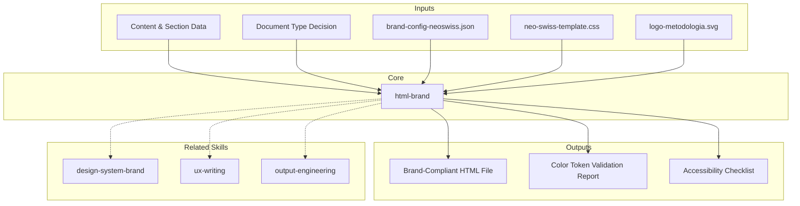

# MetodologIA HTML Brand — Neo-Swiss Document Generator

Generate beautiful, accessible, on-brand HTML deliverables following the **MetodologIA Neo-Swiss Clean & Soft Explainer** design system (v6). Every output is a self-contained single-file HTML document with all CSS inline, no external dependencies, and full WCAG AA accessibility.

## Grounding Guideline

**A deliverable without brand identity is visual noise disguised as a document.** Branded HTML generation is not aesthetics — it is strategic communication. Every color token, every typeface, every component reinforces the credibility and authority of the message.

### Brand HTML Philosophy

1. **Brand = Visual trust.** Every Design System element exists to convey professionalism and consistency. Breaking a brand token is breaking the visual promise to the client.

2. **Self-contained = Guaranteed portability.** An HTML file that depends on external resources is a fragile deliverable. File autonomy is a functional requirement, not a technical preference.

3. **Accessibility = Real reach.** WCAG AA is not compliance — it is the guarantee that 100% of stakeholders can consume the deliverable without barriers. A beautiful document that cannot be read has zero impact.

---

## CRITICAL: Before Generating ANY HTML

**ALWAYS read these two files first:**

```
Read ${CLAUDE_SKILL_DIR}/../../references/brand-config-neoswiss.json
Read ${CLAUDE_SKILL_DIR}/../../references/neo-swiss-template.css
```

The JSON provides the single source of truth for all tokens. The CSS template provides the canonical stylesheet to embed in every HTML document. **Do NOT hardcode values from memory — read the files.**

For the logo SVG:
```
Read ${CLAUDE_SKILL_DIR}/../../references/assets/logo-metodologia.svg
```

For design tokens reference:
```
Read ${CLAUDE_SKILL_DIR}/references/design-tokens.md
```

For batch operations or edge cases:
```
Read ${CLAUDE_SKILL_DIR}/references/operations-guide.md
```

---

## Design System Identity

| Property | Value |
|----------|-------|
| **Name** | Neo-Swiss Clean & Soft Explainer |
| **Version** | v6.0 |
| **Aesthetic** | Light off-white body, navy hero+footer, gold accents, Swiss 8px grid, soft corporate shadows |
| **Primary** | Navy `#122562` |
| **Accent** | Gold `#FFD700` |
| **Action** | Blue `#137DC5` |
| **Body bg** | Off-white `#F8F9FC` |
| **Dark text** | `#1F2833` |
| **Title font** | Poppins (400-800) |
| **Body font** | Trebuchet MS |
| **Note font** | Futura / Century Gothic |

---

## When to Use

- Creating branded HTML deliverables for client presentations
- Upgrading existing HTML documents to MetodologIA Neo-Swiss design
- Batch processing multiple files to brand compliance
- Generating executive, technical, or transformation documents
- Building self-contained HTML reports with WCAG AA accessibility

## When NOT to Use

- Multi-page web applications with routing → use a framework (React, Vue)
- Interactive dashboards with live data → build a dedicated app
- Print-only documents → use PDF generation tools
- Content writing → **metodologia-ux-writing** for microcopy and readability

---

## Assumptions & Limits

- Output is single-file HTML with inline CSS; Google Fonts `<link>` tags are the only external dependency
- Neo-Swiss design: Navy #122562 primary, Gold #FFD700 accent, Poppins display, Trebuchet MS body
- Does NOT handle multi-page apps, routing, or state management (use a framework)
- Does NOT embed base64 images (bloat); use relative paths or CDN URLs
- Cannot produce interactive dashboards with live data (build a React/Vue app)
- Maximum 15 sections per document; beyond that, split into separate deliverables

## Edge Cases

| Case | Handling Strategy |
|---|---|
| HTML existente corrupto con CSS mezclado de DS v1/v2/v3/v4/v5 | Parsear contenido salvable (texto, tablas, datos). Reconstruir desde neo-swiss-template.css preservando content. Flag como generacion degradada si se pierde estructura. |
| Documento con >15 secciones solicitado por el cliente | Dividir en 2 deliverables enlazados con navigation footer cruzado. Cada documento self-contained. Maximo 12 secciones por archivo para UX optima de TOC. |
| Output requerido en idioma RTL (arabe, hebreo) | Agregar `dir="rtl"` en `<html>`. Mirror layout: border-left a border-right en accent cards. Testear texto bidireccional. Validar contrast con fonts RTL. |
| Entorno sin acceso a Google Fonts CDN (red corporativa restringida) | Fallback a system-ui, -apple-system, sans-serif. Documentar degradacion visual. Alternativa: embeber font subset en base64 si peso total < 500KB. |

## Decisions & Trade-offs

| Decision | Discarded Alternative | Justification |
|---|---|---|
| Single-file HTML self-contained sobre modular CSS+JS | Archivos CSS y JS separados | Portabilidad garantizada: un archivo se abre en cualquier browser sin dependencias. Deliverables modulares rompen al moverse entre carpetas o enviarse por email. |
| Gold (#FFD700) para accent sobre cyan/indigo | Indigo #6366F1 (DS v4/v5 legacy) | Gold transmite calidez y autoridad profesional. Indigo era frio y generico. Gold es diferenciador visual de MetodologIA. |
| Poppins display + Trebuchet MS body sobre una sola familia | Inter para todo (DS v4/v5 legacy) | Poppins aporta personalidad y autoridad en headings. Trebuchet MS es legible y profesional para body. Una sola font colapsa la jerarquia. |
| Off-white #F8F9FC body bg sobre dark bg | Dark #1A1A2E / #0F172A (DS v4/v5 legacy "Dark Authority") | Light backgrounds improve readability for business documents. Dark bg was eye-fatiguing for long-form reading. Neo-Swiss = professional, not dramatic. |

## Knowledge Graph



## Output Templates

**Formato HTML (primary):**
```html
<!DOCTYPE html>
<html lang="es">
<head>
  <meta charset="UTF-8">
  <meta name="viewport" content="width=device-width, initial-scale=1.0">
  <title>{titulo} — MetodologIA</title>
  <link href="https://fonts.googleapis.com/css2?family=Poppins:wght@400;500;600;700;800&display=swap" rel="stylesheet">
  <style>
    /* === neo-swiss-template.css (embed full contents) === */
  </style>
</head>
<body>
  <a href="#main" class="skip-link">Ir al contenido</a>
  <header class="hero">
    <!-- Navy bg, gold 6px bottom border, SVG logo, badges, h1 with gold <em>, 4-col KPIs -->
  </header>
  <nav class="toc"><!-- sticky, gold active underline, uppercase font-note links --></nav>
  <main class="container" id="main">
    <section id="section-1">
      <div class="section-header">
        <div class="section-number">01</div>
        <div><h2>Title</h2></div>
      </div>
      <!-- content: cards, tables, callouts, custom components -->
    </section>
  </main>
  <footer class="site-footer">
    <!-- Navy bg, gold top border, logo+wordmark, gold chip badges, muted bottom row -->
  </footer>
  <script>/* TOC tracking */</script>
</body>
</html>
```

---

## Color Rules

Neo-Swiss uses blue for positive/success states because it maintains brand coherence with the professional MetodologIA palette.

| Semantic State | Color | Variable | Usage |
|---------------|-------|----------|-------|
| Positive/Success | Blue #137DC5 | `--positive` / `--blue` | Health indicators, wins, checkmarks |
| Warning | Amber #D97706 | `--warning` | Caution states, medium severity |
| Critical/Error | Red #DC2626 | `--critical` | Failures, blockers, high severity |
| Accent/Highlight | Gold #FFD700 | `--gold` | CTA, emphasis, hero highlights |

Green is ONLY for charts and data visualization — never for semantic states.

See `references/design-tokens.md` for the complete CSS variable system.

## Content Density by Document Type

| Dimension | Executive | Technical | Transformation |
|-----------|-----------|-----------|----------------|
| Sections | 8-12 | 10-15 | 8-10 |
| Words/section | 60-100 | 150-250 | 100-180 |
| KPIs/section | 3-4 | 1-2 | 2-3 |
| Paragraphs/section | Max 2 | Up to 5 | Max 3 |
| Visuals/section | 1 | 1 diagram | 1 |

## Document Type Decision Tree

```
Is the primary audience C-level / board / stakeholders?
├─ YES → EXECUTIVE
│   Goal: decision support in 15 min
│   Sections: 8-12, KPI-dense, lead with metrics
│
└─ NO → Is it about architecture, APIs, or technical decisions?
    ├─ YES → TECHNICAL DEEP-DIVE
    │   Goal: engineer/architect understanding
    │   Sections: 10-15, diagrams, ADRs, code
    │
    └─ NO → Multi-year roadmap or business transformation?
        ├─ YES → TRANSFORMATION DIGITAL
        │   Goal: rally business + tech
        │   Sections: 8-10, "why" first, timeline + ROI
        │
        └─ NO → Default to EXECUTIVE (safest for mixed audiences)
```

## Component Usage by Document Type

| Component | Executive | Technical | Transformation | Notes |
|-----------|-----------|-----------|----------------|-------|
| Hero KPI strip | Required | Optional | Required | Lead with metrics |
| Score bars | Heavy | Light | Medium | Progress/maturity |
| Callout cards | Heavy | Medium | Heavy | Strategic points |
| Diagram boxes | Light | Heavy | Light | Architecture/code |
| Data tables | Light | Medium | Light | Limit to 8 rows |
| Timeline (.steps) | None | None | Required | 4-6 milestones |
| Custom cards | Medium | Medium | Medium | Per-document bespoke components |

## Generation Workflow

### Phase 1: Load Brand Assets
1. Read `brand-config-neoswiss.json` — extract all token values
2. Read `neo-swiss-template.css` — this IS the complete CSS to embed
3. Read `logo-metodologia.svg` — embed inline in hero and footer
4. Determine document type (decision tree above)

### Phase 2: Plan
1. List 8-15 sections with IDs (`id="section-1"`)
2. Assign components per section using the type table
3. Draft hero KPI list (3-4 metrics max)
4. Design custom card components if the document has unique content types

### Phase 3: Build
1. Start with `<!DOCTYPE html>` skeleton
2. Embed full neo-swiss-template.css in `<style>` block
3. Add custom CSS for document-specific components (cards, badges, etc.)
4. Build hero with navy bg, gold border, inline SVG logo, KPIs
5. Build TOC with section links
6. Build `<main>` sections with numbered headers and content
7. Wire footer with navy bg, gold border, logo, badges

### Phase 4: Quality Gate
1. Read top to bottom: any placeholder text remaining?
2. Visual consistency: all sections follow numbered pattern?
3. Color audit: only brand + semantic colors from brand-config?
4. All CSS uses variables from `:root` block (no hardcoded colors)?
5. WCAG AA contrast met on all text?

## Anti-Patterns

| Anti-Pattern | Why It Breaks the Brand | Fix |
|-------------|------------------------|-----|
| Indigo #6366F1 as primary | Legacy DS v4/v5 token — NOT MetodologIA brand | Use navy #122562 |
| Cyan #22D3EE for success | Legacy DS v4/v5 token | Use blue #137DC5 for positive |
| Inter as body font | Legacy DS v4/v5 | Use Trebuchet MS |
| Clash Grotesk as display | Legacy DS v4/v5 | Use Poppins |
| Dark bg (#1A1A2E) for body | "Dark Authority" aesthetic is deprecated | Use off-white #F8F9FC |
| Green for success | Clashes with warm Neo-Swiss palette | Use blue #137DC5 |
| External stylesheets | Breaks self-contained guarantee | Inline all CSS in `<style>` block |
| Base64 inline images | Bloats file past 500KB limit | Use relative paths or CDN URLs |
| >4 hero KPIs | Visual overload, metrics lose impact | Move extras to "Key Metrics" section |
| Sections without numbers | Breaks core brand identity pattern | Always use 01, 02... numbered headers |
| Wrong shadows (rgba(0,0,0,...)) | Neo-Swiss uses navy-tinted shadows | Use rgba(18,37,98,...) |

## Constraints

| Constraint | Limit | Reason |
|-----------|-------|--------|
| File size | 500 KB max | Browser performance |
| Sections | 15 max | TOC usability |
| Table rows | 8 visible | Use modal/scroll for more |
| Title length | 65 chars max | SEO + readability |
| Hero KPIs | 4 max | Visual balance |
| Modals per doc | 3 max | Event listener overhead |
| Contrast ratio | 4.5:1 body, 3:1 large | WCAG AA |

## Validation Gate

Before delivering any HTML document, verify:

- [ ] `brand-config-neoswiss.json` was read before generation
- [ ] `neo-swiss-template.css` was embedded as the base CSS
- [ ] Document type matches audience (executive/technical/transformation)
- [ ] All colors use CSS variables from Neo-Swiss `:root` (no hardcoded hex outside tokens)
- [ ] Typography: Poppins for titles/headings, Trebuchet MS for body (NO Inter, NO Clash Grotesk)
- [ ] Hero has navy bg (#122562), gold 6px bottom border (#FFD700), inline SVG logo
- [ ] Hero has 3-4 KPIs maximum with gold `<em>` highlight
- [ ] Every section has numbered header (01, 02...) with unique ID
- [ ] Section numbers are navy 56px squares with gold text
- [ ] TOC links match all section IDs, gold active underline
- [ ] Semantic states use correct colors (blue=#137DC5 positive, NOT green, NOT cyan)
- [ ] Shadows use navy-tinted rgba(18,37,98,...) NOT black rgba(0,0,0,...)
- [ ] WCAG AA contrast ratio met on all text (4.5:1 body, 3:1 large)
- [ ] File size under 500KB
- [ ] Skip-link present: `<a href="#main" class="skip-link">`
- [ ] Single-file HTML with no external dependencies (except Poppins font link)
- [ ] `lang="es"` (or appropriate language) on `<html>` element
- [ ] No placeholder text remaining in output
- [ ] Footer has navy bg, gold top border, SVG logo, tagline
- [ ] Zero instances of: #6366F1, #22D3EE, #1A1A2E, #0F172A, Clash Grotesk, Inter (legacy tokens)

## Batch Processing

When upgrading 3+ files at once, use parallel sub-agents. Read `references/operations-guide.md` for the squad pattern, concurrency limits, and error handling.

## Reference Files

| File | When to Read | What It Contains |
|------|-------------|-----------------|
| `../../references/brand-config-neoswiss.json` | **ALWAYS — before building any document** | Single source of truth: all tokens, colors, typography, format specs |
| `../../references/neo-swiss-template.css` | **ALWAYS — embed as base CSS** | Complete 488-line canonical CSS template |
| `../../references/assets/logo-metodologia.svg` | **ALWAYS — embed in hero + footer** | Inline SVG logo (squircle + 3 pillars + gold circle) |
| `references/design-tokens.md` | Before building any document | Complete CSS variable system, component classes, typography, shadows, spacing |
| `references/operations-guide.md` | For batch processing, edge cases, acceptance criteria | Squad pattern, safe text replacement, RTL/bilingual, full checklist |

## Usage

```
/metodologia-html-brand executive ./output/brief.html
/metodologia-html-brand technical                       # outputs to current directory
/metodologia-html-brand --batch ./legacy-docs/          # upgrade 3+ files in parallel
```

Parse `$1` as document type (`executive`, `technical`, `transformation`) or `--batch` flag. Parse `$2` as output path.

**Parameters:**
- `{MODO}`: `piloto-auto` (default) | `desatendido` | `supervisado` | `paso-a-paso`
- `{FORMATO}`: `html` (default) | `dual` (html + markdown source)
- `{VARIANTE}`: `ejecutiva` (~40%) | `tecnica` (full, default)

## Cross-References

- **metodologia-design-system-brand:** Multi-format design system (this skill implements the HTML format)
- **metodologia-output-engineering:** Ghost menu pipeline that routes to this skill for HTML
- **metodologia-brand-docx:** DOCX format (use instead of this skill for Word documents)
- **metodologia-brand-pptx:** PPTX format (use instead of this skill for presentations)
- **metodologia-brand-xlsx:** XLSX format (use instead of this skill for spreadsheets)
- **metodologia-ux-writing:** UX writing standards for microcopy and readability

## Output Artifact

**Primary:** `HB-01_HTML_Brand_{project}.html` — Brand-compliant HTML deliverable with Neo-Swiss tokens, WCAG AA accessibility, numbered sections, hero KPIs.

**Secondary:** Component usage audit, color token validation report, accessibility checklist.

---

**Design System:** Neo-Swiss v6 | **Last Updated:** 2026-03-17

---
**Autor:** Javier Montano | **Ultima actualizacion:** 17 de marzo de 2026
