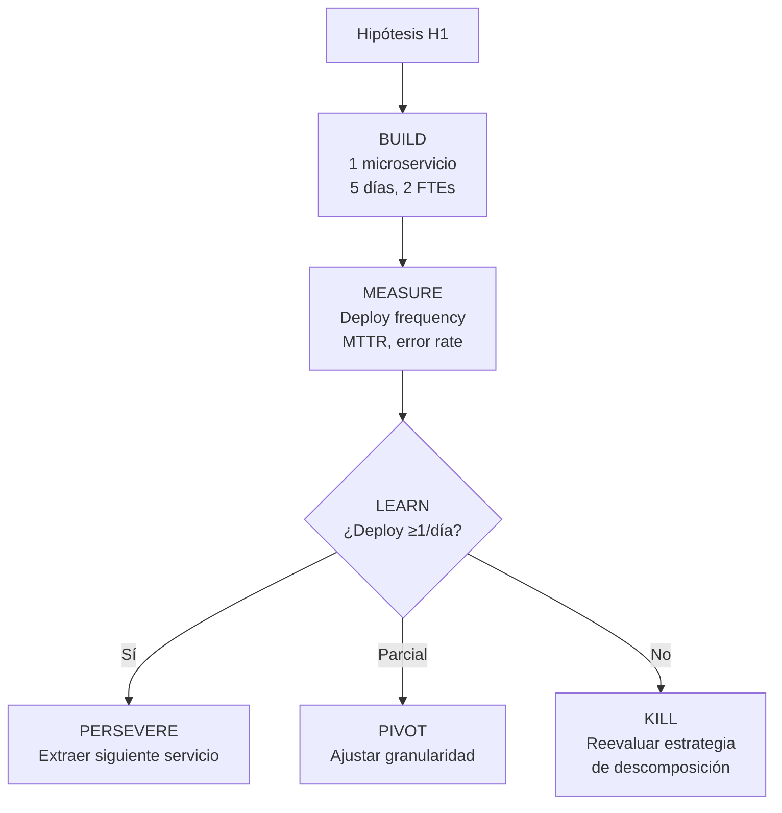
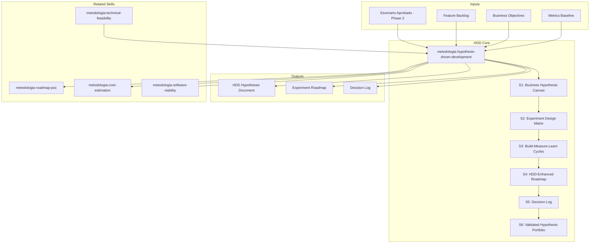

# Hypothesis-Driven Development: Lean Startup for Technical Discovery

Transforms modernization proposals into testable hypotheses with Build-Measure-Learn cycles.
Instead of assuming a solution works and planning its full execution, HDD proposes:
first the hypothesis, then the minimum experiment, then the evidence, then the decision.

## Guiding Principle

**We do not assume it works. We propose that it should work, define how we would know, and test it.**

Classic discovery produces a roadmap based on the "best-case scenario." HDD produces a roadmap based on
**incrementally validated hypotheses**. Each roadmap phase is an experiment. Each gate is a decision
point: kill, pivot, or persevere.

### HDD Philosophy

1. **Every feature is a hypothesis, not a certainty.** "Migrating to microservices will improve time-to-market"
   is a hypothesis. It needs metrics, thresholds, and an experiment to validate it.
2. **Fast failure is a success.** Discovering in Sprint 2 that a hypothesis is false saves months of
   execution in the wrong direction.
3. **Kill is a valid decision.** If the experiment refutes the hypothesis, killing the work stream is
   the correct decision. Escalating sunk cost fallacy is the worst decision.
4. **Metrics before code.** Define what we will measure BEFORE building. If we do not know what to measure,
   we do not know what we are testing.
5. **Build-Measure-Learn, not Build-Build-Build.** Each cycle is short (1-5 days). Build the minimum
   to measure. Measure to learn. Learn to decide.

### References

- **Eric Ries** — The Lean Startup (2011): Build-Measure-Learn loop
- **Jeff Gothelf** — Lean UX (2013): Hypothesis-driven design
- **Paulo Caroli** — Lean Inception (2018): Discovery as lean inception
- **Martin Fowler** — Evolutionary Architecture: fitness functions as architecture hypotheses
- **Barry O'Reilly** — Hypothesis-Driven Development in enterprise

## Inputs

Parse `$1` as **project/scenario name**.
Requires: approved scenario (Phase 3), feature backlog, business objectives.
Recommended: metrics baseline (current performance), stakeholder priorities.

## HDD Hypothesis Structure

```
HIPÓTESIS #{N}
══════════════
Creemos que: [acción/cambio propuesto]
Para: [audiencia/sistema afectado]
Resultará en: [outcome esperado]
Lo sabremos cuando: [métrica observable]
Con umbral de éxito: [valor cuantitativo]

Experimento:
  Tipo: [spike/PoC/MVP/A-B test/shadow deployment]
  Duración: [N sprints de 1 día]
  Recursos: [N FTEs]
  Entregable mínimo: [qué se construye]
  Medición: [cómo se mide]

Decisión:
  Kill si: [métrica < umbral_kill]
  Pivot si: [umbral_kill ≤ métrica < umbral_success]
  Persevere si: [métrica ≥ umbral_success]
```

## Delivery Structure

### S1: Business Hypothesis Canvas

Transform scenario objectives into business hypotheses:

| # | Hipótesis | Métrica | Umbral Éxito | Umbral Kill | Prioridad |
|---|-----------|---------|-------------|-------------|-----------|
| H1 | Migrar checkout a microservicio reduce time-to-deploy | Deploy frequency | ≥1/día | <1/semana | MUST |
| H2 | Event-driven architecture mejora resiliencia | MTTR | <15min | >60min | MUST |
| H3 | Nuevo design system aumenta conversión | Conversion rate | +15% | <+5% | SHOULD |

### S2: Experiment Design Matrix

For each hypothesis, design the minimum experiment:

| Hipótesis | Tipo Experimento | Duración | FTEs | Entregable Mínimo | Métrica de Salida |
|-----------|-----------------|----------|------|-------------------|-------------------|
| H1 | PoC: 1 servicio extraído | 5 sprints (5 días) | 2 | Checkout service deployable | Deploy frequency medido |
| H2 | Spike: event bus prototype | 3 sprints | 1 | Kafka consumer funcional | Message processing time |
| H3 | A/B test: nuevo vs viejo | 10 sprints | 1 | Feature flag + nuevo UI | Conversion rate A vs B |

### S3: Build-Measure-Learn Cycles

Map each hypothesis to BML cycles:



### S4: HDD-Enhanced Roadmap

The traditional roadmap is transformed:

**Before (classic roadmap):**
```
Fase 1 → Fase 2 → Fase 3 → Fase 4 → Entrega
```

**After (HDD roadmap):**
```
H1:Experiment → H1:Measure → H1:Decision → [Kill|Pivot|Persevere]
                                              ↓
H2:Experiment → H2:Measure → H2:Decision → [Kill|Pivot|Persevere]
                                              ↓
H3:Experiment → H3:Measure → H3:Decision → [Kill|Pivot|Persevere]
```

Each hypothesis has its own cycle. MUST hypotheses go first. If a MUST fails, re-evaluate the entire scenario.

### S5: Decision Log

| Sprint | Hipótesis | Métrica Obtenida | Umbral | Decisión | Rationale |
|--------|-----------|-----------------|--------|----------|-----------|
| D5 | H1 | Deploy freq: 2/día | ≥1/día | ✅ PERSEVERE | Supera umbral |
| D8 | H2 | MTTR: 45min | <15min | 🔄 PIVOT | Necesita retry logic |
| D18 | H3 | Conversion: +3% | +15% | ❌ KILL | ROI no justifica |

### S6: Validated Hypothesis Portfolio

At the end of the process, the portfolio shows:

| Hipótesis | Status | Evidencia | Impacto Validado | Siguiente Paso |
|-----------|--------|-----------|-----------------|---------------|
| H1 | ✅ Validada | Deploy 2x/día medido | Time-to-market -60% | Escalar a 5 servicios |
| H2 | 🔄 Pivotada | MTTR mejoró a 20min | Resiliencia +70% | Agregar retry + circuit breaker |
| H3 | ❌ Matada | Conversión +3% (insuficiente) | No justifica inversión | Reasignar FTEs |

## Integration with Discovery Pipeline

| Phase | Without HDD | With HDD |
|------|---------|---------|
| **Phase 3 (Scenarios)** | "Scenario B is better" | "Scenario B has 5 testable hypotheses" |
| **Phase 3b (Think Tank)** | "It is feasible" | "Hypotheses H1-H3 are experimentable in N days" |
| **Phase 4 (Roadmap)** | "Sprint 1: migrate X, Sprint 2: migrate Y" | "Sprint 1: Experiment H1, Gate: kill/pivot/persevere" |
| **Phase 4b (Costing)** | "We estimate 50 FTE-months" | "Validating H1-H3 costs 5 FTE-months. Executing validated hypotheses costs 45 FTE-months" |

## When to Use

- Formulating scenarios as testable propositions (Phase 3)
- Designing validation experiments for the Think Tank (Phase 3b)
- Building HDD-enhanced roadmaps (Phase 4)
- When the client asks "how do we know this will work?"
- When there is significant uncertainty in the proposed solution

## When NOT to Use

- Well-understood migrations with proven patterns (lift-and-shift)
- Regulatory compliance projects with fixed scope
- Emergency/crisis responses where speed overrides learning

## Trade-off Matrix

| Decision | Enables | Constrains | When to Use |
|---|---|---|---|
| Full HDD (all features as hypotheses) | Maximum learning, minimum waste | Higher ceremony, slower initial progress | High uncertainty, new technology, large investment |
| Partial HDD (only MUST features) | Focused validation on critical items | May miss risks in SHOULD/COULD | Medium uncertainty, time pressure |
| HDD for architecture only | Validates big decisions | Features not individually validated | Architecture-driven transformation |
| No HDD (classic roadmap) | Simplest, fastest to plan | Assumes solution works | Low uncertainty, proven patterns |

## Edge Cases

| Scenario | Response |
|---|---|
| All hypotheses validated | Rare but ideal — proceed with high confidence, reduce contingency margin |
| MUST hypothesis killed | Stop roadmap. Return to Phase 3 scenarios. May need different scenario |
| Pivot cascades (pivot triggers new hypothesis) | Allow max 2 pivot chains. If still failing, kill |
| Client refuses to kill | Document sunk cost fallacy risk. Proceed with explicit disclaimer |
| No baseline metrics available | First experiment = establish baseline. Add 1-2 sprints for measurement setup |

## Validation Gate

- [ ] Every MUST feature has an HDD hypothesis
- [ ] Each hypothesis has: metric, success threshold, kill threshold
- [ ] Experiments designed with minimum viable scope
- [ ] BML cycles mapped with decision points
- [ ] Kill/Pivot/Persevere criteria are quantitative, not qualitative
- [ ] Integration with roadmap phases documented

## Casos Borde

| Caso | Estrategia de Manejo |
|------|---------------------|
| Cliente no tiene baseline de metricas para definir umbrales | El primer experimento se dedica a establecer baseline; agregar 1-2 sprints de instrumentacion antes de formular hipotesis con umbrales cuantitativos |
| Todas las hipotesis MUST son validadas exitosamente | Caso raro pero ideal; reducir margen de contingencia en el roadmap; documentar evidencia para fortalecer la propuesta de inversion |
| Cadena de pivots en cascada (pivot genera nueva hipotesis que tambien falla) | Permitir maximo 2 niveles de pivot encadenados; si el tercer intento falla, ejecutar kill y retornar a Phase 3 para reevaluar el escenario completo |
| Stakeholders se rehusan a ejecutar kill a pesar de evidencia negativa | Documentar explicitamente el riesgo de sunk cost fallacy; escalar a sponsor ejecutivo con datos cuantitativos; proceder con disclaimer formal si insisten |

## Decisiones y Trade-offs

| Decision | Alternativa Descartada | Justificacion |
|----------|----------------------|---------------|
| Formular cada feature MUST como hipotesis testeable | Tratar features como requisitos fijos sin validacion | Las features asumidas sin evidencia son la causa principal de desperdicio en transformaciones; HDD reduce riesgo antes de comprometer presupuesto |
| Ciclos BML cortos de 1-5 dias por experimento | Sprints largos de 2-4 semanas para validacion | Ciclos cortos permiten decision rapida; ciclos largos acumulan costo antes de generar evidencia y retrasan el kill/pivot |
| Kill criteria cuantitativos y binarios | Criterios cualitativos como "el equipo siente que funciona" | Los criterios cualitativos son susceptibles a sesgo de confirmacion; solo metricas medibles producen decisiones objetivas |

## Knowledge Graph



## Output Templates

**Formato MD (default):**

```
# HDD Hypotheses — {proyecto}
## Resumen Ejecutivo
> N hipotesis formuladas, M experimentos disenados, timeline estimado: X sprints.
## S1: Business Hypothesis Canvas
| # | Hipotesis | Metrica | Umbral Exito | Umbral Kill | Prioridad |
## S2: Experiment Design Matrix
| Hipotesis | Tipo Experimento | Duracion | FTEs | Entregable Minimo |
## S3-S6: [secciones completas con diagramas BML]
## Apendice: Referencias y Supuestos
```

**Formato PPTX (para presentacion a steering committee):**

```
Slide 1: Titulo + contexto del escenario
Slide 2: Hypothesis Canvas (tabla resumen de H1-Hn)
Slide 3-N: Una slide por hipotesis (hipotesis + experimento + criterios kill/pivot/persevere)
Slide N+1: Roadmap HDD (timeline visual con gates de decision)
Slide N+2: Investment ask (esfuerzo para validar vs esfuerzo para ejecutar)
Slide N+3: Decision framework (que pasa si H1 falla, si H2 pivota, etc.)
```

**Formato HTML (bajo demanda):**
- Filename: `A-03_HDD_Hypotheses_{project}_{WIP}.html`
- Estructura: HTML self-contained branded (Design System MetodologIA v5). Light-First Technical page con hypothesis canvas interactivo, BML cycle diagrams, y decision log con semáforo Kill/Pivot/Persevere. WCAG AA, responsive, print-ready.

**Formato DOCX (bajo demanda):**
- Filename: `A-03_HDD_Hypotheses_{project}_{WIP}.docx`
- Generado con python-docx bajo MetodologIA Design System v5: portada, TOC automático, encabezados/pies de página con marca, tablas zebra, tipografía Poppins (headings navy), Montserrat (body), acentos dorados

**Formato XLSX (bajo demanda):**
- Filename: `A-03_HDD_Hypotheses_{project}_{WIP}.xlsx`
- Generado con openpyxl bajo MetodologIA Design System v5. Headers con fondo navy y tipografía Poppins blanca, formato condicional, auto-filtros activados, valores sin fórmulas. Hojas: Hypothesis Canvas, Experiment Design Matrix, Decision Log, Validated Portfolio.

## Evaluacion

| Dimension | Peso | Criterio | Umbral Minimo |
|-----------|------|----------|---------------|
| Trigger Accuracy | 10% | El skill se activa ante prompts de hipotesis, lean startup, BML, validacion de escenarios | 7/10 |
| Completeness | 25% | Cada feature MUST tiene hipotesis con metrica, umbral de exito, umbral de kill, y experimento disenado | 7/10 |
| Clarity | 20% | Stakeholders no tecnicos entienden la estructura hipotesis-experimento-decision; diagramas BML son legibles | 7/10 |
| Robustness | 20% | Edge cases cubiertos (sin baseline, all-pass, cascade pivots, kill resistance); decision log estructurado | 7/10 |
| Efficiency | 10% | Experimentos disenados con scope minimo viable; no se sobre-disenian validaciones innecesarias | 7/10 |
| Value Density | 15% | Cada hipotesis conecta directamente a valor de negocio; el portfolio muestra impacto validado cuantificado | 7/10 |

**Umbral minimo global: 7/10.** Si alguna dimension cae por debajo, el entregable requiere revision antes de entrega.

## Output Configuration

- **Language**: Spanish (Latin American, business register — simple, clear, concise, direct)
- **Attribution**: Expert committee of the MetodologIA Discovery Framework
- **Tagline**: *"Construido por profesionales, potenciado por la red agéntica de MetodologIA."*

## Output Artifact

**Primary:** `A-03_HDD_Hypotheses_{project}.md`

### Diagrams (Mermaid)
- Flowchart TD: Build-Measure-Learn cycles per hypothesis
- Gantt: experiment timeline with decision gates

---
**© Comunidad MetodologIA — All rights reserved**