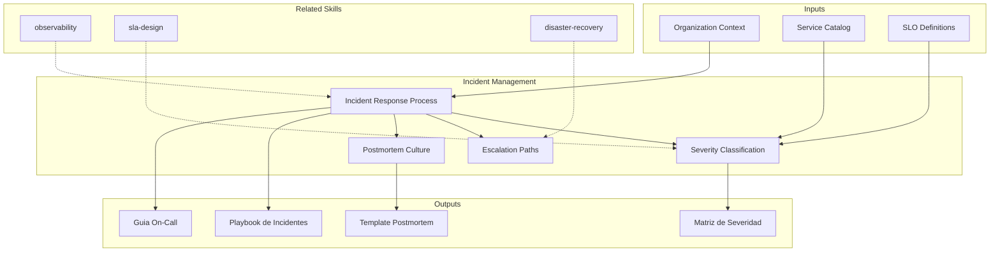

# Incident Management: Response Framework & Postmortem Culture

Incident management establishes structured response processes that minimize the impact of production incidents through clear severity classification, defined escalation paths, and blameless postmortem practices. The skill produces incident playbooks, severity matrices, and communication templates.

## TL;DR

- Define clasificacion de severidad (SEV1-SEV4) con criterios objetivos y tiempos de respuesta
- Disena flujo de respuesta a incidentes con roles claros (IC, comunicador, solucionador)
- Establece paths de escalamiento con contactos, tiempos maximos y criterios de escalada
- Produce templates de postmortem blameless con analisis de causa raiz y action items
- Crea templates de comunicacion para stakeholders internos y externos durante incidentes

## Inputs

The user provides an organization or service name as `$ARGUMENTS`. Parse `$1` as the **organization/service name**.

**Parameters:**
- `{MODO}`: `piloto-auto` (default) | `desatendido` | `supervisado` | `paso-a-paso`
- `{FORMATO}`: `markdown` (default) | `html` | `dual`
- `{VARIANTE}`: `ejecutiva` (~40%) | `tecnica` (full, default)
- `{MADUREZ}`: `inicial` | `definido` | `gestionado` | `auto` (default)

## Entregables

1. **Playbook de incidentes** — End-to-end incident response process with roles, phases, and decision trees
2. **Matriz de severidad** — Severity classification (SEV1-SEV4) with objective criteria, response times, and escalation triggers
3. **Templates de comunicacion** — Pre-built templates for internal updates, customer notifications, and status page messages
4. **Template de postmortem** — Blameless postmortem structure with timeline, root cause analysis, impact assessment, and action items
5. **Guia de on-call** — On-call rotation design, handoff procedures, and responder wellness guidelines

## Proceso

1. **Definir severidad** — Establish severity levels with objective criteria: user impact (% affected), revenue impact, data integrity, security breach
2. **Disenar flujo de respuesta** — Map incident lifecycle: detection → triage → response → mitigation → resolution → postmortem
3. **Asignar roles** — Define incident roles: Incident Commander (IC), Communications Lead, Technical Lead, Scribe
4. **Crear escalamiento** — Build escalation matrix: who to contact per severity, maximum time at each level, automatic escalation triggers
5. **Disenar comunicacion** — Create templates for each phase: initial detection, ongoing updates (every 30/60 min), resolution, and postmortem summary
6. **Establecer postmortem** — Define postmortem trigger criteria, timeline format, 5-whys analysis, action item tracking, and blameless culture guidelines
7. **Planificar on-call** — Design rotation schedule, compensation model, handoff procedures, and burnout prevention measures
8. **Definir metricas** — Track: MTTD (detect), MTTA (acknowledge), MTTR (resolve), incident frequency, postmortem completion rate

## Criterios de Calidad

- [ ] Severity levels have objective, measurable criteria (not subjective judgment)
- [ ] Response time targets defined per severity level (acknowledge, update, resolve)
- [ ] Roles are clearly defined with backup assignments
- [ ] Escalation paths include time-based automatic escalation
- [ ] Communication templates cover internal and external audiences
- [ ] Postmortem template enforces blameless language and structural analysis
- [ ] On-call rotation considers team wellness and sustainable workload
- [ ] Metrics defined for continuous improvement of incident response

## Supuestos y Limites

- Assumes monitoring and alerting infrastructure exists to detect incidents
- Incident management process effectiveness depends on regular practice (game days, drills)
- Does not implement tooling — produces process and template artifacts
- Blameless culture requires organizational commitment beyond documentation

## Casos Borde

1. **Organizacion sin monitoreo previo** — Si no existe infraestructura de alerting, el skill prioriza deteccion manual y establece un plan de adopcion de observabilidad como prerequisito. Se genera un playbook interino basado en reportes de usuario.
2. **Incidentes simultaneos (tormenta de alertas)** — Cuando multiples incidentes ocurren al mismo tiempo, el proceso define prioridad por impacto al negocio, asigna ICs separados y establece un meta-IC para coordinacion cruzada.
3. **Equipo distribuido en multiples zonas horarias** — El modelo de on-call se adapta con rotaciones follow-the-sun, handoff asincronico documentado y tiempos de respuesta ajustados por zona horaria.
4. **Cultura organizacional resistente al blameless** — Se incluye guia de facilitacion de postmortems con lenguaje prescrito, ejemplos de reframing y metricas de salud cultural para medir progreso.

## Decisiones y Trade-offs

1. **SEV1-SEV4 vs. escala de 3 niveles** — Se eligen 4 niveles porque 3 son insuficientes para distinguir entre degradacion parcial y falla total; 5+ generan confusion en la clasificacion rapida durante crisis.
2. **Postmortem para todo SEV1-SEV2 vs. selectivo** — Se requiere postmortem obligatorio en SEV1-SEV2 para asegurar aprendizaje sistematico, aceptando el costo de tiempo; SEV3-SEV4 son opcionales por criterio del equipo.
3. **Tiempos de respuesta fijos vs. basados en contexto** — Se definen tiempos fijos por severidad para eliminar ambiguedad durante crisis, pero se permite overrides documentados cuando el contexto lo justifica.
4. **Rotaciones de on-call semanales vs. diarias** — Se recomienda rotacion semanal como default para minimizar context switching, con opcion de diaria para equipos grandes donde la carga es alta.

## Knowledge Graph

## Output Templates

### Markdown (default)
- Filename: `ops_incident-playbook_{servicio}_{WIP}.md`
- Structure: TL;DR -> Matriz de severidad -> Flujo de respuesta (Mermaid) -> Templates de comunicacion -> Postmortem template -> Metricas

### DOCX
- Filename: `ops_incident-playbook_{servicio}_{WIP}.docx`
- Via Pandoc: portada con logo -> TOC -> matriz de severidad -> diagramas de flujo -> templates -> anexos de contacto

### HTML (bajo demanda)
- Filename: `ops_incident-playbook_{servicio}_{WIP}.html`
- Estructura: HTML self-contained branded (Design System MetodologIA v5). Light-First Technical page con severity matrix interactiva, escalation flow diagram, y postmortem template imprimible. WCAG AA, responsive, print-ready.

### XLSX (bajo demanda)
- Filename: `ops_incident-playbook_{servicio}_{WIP}.xlsx`
- Generado con openpyxl bajo MetodologIA Design System v5. Headers con fondo navy y tipografía Poppins blanca, formato condicional, auto-filtros activados, valores sin fórmulas. Hojas: Severity Matrix, Escalation Paths, Communication Templates, Postmortem Log, On-Call Roster.

### PPTX (bajo demanda)
- Filename: `{fase}_{entregable}_{cliente}_{WIP}.pptx`
- Generado con python-pptx bajo MetodologIA Design System v5. Slide master con degradado navy, títulos Poppins, cuerpo Montserrat, acentos dorados. Máx 20 slides variante ejecutiva / 30 variante técnica. Notas de orador con referencias de evidencia ([CODIGO], [DOC], [INFERENCIA], [SUPUESTO]).

## Evaluacion

| Dimension | Peso | Criterio |
|-----------|------|----------|
| Trigger Accuracy | 10% | Activa correctamente ante "incident process", "severity levels", "postmortem" sin falsos positivos en monitoring o alerting |
| Completeness | 25% | Cubre severidad, escalamiento, comunicacion, postmortem y on-call sin huecos |
| Clarity | 20% | Roles, tiempos y procedimientos son ejecutables sin ambiguedad durante crisis |
| Robustness | 20% | Maneja tormentas de alertas, equipos distribuidos y cultura no-blameless |
| Efficiency | 10% | Proceso de 8 pasos sin redundancia; cada fase produce artefacto concreto |
| Value Density | 15% | Cada seccion es directamente usable en produccion, no teoria generica |

**Umbral minimo**: 7/10 en cada dimension para considerar el skill production-ready.

## Cross-References

- **metodologia-observability:** Monitoring and alerting that triggers incident detection
- **metodologia-sla-design:** SLO violations that define incident severity and impact
- **metodologia-disaster-recovery:** DR procedures invoked during major incidents (SEV1)

---
**Autor:** Javier Montaño · Comunidad MetodologIA | **Version:** 1.0.0
