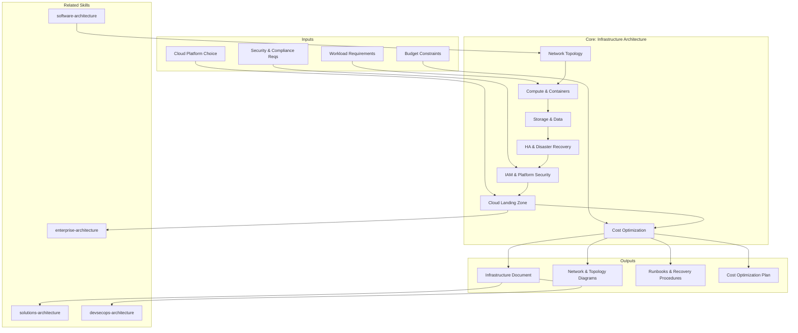

# Infrastructure Architecture: Platform & Runtime Design

Infrastructure architecture designs where and how software runs — compute resources, network topology, data storage, high availability, disaster recovery, identity management, and cost optimization. It answers: "How do we provide a platform for applications?"

## Principio Rector

**La infraestructura invisible es la mejor infraestructura.** La plataforma existe para que las aplicaciones corran — no para ser admirada. Se diseña para reliability, cost-efficiency, y self-service. Si los desarrolladores necesitan pedir tickets para desplegar, la infra falló en su misión.

### Filosofía de Infraestructura

1. **Infrastructure as Code, siempre.** Si no está en código, no existe. Terraform, Pulumi, o CDK — nunca consolas manuales en producción.
2. **HA/DR no es opcional.** Multi-AZ es el mínimo. RPO y RTO se definen ANTES del diseño, no después del primer incidente.
3. **FinOps desde Day 1.** El costo de la nube no se controla al final — se diseña desde el principio. Reserved instances, right-sizing, y cost alerts son parte del diseño.

## Inputs

The user provides a system or platform name as `$ARGUMENTS`. Parse `$1` as the **platform/system name** used throughout all output artifacts.

**Parameters:**
- `{MODO}`: `piloto-auto` (default) | `desatendido` | `supervisado` | `paso-a-paso`
  - **piloto-auto**: Auto para análisis de infra y network design, HITL para decisiones de HA/DR y cost commitments.
  - **desatendido**: Cero interrupciones. Infraestructura documentada automáticamente. Supuestos documentados.
  - **supervisado**: Autónomo con checkpoint en network topology, compute strategy, y cost optimization.
  - **paso-a-paso**: Confirma cada VPC, subnet, compute choice, storage tier, y cost recommendation.
- `{FORMATO}`: `markdown` (default) | `html` | `dual`
- `{VARIANTE}`: `ejecutiva` (~40% — S1 network topology + S4 HA/DR + S7 cost optimization) | `técnica` (full 7 sections, default)

Before generating architecture, detect infrastructure context:

```
!find . -name "*.tf" -o -name "*.yaml" -o -name "Dockerfile" -o -name "*.hcl" | head -20
```

If reference materials exist, load them:

```
Read ${CLAUDE_SKILL_DIR}/references/cloud-patterns.md
Read ${CLAUDE_SKILL_DIR}/references/cost-models.md
```

---

## When to Use

- Designing cloud infrastructure (AWS, Azure, GCP) or on-premises platforms
- Planning network topology (VPCs, subnets, firewalls, load balancers, CDN)
- Defining HA/DR strategy (availability zones, failover, backup, recovery)
- Designing IAM model (service accounts, roles, least privilege, zero trust)
- Planning cost optimization (reserved instances, spot, auto-scaling, right-sizing)
- Establishing cloud landing zones (account structure, guardrails, compliance)
- Capacity planning (compute, storage, bandwidth for growth and peaks)

## When NOT to Use

- Internal software structure → **metodologia-software-architecture**
- End-to-end solution design → **metodologia-solutions-architecture**
- Enterprise portfolio alignment → **metodologia-enterprise-architecture**
- Build pipelines and security controls → **metodologia-devsecops-architecture**

---

## Delivery Structure: 7 Sections

### S1: Network Topology

Design of network architecture ensuring connectivity, segmentation, security, and resilience.

**VPC/Network Architecture:** Subnets by tier:
- Public: load balancers, NAT gateways, bastion hosts
- Private: application servers (no inbound from internet)
- Protected: databases, sensitive data (no outbound)

**Connectivity:** Intra-region, inter-region, VPN, Direct Connect/dedicated circuits

**Firewalls & Security Groups:** Network ACLs (stateless), Security Groups (stateful), least privilege

**Load Balancing:** L4 (NLB), L7 (ALB), geographic (Route 53, CloudFront)

**DNS & CDN:** Public DNS, private DNS (service discovery), CDN (cache globally)

**DDoS & WAF:** Shield/Cloudflare for DDoS, WAF for application-layer attacks

### S2: Compute & Containers

Strategy for running workloads — VMs, containers, or serverless.

**VMs:** Full control, best for legacy/compliance. Trade-off: more management overhead.
**Containers (Docker/K8s):** Standardized, portable. Best for microservices. Trade-off: orchestration complexity.
**Serverless:** No infra management, pay per invocation. Best for event-driven. Trade-off: cold start, vendor lock-in, cost at scale.

**Kubernetes Architecture (if containers):**
- Control plane (3+ nodes), worker nodes (auto-scale), add-ons (ingress, autoscaler, monitoring)

**Auto-Scaling:** Horizontal (stateless), vertical (stateful); metrics: CPU, memory, custom, queue depth
**Resource Limits:** Requests (guaranteed), limits (max); balanced for predictability vs. flexibility

### S3: Storage & Data

Data persistence — performance, reliability, cost.

**Block Storage:** Virtual hard drives for IOPS-intensive workloads (databases)
**Object Storage:** Distributed, durable, cheap at scale (backups, logs, media, data lake)
**File Storage:** Shared filesystem (NFS) for multi-instance access

**Database Hosting:** Managed (RDS/Cloud SQL: less ops, more cost) vs. self-managed (full control, more ops)

**Backup & DR:**
- RPO: acceptable data loss; RTO: acceptable downtime
- Backup frequency vs. storage cost trade-off
- Geographically separate backup location; restore testing mandatory

**Data Tiering:** Hot (SSD), warm (standard), cold (archive/Glacier); lifecycle policies for automatic transitions

### S4: HA & Disaster Recovery (Multi-AZ, Chaos)

Strategy for surviving failures and maintaining continuity.

**Failure Modes:**
- Single instance → redundancy (replicas, failover)
- Zone failure → multi-AZ deployment
- Region failure → multi-region replication
- Data corruption → immutable backups, point-in-time recovery
- Application bug → blue-green, canary releases

**Multi-Region:** Active-passive (lower cost, longer RTO) vs. active-active (higher cost, low RTO, eventual consistency)

**Failover Mechanisms:** DNS-based, load balancer, database replica promotion; automatic vs. manual

**Chaos Testing:** Regularly kill instances, fail services, simulate zone failures. Tools: Gremlin, LitmusChaos, Chaos Monkey. Goal: validate assumptions before production incidents.

### S5: IAM & Platform Security

Identity and access management for infrastructure resources.

- **Identity Federation:** SSO via SAML/OIDC, LDAP for legacy
- **Service Accounts:** Short-lived credentials, least-privilege IAM roles
- **Secrets Management:** Vault/AWS Secrets Manager/Azure Key Vault; centralized, rotated, audited
- **Network Segmentation:** Public/private/protected tiers with explicit allow rules
- **Encryption:** In transit (TLS 1.2+), at rest (storage, backups); key management with rotation
- **Compliance & Audit:** CloudTrail/audit logs (immutable), compliance scanning, secrets scanning

### S6: Cloud Landing Zone & Governance

Foundation for safe, scalable, compliant cloud deployment.

**Account Structure:** Management (billing/guardrails), shared services (logging/monitoring/security), workload accounts (dev/staging/prod per app or team)

**Guardrails:** Preventive (SCPs: no public S3 buckets) + Detective (Config/Security Hub: monitor violations)

**Tagging Strategy:** Owner, environment, cost center, application, compliance. Enables: cost allocation, resource discovery, compliance audits.

**Billing & Cost Allocation:** Tag-based allocation, budgets & alerts, reserved instances, savings plans

**Network:** Hub-and-spoke (centralized shared VPC), Transit Gateway, central DNS

### S7: Cost Optimization

Strategies for reducing cloud spend without sacrificing performance or reliability.

- **Right-Sizing:** Analyze utilization, downsize over-provisioned resources, review monthly
- **Commitment Discounts:** Reserved Instances (30-70% off, steady-state), Savings Plans (flexible), Spot (70-90% off, fault-tolerant batch)
- **Managed vs. Self-Managed:** Break-even analysis: when operational cost exceeds unit cost savings
- **Auto-Scaling:** Scale down off-peak (save 30-50%), predictive scaling, cost-aware metrics
- **Storage Optimization:** Delete unused resources, compress data (Parquet vs. CSV), lifecycle policies
- **Data Transfer:** Minimize inter-AZ and NAT Gateway egress; CDN reduces origin bandwidth
- **Monitoring & Governance:** Cost dashboards, anomaly detection, chargeback model

---

## Trade-off Matrix

| Decision | Enables | Constrains | When to Use |
|---|---|---|---|
| **Multi-AZ** | Survive zone failure | ~2x cost, complexity | Critical workloads, availability SLA |
| **Multi-Region** | Survive region failure, global low latency | Very high cost, eventual consistency | Global app, strict RPO/RTO |
| **RDS Managed DB** | Less ops overhead | Higher cost, less control | Most workloads, HA required |
| **Self-Managed DB** | Control, potentially lower cost | High ops burden, backup responsibility | Specialized needs, sufficient ops team |
| **Kubernetes** | Flexibility, standard, portable | Ops complexity | Polyglot, stateless, K8s-experienced teams |
| **Serverless** | No infra management | Cold start, vendor lock-in, cost at scale | Event-driven, unpredictable load |
| **Reserved Instances** | 30-70% discount | Inflexibility, upfront cost | Predictable, steady-state workloads |
| **Spot Instances** | 70-90% discount | Interruption risk | Fault-tolerant batch, non-critical |

---

## Assumptions

- Workload requirements understood (performance, availability, compliance)
- Cloud platform chosen (AWS, Azure, GCP, or hybrid)
- Budget exists for infrastructure
- Team has cloud operations capability (or is building it)
- Security and compliance requirements known
- Infrastructure-as-code practices assumed (Terraform, CloudFormation)

## Limits

- Does not design application software (see **metodologia-software-architecture**)
- Does not design end-to-end solutions (see **metodologia-solutions-architecture**)
- Focuses on cloud infrastructure; on-premises design is parallel effort

---

## Casos Borde

| Caso | Estrategia de Manejo |
|---|---|
| Migracion on-premises a cloud | Periodo hibrido con coexistencia on-prem y cloud; strangler fig con VPN connectivity; migracion por fases con rollback por workload |
| Multi-cloud (AWS + Azure + GCP) | Capa de abstraccion (Kubernetes) para portabilidad; tagging consistente cross-cloud; gobernanza multi-cloud centralizada |
| Regulacion estricta (financiero, salud) | Data residency por pais/region; cuentas dedicadas con encryption, audit trails; assessments periodicos de compliance |
| Escala extrema (millones de usuarios) | Infraestructura global con caching en cada nivel; spot instances para batch; cost optimization desde Day 1; capacidad de 10x-100x sin degradacion |
| Startup con presupuesto limitado | Serverless donde sea posible; auto-scaling agresivo; spot instances; evitar reserved instances hasta que los patrones de uso sean predecibles |

## Decisiones y Trade-offs

| Decision | Alternativa Descartada | Justificacion |
|---|---|---|
| Infrastructure as Code como unico metodo de provision | Consolas manuales o clickops | Lo que no esta en codigo no existe de forma reproducible; Terraform/Pulumi/CDK garantizan auditabilidad, reproducibilidad y rollback |
| Multi-AZ como minimo para workloads criticos | Single-AZ con backup manual | El costo de downtime supera el costo de redundancia; multi-AZ es el baseline de disponibilidad enterprise |
| FinOps integrado desde el diseno, no al final | Optimizacion de costos post-despliegue | El costo de la nube no se controla al final; right-sizing, reserved instances y cost alerts son decisiones de diseno, no de operacion |
| Managed services por defecto sobre self-managed | Self-managed para todo | El costo operacional de self-managed supera el ahorro unitario en la mayoria de los casos; self-managed solo cuando hay necesidades especificas que managed no cubre |

## Knowledge Graph



## Output Templates

| Formato | Nombre | Contenido |
|---|---|---|
| **Markdown** | `A-04_Infrastructure_Architecture_Deep.md` | Documento completo con Network Topology, Compute Strategy, Storage, HA/DR, IAM, Cloud Landing Zone y Cost Optimization. Diagramas Mermaid de VPC topology y dependency graph. |
| **XLSX** | `A-04_Infrastructure_Cost_Model.xlsx` | Modelo de costos con drivers por servicio, comparativa managed vs self-managed, proyeccion de crecimiento a 12 meses, y recomendaciones de right-sizing. |
| **HTML** | `A-04_Infrastructure_Architecture_Deep_{WIP}.html` | Mismo contenido en HTML branded (Design System MetodologIA v5). Self-contained, WCAG AA, responsive. Light-First Technical. Incluye diagrama interactivo de topología VPC, tabla comparativa managed vs self-managed, y checklist de HA/DR con estado visual. |
| **DOCX** | `A-04_Infrastructure_Architecture_{cliente}_{WIP}.docx` | Generado con python-docx bajo MetodologIA Design System v5: portada, TOC automático, encabezados/pies de página con marca, tablas zebra, tipografía Poppins (headings navy), Montserrat (body), acentos dorados. |
| **PPTX** | `{fase}_{entregable}_{cliente}_{WIP}.pptx` | Generado con python-pptx bajo MetodologIA Design System v5. Slide master con degradado navy, títulos Poppins, cuerpo Montserrat, acentos dorados. Máx 20 slides variante ejecutiva / 30 variante técnica. Notas de orador con referencias de evidencia ([CODIGO], [DOC], [INFERENCIA], [SUPUESTO]). |

## Evaluacion

| Dimension | Peso | Criterio |
|---|---|---|
| Trigger Accuracy | 10% | Descripcion activa triggers correctos (cloud infrastructure, VPC, HA/DR, Kubernetes, cost optimization) sin falsos positivos con software architecture o solutions architecture |
| Completeness | 25% | Las 7 secciones cubren network, compute, storage, HA/DR, IAM, landing zone y costos sin huecos; todas las capas de infraestructura representadas |
| Clarity | 20% | Instrucciones ejecutables sin ambiguedad; cada decision de infraestructura tiene justificacion contra workload requirements; trade-offs explicitos |
| Robustness | 20% | Maneja migracion on-prem, multi-cloud, regulacion estricta, escala extrema y presupuesto limitado con estrategias diferenciadas |
| Efficiency | 10% | Proceso no tiene pasos redundantes; variante ejecutiva reduce a S1+S4+S7 sin perder decisiones criticas de disponibilidad y costo |
| Value Density | 15% | Cada seccion aporta valor practico directo; trade-off matrix y cost optimization son herramientas de decision inmediata |

**Umbral minimo: 7/10.**

---

## Validation Gate

Before finalizing delivery, verify:

- [ ] Network is secure (segmented, least privilege, encryption)
- [ ] Compute capacity matches workload requirements
- [ ] Storage is reliable (replicated, backed up, tested recovery)
- [ ] HA/DR strategy documented with tested procedures
- [ ] IAM enforced (least privilege, no shared credentials)
- [ ] Cloud landing zone established with guardrails
- [ ] Cost optimized (right-sized, committed discounts where applicable)
- [ ] Infrastructure is version-controlled (IaC)
- [ ] Monitoring and alerting cover availability, performance, cost, security
- [ ] Team can manage and scale infrastructure with documented runbooks

---

## Cross-References

- **metodologia-software-architecture:** Defines application requirements that infrastructure must support
- **metodologia-solutions-architecture:** Integration patterns constrain network topology; observability stack runs on infrastructure
- **metodologia-enterprise-architecture:** Technology radar and governance guide infrastructure decisions
- **metodologia-devsecops-architecture:** Pipeline deploys to infrastructure; security gates verify compliance

## Output Format Protocol

| Format | Default | Description |
|--------|---------|-------------|
| `markdown` | Yes | Rich Markdown + Mermaid diagrams. Token-efficient. |
| `html` | On demand | Branded HTML (Design System). Visual impact. |
| `dual` | On demand | Both formats. |

Default output is Markdown with embedded Mermaid diagrams. HTML generation requires explicit `{FORMATO}=html` parameter.

## Output Artifact

**Primary:** `A-04_Infrastructure_Architecture_Deep.html` — Executive summary, network topology, compute strategy, storage/database architecture, HA/DR strategy, IAM/security, cloud landing zone, cost optimization.

**Secondary:** Network diagram (VPC topology), auto-scaling policy, backup/recovery runbook, security compliance checklist, cost optimization quick wins.

---
**Autor:** Javier Montaño | **Última actualización:** 12 de marzo de 2026
