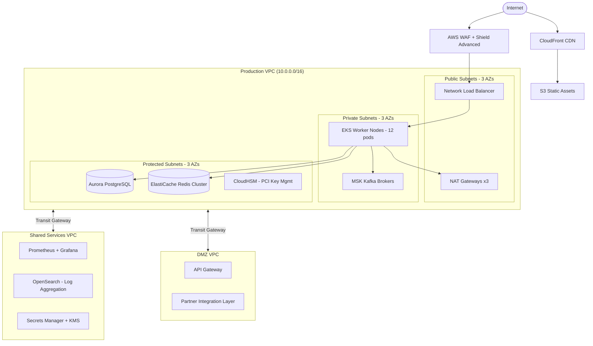
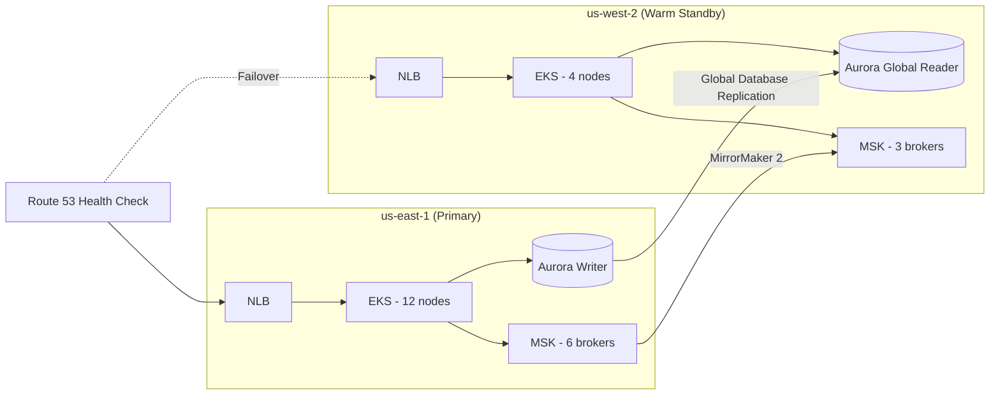

# Infrastructure Architecture — Acme Corp Banking Modernization

Infrastructure and platform design for Acme Corp's core banking modernization. Multi-VPC landing zone on AWS supporting 2.4M customers, 12,000 transactions/second peak, 99.99% availability SLA, and PCI-DSS/SOX compliance requirements. Primary region us-east-1 with active-passive DR to us-west-2.

---

## S1: Network Topology

### VPC Architecture (4 VPCs)

| VPC | CIDR | Purpose | Subnets | AZs |
|-----|------|---------|---------|-----|
| **Production** | 10.0.0.0/16 | Core banking workloads | 9 (3 public, 3 private, 3 protected) | 3 |
| **Staging** | 10.1.0.0/16 | Pre-production validation | 6 (3 public, 3 private) | 3 |
| **Shared Services** | 10.2.0.0/16 | Logging, monitoring, CI/CD, secrets | 6 (3 public, 3 private) | 3 |
| **DMZ** | 10.3.0.0/16 | External API gateway, partner integrations | 6 (3 public, 3 private) | 3 |

### Production VPC Subnet Design

- **Public subnets** (10.0.1.0/24, 10.0.2.0/24, 10.0.3.0/24): NLB, NAT Gateways, bastion host (one per AZ)
- **Private subnets** (10.0.10.0/24, 10.0.20.0/24, 10.0.30.0/24): EKS worker nodes, application pods
- **Protected subnets** (10.0.100.0/24, 10.0.200.0/24, 10.0.250.0/24): RDS Aurora, ElastiCache, Kafka brokers -- no internet route

### Network Architecture

### Security Controls

| Control | Implementation | Scope |
|---------|---------------|-------|
| DDoS protection | AWS Shield Advanced | NLB, CloudFront |
| WAF rules | OWASP Core Rule Set + custom banking rules | API Gateway, NLB |
| Network ACLs | Stateless, deny by default | All subnets |
| Security Groups | Stateful, port-level least privilege | All instances |
| VPC Flow Logs | All traffic, 90-day retention | All VPCs |
| TLS | 1.3 enforced, 1.2 minimum | All in-transit |

---

## S2: Compute & Containers

### EKS Cluster Design

| Component | Configuration | Rationale |
|-----------|--------------|-----------|
| Control Plane | AWS-managed, 3 AZs | 99.95% SLA |
| Base Node Group | 6x m7i.2xlarge (on-demand) | Steady-state capacity, Graviton considered but vendor SDK compatibility required |
| Burst Node Group | 0-18x m7i.xlarge (Spot + on-demand mix) | Peak hours and month-end processing |
| Critical Node Group | 3x m7i.xlarge (on-demand, dedicated) | Payment processing pods -- no preemption |
| Autoscaler | Karpenter | Sub-60s node provisioning |

### Resource Budgets

| Workload | CPU Request | Memory Request | Replicas | Priority |
|----------|-----------|---------------|----------|----------|
| Payment Service | 1000m | 2Gi | 6 | Critical |
| Account Service | 500m | 1Gi | 4 | High |
| Fraud Engine | 2000m | 4Gi | 3 | Critical |
| Notification Service | 250m | 512Mi | 3 | Normal |
| API Gateway | 500m | 1Gi | 4 | High |

### Namespaces

`banking-core`, `banking-payments`, `banking-fraud`, `banking-notifications`, `platform-monitoring`, `platform-ingress`, `platform-jobs`

---

## S3: Storage & Data

### Database Architecture

| Service | Technology | Instance | HA | Purpose |
|---------|-----------|----------|-----|---------|
| Core Banking DB | Aurora PostgreSQL 15 | db.r7g.2xlarge | 3-node cluster (writer + 2 readers) | Accounts, customers, transactions |
| Fraud Analytics | Amazon OpenSearch | r6g.xlarge.search x3 | Multi-AZ | Real-time fraud pattern detection |
| Cache Layer | ElastiCache Redis 7.2 | cache.r7g.xlarge x6 | Cluster mode, 3 shards | Session, balance cache, rate limiting |
| Event Store | Amazon MSK (Kafka) | kafka.m7g.xlarge x6 | 3 AZs, replication=3 | Event sourcing, CQRS projections |
| Object Storage | S3 Standard | -- | Cross-region replication | Documents, statements, audit logs |

### Backup & Recovery

| Component | RPO | RTO | Method |
|-----------|-----|-----|--------|
| Aurora PostgreSQL | 5 min | 15 min | Continuous backup + cross-region snapshot |
| ElastiCache Redis | 1 hour | 10 min | Daily RDB snapshot + AOF |
| MSK Kafka | 0 (replicated) | 5 min | 3x replication, multi-AZ |
| S3 | 0 (versioned) | Instant | Cross-region replication |
| CloudHSM | N/A | 30 min | Multi-AZ cluster, key backup |

---

## S4: HA & Disaster Recovery

### Multi-AZ Deployment (us-east-1: AZ-a, AZ-b, AZ-c)

| Component | AZ-a | AZ-b | AZ-c | Failover Time |
|-----------|------|------|------|---------------|
| NLB | Active | Active | Active | Immediate |
| EKS Workers | 4 nodes | 4 nodes | 4 nodes | Pod reschedule <30s |
| Aurora | Writer | Reader | Reader | Auto-failover <30s |
| Redis Cluster | 2 shards | 2 shards | 2 shards | Auto-failover <10s |
| MSK Kafka | 2 brokers | 2 brokers | 2 brokers | ISR failover <5s |
| NAT Gateway | Active | Active | Active | Independent |

### Cross-Region DR Strategy (us-west-2)

**Strategy:** Warm Standby -- scaled-down replica of production always running.

| Metric | Target | Achieved |
|--------|--------|----------|
| RPO | <15 min | 5 min (Aurora Global DB replication lag) |
| RTO | <30 min | 20 min (automated failover runbook) |
| Annual DR drills | 2 | Scheduled Q2 and Q4 |

### Chaos Testing Program

| Frequency | Test | Tool | Blast Radius |
|-----------|------|------|-------------|
| Weekly | Random pod termination | LitmusChaos | Single namespace |
| Monthly | AZ failure simulation | AWS FIS | Full AZ |
| Quarterly | Database failover | AWS FIS + manual | Aurora cluster |
| Semi-annual | Full region failover | Manual runbook | All services |

---

## S5: IAM & Platform Security

### Identity Federation

- **Human access:** AWS IAM Identity Center (SSO) via Okta SAML 2.0, MFA enforced
- **Service accounts:** IAM Roles for Service Accounts (IRSA) -- no long-lived credentials
- **CI/CD:** OIDC federation from GitHub Actions -- short-lived session tokens
- **Partner access:** IAM Roles with external ID, scoped to DMZ VPC resources only

### Least-Privilege Role Matrix

| Role | EKS | RDS | S3 | Secrets | Network |
|------|-----|-----|----|---------|---------|
| Platform Admin | Full | Full | Full | Full | Full |
| SRE | Namespace-scoped | Read + failover | Read | Read | Read |
| Developer | Own namespace | Read replica only | App bucket | Own service | None |
| CI/CD Pipeline | Deploy to namespace | None | Artifact bucket | Read | None |
| Auditor | Read all | Read all | Read all | Audit logs | Read |

### Encryption & Compliance

| Data State | Method | Key Management |
|-----------|--------|---------------|
| In transit | TLS 1.3 (enforced) | ACM certificates, auto-renewal |
| At rest (DB) | AES-256 | KMS CMK, annual rotation |
| At rest (S3) | SSE-KMS | Per-bucket keys |
| PCI cardholder data | Field-level encryption | CloudHSM (FIPS 140-2 Level 3) |

---

## S6: Cloud Landing Zone & Governance

### AWS Organizations Structure

| OU | Account | Purpose |
|----|---------|---------|
| Management | Billing & Governance | SCPs, consolidated billing |
| Security | Security Hub | GuardDuty, SecurityHub, CloudTrail, Config |
| Shared Services | Logging | Centralized CloudWatch, OpenSearch |
| Shared Services | CI/CD | GitHub Actions runners, ECR, artifact storage |
| Workloads | Production | Core banking services |
| Workloads | Staging | Pre-production |
| Sandbox | Developer Accounts | Experimentation with spend caps |

### Service Control Policies

- **Deny:** Public S3 buckets, unencrypted EBS/RDS/S3, regions outside us-east-1/us-west-2, root account usage
- **Require:** CloudTrail in all accounts, Config recording, mandatory tagging, VPC Flow Logs

### Tagging Standard

| Tag Key | Example Values | Enforcement |
|---------|---------------|-------------|
| `Environment` | prod, staging, sandbox | SCP-enforced |
| `Service` | payments, accounts, fraud | Required for cost allocation |
| `Team` | platform, core-banking, fraud-ops | Chargeback reporting |
| `CostCenter` | CC-BANK-001 | Finance reconciliation |
| `Compliance` | pci-dss, sox, none | Audit filtering |
| `DataClassification` | confidential, internal, public | DLP enforcement |

---

## S7: Cost Optimization

### Monthly Cost Projection

| Category | On-Demand Cost | Optimized Cost | Savings | Method |
|----------|---------------|---------------|---------|--------|
| Compute (EKS) | $18,400 | $11,960 | 35% | Spot (burst), RI (base), Karpenter |
| Database (Aurora) | $8,200 | $5,740 | 30% | Reserved Instance (1-yr) |
| Cache (Redis) | $3,600 | $2,520 | 30% | Reserved Nodes |
| Kafka (MSK) | $4,800 | $4,800 | 0% | No RI available for MSK |
| Storage (S3) | $1,200 | $780 | 35% | Lifecycle policies, Glacier |
| Network | $3,800 | $2,660 | 30% | VPC endpoints, CDN |
| Other | $2,000 | $1,540 | 23% | Right-sizing, cleanup |
| **Total** | **$42,000** | **$30,000** | **29%** | |

### FinOps Controls

- Budget alerts at 80% and 100% of $30,000 monthly target
- Anomaly detection: alert on >15% daily spend variance
- Weekly cost review in #finops-banking Slack channel
- Quarterly reserved instance utilization review
- Staging environment scales to zero outside 8am-8pm ET (saves ~$4,200/month)

---

## Conclusions

The Acme Corp banking infrastructure achieves 99.99% availability through 3-AZ deployment with warm standby DR in us-west-2. PCI-DSS compliance is addressed via CloudHSM for cardholder data, network segmentation with protected subnets, and field-level encryption. Monthly infrastructure cost is projected at $30,000 after optimization, a 29% reduction from on-demand pricing. The Karpenter autoscaler handles peak transaction loads of 12,000 TPS with sub-60-second node provisioning.

Key risks: MSK Kafka costs are not reducible via reserved instances, and the warm standby DR region adds $8,400/month that is pure insurance cost.

---

**Autor:** Javier Montano | MetodologIA | 12 de marzo de 2026
