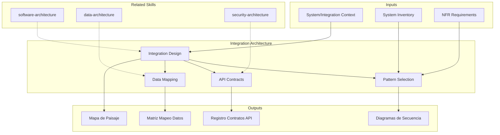

# Integration Architecture: System Connectivity & API Contract Design

Integration architecture defines how systems communicate, share data, and maintain consistency across the enterprise landscape. The skill produces integration landscape maps, contract registries, and sequence diagrams that enable reliable, maintainable system connectivity.

## Grounding Guideline

> *Two systems that do not communicate correctly are worse than two systems that do not communicate at all.*

1. **Explicit contracts.** Every integration needs a formal contract: schema, SLA, error handling, and versioning.
2. **Minimum coupling, maximum cohesion.** The ideal integration transmits only what is necessary and does not expose internals.
3. **End-to-end observability.** If you cannot trace a message from origin to destination, you cannot diagnose failures.

## TL;DR

- Map the current integration landscape with all data flows between systems
- Select appropriate integration patterns (point-to-point, ESB, iPaaS, event mesh) per context
- Define API contracts with versioning, backward compatibility, and governance
- Design data mapping between systems with transformations and quality rules
- Produce sequence diagrams for critical integration flows

## Inputs

The user provides a system or integration context as `$ARGUMENTS`. Parse `$1` as the **system/integration name**.

**Parameters:**
- `{MODO}`: `piloto-auto` (default) | `desatendido` | `supervisado` | `paso-a-paso`
- `{FORMATO}`: `markdown` (default) | `html` | `dual`
- `{VARIANTE}`: `ejecutiva` (~40%) | `tecnica` (full, default)
- `{PATRON}`: `sync` | `async` | `event-driven` | `hybrid` | `auto` (default)

## Deliverables

1. **Integration Landscape Map** — Visual inventory of all systems and their connections with protocol, frequency, and data volume
2. **API Contract Registry** — Catalog of API contracts with versioning strategy, owners, and consumers
3. **Sequence Diagrams** — Detailed sequence diagrams for critical integration flows
4. **Data Mapping Matrix** — Field-level data mapping between source and target systems with transformation rules
5. **Integration Pattern Guide** — Pattern selection rationale and implementation guidelines per integration point

## Process

1. **Inventory systems** — Catalog all systems in scope with their roles (source, target, orchestrator), technologies, and owners
2. **Map existing flows** — Document current integration flows: protocol, frequency, volume, latency requirements, error handling
3. **Classify integrations** — Categorize each integration by pattern (request-reply, fire-and-forget, publish-subscribe, batch ETL)
4. **Select patterns** — Choose integration pattern per connection based on coupling, latency, volume, and reliability requirements
5. **Design contracts** — Define API contracts (OpenAPI, AsyncAPI, GraphQL schema) with versioning and backward compatibility strategy
6. **Map data** — Create field-level data mapping with transformation rules, default values, and validation constraints
7. **Design error handling** — Define retry policies, circuit breakers, dead letter queues, and compensating transactions
8. **Document critical flows** — Produce sequence diagrams for top-priority integration flows including happy path and error scenarios

## Quality Criteria

- [ ] All systems in scope inventoried with ownership and technology stack
- [ ] Integration patterns justified per connection (not one-size-fits-all)
- [ ] API contracts include versioning strategy and breaking change policy
- [ ] Data mapping covers field-level transformations with validation rules
- [ ] Error handling defined for each integration point (retry, DLQ, compensation)
- [ ] Sequence diagrams cover both happy path and key error scenarios
- [ ] Non-functional requirements addressed: latency, throughput, availability
- [ ] Security requirements documented: authentication, authorization, encryption in transit

## Assumptions & Limits

- Assumes system inventory is available or can be constructed from documentation
- Does not implement integrations — produces architecture and design artifacts
- API contract details depend on access to system documentation or SME input
- Performance characteristics are estimates until validated by load testing

## Edge Cases

1. **Sistemas legacy con protocolos obsoletos (SOAP, FTP, ficheros planos)** — El skill disena adaptadores/wrappers que encapsulan protocolos legacy detras de interfaces modernas (REST/async), documentando la deuda tecnica y plan de modernizacion.
2. **Integracion con terceros sin documentacion de API** — Cuando el proveedor no provee especificaciones, el skill genera contratos basados en ingenieria inversa del comportamiento observable, marcados con [INFERENCIA], y recomienda contract testing.
3. **Volumen de datos que excede capacidad sincrona** — Para integraciones con millones de registros diarios, el skill automaticamente propone patrones async (event streaming, batch con CDC) en lugar de request-reply.
4. **Ciclo de vida de APIs sin versionado existente** — Si los sistemas no tienen estrategia de versionado, el skill define politica de versionado (URL path, header, o semantic) y plan de adopcion retroactiva.

## Decisions & Trade-offs

1. **Patron por conexion vs. patron unico** — Se selecciona patron por conexion porque un enfoque unico (ej: todo async) genera sobre-ingenieria en integraciones simples y sub-ingenieria en las complejas.
2. **OpenAPI + AsyncAPI vs. solo OpenAPI** — Se usan ambos estendares porque las arquitecturas modernas combinan sync y async; documentar solo sync deja flujos event-driven sin contrato formal.
3. **Circuit breaker obligatorio vs. opcional** — Obligatorio para integraciones entre dominios diferentes; el costo de implementacion es bajo comparado con el riesgo de falla en cascada.
4. **Data mapping a nivel de campo vs. a nivel de entidad** — A nivel de campo porque las discrepancias semanticas se esconden en los detalles; mapping a nivel de entidad genera bugs de integracion en produccion.

## Knowledge Graph

## Output Templates

### Markdown (default)
- Filename: `arch_integration-landscape_{sistema}_{WIP}.md`
- Structure: TL;DR -> Inventario de sistemas -> Mapa de paisaje (Mermaid) -> Contratos API -> Matriz de mapeo de datos -> Diagramas de secuencia

### HTML
- Filename: `arch_integration-landscape_{sistema}_{WIP}.html`
- Estructura: dashboard navegable con mapa de paisaje interactivo, filtros por patron/protocolo, y drill-down a diagramas de secuencia por flujo

### DOCX
- Filename: `arch_integration-landscape_{sistema}_{WIP}.docx`
- Generado con python-docx bajo Metodología Design System v5: portada, TOC automático, encabezados/pies de página con marca, tablas zebra, tipografía Poppins (headings navy), Trebuchet MS (body), acentos dorados

### XLSX (bajo demanda)
- Filename: `{fase}_{entregable}_{cliente}_{WIP}.xlsx`
- Generado con openpyxl bajo MetodologIA Design System v5. Headers con fondo navy y tipografía Poppins blanca, formato condicional, auto-filtros activados, valores sin fórmulas. Hojas: System Inventory, Integration Landscape, API Contract Registry, Data Mapping Matrix, Error Handling Policies.

### PPTX (bajo demanda)
- Filename: `{fase}_{entregable}_{cliente}_{WIP}.pptx`
- Generado con python-pptx bajo MetodologIA Design System v5. Slide master con degradado navy, títulos Poppins, cuerpo Trebuchet MS, acentos dorados. Máx 20 slides variante ejecutiva / 30 variante técnica. Notas de orador con referencias de evidencia ([CODIGO], [DOC], [INFERENCIA], [SUPUESTO]).

## Evaluacion

| Dimension | Peso | Criterio |
|-----------|------|----------|
| Trigger Accuracy | 10% | Activa ante "integration", "API contract", "event mesh", "ESB" sin confundir con software architecture general |
| Completeness | 25% | Cubre inventario, patrones, contratos, data mapping, error handling y diagramas |
| Clarity | 20% | Cada integracion tiene patron justificado, contrato definido y error handling explicito |
| Robustness | 20% | Maneja legacy SOAP/FTP, terceros sin docs, alto volumen y ausencia de versionado |
| Efficiency | 10% | 8 pasos donde inventario alimenta clasificacion que alimenta diseno |
| Value Density | 15% | Mapa de paisaje y contratos son directamente implementables por equipos de desarrollo |

**Umbral minimo**: 7/10 en cada dimension para considerar el skill production-ready.

## Cross-References

- **metodologia-software-architecture:** Application architecture that hosts integration endpoints
- **metodologia-data-architecture:** Data governance and master data management across integrations
- **metodologia-security-architecture:** API security, mTLS, OAuth2 patterns for integration security

---
**Autor:** Javier Montaño · Comunidad MetodologIA | **Version:** 1.0.0
