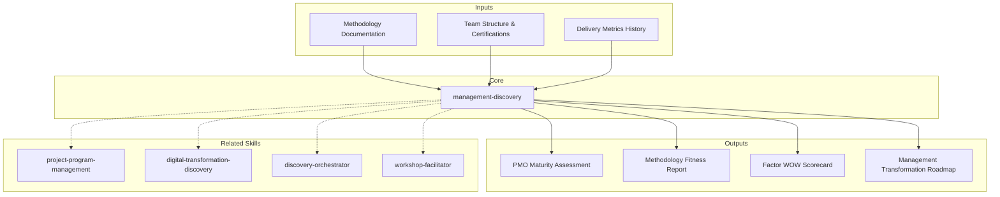

# Management Discovery — PMO Maturity Assessment & Transformation Roadmap

Genera un assessment de 7 secciones para servicios de management y consultoria: evaluacion de madurez del PMO, fitness metodologico, capacidades del equipo, modelo de governance, baseline de performance de delivery, assessment de Factor WOW, y roadmap de transformacion. Diseñado para encontrar el punto exacto donde la disciplina metodologica se adapta al contexto organizacional sin perder rigor.

## Principio Rector

> *La gestion sin metodologia es improvisacion. La metodologia sin contexto es dogma. El arte del management consulting es encontrar el punto exacto donde la disciplina metodologica se adapta al contexto organizacional sin perder rigor.*

1. **No existe una metodologia universalmente correcta.** Agile no es siempre la respuesta. Waterfall no es siempre el problema. El assessment evalua el fit entre metodologia y contexto (equipo, complejidad, stakeholders, regulacion) antes de recomendar cambios.
2. **Las metricas sin contexto son peligrosas.** La velocidad de un equipo no se compara con la de otro. El cycle time de un proyecto regulado no se compara con el de un MVP. Cada metrica se interpreta dentro de su contexto operativo.
3. **Factor WOW es el diferenciador.** Responsabilidad, Alta Iniciativa, Coordinacion Impecable, Anticipacion y Proactividad no son soft skills — son competencias medibles que separan delivery excelente de delivery aceptable.

## Inputs

- `$1` — Path to PMO documentation or project workspace (default: current working directory)
- `$2` — Analysis depth: `full` (default), `executive` (S1, S5, S7 only)

Parse from `$ARGUMENTS`.

**Parameters:**
- `{MODO}`: `piloto-auto` (default) | `desatendido` | `supervisado` | `paso-a-paso`
  - **piloto-auto**: Auto para analisis de metricas y herramientas, HITL para evaluacion de governance y Factor WOW.
  - **desatendido**: Cero interrupciones. Analisis completo automatizado. Supuestos documentados.
  - **supervisado**: Autonomo con reportes al completar cada seccion.
  - **paso-a-paso**: Confirma antes de cada seccion del analisis.
- `{FORMATO}`: `markdown` (default) | `html` | `dual`
- `{VARIANTE}`: `ejecutiva` (~40% — S1, S5, S7 only) | `tecnica` (full, default)
- `{TIPO_SERVICIO}`: `Management` (fixed for this skill)

## Input Requirements

**Mandatory:**
- Documentacion de metodologia actual (Agile ceremonies, SAFe artifacts, project plans)
- Estructura del equipo de gestion (roles, responsabilidades)
- Metricas de delivery basicas (velocity, cycle time, o equivalentes)

**Recommended:**
- Historico de proyectos (12+ meses): scope, timeline, budget vs actual
- Resultados de retrospectivas o encuestas de equipo
- Inventario de certificaciones del equipo
- Herramientas de gestion de proyectos en uso (Jira, Azure DevOps, etc.)
- Governance documentation (escalation matrix, decision rights, reporting)
- Stakeholder satisfaction surveys

## Assumptions & Limits

**Assumptions:**
- Existe un proceso de gestion de proyectos (aunque sea informal)
- Hay acceso a metricas basicas de delivery
- Los stakeholders estan disponibles para validar hallazgos
- La organizacion busca mejorar su capacidad de delivery

**Cannot do:**
- Evaluar dinamicas interpersonales del equipo (requiere observacion directa)
- Facilitar retrospectivas o workshops (requiere engagement presencial)
- Implementar cambios metodologicos (requiere engagement de transformacion)
- Negociar cambios contractuales (requiere equipo comercial)

## Workarounds When Inputs Missing

| Missing Input | Impact | Workaround |
|---|---|---|
| No methodology documentation | Cannot assess methodology fitness | Inferir de herramientas, ceremonies observadas, artifacts producidos; flag como [INFERENCIA] |
| No delivery metrics | Cannot baseline performance | Analizar Jira/Azure DevOps data si disponible; estimar de historico de releases |
| No governance docs | Cannot assess governance model | Entrevistas con team leads; inferir de escalation patterns; flag como [SUPUESTO] |
| No team certifications | Cannot inventory capabilities | Self-assessment; inferir de roles y responsabilidades |
| No stakeholder surveys | Cannot assess satisfaction | Proxy via defect escapes, scope changes, escalation frequency |

## Edge Cases

- **Equipo sin metodologia formal:** Evaluar practicas emergentes. Identificar lo que funciona informalmente antes de formalizar.
- **Multiples metodologias coexistiendo:** Mapear por equipo/proyecto. Evaluar coherencia y friccion entre modelos. Considerar Disciplined Agile como unificador.
- **PMO percibido como burocracia:** Evaluar si el PMO agrega valor o solo control. Recomendar PMO agil (servant-leadership model).
- **Equipo distribuido (multi-timezone):** Ajustar evaluacion de ceremonies (async vs sync). Evaluar herramientas de colaboracion asincrona.
- **Organizacion en crecimiento rapido:** Evaluar escalabilidad del modelo actual. Anticipar puntos de quiebre. SAFe assessment si aplica.
- **Post-merger/acquisition:** Evaluar integracion de culturas metodologicas. Recomendar modelo unificado gradual.

## Trade-off Matrix

| Decision | Enables | Constrains | When to Use |
|---|---|---|---|
| **Full 7-section analysis** | Maximum depth, complete transformation plan | 5-7 dias, alto consumo de tokens | Management transformation programs, PMO setup |
| **Executive variant** (S1+S5+S7) | Quick maturity snapshot, decision-ready | No incluye metodologia, equipo ni governance | Business case para management consulting |
| **Methodology-focused** (S2 deep) | Methodology selection/optimization | Menor profundidad en equipo y performance | Transiciones metodologicas (e.g., Waterfall to Agile) |
| **Performance-focused** (S5+S1 deep) | Data-driven improvement plan | Menos contexto de equipo y governance | Equipos con problemas de delivery medibles |

## 7-Section Framework

### S1: PMO Maturity Assessment

Evaluacion de madurez del PMO en 4 niveles.

**Niveles de madurez:**

| Nivel | Nombre | Caracteristicas |
|---|---|---|
| L1 | Ad-hoc | Gestion por heroismo individual, sin procesos estandar, resultados impredecibles |
| L2 | Defined | Procesos documentados, templates estandar, roles definidos, metricas basicas |
| L3 | Managed | Metricas cuantitativas, mejora continua, portfolio management, resource optimization |
| L4 | Optimized | Predictive analytics, innovation culture, strategic alignment, continuous learning |

**Assessment por 5 dimensiones:**

| Dimension | Score (1-5) | Evidencia | Gap vs Target |
|---|---|---|---|
| Procesos | ... | Estandarizacion, repetibilidad, documentacion | ... |
| Personas | ... | Roles, competencias, training, cultura | ... |
| Herramientas | ... | Adoption, integracion, automatizacion | ... |
| Governance | ... | Decision rights, escalation, reporting | ... |
| Cultura | ... | Colaboracion, mejora continua, accountability | ... |

**Scoring basado en evidencia:** Cada score requiere al menos 2 evidencias verificables. Sin evidencia = score maximo de 2.

### S2: Methodology Fitness

Evaluacion de fitness de la metodologia actual al contexto organizacional.

**Metodologias evaluadas:**
- **Agile (Scrum/Kanban):** Para equipos pequenos, requisitos cambiantes, feedback rapido
- **SAFe:** Para escala enterprise, multiples equipos coordinados, portfolio management
- **Disciplined Agile (DA):** Para organizaciones que necesitan flexibilidad metodologica, context-sensitive
- **Waterfall:** Para proyectos con requisitos estables, regulacion estricta, dependencias duras
- **Hybrid:** Combinacion contextual de enfoques

**Fit-to-context evaluation:**

| Factor de Contexto | Estado Actual | Metodologia Optima | Fit Actual |
|---|---|---|---|
| Tamano de equipo | ... | ... | Alto/Medio/Bajo |
| Complejidad del proyecto | ... | ... | Alto/Medio/Bajo |
| Stakeholder engagement | ... | ... | Alto/Medio/Bajo |
| Requisitos regulatorios | ... | ... | Alto/Medio/Bajo |
| Cambio en requisitos | ... | ... | Alto/Medio/Bajo |
| Distribucion geografica | ... | ... | Alto/Medio/Bajo |

**Recomendacion con trade-offs explicitos:** No "Agile es mejor" sino "Agile en este contexto porque X, con el riesgo de Y, mitigado por Z."

### S3: Team Capability Evaluation

Inventario de capacidades y gaps del equipo.

**Inventario de certificaciones:**

| Certificacion | Categoria | Cantidad | % del Equipo |
|---|---|---|---|
| PMP | Traditional PM | ... | ... |
| CSM | Scrum | ... | ... |
| SMPC | Scrum Master | ... | ... |
| ACPC | Agile Coach | ... | ... |
| PMI-ACP | Agile PM | ... | ... |
| DTPC | Design Thinking | ... | ... |
| KMP | Kanban | ... | ... |
| SAFe (SPC/SA/RTE) | Scaled Agile | ... | ... |
| OKRCPC | OKR | ... | ... |

**Distribucion de experiencia:**

| Rango de Experiencia | Cantidad | % |
|---|---|---|
| Junior (0-2 anos) | ... | ... |
| Mid (2-5 anos) | ... | ... |
| Senior (5-10 anos) | ... | ... |
| Lead/Expert (10+ anos) | ... | ... |

**Skill gaps:** Comparacion entre competencias requeridas y disponibles. Priorizacion por impacto en delivery.

**Training needs assessment:** Plan de capacitacion alineado a gaps identificados y roadmap de transformacion.

**Capacity analysis:** FTE disponibles vs demanda de proyectos. Utilizacion actual. Riesgo de burnout.

### S4: Governance Model Assessment

Evaluacion del modelo de gobernanza actual.

**Dimensiones de governance:**

| Dimension | Score (1-5) | Evidencia |
|---|---|---|
| Decision rights clarity | ... | Quien decide que, documentado y respetado |
| Escalation effectiveness | ... | Tiempo de resolucion, path claro, resultados |
| Ceremony health | ... | Asistencia, duracion, action items, follow-up |
| Reporting cadence | ... | Frecuencia, audiencia, actionability |
| Stakeholder engagement quality | ... | Feedback loops, satisfaction, involvement |

**Ceremony health assessment:**

| Ceremonia | Frecuencia | Duracion | Asistencia (%) | Efectividad (1-5) | Issues |
|---|---|---|---|---|---|
| Daily standup | ... | ... | ... | ... | ... |
| Sprint review | ... | ... | ... | ... | ... |
| Retrospective | ... | ... | ... | ... | ... |
| Sprint planning | ... | ... | ... | ... | ... |
| Backlog refinement | ... | ... | ... | ... | ... |

**Governance health score:** Promedio ponderado. >3.5 = saludable. 2.5-3.5 = requiere ajustes. <2.5 = requiere intervencion.

### S5: Delivery Performance Baseline

Baseline de performance de delivery con metricas cuantitativas.

**Metricas core:**

| Metrica | Valor Actual | Benchmark Industria | Status |
|---|---|---|---|
| Velocity stability | Coeficiente de variacion: ...% | <20% = estable | ... |
| Predictability index | Delivered / Committed: ...% | >80% = predecible | ... |
| Cycle time | ... dias (promedio) | Depende de contexto | ... |
| Lead time | ... dias (promedio) | Depende de contexto | ... |
| WIP balance | ... items (promedio) | Little's Law: WIP = Throughput x Lead Time | ... |
| Scope change rate | ...% por sprint/release | <10% = controlado | ... |
| Defect injection rate | ... defectos/sprint | Trend descendente = saludable | ... |

**Interpretacion contextual:** Cada metrica interpretada dentro del contexto del equipo (tamano, complejidad, regulacion). No se comparan equipos entre si.

**Trend analysis:** Si hay datos historicos (6+ meses), identificar tendencias. Mejorar, estable o deteriorar.

### S6: Factor WOW Assessment

Evaluacion de las 5 dimensiones del Factor WOW de MetodologIA.

**Dimensiones Factor WOW:**

| Dimension | Score (1-5) | Evidencia | Gap vs Estandar MetodologIA |
|---|---|---|---|
| **Responsabilidad** | ... | Ownership de entregables, accountability, cumplimiento de compromisos | ... |
| **Alta Iniciativa** | ... | Proactividad en identificar problemas y soluciones, ir mas alla de lo pedido | ... |
| **Coordinacion Impecable** | ... | Sincronizacion entre equipos, handoffs limpios, comunicacion efectiva | ... |
| **Anticipacion** | ... | Identificacion temprana de riesgos, planificacion proactiva, early warning | ... |
| **Proactividad** | ... | Propuestas de mejora, innovation mindset, continuous improvement | ... |

**Assessment basado en evidencia:**
- Cada dimension requiere al menos 3 evidencias (comportamientos observados, artefactos producidos, feedback de stakeholders)
- Score sin evidencia = maximo 2
- Evidencia contradictoria = score promedio con flag

**Gap analysis vs estandar MetodologIA:**
- Score objetivo MetodologIA: 4.0+ en todas las dimensiones
- Dimensiones por debajo de 3.0 = accion correctiva requerida
- Plan de desarrollo por dimension con gap significativo

### S7: Management Transformation Roadmap

Hoja de ruta de transformacion de management en 3 horizontes.

**Horizonte 1 — Quick Wins (0-3 meses):**
- Optimizacion de ceremonies (reducir duracion, mejorar efectividad, eliminar redundancia)
- Adopcion de herramientas basicas (Jira configuration, dashboard setup, reporting templates)
- Metricas baseline establecidas y visibles
- Governance basica operativa (escalation matrix, decision rights)

**Horizonte 2 — Medium-term (3-9 meses):**
- Evolucion metodologica (ajuste de metodologia segun fitness assessment)
- Governance strengthening (ceremony redesign, stakeholder engagement improvement)
- Team capability development (certificaciones prioritarias, coaching)
- Delivery performance improvement (cycle time reduction, predictability increase)

**Horizonte 3 — Strategic (9-18 meses):**
- PMO maturity advancement (avanzar al siguiente nivel)
- Factor WOW adoption (cultura de excelencia operativa)
- Predictive management (forecasting, portfolio optimization)
- Continuous improvement culture (data-driven decisions, innovation time)

**Milestones por horizonte:**
- Metricas target por fase
- Certificaciones a obtener
- Governance maturity target
- Factor WOW score target

**Indicadores de magnitud (NOT prices):**
- FTE-meses de consultoria por horizonte
- Horas de coaching y capacitacion
- Licencias de herramientas (cantidad, tipo)
- Certificaciones (numero, tipo)

> **Disclaimer obligatorio:** Las magnitudes presentadas son estimaciones basadas en drivers identificados. Los valores finales dependen de negociacion comercial, condiciones de mercado y contexto especifico del cliente.

## Escalation to Human Architect

- Conflictos organizacionales profundos (politica interna, resistencia al cambio sistematica)
- Cambios metodologicos que impactan contratos existentes
- Evaluacion de performance individual (requiere RRHH y management directo)
- Decisiones de reestructuracion de equipos
- Integracion post-merger de culturas de gestion
- Decisiones contractuales (Fixed Price vs T&M vs Staff Aug)

## Casos Borde

| Caso | Estrategia de Manejo |
|---|---|
| Equipo sin metodologia formal — solo practicas emergentes no documentadas | Evaluar practicas emergentes via observacion de artefactos (Jira boards, meeting invites, release history). Documentar lo que funciona informalmente antes de formalizar. Score maximo de 2 sin evidencia documental. |
| Multiples metodologias coexistiendo (Scrum + Waterfall + Kanban en diferentes equipos) | Mapear metodologia por equipo/proyecto. Evaluar coherencia y friccion entre modelos. Considerar Disciplined Agile como unificador. No forzar uniformidad si el contexto lo justifica. |
| PMO percibido como burocracia que frena delivery | Evaluar valor agregado vs control puro. Medir lead time de procesos PMO. Recomendar PMO agil (servant-leadership model). Quick wins: eliminar reportes que nadie lee, simplificar approvals. |
| Post-merger con dos culturas metodologicas incompatibles | Assessment separado por organizacion. Identificar practicas comunes como base. Modelo unificado gradual (12-18 meses). No imponer cultura de una empresa sobre otra. Governance compartido como primer paso. |

## Decisiones y Trade-offs

| Decision | Alternativa Descartada | Justificacion |
|---|---|---|
| Factor WOW como framework de evaluacion de competencias sobre frameworks genericos (SFIA, competency matrix) | SFIA 8 o competency matrix corporativa | Factor WOW (Responsabilidad, Alta Iniciativa, Coordinacion, Anticipacion, Proactividad) mide competencias especificas de delivery excellence que frameworks genericos no capturan. Alineado con cultura MetodologIA. |
| Assessment basado en evidencia (min 2 evidencias por score) sobre self-assessment | Encuestas de auto-evaluacion del equipo | Self-assessment tiene bias de deseabilidad social (+1.5 puntos promedio). Evidencia verificable (artefactos, metricas, observacion) produce scores mas honestos y accionables. |
| Roadmap en 3 horizontes (0-3, 3-9, 9-18 meses) sobre plan unico de transformacion | Plan de transformacion monolitico a 18 meses | Horizontes permiten ajuste iterativo. Quick wins en H1 construyen credibilidad. H2 y H3 se refinan con aprendizajes de fases anteriores. Plan monolitico asume predictibilidad que no existe. |

## Knowledge Graph



## Output Templates

**Formato MD (default):**
```
# Management Discovery: {project_name}
## S1: PMO Maturity Assessment
  - Maturity level (L1-L4) con evidencia
  - Radar chart 5 dimensiones
## S2: Methodology Fitness
  - Fit-to-context por factor
## S3-S7: [remaining sections]
## Anexos: Certification inventory, ceremony health audit, Factor WOW evidence log
```

**Formato XLSX (secondary):**
- Hoja 1: PMO Maturity scoring (dimension, score, evidencia, gap, target)
- Hoja 2: Methodology fitness matrix (factor, estado actual, optima, fit)
- Hoja 3: Team capability inventory (nombre, rol, certificaciones, experiencia)
- Hoja 4: Delivery metrics baseline (metrica, valor actual, benchmark, status, trend)
- Hoja 5: Factor WOW scorecard (dimension, score, evidencias, gap)

**Formato DOCX (bajo demanda):**
- Filename: `{fase}_Management_Discovery_{cliente}_{WIP}.docx`
- Generado via python-docx con MetodologIA Design System v5. Portada con logo y metadatos, TOC automatico, headers/footers con nombre del skill y numeracion, tablas zebra, titulos Poppins navy, cuerpo Montserrat, acentos gold.

**Formato HTML (bajo demanda):**
- Filename: `Management_Discovery_{project}_{WIP}.html`
- Estructura: HTML self-contained branded (Design System MetodologIA v5). Dark-First Executive. Incluye radar charts de madurez PMO y Factor WOW, heatmap de methodology fitness, y roadmap de transformacion con timeline visual. WCAG AA, responsive, print-ready.

**Formato PPTX (bajo demanda):**
- Filename: `{fase}_{entregable}_{cliente}_{WIP}.pptx`
- Generado con python-pptx bajo MetodologIA Design System v5. Slide master con degradado navy, títulos Poppins, cuerpo Montserrat, acentos dorados. Máx 20 slides variante ejecutiva / 30 variante técnica. Notas de orador con referencias de evidencia ([CODIGO], [DOC], [INFERENCIA], [SUPUESTO]).

## Evaluacion

| Dimension | Peso | Criterio | Umbral Minimo |
|---|---|---|---|
| Trigger Accuracy | 10% | El skill se activa correctamente ante menciones de PMO, methodology, governance, delivery performance, Factor WOW | 7/10 |
| Completeness | 25% | Las 7 secciones cubren maturity, fitness, capabilities, governance, performance, WOW, y roadmap | 7/10 |
| Clarity | 20% | Cada score con evidencia verificable. Metricas interpretadas en contexto. Recomendaciones con trade-offs explicitos. | 7/10 |
| Robustness | 20% | Edge cases de multi-metodologia, PMO burocracia, post-merger cubiertos. Workarounds para inputs faltantes documentados. | 7/10 |
| Efficiency | 10% | Output proporcional a variante (ejecutiva vs tecnica). Sin seccion redundante. Evidence tags consistentes. | 7/10 |
| Value Density | 15% | Roadmap con quick wins accionables. Factor WOW con plan de desarrollo por dimension. Metricas con targets concretos. | 7/10 |

**Umbral minimo global:** 7/10. Deliverables por debajo requieren re-work antes de entrega.

## Validation Gate

- [ ] PMO maturity level identificado con evidencia por dimension
- [ ] Methodology fitness evaluado con fit-to-context por factor
- [ ] Inventario de certificaciones y capability gaps documentado
- [ ] Governance model evaluado con health score y ceremony assessment
- [ ] Delivery performance baseline con metricas cuantitativas y benchmarks
- [ ] Factor WOW evaluado con evidencia por dimension y gap analysis
- [ ] Roadmap en 3 horizontes con milestones y metricas target
- [ ] Magnitudes de inversion documentadas (NUNCA precios) con disclaimer
- [ ] Evidencia tagueada con [CODIGO], [CONFIG], [DOC], [INFERENCIA], [SUPUESTO]
- [ ] Cross-references entre secciones (maturity S1 informa roadmap S7, performance S5 valida methodology S2)

## Output Artifact

**Primary:** `Management_Discovery_{project}.md` — Assessment completo de 7 secciones con evaluacion de madurez PMO, fitness metodologico, capacidades de equipo, governance, delivery performance, Factor WOW, y roadmap de transformacion.

**Diagramas incluidos:**
- Radar chart de madurez PMO por dimension
- Heatmap de methodology fitness por factor de contexto
- Dashboard de delivery performance (metricas key)
- Radar chart de Factor WOW por dimension
- Roadmap de transformacion (gantt)

---
**Autor:** Javier Montaño · Comunidad MetodologIA | **Ultima actualizacion:** 14 de marzo de 2026
