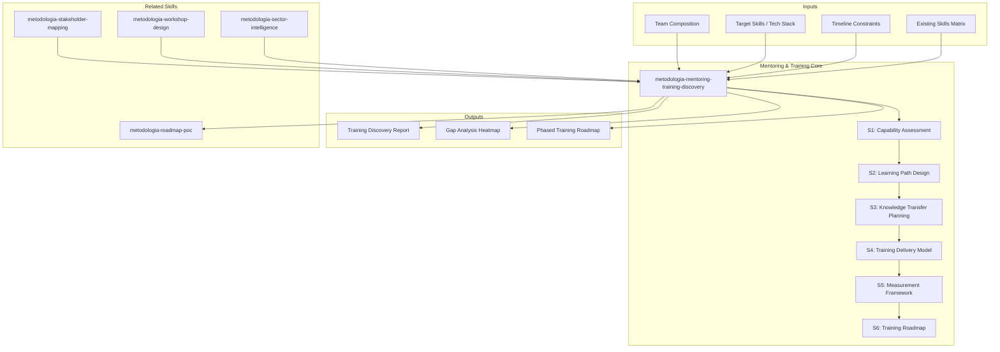
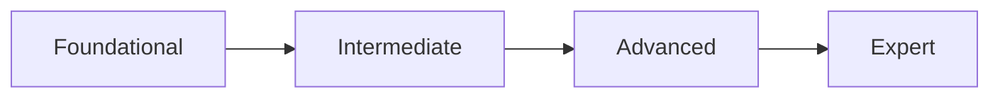

# Mentoring & Training Discovery — Capability Development Assessment

Generates a 6-section mentoring and training discovery covering capability assessment, learning path design, knowledge transfer planning, training delivery model, measurement framework, and a phased training roadmap. Produces actionable findings with gap analysis, delivery recommendations, and measurable success criteria.

## Principio Rector

> *El conocimiento que no se transfiere se pierde. La capacitacion que no se mide es un acto de fe. Un programa de mentoring efectivo convierte la experiencia individual en capacidad organizacional.*

1. **La brecha de capacidad es un riesgo de negocio, no solo un tema de RRHH.** Cada skill gap no atendido se manifiesta como velocidad reducida, calidad inconsistente o dependencia critica de individuos. El assessment de capacidad es la primera linea de defensa contra el riesgo operativo.
2. **El aprendizaje efectivo es contextual y progresivo.** No existe un modelo unico de capacitacion. La combinacion optima de bootcamp, mentoring, on-the-job training y certificacion depende del rol, la experiencia previa y el contexto organizacional.
3. **Medir no es opcional — es la diferencia entre capacitacion y esperanza.** Sin metricas de adquisicion de conocimiento, tiempo a productividad y retencion, un programa de training es un gasto, no una inversion.

## Inputs

- `$1` — Path to team documentation, skills matrices, or project root (default: current working directory)
- `$2` — Analysis depth: `full` (default), `executive` (sections S1, S5, S6 only)

Parse from `$ARGUMENTS`.

**Parameters:**
- `{MODO}`: `piloto-auto` (default) | `desatendido` | `supervisado` | `paso-a-paso`
  - **piloto-auto**: Auto para inventario de skills y gap analysis, HITL para diseno de learning paths y modelo de delivery.
  - **desatendido**: Cero interrupciones. Analisis completo automatizado. Supuestos documentados.
  - **supervisado**: Autonomo con reportes al completar cada seccion.
  - **paso-a-paso**: Confirma antes de cada seccion del analisis.
- `{FORMATO}`: `markdown` (default) | `html` | `dual`
- `{VARIANTE}`: `ejecutiva` (~40% — sections S1, S5, S6 only) | `tecnica` (full, default)

## Input Requirements

**Mandatory:**
- Current team composition and role definitions
- Target skills or technology stack for the engagement
- Timeline constraints for capability readiness
- Stakeholder expectations on delivery model

**Recommended:**
- Existing skills matrix or competency assessments
- Previous training program results or satisfaction surveys
- Certification inventory per team member
- Project history (technologies used, complexity levels)
- Industry benchmarks for role competencies

## Assumptions & Limits

**Assumptions:**
- Team members are available for assessment (self-assessment or evaluation)
- Target competency model is defined or can be inferred from project requirements
- Organization supports dedicated training time (not 100% billable expectation)
- Documentation in English or Spanish

**Cannot do:**
- Individual performance evaluation (requires HR processes and manager input)
- Psychometric assessment (requires specialized tools and certified evaluators)
- Salary benchmarking (requires market data and compensation expertise)
- Real-time skill verification through technical interviews (requires live sessions)

## Workarounds When Inputs Missing

| Missing Input | Impact | Workaround |
|---|---|---|
| No skills matrix | Cannot quantify gaps | Infer from project history, technology stack, team roles; flag as assumption |
| No target competency model | Cannot define learning paths | Use industry-standard role definitions (e.g., SFIA, MetodologIA role catalog); flag as baseline |
| No previous training data | Cannot benchmark improvement | Establish baseline through initial assessment; recommend pre/post methodology |
| No certification inventory | Cannot assess formal credentials | Self-declaration survey; cross-reference with LinkedIn/CV data; flag confidence level |
| No project history | Cannot contextualize experience | Role-based assessment only; flag as limited context |

## 6-Section Framework

### S1: Capability Assessment

- **Current skills inventory**: Per role/team member — technical skills, soft skills, domain knowledge. Proficiency levels: Foundational (1), Developing (2), Proficient (3), Advanced (4), Expert (5)
- **Target skills definition**: Per role — required competencies for engagement success. Mapped to SFIA framework or MetodologIA role catalog where applicable
- **Gap analysis**: Current vs target delta per role/team. Heat map visualization. Critical gaps (delta >= 3 levels) flagged
- **Competency model mapping**: Role-based competency clusters (technical, methodological, interpersonal, domain). Weight by business criticality
- **Critical skill identification**: Skills where gap + business impact = HIGH. Single points of failure (one person holds critical knowledge)
- **Market benchmark comparison**: How team capabilities compare to industry standards for similar roles/technologies

**Conditional logic:**
- IF critical gaps > 30% of required skills: flag CRITICAL — project readiness at risk
- IF single points of failure identified: flag HIGH — knowledge concentration risk
- IF no formal competency model exists: recommend adoption of SFIA or equivalent as foundational step

### S2: Learning Path Design

- **Role-based learning paths**: Per role, structured progression:
  - **Foundational** (weeks 1-4): Core concepts, tools setup, coding standards, team processes
  - **Intermediate** (weeks 5-12): Applied skills, supervised deliverables, code review participation
  - **Advanced** (months 4-9): Independent delivery, mentoring others, architecture decisions
  - **Expert** (months 10+): Innovation, thought leadership, community contribution
- **Certification milestones**: Industry certifications mapped to progression (AWS, Azure, Scrum, ISTQB, etc.). Per certification: preparation time, exam cost magnitude, validity period
- **Self-paced vs instructor-led balance**: Recommendation per topic area. Self-paced for tools/syntax, instructor-led for architecture/design patterns/soft skills
- **MetodologIA University model integration**: Alignment with existing MetodologIA training catalog, reuse of certified content, gap identification for new content development
- **Prerequisites and dependencies**: Learning path dependency graph. Blocking prerequisites identified

**Conditional logic:**
- IF team has < 1 year experience in target stack: recommend intensive bootcamp (Phase 1)
- IF certification is client requirement: prioritize certification track with dedicated study time
- IF MetodologIA University content covers > 60% of needs: leverage existing content, develop delta only

### S3: Knowledge Transfer Planning

- **Documentation needs**: What must be documented — architecture decisions, runbooks, coding standards, deployment procedures. Format and location standards
- **Pairing/shadowing programs**: Structure for knowledge transfer through practice. Senior-junior pairing ratios, rotation cadence, session format
- **Workshop design**: Topic-specific workshops with hands-on exercises. Per workshop: duration, audience, prerequisites, deliverables, facilitator requirements
- **Hands-on labs**: Practical exercises mapped to learning objectives. Sandbox environments, realistic scenarios, progressive difficulty
- **Code review mentoring**: Structured code review as learning tool. Review checklists, feedback templates, escalation criteria
- **Tribal knowledge capture**: Strategy for documenting undocumented expertise. Knowledge mining sessions, decision log creation, architecture decision records (ADR)
- **Knowledge base creation plan**: Platform selection, taxonomy design, contribution guidelines, maintenance ownership

**Conditional logic:**
- IF tribal knowledge concentration > 3 critical areas per person: flag CRITICAL — bus factor risk
- IF no documentation standards exist: recommend documentation-first approach before content creation
- IF remote/distributed team: emphasize asynchronous knowledge transfer methods

### S4: Training Delivery Model

Per audience segment, recommend optimal blend:

| Model | Duration | Best For | Scale |
|---|---|---|---|
| **Bootcamp** | 2-8 weeks intensive | New technology adoption, team ramp-up | 5-20 people |
| **Ongoing mentoring** | 1:1 or 1:many, continuous | Skill deepening, career development | 1-5 per mentor |
| **On-the-job training** | Embedded in delivery | Applied learning, context-specific | Individual |
| **Certification tracks** | Self-paced + exam prep | Formal credential requirements | Individual |
| **Community of Practice** | Bi-weekly, ongoing | Knowledge sharing, innovation | 10-50 people |

- **Blend recommendation per audience**: Matrix of audience segment x delivery model with rationale
- **Facilitator requirements**: Internal vs external trainers, subject matter expert availability, train-the-trainer needs
- **Infrastructure needs**: LMS platform, lab environments, video conferencing, recording/playback capabilities
- **Schedule integration**: Training time allocation within sprint/delivery cadence. Recommended: 10-20% of capacity for ongoing learning

**Conditional logic:**
- IF timeline < 3 months AND gap is foundational: recommend bootcamp model
- IF team > 20 people: recommend train-the-trainer + CoP model for scalability
- IF budget constrained: prioritize on-the-job training + self-paced with curated content

### S5: Measurement Framework

- **Skill acquisition metrics**: Pre/post assessment scores per competency area. Minimum improvement threshold: 1 proficiency level per quarter
- **Time-to-productivity**: Days from onboarding to first independent deliverable. Benchmark per role complexity
- **Certification pass rates**: First-attempt pass rate target (> 80%). Retake policy and support
- **Knowledge retention**: 30/60/90 day knowledge checks. Spaced repetition integration. Decay rate monitoring
- **Business impact indicators**:
  - Velocity: Story points/sprint trend post-training
  - Quality: Defect density trend post-training
  - Satisfaction: Team confidence survey (quarterly)
  - Autonomy: Escalation rate reduction over time
- **ROI indicators**: Productivity gain magnitude, reduced dependency on external experts, faster onboarding of new team members. Expressed in effort-days saved, NOT monetary values

**Conditional logic:**
- IF no baseline metrics exist: establish baseline in first 2 weeks before training starts
- IF retention at 90 days < 60%: flag delivery model effectiveness, recommend reinforcement strategy
- IF certification pass rate < 70%: review preparation adequacy and study time allocation

### S6: Training Roadmap

Phased plan with certification milestones and success metrics:

**Phase 1: Foundation (Month 1-2)**
- Target audience: Full team
- Delivery model: Bootcamp (intensive) + documentation sprint
- Content focus: Core technology stack, team processes, coding standards
- Success metrics: All members reach Foundational (L1) proficiency, initial documentation complete
- Effort magnitude: X trainer-days (NOT prices)

**Phase 2: Acceleration (Month 3-6)**
- Target audience: Role-specific groups
- Delivery model: Mentoring (1:many) + on-the-job training + certification prep
- Content focus: Role-specific deep dives, advanced patterns, first certifications
- Success metrics: 70% reach Proficient (L3), first certification cohort complete
- Effort magnitude: X trainer-days (NOT prices)

**Phase 3: Mastery (Month 7-12)**
- Target audience: Advanced practitioners + new joiners (cycle restart)
- Delivery model: CoP facilitation + advanced workshops + train-the-trainer
- Content focus: Architecture decisions, innovation, knowledge multiplication
- Success metrics: Team self-sufficient, internal trainers certified, CoP active
- Effort magnitude: X trainer-days (NOT prices)

Per phase: dependencies on previous phase, risk factors, contingency if timeline compressed.

## Casos Borde

| Caso | Estrategia de Manejo |
|------|---------------------|
| Equipo sin ninguna experiencia en el stack objetivo (gap foundational >80%) | Recomendar bootcamp intensivo como Phase 0 obligatoria; no iniciar delivery hasta alcanzar nivel Foundational; escalar si timeline no permite ramp-up |
| Key person dependency (una persona concentra conocimiento critico en >3 areas) | Flag CRITICAL por bus factor; priorizar knowledge transfer inmediato via pairing/shadowing; documentar tribal knowledge antes de cualquier otra actividad |
| Organizacion espera 100% billable time sin dedicacion a training | Documentar el riesgo de no invertir en capacitacion; proponer modelo 90/10 como minimo; escalar a sponsor si la expectativa no cambia |
| Training needs abarcan dominios fuera de la expertise de MetodologIA | Identificar gaps que requieren proveedores externos; recomendar partnerships o certificaciones especificas; no pretender cubrir lo que no se domina |

## Decisiones y Trade-offs

| Decision | Alternativa Descartada | Justificacion |
|----------|----------------------|---------------|
| Usar modelo de 5 niveles de proficiencia (Foundational a Expert) | Binario (sabe / no sabe) | Los 5 niveles permiten disenar learning paths progresivos y medir mejora incremental; el modelo binario no captura crecimiento |
| Incluir measurement framework como seccion mandatoria (S5) | Training sin metricas de efectividad | Sin metricas de adquisicion, retencion y productividad, un programa de training es un gasto sin evidencia de retorno |
| Combinar bootcamp + mentoring + on-the-job como modelo hibrido | Un unico modelo de delivery para todos los roles | Cada audiencia tiene necesidades diferentes; un modelo unico sub-optimiza para todos |

## Knowledge Graph



## Output Templates

**Formato MD (default):**

```
# Mentoring & Training Discovery — {proyecto}
## Resumen Ejecutivo
> Roles evaluados: N. Gaps criticos: X. Tiempo estimado a productividad: Y meses.
## S1: Capability Assessment
| Rol | Skill | Nivel Actual | Nivel Objetivo | Gap | Criticidad |
## S2: Learning Paths

## S3-S6: [secciones completas]
## Roadmap de Training
```mermaid
gantt
    title Training Roadmap
    ...
```
```

**Formato XLSX (para RRHH y gestores de talento):**

```
Hoja 1: Resumen Ejecutivo (gaps criticos + recomendaciones top 5)
Hoja 2: Skills Matrix (rol x skill x nivel actual x nivel objetivo x gap)
Hoja 3: Learning Paths (por rol, con milestones de certificacion)
Hoja 4: Calendario de Training (actividad x fecha x audiencia x facilitador)
Hoja 5: Metricas de Medicion (baseline x target x frecuencia de tracking)
Hoja 6: Budget de Training (esfuerzo en trainer-days, NO precios)
```

**Formato HTML (bajo demanda):**
- Filename: `Mentoring_Training_Discovery_{project}_{WIP}.html`
- Estructura: HTML self-contained branded (Design System MetodologIA v5). Light-First Technical. Incluye heatmap de skills gap por rol, flowchart de learning paths con milestones de certificacion, y roadmap faseado con timeline visual. WCAG AA, responsive, print-ready.

**Formato DOCX (bajo demanda):**
- Filename: `{fase}_Mentoring_Training_Discovery_{cliente}_{WIP}.docx`
- Generado via python-docx con MetodologIA Design System v5. Portada con logo y metadatos, TOC automatico, headers/footers con nombre del skill y numeracion, tablas zebra, titulos Poppins navy, cuerpo Montserrat, acentos gold.

**Formato PPTX (bajo demanda):**
- Filename: `{fase}_Mentoring_Training_Discovery_{cliente}_{WIP}.pptx`
- Generado via python-pptx con MetodologIA Design System v5. Slide master navy gradient, titulos Poppins, cuerpo Montserrat, acentos gold. Max 20 slides variante ejecutiva / 30 variante tecnica. Speaker notes con referencias de evidencia [DOC]/[INFERENCIA]/[SUPUESTO].

## Evaluacion

| Dimension | Peso | Criterio | Umbral Minimo |
|-----------|------|----------|---------------|
| Trigger Accuracy | 10% | El skill se activa ante prompts de training, mentoring, capability assessment, upskilling | 7/10 |
| Completeness | 25% | Las 6 secciones pobladas; gap analysis por rol/equipo; learning paths con niveles de progresion y certificaciones | 7/10 |
| Clarity | 20% | Heatmap de gaps es visualmente claro; modelo de delivery tiene justificacion por audiencia | 7/10 |
| Robustness | 20% | Edge cases cubiertos (zero experience, bus factor, no training time, outside expertise); workarounds documentados | 7/10 |
| Efficiency | 10% | Profundidad adaptada (full vs executive); MetodologIA University content reutilizado donde aplica | 7/10 |
| Value Density | 15% | Metricas de medicion definidas con baseline y target; ROI expresado en esfuerzo-dias ahorrados; single points of failure abordados | 7/10 |

**Umbral minimo global: 7/10.** Si alguna dimension cae por debajo, el entregable requiere revision antes de entrega.

## Escalation to Human Architect

- Team assessment reveals organizational issues beyond training (motivation, leadership, culture)
- Client expectations on timeline are incompatible with realistic skill acquisition curves
- Certification requirements conflict with project delivery timeline
- Training needs span domains outside MetodologIA expertise
- Individual performance issues require HR intervention, not training

## Validation Gate

- [ ] Capability assessment complete with gap analysis per role/team
- [ ] Learning paths designed with progression levels and certification milestones
- [ ] Knowledge transfer plan includes documentation, pairing, and tribal knowledge capture
- [ ] Training delivery model recommended per audience segment with rationale
- [ ] Measurement framework defined with baseline, tracking, and business impact indicators
- [ ] Training roadmap phased with effort magnitudes (trainer-days, NOT prices)
- [ ] All findings tagged with evidence source [DOC], [INFERENCIA], [SUPUESTO]
- [ ] Single points of failure (key-person dependencies) identified and addressed
- [ ] MetodologIA University integration points identified where applicable
- [ ] Recommendations sequenced by criticality and dependency

## Output Artifact

**Primary:** `Mentoring_Training_Discovery_{project}.md` (o `.html` si `{FORMATO}=html|dual`) — 6-section capability development assessment with gap analysis, learning path design, delivery model recommendation, measurement framework, and phased training roadmap.

**Diagramas incluidos:**
- Heatmap: Skills gap matrix (current vs target per role)
- Flowchart: Learning path progression with certification milestones
- Timeline: Phased training roadmap with dependencies

---
**Autor:** Javier Montaño · Comunidad MetodologIA | **Ultima actualizacion:** 14 de marzo de 2026
