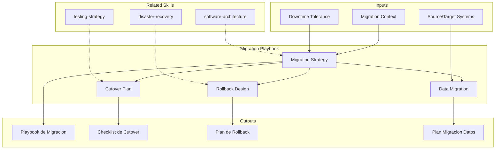

# Migration Playbook: Execution Strategy & Cutover Planning

Migration playbook provides detailed execution guidance for system migrations, covering strategy selection, data migration, cutover choreography, and rollback procedures. The skill produces migration playbooks, cutover checklists, and rollback plans that minimize risk during system transitions.

## TL;DR

- Selecciona estrategia de migracion apropiada (strangler fig, parallel run, big bang) segun riesgo y contexto
- Disena plan de migracion de datos con validacion, reconciliacion y rollback
- Produce checklist de cutover con secuencia horaria, responsables y criterios go/no-go
- Define procedimientos de rollback con puntos de decision y tiempos maximos
- Establece metricas de exito post-migracion y periodo de estabilizacion

## Inputs

The user provides a migration context as `$ARGUMENTS`. Parse `$1` as the **migration/project name**.

**Parameters:**
- `{MODO}`: `piloto-auto` (default) | `desatendido` | `supervisado` | `paso-a-paso`
- `{FORMATO}`: `markdown` (default) | `html` | `dual`
- `{VARIANTE}`: `ejecutiva` (~40%) | `tecnica` (full, default)
- `{ESTRATEGIA}`: `strangler-fig` | `parallel-run` | `big-bang` | `phased` | `auto` (default)

## Entregables

1. **Playbook de migracion** — Comprehensive migration guide with strategy, phases, dependencies, and risk mitigation
2. **Checklist de cutover** — Hour-by-hour cutover sequence with tasks, owners, validation checks, and go/no-go gates
3. **Plan de rollback** — Detailed rollback procedures with decision points, time limits, and data recovery steps
4. **Plan de migracion de datos** — Data extraction, transformation, loading, validation, and reconciliation procedures
5. **Plan de estabilizacion** — Post-migration monitoring, issue triage, and hypercare period definition

## Proceso

1. **Evaluar contexto de migracion** — Assess source/target systems, data volumes, integration dependencies, downtime tolerance, and team capability
2. **Seleccionar estrategia** — Choose migration approach based on risk tolerance, downtime window, and system complexity
3. **Disenar migracion de datos** — Plan ETL pipeline: extraction from source, transformation rules, loading into target, validation checksums
4. **Planificar wave structure** — Group migration items into waves by risk and dependency; pilot wave first
5. **Crear checklist de cutover** — Sequence all cutover activities: pre-cutover prep, DNS/traffic switch, validation, rollback window
6. **Disenar rollback** — Define rollback triggers, procedures, maximum time-to-decision, and data reconciliation after rollback
7. **Planificar comunicacion** — Stakeholder notifications: pre-migration, during cutover, post-migration, and incident escalation
8. **Definir hypercare** — Establish post-migration monitoring period with enhanced support, issue SLAs, and stabilization criteria

## Criterios de Calidad

- [ ] Migration strategy justified with risk-benefit analysis
- [ ] Data migration includes validation and reconciliation procedures
- [ ] Cutover checklist is time-sequenced with owners and validation gates
- [ ] Rollback plan tested or at minimum reviewed by operations team
- [ ] Rollback decision point defined with clear criteria and time limit
- [ ] Communication plan covers all stakeholder groups
- [ ] Hypercare period defined with specific monitoring and support levels
- [ ] Evidence tags applied: [DOC], [CONFIG], [INFERENCIA], [SUPUESTO]

## Supuestos y Limites

- Assumes source and target systems are documented or accessible for analysis
- Data migration timings are estimates until validated by dry-run
- Does not implement migration — produces planning and execution artifacts
- Rollback feasibility depends on data mutability during migration window

## Casos Borde

1. **Migracion sin ventana de downtime permitida** — Cuando el negocio exige zero-downtime, el skill fuerza estrategia strangler fig o parallel run con sincronizacion bidireccional, descartando big bang.
2. **Datos con dependencias circulares entre sistemas** — Si las entidades tienen foreign keys cruzadas, el plan de migracion de datos define orden topologico con registros placeholder y una fase de reconciliacion post-carga.
3. **Rollback imposible por cambios destructivos** — Cuando la migracion incluye transformaciones irreversibles (ej: merge de tablas, cambio de schema), el skill disena forward-fix strategy en lugar de rollback clasico.
4. **Equipo sin experiencia en migraciones** — El playbook incluye dry-run obligatorio con checklist simplificada y sesion de walkthrough antes del cutover real.

## Decisiones y Trade-offs

1. **Strangler fig default vs. big bang** — Strangler fig como recomendacion para sistemas complejos porque reduce riesgo, pero big bang se mantiene como opcion valida para sistemas simples con ventana de downtime.
2. **Pilot wave obligatorio vs. opcional** — Obligatorio porque una wave piloto con el componente de menor riesgo valida el proceso completo antes de migrar sistemas criticos; el costo es 1-2 semanas adicionales.
3. **Dry-run de datos vs. validacion solo en cutover** — Dry-run obligatorio porque los tiempos estimados de migracion de datos fallan en 60%+ de los casos sin prueba real; el costo de un dry-run es minimo comparado con un cutover fallido.
4. **Hypercare 2 semanas vs. 1 semana** — 2 semanas como default porque los issues post-migracion frecuentemente emergen despues de ciclos de negocio (fin de mes, payroll, reporting).

## Knowledge Graph

## Output Templates

### Markdown (default)
- Filename: `delivery_migration-playbook_{proyecto}_{WIP}.md`
- Structure: TL;DR -> Estrategia seleccionada -> Wave plan (Mermaid gantt) -> Checklist de cutover -> Plan de datos -> Rollback -> Hypercare

### DOCX
- Filename: `delivery_migration-playbook_{proyecto}_{WIP}.docx`
- Via Pandoc: portada -> TOC -> resumen ejecutivo -> estrategia -> wave plan -> checklist de cutover (formato tabla) -> plan de datos -> rollback -> comunicacion

### HTML (bajo demanda)
- Filename: `delivery_migration-playbook_{proyecto}_{WIP}.html`
- Estructura: HTML self-contained branded (Design System MetodologIA v5). Timeline para roadmap. Incluye wave plan con gantt visual, checklist de cutover con estado interactivo go/no-go, y árbol de decision de rollback. WCAG AA, responsive, print-ready.

### XLSX (bajo demanda)
- Filename: `{fase}_{entregable}_{cliente}_{WIP}.xlsx`
- Generado con openpyxl bajo MetodologIA Design System v5. Headers con fondo navy y tipografía Poppins blanca, formato condicional, auto-filtros activados, valores sin fórmulas. Hojas: Wave Plan, Cutover Checklist, Data Migration Map, Rollback Procedures, Hypercare Log.

### PPTX (bajo demanda)
- Filename: `{fase}_migration-playbook_{cliente}_{WIP}.pptx`
- Generado via python-pptx con MetodologIA Design System v5. Slide master navy gradient, titulos Poppins, cuerpo Montserrat, acentos gold. Max 20 slides variante ejecutiva / 30 variante tecnica. Speaker notes con referencias de evidencia [DOC]/[INFERENCIA]/[SUPUESTO].

## Evaluacion

| Dimension | Peso | Criterio |
|-----------|------|----------|
| Trigger Accuracy | 10% | Activa ante "migration", "cutover", "strangler fig", "rollback" sin confundir con deployment pipeline o release management |
| Completeness | 25% | Cubre estrategia, datos, cutover, rollback, comunicacion y hypercare sin huecos |
| Clarity | 20% | Checklist de cutover es hora-por-hora con responsables y gates go/no-go |
| Robustness | 20% | Maneja zero-downtime, dependencias circulares, rollback imposible y equipos sin experiencia |
| Efficiency | 10% | 8 pasos donde contexto alimenta estrategia que alimenta planes detallados |
| Value Density | 15% | Checklist y playbook son directamente ejecutables el dia del cutover |

**Umbral minimo**: 7/10 en cada dimension para considerar el skill production-ready.

## Cross-References

- **metodologia-software-architecture:** Target architecture that migration delivers
- **metodologia-testing-strategy:** Migration validation testing strategy
- **metodologia-disaster-recovery:** DR considerations during and after migration

---
**Autor:** Javier Montaño · Comunidad MetodologIA | **Version:** 1.0.0
