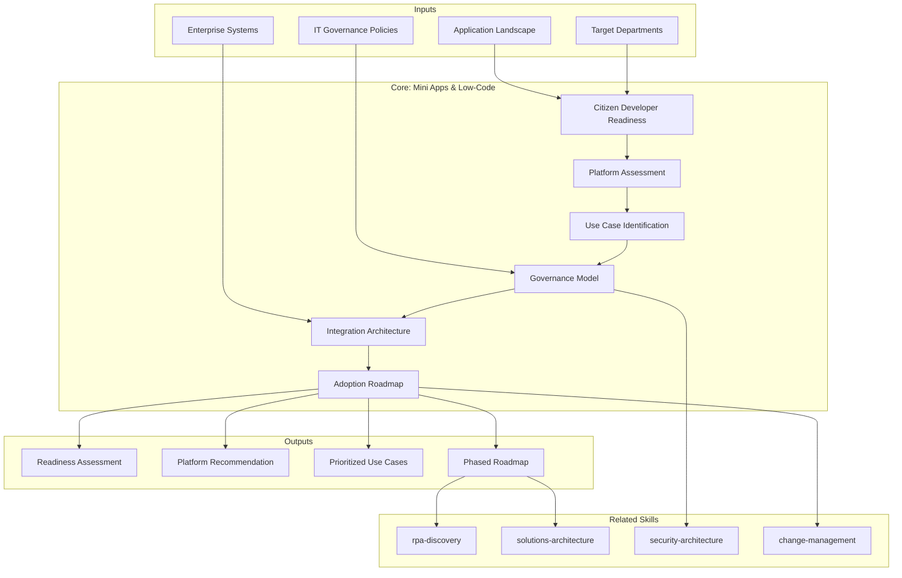

# Mini Apps & Low-Code Discovery — Citizen Development Readiness Assessment

Generates a 6-section Mini Apps and Low-Code discovery covering citizen developer readiness, platform assessment, use case identification and prioritization, governance model, integration architecture, and a phased low-code adoption roadmap. Produces actionable findings with readiness scoring, platform comparison, and governed adoption strategy.

## Principio Rector

> *El low-code democratiza la creacion, pero sin gobernanza convierte a la organizacion en un museo de aplicaciones abandonadas. La velocidad del desarrollo ciudadano solo tiene valor cuando se acompana de gobierno, seguridad y mantenibilidad.*

1. **La democratizacion sin gobernanza es caos con interfaz grafica.** Habilitar a usuarios de negocio para crear aplicaciones sin un marco de gobierno produce shadow IT a escala. El Center of Excellence no es burocracia — es la infraestructura que hace sostenible la velocidad.
2. **La plataforma correcta es la que se gobierna, no la que mas features tiene.** La evaluacion de plataformas low-code debe priorizar gobernanza empresarial, seguridad y mantenibilidad sobre capacidades tecnicas. Una plataforma ingobernable es una deuda organizacional.
3. **Los quick wins son la puerta de entrada, no el destino.** Las primeras mini apps deben demostrar valor rapido Y buen gobierno. Si los pilotos ignoran seguridad y gobernanza, establecen precedentes toxicos que escalan con la adopcion.

## Inputs

- `$1` — Path to existing low-code artifacts, documentation, or project root (default: current working directory)
- `$2` — Analysis depth: `full` (default), `executive` (sections S1, S3, S6 only)

Parse from `$ARGUMENTS`.

**Parameters:**
- `{MODO}`: `piloto-auto` (default) | `desatendido` | `supervisado` | `paso-a-paso`
  - **piloto-auto**: Auto para inventario y evaluacion de plataformas, HITL para modelo de gobernanza y decisiones de arquitectura de integracion.
  - **desatendido**: Cero interrupciones. Analisis completo automatizado. Supuestos documentados.
  - **supervisado**: Autonomo con reportes al completar cada seccion.
  - **paso-a-paso**: Confirma antes de cada seccion del analisis.
- `{FORMATO}`: `markdown` (default) | `html` | `dual`
- `{VARIANTE}`: `ejecutiva` (~40% — sections S1, S3, S6 only) | `tecnica` (full, default)

## Input Requirements

**Mandatory:**
- Current application landscape inventory (internal tools, spreadsheet-based processes)
- IT governance policies and security requirements
- Target departments/teams for citizen development
- Enterprise systems inventory (ERP, CRM, databases) for integration assessment

**Recommended:**
- Existing low-code/no-code usage (sanctioned or shadow IT)
- IT-business relationship assessment or survey results
- Data classification policy
- Cloud strategy and preferred vendors (Microsoft, Google, AWS)
- Previous automation or digital transformation initiatives

## Assumptions & Limits

**Assumptions:**
- Organization has identifiable manual processes or spreadsheet-based workflows
- IT department is willing to support (not block) citizen development with governance
- Enterprise systems have API capabilities for integration
- Documentation in English or Spanish

**Cannot do:**
- Platform licensing negotiation (requires vendor engagement and procurement)
- Production deployment of mini apps (requires development and testing)
- Organizational change management execution (requires sustained leadership effort)
- Data migration from legacy systems (requires dedicated migration project)

## Workarounds When Inputs Missing

| Missing Input | Impact | Workaround |
|---|---|---|
| No application inventory | Cannot identify automation candidates | Workshop-based process discovery with business stakeholders; flag as assumption |
| No IT governance policies | Cannot define guardrails | Recommend baseline governance framework; flag as foundational gap |
| No data classification | Cannot define data access policies | Assume all data as sensitive until classified; recommend classification exercise |
| No cloud strategy | Cannot align platform recommendation | Evaluate platforms vendor-agnostic; note alignment risk if strategy later conflicts |
| No existing low-code usage | Cannot benchmark current state | Start from zero baseline; assess readiness rather than current adoption |

## 6-Section Framework

### S1: Citizen Developer Readiness

Per department/team, assess readiness across five dimensions:

- **Current low-code/no-code skills**: Existing experience with Power Apps, Google AppSheet, Airtable, Excel macros, or similar. Self-service BI experience (Power BI, Tableau)
- **Governance awareness**: Understanding of data policies, security requirements, change management. Shadow IT history
- **Data sensitivity understanding**: Awareness of data classification, PII handling, regulatory requirements per data domain
- **IT-business relationship maturity**: Collaboration model (adversarial, transactional, partnership, co-creation). Support ticket patterns
- **Readiness score per department**: Composite score (1-10) based on skills, governance awareness, data maturity, IT relationship

**Readiness classification:**

| Score | Classification | Recommendation |
|---|---|---|
| 1-3 | Not Ready | Foundational training + governance education before any tools |
| 4-6 | Conditionally Ready | Supervised pilot with IT co-development |
| 7-8 | Ready | Self-service with governance guardrails |
| 9-10 | Advanced | CoE contributor, can mentor others |

**Conditional logic:**
- IF readiness score < 4 across all departments: flag CRITICAL — foundational capability gap, recommend training-first approach
- IF governance awareness < 3: flag HIGH — shadow IT risk, establish governance framework before enabling tools
- IF IT-business relationship is adversarial: flag BLOCKER — organizational alignment required before technology

### S2: Platform Assessment

Structured comparison using SUBSTANCIA/PROMESA/RIESGO/HUMO evaluation scale:

| Criterion | Power Platform | OutSystems | Mendix | Retool | Other |
|---|---|---|---|---|---|
| Enterprise governance | — | — | — | — | — |
| Scalability | — | — | — | — | — |
| Integration capabilities | — | — | — | — | — |
| Learning curve | — | — | — | — | — |
| TCO drivers | — | — | — | — | — |
| Security model | — | — | — | — | — |

**SUBSTANCIA/PROMESA/RIESGO/HUMO scale:**
- **SUBSTANCIA**: Proven capability with enterprise references, mature feature, well-documented
- **PROMESA**: Capability exists but immature, limited enterprise validation, roadmap item
- **RIESGO**: Capability exists with known limitations, workarounds required, vendor dependency
- **HUMO**: Marketing claim without substance, vaporware, or fundamentally limited

Per platform: strengths, limitations, ideal use cases, licensing model drivers (NOT prices), vendor lock-in assessment.

**Additional evaluation criteria:**
- Offline capability and mobile support
- Multi-tenancy and environment management
- Compliance certifications (SOC 2, ISO 27001, HIPAA)
- Marketplace/component ecosystem maturity
- AI/ML integration capabilities

**Conditional logic:**
- IF organization is Microsoft-heavy (O365, Azure AD, Teams): Power Platform has natural advantage — weight integration criterion higher
- IF use cases require complex business logic: evaluate OutSystems/Mendix over pure no-code options
- IF data sovereignty requirements: evaluate on-premise deployment options, flag cloud-only platforms as RISK

### S3: Use Case Identification & Prioritization

- **Automation candidates**: Repetitive manual processes, data entry, report generation, notification workflows
- **Simple internal tools**: CRUD applications, inventory tracking, request management, employee directories
- **Data entry apps**: Form-based data capture replacing spreadsheets, paper forms, or email-based processes
- **Approval workflows**: Multi-step approval chains, expense reports, leave requests, procurement approvals
- **Dashboards**: Operational dashboards, KPI tracking, real-time status boards

**Prioritization framework — Impact x Complexity scoring:**

| | Low Complexity | Medium Complexity | High Complexity |
|---|---|---|---|
| **High Impact** | QUICK WIN | STRATEGIC | EVALUATE CAREFULLY |
| **Medium Impact** | QUICK WIN | PLAN | DEFER |
| **Low Impact** | OPTIONAL | DEFER | REJECT |

- **Quick wins**: High impact, low complexity. First 2-3 pilots. Must demonstrate value AND governance
- **Strategic apps**: High impact, medium-high complexity. Plan with proper architecture
- **Separation criteria**: Apps that belong in low-code vs apps that require pro-code development

**Conditional logic:**
- IF > 20 use cases identified: prioritize top 10, batch remainder into phases
- IF all high-impact cases are high-complexity: flag RISK — low-code may not be the right approach for initial value demonstration
- IF quick wins involve sensitive data: ensure governance model (S4) is in place before pilot

### S4: Governance Model

- **Center of Excellence (CoE)**: Structure, roles (CoE lead, platform admin, business champion, security reviewer), reporting line, charter
- **Environment management**: Development, testing, production environments. Promotion process. Sandbox policies
- **Data access policies**: Per data classification level — what data citizen developers can access, what requires IT involvement. Principle of least privilege
- **Security guardrails**: Authentication requirements (SSO/MFA), data loss prevention (DLP) policies, connector restrictions, custom connector approval process
- **App lifecycle management**: Version control, backup strategy, app retirement criteria, ownership transfer when creator leaves organization
- **Review/approval process**: Before-production checklist — security review, data access review, performance review, accessibility check. Approval authority matrix

**Governance maturity levels:**

| Level | Description | Indicators |
|---|---|---|
| L0 | No governance | Anyone can build anything, no oversight |
| L1 | Reactive | IT discovers apps after deployment, firefighting |
| L2 | Basic | Policies exist but enforcement is manual |
| L3 | Managed | CoE operational, automated policy enforcement, regular audits |
| L4 | Optimized | Self-service within guardrails, continuous improvement, metrics-driven |

**Conditional logic:**
- IF current governance = L0: flag CRITICAL — do not enable citizen development without minimum L2 governance
- IF data classification policy missing: flag BLOCKER — cannot define data access policies without classification
- IF no app retirement policy: flag HIGH — orphaned apps accumulate technical debt and security exposure

### S5: Integration Architecture

- **Low-code to enterprise systems connectivity**: Inventory of required integrations (ERP, CRM, HRIS, databases, file systems)
- **API gateway requirements**: Centralized API management, rate limiting, monitoring, versioning. Existing API infrastructure assessment
- **Data sync patterns**: Real-time vs batch, uni-directional vs bi-directional, conflict resolution strategy. Per integration: pattern recommendation with rationale
- **Authentication/authorization**: Identity provider integration (Azure AD, Okta, etc.), service account management, OAuth flows, API key governance
- **Event-driven integration**: Webhooks, message queues, event buses for real-time triggers. Suitability assessment per use case
- **Security boundary definition**: Network segmentation between low-code platform and enterprise systems. Data in transit encryption, at rest encryption, audit logging

**Integration complexity classification:**

| Complexity | Description | Example | Governance |
|---|---|---|---|
| Simple | Pre-built connector, read-only | SharePoint list read | Citizen developer |
| Moderate | Pre-built connector, read-write | CRM record update | IT-supervised |
| Complex | Custom connector, API integration | ERP integration | IT-developed |
| Critical | System-of-record, transactional | Financial system write | Pro-code only |

**Conditional logic:**
- IF enterprise systems lack APIs: flag BLOCKER for integration — recommend API enablement project first
- IF no API gateway exists: recommend gateway implementation as prerequisite for scale
- IF critical system integrations required: recommend pro-code microservice layer, NOT direct low-code connection

### S6: Low-Code Adoption Roadmap

Phased plan with adoption metrics per phase:

**Phase 1: Pilot (Month 1-3)**
- Select 2-3 quick win use cases from S3 prioritization
- Establish minimum viable governance (L2 from S4)
- Deploy chosen platform in controlled environment
- Train initial citizen developer cohort (5-10 people)
- Success metrics: Apps deployed, user adoption rate, governance compliance rate
- Effort magnitude: IT setup days, training days (NOT prices)

**Phase 2: Expansion (Month 4-9)**
- Establish CoE with dedicated roles
- Expand to 3-5 departments
- Launch formal training program (aligned with mentoring-training-discovery if applicable)
- Implement automated governance tooling (DLP, environment management)
- Success metrics: Active citizen developers, apps in production, integration count, incident rate
- Effort magnitude: CoE staffing, training program days (NOT prices)

**Phase 3: Maturity (Month 10-18)**
- Enterprise-wide availability with self-service governance
- Advanced use cases (complex integrations, AI-powered apps)
- Community of Practice for citizen developers
- Continuous improvement cycle (quarterly governance review, platform capability assessment)
- Success metrics: Organization-wide adoption rate, app portfolio health, business value delivered, shadow IT reduction
- Effort magnitude: Ongoing CoE operation, advanced training days (NOT prices)

Per phase: prerequisites from previous phase, risk factors, rollback criteria if adoption stalls, dependency on governance maturity.

## Escalation to Human Architect

- Enterprise architecture constraints conflict with low-code platform requirements
- Data sovereignty or regulatory requirements require legal review
- Organizational politics between IT and business create adoption blockers
- Existing shadow IT landscape is extensive and uncharted
- Platform vendor evaluation requires commercial negotiation context
- Integration with legacy systems without API capability requires custom development scoping

## Validation Gate

- [ ] Citizen developer readiness assessed per department with composite scores
- [ ] Platform assessment complete with SUBSTANCIA/PROMESA/RIESGO/HUMO evaluation
- [ ] Use cases identified and prioritized with Impact x Complexity scoring
- [ ] Governance model defined with CoE structure, policies, and maturity target
- [ ] Integration architecture mapped with complexity classification per integration
- [ ] Adoption roadmap phased with metrics and effort magnitudes (NOT prices)
- [ ] All findings tagged with evidence source [DOC], [INFERENCIA], [SUPUESTO]
- [ ] Security guardrails defined for citizen development
- [ ] Quick wins identified that demonstrate value AND governance simultaneously
- [ ] Recommendations sequenced by dependency and organizational readiness

## Casos Borde

| Caso | Estrategia de Manejo |
|---|---|
| Organizacion sin procesos manuales identificables | Realizar workshop de process discovery con stakeholders de negocio; mapear procesos basados en spreadsheets como punto de partida; flag como [SUPUESTO] |
| Shadow IT extensivo con apps low-code no sancionadas | Inventariar apps existentes antes de recomendar plataforma; evaluar migracion vs consolidacion; establecer amnistia temporal para registrar apps no gobernadas |
| Resistencia de IT a citizen development | Disenar modelo de co-creacion IT-negocio; comenzar con pilotos supervisados que demuestren gobernanza; escalar solo con evidencia de compliance |
| Multiples plataformas low-code ya en uso | Evaluar consolidacion vs coexistencia; mapear bots y apps por plataforma; priorizar interoperabilidad sobre uniformidad si el costo de migracion es alto |

## Decisiones y Trade-offs

| Decision | Alternativa Descartada | Justificacion |
|---|---|---|
| Gobernanza minima L2 antes de habilitar citizen development | Habilitar herramientas sin gobernanza previa | Sin guardrails, citizen development produce shadow IT a escala; los precedentes toxicos de pilotos sin gobernanza escalan con la adopcion |
| Quick wins que demuestren valor Y gobernanza simultaneamente | Quick wins solo de valor sin gobernanza | Si los pilotos ignoran seguridad y gobernanza, establecen precedentes que son costosos de revertir cuando se escala |
| CoE como infraestructura habilitadora, no como burocracia | Gobernanza distribuida sin CoE | Sin un centro de excelencia, la consistencia de estandares y la calidad de las apps depende de la disciplina individual, que no escala |

## Knowledge Graph

## Output Templates

| Formato | Nombre | Contenido |
|---|---|---|
| **Markdown** | `Mini_Apps_Discovery_{project}.md` | Assessment de 6 secciones: readiness scoring, platform comparison SUBSTANCIA/PROMESA/RIESGO/HUMO, use case prioritization con Impact x Complexity, governance model con CoE, integration architecture, y adoption roadmap faseado. Diagramas Mermaid embebidos. |
| **PPTX** | `Mini_Apps_Discovery_{project}.pptx` | Presentacion ejecutiva con quadrant chart de priorizacion, timeline de adopcion, y readiness heatmap por departamento. Para alineacion con sponsors ejecutivos. |
| **HTML** | `Mini_Apps_Discovery_{project}_{WIP}.html` | Mismo contenido en HTML branded (Design System MetodologIA v5). Self-contained, WCAG AA, responsive. Dark-First Executive. Incluye quadrant chart interactivo de priorizacion Impact x Complexity, readiness heatmap por departamento, y roadmap de adopcion faseado con hitos de gobernanza. |
| **DOCX** | `{fase}_Mini_Apps_Discovery_{cliente}_{WIP}.docx` | Generado via python-docx con MetodologIA Design System v5. Portada con logo y metadatos, TOC automatico, headers/footers con nombre del skill y numeracion, tablas zebra, titulos Poppins navy, cuerpo Montserrat, acentos gold. |
| **XLSX** | `{fase}_{entregable}_{cliente}_{WIP}.xlsx` | Generado con openpyxl bajo MetodologIA Design System v5. Headers con fondo navy y tipografía Poppins blanca, formato condicional, auto-filtros activados, valores sin fórmulas. Hojas: Readiness Assessment, Platform Comparison, Use Case Prioritization, Governance Model, Integration Architecture, Adoption Roadmap. |

## Evaluacion

| Dimension | Peso | Criterio |
|---|---|---|
| Trigger Accuracy | 10% | Descripcion activa triggers correctos (low-code, citizen developer, Power Platform, mini apps) sin falsos positivos con RPA o digital transformation generica |
| Completeness | 25% | Las 6 secciones cubren readiness, plataforma, casos de uso, gobernanza, integracion y roadmap sin huecos; todos los departamentos target evaluados |
| Clarity | 20% | Instrucciones ejecutables sin ambiguedad; scoring de readiness con criterios cuantificables; recomendaciones de plataforma con justificacion explicita |
| Robustness | 20% | Maneja shadow IT extensivo, resistencia de IT, multiples plataformas, y ausencia de procesos documentados con workarounds especificos |
| Efficiency | 10% | Proceso no tiene pasos redundantes; variante ejecutiva reduce a S1+S3+S6 sin perder capacidad de decision |
| Value Density | 15% | Cada seccion aporta valor practico directo; readiness scoring y platform comparison son herramientas de decision inmediata para sponsors |

**Umbral minimo: 7/10.**

---

## Output Artifact

**Primary:** `Mini_Apps_Discovery_{project}.md` (o `.html` si `{FORMATO}=html|dual`) — 6-section low-code and citizen development assessment with readiness scoring, platform comparison, governed use case prioritization, integration architecture, and phased adoption roadmap.

**Diagramas incluidos:**
- Quadrant chart: Use case prioritization (Impact x Complexity)
- Architecture diagram: Integration topology (low-code platform to enterprise systems)
- Timeline: Phased adoption roadmap with governance maturity milestones

---
**Autor:** Javier Montaño · Comunidad MetodologIA | **Ultima actualizacion:** 14 de marzo de 2026
