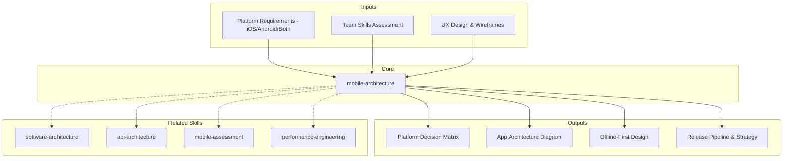

# Mobile Architecture: Platform Strategy, Patterns & Release Management

Mobile architecture defines how mobile applications are structured, how they communicate with backends, handle offline scenarios, manage state, and reach users through app stores. This skill produces comprehensive mobile architecture documentation covering platform selection, app architecture patterns, offline-first design, performance optimization, backend integration, and release strategy.

## Grounding Guideline

**Mobile is not "web on a small screen" — it is a channel with unique constraints.** Unstable network, finite battery, release cycles controlled by stores, and users who abandon at 3 seconds. Designing mobile requires respecting these constraints as first-class constraints, not afterthoughts.

### Mobile Architecture Philosophy

1. **Offline-first for unreliable networks.** The app must work without connectivity. Sync when there is a network, cache always, persistent action queue. The user should not notice the difference.
2. **Native vs cross-platform is a business decision.** It is not technical — it is about team, velocity, and budget. Flutter for velocity, Native for extreme performance, KMP for shared logic with native UI.
3. **Release management is more complex than web.** There is no "deploy to production in 5 minutes." There are store reviews, staged rollouts, feature flags, and forced updates. The release pipeline is architecture.
4. **Performance is UX.** Cold start <2s, 60fps minimum, <200MB RAM. Every millisecond counts in mobile.

## Inputs

The user provides an app or project name as `$ARGUMENTS`. Parse `$1` as the **app/project name** used throughout all output artifacts.

**Parameters:**
- `{MODO}`: `piloto-auto` (default) | `desatendido` | `supervisado` | `paso-a-paso`
  - **piloto-auto**: Auto para platform comparison y architecture patterns, HITL para platform selection y offline strategy.
  - **desatendido**: Zero interruptions. Arquitectura mobile documentada automáticamente. Assumptions documented.
  - **supervisado**: Autónomo con checkpoint en platform decision y release strategy.
  - **paso-a-paso**: Confirma cada platform evaluation, architecture pattern, offline design, y release pipeline.
- `{FORMATO}`: `markdown` (default) | `html` | `dual`
- `{VARIANTE}`: `ejecutiva` (~40% — S1 platform strategy + S3 offline-first + S6 release) | `técnica` (full 6 sections, default)

Before generating architecture, detect the mobile project context:

```
!find . -name "pubspec.yaml" -o -name "package.json" -o -name "*.xcodeproj" -type d -o -name "build.gradle*" -o -name "*.swift" -o -name "*.kt" | head -20
```

If reference materials exist, load them:

```
Read ${CLAUDE_SKILL_DIR}/references/mobile-patterns.md
```

---

## When to Use

- Choosing between native, cross-platform, or hybrid mobile development
- Designing app architecture (MVVM, MVI, Clean Architecture, modularization)
- Implementing offline-first data synchronization
- Optimizing mobile performance (cold start, memory, battery)
- Designing backend APIs specifically for mobile consumption
- Planning mobile CI/CD, code signing, and app store distribution

## When NOT to Use

- Backend service architecture --> use software-architecture skill
- API design without mobile-specific concerns --> use solutions-architecture skill
- Assessing existing mobile app health --> use mobile-assessment skill
- UX content and microcopy --> use ux-writing skill

---

## Delivery Structure: 6 Sections

### S1: Platform Strategy

**Platform Comparison (2025-2026):**

| Factor | Native (Swift/Kotlin) | Flutter (3.24+) | React Native (New Arch) | KMP / CMP |
|---|---|---|---|---|
| Performance | Best | Near-native (Impeller renderer) | Good (Fabric + TurboModules) | Native (shared logic) |
| UI rendering | Platform-native | Impeller: precompiled shaders, 60/120 FPS, no shader jank | Fabric: synchronous, concurrent UI via JSI | Native per platform (or CMP shared UI) |
| Code sharing | 0% | 90-95% | 85-90% | 50-80% logic; 90%+ with CMP UI |
| Team skills | iOS + Android specialists | Dart developers | JavaScript/React developers | Kotlin developers |
| Market share | N/A | ~46% cross-platform | ~35% cross-platform | Growing (Google Docs on iOS uses KMP) |
| Hot reload | Limited | Excellent (sub-second) | Good | N/A (logic layer) |
| App size overhead | Baseline | +5-10MB | +7-15MB | Minimal (logic only) |
| Cold start | Fastest | Fast (Impeller eliminates shader warmup) | Moderate (JSI improves over bridge) | Native speed |

**React Native New Architecture (default since 0.76):**
- **Fabric Renderer:** Synchronous, concurrent-capable UI. Replaces the async bridge with JSI (JavaScript Interface) for direct C++ calls. Enables synchronous native method invocation.
- **TurboModules:** Lazy-loaded native modules. Only initialized when first accessed (vs. all at startup). Reduces cold start time. Shopify reports 10% faster Android launch.
- **Codegen:** Type-safe interface generation from Flow/TypeScript specs. Eliminates runtime serialization overhead.
- Migration: greenfield apps get New Arch by default. Existing apps: enable incrementally, test each native module.

**Flutter Impeller Renderer (default since 3.16):**
- Replaces Skia with ahead-of-time shader compilation. Eliminates shader jank (first-frame stutter).
- Vulkan backend (Android), Metal backend (iOS). Consistent 60/120 FPS.
- Reduced memory footprint for rendering pipeline.
- Impact: cold start improved (no runtime shader compilation), smoother animations, predictable frame times.

**Compose Multiplatform (CMP) Status (2025-2026):**
- JetBrains extension of Jetpack Compose to iOS, desktop, web.
- iOS support: stable since 2024. Production-ready for business apps.
- Shares UI + logic in Kotlin. Best for: teams already on Kotlin wanting maximum code reuse with declarative UI.
- Google Docs uses KMP in production on iOS with performance parity or better.
- Roadmap: multi-module compilation for Kotlin/Wasm, dynamic loading, improved iOS rendering.

**Decision Criteria:**
- Performance-critical (games, AR, heavy animations): Native
- Rapid development, single codebase, custom UI: Flutter
- Existing React/JS team, web+mobile: React Native
- Shared business logic, native UI per platform: KMP
- Maximum code sharing including UI, Kotlin team: CMP

### S2: App Architecture Patterns

**Architecture Patterns:**
- **MVVM:** View observes ViewModel; ViewModel transforms Model. Best for: reactive frameworks (SwiftUI, Compose, Flutter).
- **MVI:** Unidirectional: Intent -> Reducer -> State -> View. Best for: complex state, predictable behavior, time-travel debugging.
- **Clean Architecture:** Domain layer framework-independent; Use Cases orchestrate business logic. Best for: large apps, testability priority.
- **BLoC/Redux:** Centralized state store with events. Best for: Flutter (BLoC), React Native (Redux/Zustand).

**Modularization Strategy (2025 best practices):**

| Module Type | Contains | Depends On | Example |
|---|---|---|---|
| Feature module | Screen(s), ViewModel, Repository | Core modules only | `:feature-orders`, `:feature-profile` |
| Core module | Shared utilities, networking, design system | Foundation only | `:core-network`, `:core-design` |
| Navigation module | Routing, deep links | Feature module interfaces | `:navigation` |
| Foundation | Extensions, constants, logger | Nothing | `:foundation` |

- **Rule:** Feature modules never depend on other feature modules. Enforce via Gradle/build linting.
- KMP sharing: start with networking + data layer shared; keep UI native. Expand as confidence grows.
- Build performance: modularization enables parallel builds. Target <3 min incremental build.

**Dynamic Feature Delivery:**
- **Android Dynamic Feature Modules:** Download features on demand via Play Feature Delivery. Reduces initial APK size. Use for: large features accessed by <30% of users (e.g., advanced editor, AR scanner).
- **iOS On-Demand Resources:** Tag assets by usage. System downloads when needed, purges under storage pressure. Use for: large media, tutorial content, optional features.
- **App Clips (iOS) / Instant Apps (Android):** Lightweight entry points (<15MB) for specific flows without full install. Architecture: extract target feature into standalone module with minimal dependencies.

**State Management Layers:**
- Local: UI-specific, ephemeral (scroll position, form input)
- Shared: cross-screen (profile, cart, auth token)
- Persistent: survives restart (settings, offline queue, cache)
- Server: remote with staleness policies (cache-then-network, stale-while-revalidate)

**Declarative UI Patterns (2025):**
- **Jetpack Compose:** ViewModel exposes `StateFlow`. Composable observes via `collectAsState()`. Side effects: `LaunchedEffect`, `rememberCoroutineScope`. Navigation: type-safe Compose Navigation 2.8+.
- **SwiftUI:** `@Observable` macro (iOS 17+) replaces `ObservableObject`. `NavigationStack` with `navigationDestination(for:)`. Combine phased out for async/await + `@Observable`.

**Dependency Injection:** Constructor injection for testability. Hilt (Android), Swinject (iOS), get_it (Flutter), inversify (RN).

### S3: Offline-First & Data Sync

**Local Storage:**
- SQLite/Room/Core Data: structured relational data, complex queries
- Key-value: SharedPreferences/UserDefaults/MMKV for simple settings
- File storage: documents, images, binary data
- Encrypted: Keychain (iOS), EncryptedSharedPreferences (Android)

**Sync Strategies:** Pull (client requests on open/refresh), push (WebSocket/SSE), delta (changes since timestamp), full (replace local state).

**Conflict Resolution:** Last-write-wins (simplest), server-wins (authoritative), field-level merge (most flexible), CRDTs (conflict-free, eventual consistency).

**Optimistic UI:** Apply locally immediately, queue server sync, confirm on success, revert on failure. Persistent queue survives restart. Exponential backoff retry.

**Background Tasks:**
- Android: WorkManager for deferrable guaranteed work; Foreground Service for ongoing tasks. Avoid AlarmManager for periodic work.
- iOS: BGTaskScheduler (BGAppRefreshTask for periodic, BGProcessingTask for heavy). Background URLSession for large transfers. 30s execution limit unless special entitlement.
- Cross-platform: abstract behind platform interface. Test with airplane mode and process death.

### S4: Performance & UX Optimization

**Cold Start Benchmarks:**

| Rating | Time to First Meaningful Content | Action |
|---|---|---|
| Excellent | <1s | No action needed |
| Good | 1-2s | Monitor, optimize opportunistically |
| Acceptable | 2-3s | Prioritize optimization in next sprint |
| Unacceptable | >3s | Critical fix -- users abandon at 3s+ |

**Cold Start Optimization Checklist:**
- [ ] Splash screen provides immediate visual feedback
- [ ] Lazy initialization: defer analytics, crash reporting, non-critical SDKs
- [ ] Preload critical data from cache; show cached content first
- [ ] Minimize DI graph: only inject first-screen dependencies at startup
- [ ] Android: generate Baseline Profiles for AOT compilation of hot paths
- [ ] Flutter: Impeller eliminates shader warmup; verify no Skia fallback
- [ ] React Native: TurboModules lazy-load; verify no bridge-era modules blocking startup

**Memory Management:**
- Image caching: size-appropriate thumbnails, LRU with memory limit
- List virtualization: LazyColumn (Compose), ListView.builder (Flutter), FlatList (RN)
- Leak detection: LeakCanary (Android), Instruments (iOS), DevTools (Flutter)
- Budget: <200MB peak for mainstream apps; <100MB for emerging market targets

**Animation Targets:** 60fps minimum (120fps for ProMotion/high refresh). Animate transform/opacity (GPU), not size/position (CPU). Platform APIs: Compose Animation, SwiftUI `withAnimation`, Flutter `AnimationController`.

**Battery Optimization:** Batch network requests. Significant-change location monitoring. Compress payloads. Prefer WiFi for large transfers.

**Accessibility:**
- Screen reader labels on all interactive elements
- Dynamic type support (no clipping)
- WCAG AA contrast: 4.5:1 text, 3:1 large text
- Touch targets: 44x44pt (iOS), 48x48dp (Android)
- Respect reduced motion system setting

### S5: Backend Integration

**Mobile-Optimized API Design:**
- BFF (Backend-for-Frontend): dedicated API layer per platform/screen
- Response shaping: return only needed fields
- Pagination: cursor-based (stable) over offset-based
- Compression: gzip/brotli for JSON payloads
- Versioning: URL path (/v2/) or header. Support N-1 for forced update grace.

**GraphQL vs. REST Decision:**

| Factor | REST | GraphQL |
|---|---|---|
| Over-fetching | Common | Eliminated (client specifies) |
| Under-fetching | Multiple round trips | Single query, nested resolution |
| Caching | HTTP caching (simple) | Client-side (Apollo, Relay, urql) |
| Mobile fit | Good with BFF | Excellent for varied screens |

**Push Notifications:** APNs (iOS) + FCM (Android). Silent push for background sync. Rich push with images, actions, deep links. Permission strategy: ask after value demonstration, not first launch.

**Deep Linking:** Universal Links (iOS) / App Links (Android) for domain-based routing. Deferred deep linking for new installs. Full navigation stack restoration.

### S6: Release & Distribution

**Mobile CI/CD Pipeline:**
- Build: compile per platform, generate signed artifacts
- Test: unit, widget/UI, integration, screenshot tests
- Sign: Fastlane match (iOS), Play App Signing (Android)
- Distribute: TestFlight (iOS beta), Play Console internal track, Firebase App Distribution

**Feature Flags:** Remote config for enable/disable without app update. Gradual rollout (1% -> 10% -> 50% -> 100%). Kill switch. Tools: Firebase Remote Config, LaunchDarkly, Unleash.

**OTA Updates:** CodePush (React Native), Shorebird (Flutter). No OTA for native compiled code (store policy). Must not change app purpose.

**App Store Compliance:**
- Apple: App Review Guidelines, privacy nutrition labels, ATT prompt, PrivacyInfo.xcprivacy manifest
- Google: Data Safety section, target API level (annual requirement), permission rationale at point of use
- Both: accessibility, content ratings, subscription billing rules

**Versioning:** Semantic versioning (major.minor.patch). Always-incrementing build numbers. Minimum version enforcement for critical updates.

---

## Trade-off Matrix

| Decision | Enables | Constrains | When to Use |
|---|---|---|---|
| Native | Best performance, full API access | 2x codebase, 2x team | Performance-critical, platform-specific |
| Flutter | Single codebase, Impeller rendering | Custom render engine, plugin gaps | Rapid iteration, consistent UI |
| React Native (New Arch) | JS ecosystem, Fabric/TurboModules perf | Native module migration effort | JS teams, existing React codebase |
| KMP/CMP | Shared logic (+ optional shared UI) | Smaller ecosystem, Kotlin required | Kotlin teams, logic-first sharing |
| Offline-First | Works without network, fast UI | Sync complexity, conflict resolution | Field workers, unreliable connectivity |
| Dynamic Features | Smaller initial download | Delivery complexity, testing overhead | Large features used by <30% of users |
| BFF Pattern | Optimized mobile responses | Additional service to maintain | Shared backend serving web and mobile |

---

## Assumptions

- Target platforms defined (iOS, Android, or both)
- Minimum OS version requirements established
- Backend API exists or is being co-designed
- Team skills assessed for platform decision
- App store accounts provisioned

## Limits

- Does not design backend services (use software-architecture skill)
- Does not assess existing app health (use mobile-assessment skill)
- Does not cover API design in isolation (use solutions-architecture skill)
- Platform SDKs evolve rapidly; verify against latest documentation

## Edge Cases

| Case | Handling Strategy |
|---|---|
| Desarrollador unico construyendo para ambas plataformas (iOS + Android) | Cross-platform obligatorio (Flutter o React Native). Maximizar code sharing. Usar managed services para backend. Evitar native modules custom. Priorizar velocity sobre optimizacion. |
| App enterprise con requisitos MDM (Mobile Device Management) | Integrar MDM desde Sprint 0. Managed app config, VPN tunneling, data loss prevention como constraints de arquitectura. Testear con perfiles MDM reales tempranamente. Certificate pinning obligatorio. |
| Industria regulada (healthcare/finance) con requisitos de compliance estrictos | Biometric auth obligatorio. Certificate pinning. No sensitive data en logs ni screenshots. Jailbreak/root detection. HIPAA/PCI-DSS compliance checklist. Encriptar storage local. Audit trail de acciones criticas. |
| Super app con >10 feature modules y multiples equipos de desarrollo | Micro-frontend architecture. Cada feature team owner de un module. Dynamic feature delivery para reducir APK/IPA inicial. Navigation contract entre modules. CI/CD por modulo con integration testing cruzado. |

## Decisions & Trade-offs

| Decision | Discarded Alternative | Justification |
|---|---|---|
| Flutter como default para cross-platform sobre React Native | React Native con New Architecture | Flutter ofrece Impeller renderer (60/120 FPS sin shader jank), 90-95% code sharing, y hot reload sub-segundo. React Native requiere migracion a New Arch para beneficios similares. Flutter mejor para equipos sin experiencia React previa. |
| Offline-first con optimistic UI como patron default | Online-only con loading spinners | Mobile opera en redes inestables. Optimistic UI elimina latencia percibida. Queue persistente sobrevive restart. El costo de sync complexity se justifica por UX superior y retenciones 2-3x mayores. |
| BFF (Backend-for-Frontend) sobre API generica compartida con web | API unica REST para web y mobile | Mobile necesita response shaping especifico (menos datos, diferentes aggregations). BFF elimina over-fetching y reduce round trips. API generica fuerza compromises que degradan performance en ambos canales. |

## Knowledge Graph



## Output Templates

**Formato MD (default):**
```
# Mobile Architecture: {app_name}
## S1: Platform Strategy
  - Comparison matrix (Native vs Flutter vs RN vs KMP)
  - Decision rationale with team skill assessment
## S2: App Architecture Patterns
  - Architecture diagram (Mermaid)
  - Modularization plan
## S3-S6: [remaining sections]
## Anexos: CI/CD pipeline config, app store compliance checklist, accessibility audit
```

**Formato HTML (bajo demanda):**
- Filename: `Mobile_Architecture_{app_name}_{WIP}.html`
- Estructura: HTML self-contained branded (Design System MetodologIA v5). Light-First Technical. Incluye platform decision matrix interactiva con scoring visual, diagrama C4 Level 2 de arquitectura mobile, performance benchmark dashboard (cold start, memory, FPS), y release pipeline flowchart con stage gates. WCAG AA, responsive, print-ready.

**Formato DOCX (bajo demanda):**
- Filename: `{fase}_Mobile_Architecture_{cliente}_{WIP}.docx`
- Generado via python-docx con MetodologIA Design System v5. Portada con logo y metadatos, TOC automatico, headers/footers con nombre del skill y numeracion, tablas zebra, titulos Poppins navy, cuerpo Trebuchet MS, acentos gold.

**Formato XLSX (bajo demanda):**
- Filename: `{fase}_Mobile_Architecture_{cliente}_{WIP}.xlsx`
- Generado via openpyxl con MetodologIA Design System v5. Headers navy con texto blanco Poppins, formato condicional por severidad/estado, auto-filtros en todas las columnas, valores calculados sin formulas. Hojas: Platform Comparison Matrix, Architecture Decisions, Performance Budgets, Release Pipeline.

**Formato PPTX (bajo demanda):**
- Filename: `{fase}_Mobile_Architecture_{cliente}_{WIP}.pptx`
- Generado via python-pptx con MetodologIA Design System v5. Slide master navy gradient, titulos Poppins, cuerpo Trebuchet MS, acentos gold. Max 20 slides variante ejecutiva / 30 variante tecnica. Speaker notes con referencias de evidencia [DOC]/[INFERENCIA]/[SUPUESTO].

## Evaluacion

| Dimension | Peso | Criterio | Umbral Minimo |
|---|---|---|---|
| Trigger Accuracy | 10% | El skill se activa correctamente ante menciones de mobile architecture, Flutter, React Native, KMP, offline-first, app store | 7/10 |
| Completeness | 25% | Las 6 secciones cubren platform, architecture, offline, performance, backend integration, y release | 7/10 |
| Clarity | 20% | Platform decision con justificacion cuantitativa. Architecture patterns con layer separation explicita. Performance targets concretos. | 7/10 |
| Robustness | 20% | Edge cases de single dev, MDM, regulated industry, super app cubiertos. Offline strategy con conflict resolution. Store compliance checklist. | 7/10 |
| Efficiency | 10% | Output proporcional al contexto. Sin documentar plataformas no relevantes. Modularization scoped al tamano del equipo. | 7/10 |
| Value Density | 15% | Cold start optimization checklist accionable. CI/CD pipeline configs concretos. Feature flag strategy con kill switch. | 7/10 |

**Umbral minimo global:** 7/10. Deliverables por debajo requieren re-work antes de entrega.

---

## Edge Cases

**Single Developer Building for Both Platforms:**
Cross-platform (Flutter or React Native) strongly favored. Maximize code sharing. Use managed services for backend.

**Enterprise App with MDM Requirements:**
MDM integration affects architecture: managed app config, VPN tunneling, data loss prevention. Test with MDM profiles early.

**App with Large Media (Video, 3D):**
Streaming over download. Progressive loading for 3D. CDN integration. Selective offline download with storage management UI.

**Super App / Multi-Feature App:**
Micro-frontend architecture: each feature team owns a module. Dynamic feature delivery. Navigation contract between modules.

**Regulated Industry (Healthcare, Finance):**
Biometric auth. Certificate pinning. No sensitive data in logs or screenshots. Jailbreak/root detection. HIPAA/PCI-DSS compliance.

---

## Validation Gate

Before finalizing delivery, verify:

- [ ] Platform strategy justified with comparison matrix and team skill assessment
- [ ] Architecture pattern selected with clear layer separation and modularization plan
- [ ] Cold start target defined (<2s) with optimization checklist addressed
- [ ] Offline strategy covers sync, conflict resolution, and persistent queue
- [ ] Accessibility meets WCAG AA and platform guidelines
- [ ] Backend integration uses mobile-optimized patterns (BFF, pagination, compression)
- [ ] Push notification and deep linking architecture documented
- [ ] CI/CD pipeline covers build, test, sign, and distribute
- [ ] Feature flag strategy supports gradual rollout and kill switch
- [ ] App store compliance checklist reviewed for both platforms

---

## Output Format Protocol

| Format | Default | Description |
|--------|---------|-------------|
| `markdown` | Yes | Rich Markdown + Mermaid diagrams. Token-efficient. |
| `html` | On demand | Branded HTML (Design System). Visual impact. |
| `dual` | On demand | Both formats. |

Default output is Markdown with embedded Mermaid diagrams. HTML generation requires explicit `{FORMATO}=html` parameter.

## Output Artifact

**Primary:** `A-01_Mobile_Architecture.html` -- Executive summary, platform decision matrix, architecture diagram, offline-first design, performance optimization plan, backend integration strategy, release pipeline.

**Secondary:** Module dependency diagram, API contract specification, CI/CD pipeline configuration, app store compliance checklist, accessibility audit template.

---
**Autor:** Javier Montaño | **Última actualización:** 12 de marzo de 2026
