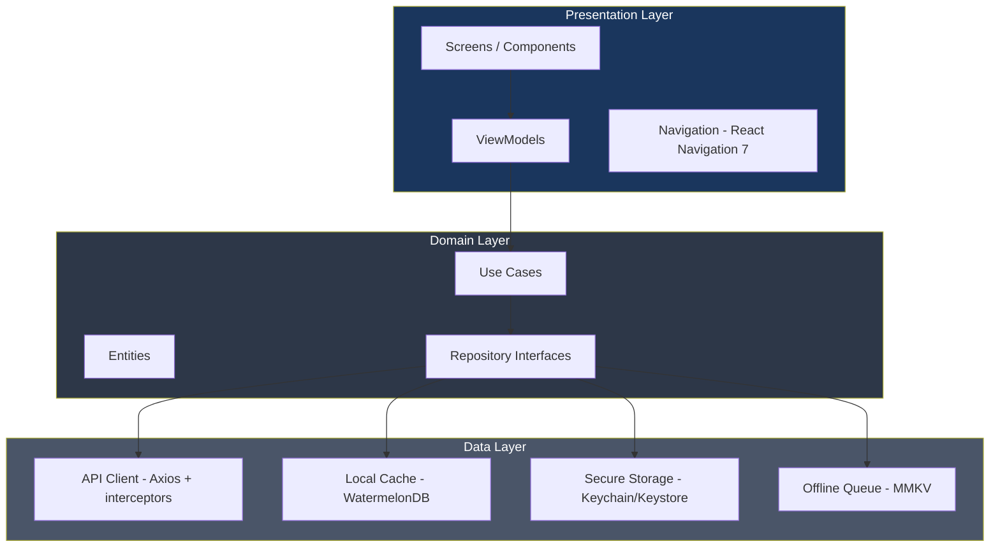
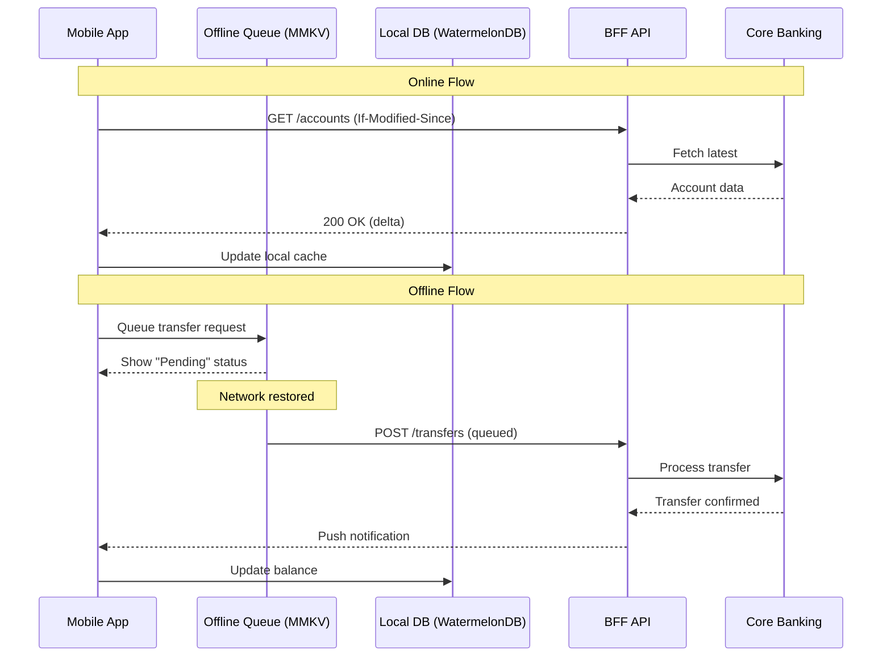
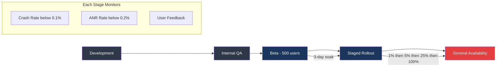

# Mobile Architecture — Acme Corp Banking Modernization

Mobile architecture design for Acme Corp's retail banking app serving 1.8M monthly active users across iOS and Android. This document covers platform strategy, app architecture, offline-first data sync, performance optimization, backend integration, and release management.

---

## S1: Platform Strategy

### Platform Decision: React Native (New Architecture)

| Factor | Native | Flutter | React Native (New Arch) | Decision |
|--------|--------|---------|------------------------|----------|
| Code sharing | 0% | 90-95% | 85-90% | RN: 87% shared code target |
| Team skills | No iOS expertise | Dart ramp-up needed | 6 React/JS developers available | RN: existing team capability |
| Performance | Best | Near-native | Good (Fabric + TurboModules) | RN: sufficient for banking flows |
| Time to market | 12 months | 7 months | 6 months | RN: fastest with current team |
| Biometric APIs | Full access | Plugin-dependent | TurboModules direct access | RN: TurboModules bridge biometrics |
| App size overhead | Baseline | +8MB | +12MB | RN: acceptable at 34MB total |

### React Native New Architecture Enablement

- **Fabric Renderer:** Synchronous UI with JSI for direct C++ native calls. Eliminates async bridge bottleneck for real-time balance updates.
- **TurboModules:** Lazy-loaded native modules. Biometric auth, secure storage, and push notification modules initialize on first use only.
- **Codegen:** TypeScript specs generate type-safe native interfaces. Zero runtime serialization overhead for payment flows.

### Platform Requirements

| Requirement | iOS | Android |
|------------|-----|---------|
| Minimum OS | iOS 16.0 | Android 10 (API 29) |
| Target devices | iPhone 12+ (95% of user base) | Mid-range+ (Snapdragon 600+) |
| Biometric | Face ID / Touch ID | Fingerprint / Face Unlock |
| App size budget | <40MB | <35MB (APK), <80MB (AAB) |

---

## S2: App Architecture

### Architecture Pattern: Clean Architecture + MVVM

### Module Structure

| Module | Contains | Dependencies | Example |
|--------|----------|-------------|---------|
| `feature-accounts` | Account list, detail, statements | `core-network`, `core-design` | Balance view, transaction history |
| `feature-transfers` | P2P, ACH, wire transfers | `core-network`, `core-auth`, `core-design` | Transfer form, confirmation |
| `feature-payments` | Bill pay, scheduled payments | `core-network`, `core-design` | Payee management, recurring |
| `feature-cards` | Card management, freeze/unfreeze | `core-network`, `core-design` | Virtual card, spend controls |
| `feature-auth` | Login, biometric, MFA | `core-auth`, `core-secure-storage` | Login screen, biometric prompt |
| `core-network` | API client, interceptors, retry | `foundation` | Axios instance, auth headers |
| `core-design` | Design system components, tokens | `foundation` | Buttons, cards, typography |
| `core-auth` | Auth state, token management | `core-secure-storage` | JWT refresh, session timeout |
| `core-secure-storage` | Keychain/Keystore wrapper | `foundation` | Encrypted preferences |
| `foundation` | Logger, constants, extensions | None | Date formatting, currency utils |

### State Management: Zustand + React Query

| State Type | Technology | Persistence | Example |
|-----------|-----------|-------------|---------|
| Server state | React Query (TanStack) | Memory + disk cache | Account balances, transactions |
| Client state | Zustand | MMKV (encrypted) | Auth session, UI preferences |
| Form state | React Hook Form | Memory only | Transfer form, payee form |
| Navigation | React Navigation 7 | Memory + deep link restore | Screen stack, tab state |

---

## S3: Offline-First & Data Sync

### Offline Capability Matrix

| Feature | Offline Support | Sync Strategy | Conflict Resolution |
|---------|----------------|---------------|-------------------|
| View account balances | Cached (stale indicator shown) | Pull on app foreground | Server-wins |
| View transaction history | Last 90 days cached locally | Delta sync (since timestamp) | Server-wins |
| Initiate transfer | Queued in offline queue | Push when online | Server validation |
| View cards | Full offline | Pull on app foreground | Server-wins |
| Bill payments | Queued with pending status | Push when online | Server validation |
| Biometric login | Full offline (cached token) | Token refresh on reconnect | Re-authenticate if expired |

### Sync Architecture

### Conflict Resolution

- **Server-wins** for all read data (balances, transactions, card status)
- **Queue ordering** for write operations (transfers processed in FIFO order)
- **Stale data indicator:** "Last updated 3 hours ago" banner when cache age > 30 minutes
- **Forced sync:** Pull-to-refresh triggers full sync on any screen

---

## S4: Performance & UX Optimization

### Performance Budgets

| Metric | Target | Current Baseline | Status |
|--------|--------|-----------------|--------|
| Cold start (iOS) | <1.5s | 1.2s | PASS |
| Cold start (Android) | <2.0s | 1.8s | PASS |
| TTI (Time to Interactive) | <2.0s | 1.6s | PASS |
| Screen transitions | <300ms | 220ms | PASS |
| Frame rate | 60fps sustained | 58fps (accounts list) | MONITOR |
| Memory (peak) | <180MB | 145MB | PASS |
| App size (iOS) | <40MB | 34MB | PASS |
| App size (Android AAB) | <35MB | 28MB | PASS |

### Cold Start Optimization

- TurboModules: biometric, analytics, crash reporting lazy-initialized (not at startup)
- Hermes engine: precompiled bytecode for faster JS parsing
- Splash screen: native splash (instant) transitions to React Native root in <800ms
- Preload: cached account summary displayed while fresh data loads in background

### Accessibility

| Requirement | Implementation |
|------------|---------------|
| Screen reader | accessibilityLabel on all touchable elements |
| Dynamic type | rem-based typography, no clipping at 200% |
| Color contrast | 4.5:1 body text, 3:1 large text (verified) |
| Touch targets | 48x48dp minimum (Android), 44x44pt (iOS) |
| Reduced motion | Respects system preference, disables parallax |

---

## S5: Backend Integration

### BFF Architecture

Dedicated Backend-for-Frontend layer optimizes responses for mobile screens.

| Endpoint | Response Shape | Cache TTL | Auth |
|----------|--------------|-----------|------|
| `GET /mobile/dashboard` | Accounts + recent txns + alerts (single call) | 30s | JWT |
| `GET /mobile/accounts/{id}/transactions` | Cursor-paginated, 20/page | 60s | JWT |
| `POST /mobile/transfers` | Transfer confirmation + updated balance | None | JWT + 2FA |
| `GET /mobile/cards` | All cards with status + spend summary | 120s | JWT |
| `POST /mobile/auth/biometric` | Session token + refresh token | None | Biometric challenge |

### Push Notifications

| Event | Channel | Priority | Deep Link |
|-------|---------|----------|-----------|
| Transfer completed | FCM + APNs | High | `/transactions/{id}` |
| Fraud alert | FCM + APNs | Critical | `/alerts/{id}` |
| Payment due reminder | FCM + APNs | Normal | `/payments/scheduled` |
| New statement available | FCM + APNs | Low | `/accounts/{id}/statements` |
| Security: new device login | FCM + APNs | Critical | `/settings/security` |

### Certificate Pinning

- Pin to leaf certificate + backup intermediate
- Pinning applied to all API endpoints and auth endpoints
- Fallback: if pin fails, block request and show "Security verification failed" error
- Pin rotation: update via app update, 90-day rotation cycle

---

## S6: Release & Distribution

### CI/CD Pipeline

| Stage | Tool | Duration | Gate |
|-------|------|----------|------|
| Lint + Type Check | ESLint + TypeScript | 2 min | Fail on errors |
| Unit Tests | Jest (1,847 tests) | 4 min | >80% coverage |
| Integration Tests | Detox (iOS + Android) | 18 min | All critical paths pass |
| Build iOS | Fastlane + Xcode Cloud | 12 min | Signed IPA |
| Build Android | Fastlane + Gradle | 8 min | Signed AAB |
| Deploy Beta | TestFlight + Play Internal | 5 min | Auto-distribute |
| **Total Pipeline** | | **~49 min** | |

### Release Strategy

### Feature Flags (Firebase Remote Config)

| Flag | Description | Rollout State |
|------|------------|---------------|
| `enable_instant_transfers` | Real-time P2P transfers | 25% (monitoring latency) |
| `enable_virtual_cards` | Virtual card issuance | 100% (GA) |
| `enable_spend_insights` | AI-powered spending analysis | Beta only |
| `force_update_minimum_version` | Block versions below threshold | v2.8.0 minimum |

### App Store Compliance

| Requirement | iOS Status | Android Status |
|------------|-----------|---------------|
| Privacy nutrition labels | Configured | N/A |
| Data Safety section | N/A | Configured |
| PrivacyInfo.xcprivacy manifest | Present for app + all SDKs | N/A |
| Target API level (35) | N/A | Compliant |
| ATT prompt | Implemented (shown after first transfer) | N/A |
| Biometric usage description | Configured | Permission rationale at use |

---

## Conclusions

The Acme Corp mobile banking app uses React Native with the New Architecture (Fabric + TurboModules) to deliver a performant, offline-capable banking experience with 87% code sharing across iOS and Android. Clean Architecture with MVVM provides clear separation enabling the 6-person team to work on features independently. Offline-first design with WatermelonDB and an MMKV-backed queue ensures customers can view balances and queue transfers without connectivity. The staged rollout strategy with feature flags limits blast radius for new features serving 1.8M MAU.

Key risks: React Native TurboModule migration for legacy native modules (3 remaining), and Android cold start time approaching the 2s budget on lower-end devices.

---

**Autor:** Javier Montano | MetodologIA | 12 de marzo de 2026
