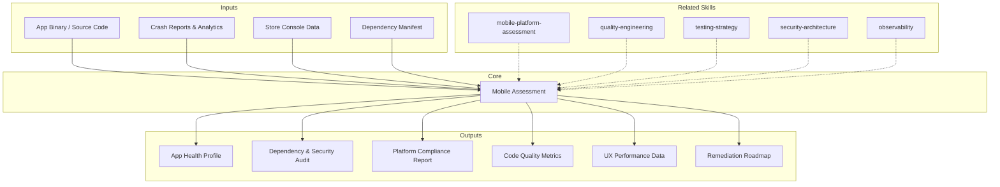

# Mobile Assessment: App Health, Compliance & Remediation

Mobile assessment evaluates an existing mobile application across six dimensions: runtime health, dependency security, platform compliance, code quality, user experience metrics, and remediation planning. This skill produces a comprehensive AS-IS assessment that identifies risks, quantifies technical debt, and prioritizes fixes.

## Grounding Guideline

**An app without vitals metrics is an app flying blind.** Crash-free rate, ANR rate, cold start, and app size are not "nice-to-have" — they are the vital signs that determine if the app survives in the stores. Store compliance is non-negotiable: an App Store rejection can cost weeks of revenue.

### Mobile Assessment Philosophy

1. **Store compliance is non-negotiable.** Privacy manifests, target API levels, data safety declarations. A compliance gap is a rejection risk that blocks releases.
2. **Crash-free rate drives retention.** Every crash is a user who potentially never returns. The Google Play threshold (>1.09%) affects store visibility.
3. **Dependency health predicts maintenance cost.** Abandoned libraries, unpatched CVEs, and SDK bloat are debt paid with interest. Auditing dependencies is prevention.
4. **Measure before you optimize.** Without a baseline there is no verifiable improvement. Instrument first, optimize after.

## Inputs

The user provides an app name as `$ARGUMENTS`. Parse `$1` as the **app name** used throughout all output artifacts.

**Parameters:**
- `{MODO}`: `piloto-auto` (default) | `desatendido` | `supervisado` | `paso-a-paso`
  - **piloto-auto**: Auto para health profiling y dependency audit, HITL para severity classification y remediation priorities.
  - **desatendido**: Zero interruptions. Assessment completo automáticamente. Assumptions documented.
  - **supervisado**: Autónomo con checkpoint en compliance findings y remediation roadmap.
  - **paso-a-paso**: Confirma cada health metric, dependency finding, compliance check, y remediation item.
- `{FORMATO}`: `markdown` (default) | `html` | `dual`
- `{VARIANTE}`: `ejecutiva` (~40% — S1 health profile + S3 compliance + S6 remediation) | `técnica` (full 6 sections, default)

Before generating assessment, detect the mobile project context:

```
!find . -name "pubspec.yaml" -o -name "package.json" -o -name "*.xcodeproj" -type d -o -name "build.gradle*" -o -name "Podfile" -o -name "*.swift" -o -name "*.kt" | head -20
```

If reference materials exist, load them:

```
Read ${CLAUDE_SKILL_DIR}/references/mobile-assessment-benchmarks.md
```

---

## When to Use

- Evaluating an existing mobile app before a major release or refactor
- Auditing dependency health and security vulnerabilities
- Checking compliance with App Store and Google Play policies
- Measuring app performance against industry benchmarks
- Assessing code quality and architectural fitness
- Building a prioritized remediation roadmap for mobile tech debt

## When NOT to Use

- Designing new mobile architecture from scratch --> use mobile-architecture skill
- General software architecture assessment --> use software-architecture skill
- Current-state analysis for non-mobile systems --> use asis-analysis skill
- Quality engineering practices and test strategy --> use quality-engineering skill

---

## Delivery Structure: 6 Sections

### S1: App Health Profile

**Google Play Vitals Thresholds (enforced, affect store visibility):**

| Metric | Bad Behavior Threshold | Per-Device Threshold | Consequence |
|---|---|---|---|
| User-perceived crash rate | >1.09% of daily sessions | >8% on single device model | Reduced discoverability, store warning |
| User-perceived ANR rate | >0.47% of daily active users | >8% on single device model | Reduced discoverability, store warning |
| Excessive wakeups | >10 wakeups/hour | N/A | Battery vitals warning |
| Stuck partial wake locks | >0.30% of sessions (enforced Mar 2026) | N/A | Store visibility impact |
| Excessive cold starts | >5s | N/A | Vitals flag (aim far lower) |

- Play checks daily using a 28-day rolling average. Exceeding thresholds reduces search ranking and may show warnings on listing.
- "Slow sessions" metric (2025): measures frame smoothness for games. <25% of frames at target = slow session.

**Crash Rate Benchmarks:**

| Rating | Crash-Free Sessions | Action |
|---|---|---|
| Excellent (top 10%) | >99.99% | Monitor only |
| Good (industry median) | >99.95% | Maintain |
| Acceptable | >99.5% | Investigate top crashes |
| Poor | 99.0-99.5% | Prioritize crash fixes |
| Critical | <99.0% | Emergency: app stability at risk |

**ANR / Hang Rate:**
- ANR target: <0.47% (Google Play threshold). Best-in-class: <0.10%.
- Main thread blocking causes: network calls, heavy computation, disk I/O, lock contention.
- StrictMode: zero violations in production.
- iOS hang rate: main thread unresponsive >250ms. Use MetricKit `MXHangDiagnostic` for reporting.

**Cold Start Benchmarks:**

| Rating | Time | Action |
|---|---|---|
| Excellent | <1s | No action |
| Good | 1-2s | Monitor |
| Acceptable | 2-3s | Optimize next sprint |
| Unacceptable | >3s | Critical priority |
| Google Play flag | >5s | Vitals warning |

- Measure: `reportFullyDrawn()` (Android), `os_signpost` / MetricKit (iOS).
- Breakdown analysis: runtime init, DI setup, network fetch, layout rendering.
- Optimization: lazy init, baseline profiles (Android), Impeller (Flutter), TurboModules (RN).

**App Size Budget:**

| Category | Target | Warning | Critical |
|---|---|---|---|
| Initial download (APK/IPA) | <30MB | 30-80MB | >80MB |
| With on-demand resources | <150MB | 150-300MB | >300MB |
| Emerging market target | <15MB | 15-25MB | >25MB |
| App Clip / Instant App | <15MB (hard limit) | N/A | N/A |

- Size contributors: assets, native libraries, dependencies, debug symbols.
- Optimization: ProGuard/R8 (Android), App Thinning/bitcode (iOS), asset compression, on-demand resources.
- Track size per release. Alert on >5% growth between versions.

**Memory Footprint:**
- Baseline: app at rest after initial load. Target: <150MB.
- Peak: during heaviest screen/operation. Target: <250MB (mainstream), <150MB (emerging market).
- Memory leaks: objects retained after screen dismissal. LeakCanary (Android), Instruments (iOS).
- OOM crash rate: must be near zero.

**Tools:** Firebase Crashlytics, Sentry, Embrace (mobile-focused with session replay), Bugsnag.

### S2: Dependency & Security Audit

**Dependency Inventory:**
- Total count (direct + transitive)
- Outdated: major versions behind, security patches missing
- Abandoned: no updates in >12 months, no maintainer activity
- Duplicate: multiple libraries serving same purpose

**CVE Analysis:**
- Scan all dependencies for known vulnerabilities (CVSS scoring)
- Severity: Critical (CVSS 9.0+), High (7.0-8.9), Medium (4.0-6.9), Low (<4.0)
- Exploitability: network-accessible vs. local only
- Remediation: update available, patch available, no fix (replace library)
- Tools: Snyk, OWASP Dependency-Check, npm audit, pub outdated, `./gradlew dependencyCheckAnalyze`

**License Compliance:**
- Inventory: MIT, Apache 2.0, GPL, LGPL, BSD, proprietary
- Copyleft risk: GPL in proprietary app = license conflict
- Attribution: MIT/Apache require notice in app or docs
- Proprietary SDK terms: data collection clauses, usage restrictions

**SDK Bloat Assessment:**
- Size contribution per SDK (method count, binary size)
- SDK overlap: multiple analytics SDKs, multiple crash reporters
- Unused SDKs: integrated but no longer called (dead code)
- Privacy impact: SDKs collecting user data (ATT, GDPR implications)

### S3: Platform Compliance

**Apple App Store Compliance:**
- App Review Guidelines: IAP for digital goods, subscription rules, external link entitlement
- Privacy nutrition labels: must match actual data collection
- ATT (App Tracking Transparency): prompt required before any tracking
- Minimum deployment target: current iOS version - 2
- Used entitlements only (unused entitlements cause rejection)

**iOS Privacy Manifest (PrivacyInfo.xcprivacy) -- MANDATORY:**

Every app and third-party SDK must include `PrivacyInfo.xcprivacy` declaring:

| Element | Description | Enforcement |
|---|---|---|
| Required Reason APIs | UserDefaults, file timestamp, disk space, boot time, system uptime | Must declare reason code per API; rejection if missing (since May 2024) |
| Data collection types | Categories of data collected (name, email, location, etc.) | Must match privacy nutrition labels |
| Tracking domains | Domains contacted for tracking purposes | Must be declared; ATT required before contacting |
| SDK code signature | Third-party SDKs on Apple's "commonly used" list | Must include manifest AND signature (since Feb 2025) |

**Audit checklist:**
- [ ] `PrivacyInfo.xcprivacy` exists in app bundle and every third-party framework
- [ ] All Required Reason API usages declared with valid reason codes
- [ ] Data collection categories match App Store privacy nutrition labels
- [ ] Tracking domains listed; ATT prompt shown before any tracking network call
- [ ] SDKs on Apple's "commonly used" list include manifest + code signature
- Non-compliance: App Store rejection. Retroactive enforcement on updates.

**Google Play Compliance:**
- Data Safety section: accurate, matches actual collection
- Target API level: annual requirement (API 35 for 2025, check current year)
- Permissions: requested at point of use with rationale string
- Families/COPPA policy if targeting children
- Background location: requires justification and review

**Accessibility (WCAG Mobile):**
- Screen reader labels on all interactive elements
- Touch targets: 44x44pt (iOS), 48x48dp (Android)
- Color contrast: 4.5:1 normal text, 3:1 large text
- Dynamic type: text scales without clipping
- Reduced motion: respect system setting
- Focus order: logical navigation for assistive technology

### S4: Code Quality & Architecture Fit

**Tech Debt Inventory:**
- TODO/FIXME/HACK count and age
- Deprecated API usage (list with migration path)
- Code duplication percentage (target: <5%)
- Cyclomatic complexity per function (target: <15)
- Dead code identification

**Test Coverage:**
- Unit tests: target >70% business logic
- Widget/UI tests: critical flows covered
- Integration tests: end-to-end happy path + error paths
- Screenshot tests: visual regression detection
- Flaky test rate: target <2%

**Flashlight (formerly Lighthouse for Mobile) -- Android CI Performance:**
- Automated performance scoring in CI/E2E pipeline
- Measures: cold start time, frame rate per screen, CPU usage, memory per screen, app size
- Supports: native Android, React Native, Flutter
- Integration: fail PR if performance score drops below threshold
- Use for: automated regression detection on every PR -- prevents slow performance creep
- Setup: add to CI pipeline alongside unit tests; define score thresholds per metric

**Modularity Score:**
- Module count and independence
- Dependency direction enforcement (feature -> core -> foundation, never reverse)
- Zero circular dependencies
- Build parallelism potential (target: <3 min incremental)

**Build Health:**
- Clean build time, incremental build time
- CI pipeline duration (commit to artifact): target <15 min
- Cache hit rate (Gradle build cache, CocoaPods cache)
- Build failure frequency: target <5%

### S5: User Experience Metrics

**Load Time Metrics:**
- Time to Interactive (TTI): app responds to input
- Time to First Meaningful Paint (FMP): primary content visible
- Screen transition: <300ms target
- Data loading: skeleton/shimmer, content within 1-2s

**Interaction Latency:**
- Tap response: visual feedback within 100ms
- Scroll: 60fps sustained, no jank (dropped frames <1%)
- Input latency: keyboard input reflected immediately
- Gesture responsiveness: swipe, pinch, drag feel immediate

**Offline Behavior:** Graceful degradation, cached content available, queued actions sync when online, clear network status indication.

**Deep Link Coverage:** Universal Links / App Links configured, all shareable content has deep links, full navigation context restored, deferred deep links for new installs.

**Push Notification Health:** Token registration rate, delivery rate, open rate, opt-in rate, silent push reliability.

### S6: Remediation Roadmap

**Finding Severity Classification:**

| Severity | Definition | SLA |
|---|---|---|
| Critical | App rejection risk, security CVE (CVSS 9+), crash >1%, Play vitals threshold exceeded | Fix immediately |
| High | Performance degradation, compliance gap, ANR near threshold, missing privacy manifest | Fix within 1 sprint |
| Medium | Tech debt, minor compliance, suboptimal patterns | Plan within quarter |
| Low | Nice-to-have, optimization, cosmetic | Backlog |

**Quick Wins (1-3 days each):**
- Update dependencies with Critical CVEs
- Add missing accessibility labels
- Remove unused SDKs (reduces size + privacy risk)
- Fix ANR-causing main thread blocking
- Add missing PrivacyInfo.xcprivacy declarations
- Enable ProGuard/R8 if not already active

**Strategic Fixes (1-4 weeks each):**
- Modularize monolithic app structure
- Implement offline-first sync
- Migrate deprecated APIs
- Add test coverage for critical flows
- Optimize cold start (lazy init, baseline profiles)
- Integrate Flashlight in CI for performance regression detection

**Migration Paths (1-3 months each):**
- Cross-platform migration, architecture overhaul (MVC to MVVM/Clean), backend redesign (REST to GraphQL/BFF), accessibility remediation, CI/CD modernization

**Prioritization Formula:**
- Priority Score = `(Impact * Risk) / Effort`
- Impact = severity weight (Critical=4, High=3, Medium=2, Low=1) * affected user percentage
- Top 10 items form the immediate action plan

**Progress Tracking:** Quarterly full assessment, monthly spot-checks. Track: severity distribution trend, crash-free rate, ANR rate, app store rating, app size.

---

## Trade-off Matrix

| Decision | Enables | Constrains | When to Use |
|---|---|---|---|
| Fix Critical First | Prevents rejection, secures users | Delays feature work | Always the right priority |
| Modularize Before Features | Faster future development | Upfront investment | High tech debt, slow builds |
| Increase Test Coverage | Confidence, fewer regressions | Slower initial development | Before major refactors |
| SDK Consolidation | Smaller app, fewer conflicts | Migration effort | Multiple overlapping SDKs |
| Accessibility Retrofit | Larger user base, compliance | Significant effort | Regulatory requirement, ethical priority |
| Flashlight CI Integration | Automated perf regression detection | CI time increase (~2-5 min) | Any app with >10K users |

---

## Assumptions

- App is in production with real user data available (crash reports, analytics)
- Source code is accessible for static analysis
- App store console access for vitals and compliance data
- Performance profiling tools can be run on representative devices
- Team available to provide context on known issues

## Limits

- Does not design new architecture (use mobile-architecture skill)
- Does not implement fixes, only identifies and prioritizes them
- Automated analysis supplements but does not replace manual code review
- Device-specific issues require testing on actual hardware

---

## Edge Cases

**No Analytics/Crash Reporting:** Install Crashlytics + basic analytics as prerequisite. Establish baseline from assessment date. Manual testing substitutes for production metrics.

**Legacy App with No Tests:** Start with critical path characterization tests only. Capture current behavior before refactoring.

**Emerging Markets:** App size <15MB ideal. Benchmark on low-end devices (2GB RAM). Network: 3G, high latency.

**Multiple Release Tracks:** Assess each variant independently. Feature flags may hide issues across tracks.

**White-Label / Multi-Tenant:** Assess each tenant config independently. Compliance varies by jurisdiction.

---

## Validation Gate

Before finalizing delivery, verify:

- [ ] Crash rate and ANR rate measured against Google Play vitals thresholds
- [ ] App size measured against budget table (initial <30MB, with resources <150MB)
- [ ] Cold start measured against benchmark table (<2s good, >3s unacceptable)
- [ ] All dependencies audited for CVEs and license compliance
- [ ] iOS PrivacyInfo.xcprivacy audit checklist completed
- [ ] Google Play Data Safety and target API compliance verified
- [ ] Accessibility audit covers screen reader, contrast, touch targets, dynamic type
- [ ] Code quality metrics quantified (coverage, complexity, duplication)
- [ ] Flashlight or equivalent CI performance tool evaluated/recommended
- [ ] Every finding classified by severity with effort estimate
- [ ] Remediation roadmap prioritized with quick wins and strategic items separated

---

## Knowledge Graph



## Output Templates

**Formato MD (default):**

```
# Mobile Assessment: {app_name}
## S1: App Health Profile
### Crash Rate | ANR Rate | Cold Start | App Size | Memory
(tablas con benchmarks y estado actual)

## S2: Dependency & Security Audit
### Inventario | CVEs | Licencias | SDK Bloat
(tabla de dependencias con severidad CVSS)

## S3: Platform Compliance
### Apple App Store | Google Play | Accessibility
(checklists con estado por item)

## S4: Code Quality & Architecture Fit
### Tech Debt | Test Coverage | Modularity | Build Health

## S5: User Experience Metrics
### Load Time | Interaction Latency | Offline | Deep Links

## S6: Remediation Roadmap
### Quick Wins | Strategic Fixes | Migration Paths
(tabla priorizada: severity * impact / effort)
```

**Formato HTML (bajo demanda):**
- Filename: `A-01_Mobile_Assessment_{app_name}_{WIP}.html`
- Estructura: HTML self-contained branded (Design System MetodologIA v5). Light-First Technical. Incluye dashboard visual de health metrics con semaforos de vitales, heatmap de cobertura de tests, y roadmap interactivo de remediacion con filtros por severidad. WCAG AA, responsive, print-ready.

**Formato DOCX (bajo demanda):**
- Filename: `{fase}_Mobile_Assessment_{cliente}_{WIP}.docx`
- Generado via python-docx con MetodologIA Design System v5. Portada con logo y metadatos, TOC automatico, headers/footers con nombre del skill y numeracion, tablas zebra, titulos Poppins navy, cuerpo Trebuchet MS, acentos gold.

**Formato XLSX (bajo demanda):**
- Filename: `{fase}_Mobile_Assessment_{cliente}_{WIP}.xlsx`
- Generado via openpyxl con MetodologIA Design System v5. Headers navy con texto blanco Poppins, formato condicional por severidad (Critical/High/Medium/Low), auto-filtros en todas las columnas, valores calculados sin formulas. Hojas: App Health Metrics, Dependency Audit, Compliance Checklist, Remediation Roadmap.

**Formato PPTX (bajo demanda):**
- Filename: `{fase}_Mobile_Assessment_{cliente}_{WIP}.pptx`
- Generado via python-pptx con MetodologIA Design System v5. Slide master navy gradient, titulos Poppins, cuerpo Trebuchet MS, acentos gold. Max 20 slides variante ejecutiva / 30 variante tecnica. Speaker notes con referencias de evidencia [DOC]/[INFERENCIA]/[SUPUESTO].

## Evaluacion

| Dimension | Peso | Criterio (7/10 minimo) |
|---|---|---|
| Trigger Accuracy | 10% | El skill se activa correctamente ante keywords de mobile assessment y no ante arquitectura nueva |
| Completeness | 25% | Las 6 secciones cubren health, dependencies, compliance, code quality, UX, y remediation con datos cuantitativos |
| Clarity | 20% | Tablas de benchmarks son autoexplicativas; severidades y SLAs no requieren interpretacion adicional |
| Robustness | 20% | Edge cases (sin analytics, legacy, mercados emergentes, multi-tenant) tienen estrategia documentada |
| Efficiency | 10% | Variante ejecutiva entrega valor en ~40% del contenido; parametros permiten ajuste de profundidad |
| Value Density | 15% | Cada seccion produce hallazgos accionables con prioridad, effort estimate, y owner asignado |

**Umbral minimo:** 7/10 en cada dimension. Composite ponderado >= 7.0 para considerar el output aceptable.

---

## Output Format Protocol

| Format | Default | Description |
|--------|---------|-------------|
| `markdown` | Yes | Rich Markdown + Mermaid diagrams. Token-efficient. |
| `html` | On demand | Branded HTML (Design System). Visual impact. |
| `dual` | On demand | Both formats. |

Default output is Markdown with embedded Mermaid diagrams. HTML generation requires explicit `{FORMATO}=html` parameter.

## Output Artifact

**Primary:** `A-01_Mobile_Assessment.html` -- Executive summary, health dashboard (with benchmark tables), dependency audit, compliance checklist, code quality metrics, UX performance data, prioritized remediation roadmap.

**Secondary:** CVE report, accessibility audit spreadsheet, performance profiling captures, build time analysis, dependency license inventory, PrivacyInfo.xcprivacy audit report.

---
**Autor:** Javier Montaño | **Última actualización:** 12 de marzo de 2026
