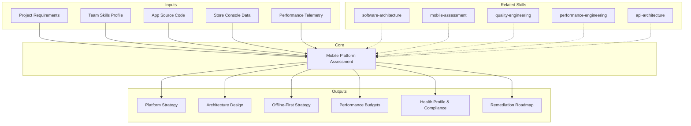

# Mobile Platform Assessment: Strategy, Health & Remediation

Mobile platform assessment unifies two formerly separate concerns — designing mobile architecture and evaluating existing mobile app health — into a single comprehensive skill. It produces deliverables covering platform strategy, architecture patterns, offline-first design, performance optimization, store compliance, dependency security, code quality, and prioritized remediation.

## Grounding Guideline

**Mobile is not "web on a small screen" — it is a channel with unique constraints. And an app without vitals metrics is an app flying blind.** Unstable network, finite battery, release cycles controlled by stores, users who abandon at 3 seconds, and store compliance that is non-negotiable. Designing and evaluating mobile requires respecting these constraints as first-class concerns.

### Unified Philosophy

1. **Offline-first for unreliable networks.** The app must work without connectivity. Sync when there is a network, cache always, persistent action queue.
2. **Native vs cross-platform is a business decision.** It is not technical — it is about team, velocity, and budget. Flutter for velocity, Native for extreme performance, KMP for shared logic with native UI.
3. **Store compliance is non-negotiable.** Privacy manifests, target API levels, data safety declarations. A compliance gap is a rejection risk that blocks releases.
4. **Crash-free rate drives retention.** Every crash is a user who potentially never returns. The Google Play threshold (>1.09%) affects store visibility.
5. **Performance is UX.** Cold start <2s, 60fps minimum, <200MB RAM. Every millisecond counts.
6. **Measure before you optimize.** Without a baseline there is no verifiable improvement. Instrument first, optimize after.
7. **Release management is architecture.** There is no "deploy to production in 5 minutes." There are store reviews, staged rollouts, feature flags, and forced updates.

## Inputs

The user provides an app or project name as `$ARGUMENTS`. Parse `$1` as the **app/project name** used throughout all output artifacts.

**Parameters:**
- `{MODO_OPERACIONAL}`: `evaluacion` | `diseño` | `integral` (default)
  - **evaluacion**: AS-IS assessment focus — health metrics, compliance audit, dependency security, remediation roadmap. Best for existing apps.
  - **diseño**: Architecture design focus — platform strategy, patterns, offline-first, performance budgets, release pipeline. Best for new apps or major refactors.
  - **integral**: Full combined assessment and design. Both evaluation and architecture in one deliverable.
- `{MODO}`: `piloto-auto` (default) | `desatendido` | `supervisado` | `paso-a-paso`
  - **piloto-auto**: Auto for health profiling, platform comparison, and dependency audit. HITL for platform selection, severity classification, and remediation priorities.
  - **desatendido**: Zero interruptions. Assessment and architecture documented automatically. Assumptions documented.
  - **supervisado**: Autonomous with checkpoint on platform decision, compliance findings, and remediation roadmap.
  - **paso-a-paso**: Confirms each platform evaluation, health metric, compliance check, architecture pattern, and remediation item.
- `{FORMATO}`: `markdown` (default) | `html` | `dual`
- `{VARIANTE}`: `ejecutiva` (~40% — S1 platform strategy + S4 compliance + S9 remediation) | `técnica` (full 9 sections, default)

Before generating assessment, detect the mobile project context:

```
!find . -name "pubspec.yaml" -o -name "package.json" -o -name "*.xcodeproj" -type d -o -name "build.gradle*" -o -name "Podfile" -o -name "*.swift" -o -name "*.kt" | head -20
```

If reference materials exist, load them:

```
Read ${CLAUDE_SKILL_DIR}/references/mobile-patterns.md
Read ${CLAUDE_SKILL_DIR}/references/mobile-assessment-benchmarks.md
```

---

## When to Use

- Choosing between native, cross-platform, or hybrid mobile development
- Designing app architecture (MVVM, MVI, Clean Architecture, modularization)
- Evaluating an existing mobile app before a major release or refactor
- Implementing offline-first data synchronization
- Auditing dependency health and security vulnerabilities
- Checking compliance with App Store and Google Play policies
- Measuring app performance against industry benchmarks
- Optimizing mobile performance (cold start, memory, battery)
- Planning mobile CI/CD, code signing, and app store distribution
- Building a prioritized remediation roadmap for mobile tech debt

## When NOT to Use

- Backend service architecture --> use metodologia-software-architecture skill
- API design without mobile-specific concerns --> use metodologia-solutions-architecture skill
- General non-mobile current-state analysis --> use metodologia-asis-analysis skill
- Quality engineering practices and test strategy --> use metodologia-quality-engineering skill
- UX content and microcopy --> use metodologia-ux-writing skill

---

## Delivery Structure: 9 Sections

> **Mode routing:** `{MODO_OPERACIONAL}=evaluacion` delivers S5-S9 primarily. `diseño` delivers S1-S4 + S8. `integral` delivers all 9 sections.

### S1: Platform Strategy

**Platform Comparison (2025-2026):**

| Factor | Native (Swift/Kotlin) | Flutter (3.24+) | React Native (New Arch) | KMP / CMP |
|---|---|---|---|---|
| Performance | Best | Near-native (Impeller renderer) | Good (Fabric + TurboModules) | Native (shared logic) |
| UI rendering | Platform-native | Impeller: precompiled shaders, 60/120 FPS, no shader jank | Fabric: synchronous, concurrent UI via JSI | Native per platform (or CMP shared UI) |
| Code sharing | 0% | 90-95% | 85-90% | 50-80% logic; 90%+ with CMP UI |
| Team skills | iOS + Android specialists | Dart developers | JavaScript/React developers | Kotlin developers |
| Market share | N/A | ~46% cross-platform | ~35% cross-platform | Growing (Google Docs on iOS uses KMP) |
| Hot reload | Limited | Excellent (sub-second) | Good | N/A (logic layer) |
| App size overhead | Baseline | +5-10MB | +7-15MB | Minimal (logic only) |
| Cold start | Fastest | Fast (Impeller eliminates shader warmup) | Moderate (JSI improves over bridge) | Native speed |

**React Native New Architecture (default since 0.76):**
- **Fabric Renderer:** Synchronous, concurrent-capable UI. Replaces the async bridge with JSI (JavaScript Interface) for direct C++ calls.
- **TurboModules:** Lazy-loaded native modules. Only initialized when first accessed (vs. all at startup). Shopify reports 10% faster Android launch.
- **Codegen:** Type-safe interface generation from Flow/TypeScript specs. Eliminates runtime serialization overhead.

**Flutter Impeller Renderer (default since 3.16):**
- Replaces Skia with ahead-of-time shader compilation. Eliminates shader jank.
- Vulkan backend (Android), Metal backend (iOS). Consistent 60/120 FPS.
- Impact: cold start improved, smoother animations, predictable frame times.

**Compose Multiplatform (CMP) Status (2025-2026):**
- JetBrains extension of Jetpack Compose to iOS, desktop, web.
- iOS support: stable since 2024. Production-ready for business apps.
- Google Docs uses KMP in production on iOS with performance parity or better.

**Decision Criteria:**
- Performance-critical (games, AR, heavy animations): Native
- Rapid development, single codebase, custom UI: Flutter
- Existing React/JS team, web+mobile: React Native
- Shared business logic, native UI per platform: KMP
- Maximum code sharing including UI, Kotlin team: CMP

### S2: App Architecture Patterns

**Architecture Patterns:**
- **MVVM:** View observes ViewModel; ViewModel transforms Model. Best for: reactive frameworks (SwiftUI, Compose, Flutter).
- **MVI:** Unidirectional: Intent -> Reducer -> State -> View. Best for: complex state, predictable behavior, time-travel debugging.
- **Clean Architecture:** Domain layer framework-independent; Use Cases orchestrate business logic. Best for: large apps, testability priority.
- **BLoC/Redux:** Centralized state store with events. Best for: Flutter (BLoC), React Native (Redux/Zustand).

**Modularization Strategy (2025 best practices):**

| Module Type | Contains | Depends On | Example |
|---|---|---|---|
| Feature module | Screen(s), ViewModel, Repository | Core modules only | `:feature-orders`, `:feature-profile` |
| Core module | Shared utilities, networking, design system | Foundation only | `:core-network`, `:core-design` |
| Navigation module | Routing, deep links | Feature module interfaces | `:navigation` |
| Foundation | Extensions, constants, logger | Nothing | `:foundation` |

- **Rule:** Feature modules never depend on other feature modules. Enforce via Gradle/build linting.
- Build performance: modularization enables parallel builds. Target <3 min incremental build.

**Dynamic Feature Delivery:**
- **Android Dynamic Feature Modules:** Download features on demand via Play Feature Delivery. Use for: large features accessed by <30% of users.
- **iOS On-Demand Resources:** Tag assets by usage. System downloads when needed, purges under storage pressure.
- **App Clips (iOS) / Instant Apps (Android):** Lightweight entry points (<15MB) for specific flows without full install.

**State Management Layers:**
- Local: UI-specific, ephemeral (scroll position, form input)
- Shared: cross-screen (profile, cart, auth token)
- Persistent: survives restart (settings, offline queue, cache)
- Server: remote with staleness policies (cache-then-network, stale-while-revalidate)

**Declarative UI Patterns (2025):**
- **Jetpack Compose:** ViewModel exposes `StateFlow`. Side effects: `LaunchedEffect`. Navigation: type-safe Compose Navigation 2.8+.
- **SwiftUI:** `@Observable` macro (iOS 17+) replaces `ObservableObject`. `NavigationStack` with `navigationDestination(for:)`.

**Dependency Injection:** Constructor injection for testability. Hilt (Android), Swinject (iOS), get_it (Flutter), inversify (RN).

### S3: Offline-First & Data Sync

**Local Storage:**
- SQLite/Room/Core Data: structured relational data, complex queries
- Key-value: SharedPreferences/UserDefaults/MMKV for simple settings
- File storage: documents, images, binary data
- Encrypted: Keychain (iOS), EncryptedSharedPreferences (Android)

**Sync Strategies:** Pull (client requests on open/refresh), push (WebSocket/SSE), delta (changes since timestamp), full (replace local state).

**Conflict Resolution:** Last-write-wins (simplest), server-wins (authoritative), field-level merge (most flexible), CRDTs (conflict-free, eventual consistency).

**Optimistic UI:** Apply locally immediately, queue server sync, confirm on success, revert on failure. Persistent queue survives restart. Exponential backoff retry.

**Background Tasks:**
- Android: WorkManager for deferrable guaranteed work; Foreground Service for ongoing tasks.
- iOS: BGTaskScheduler (BGAppRefreshTask for periodic, BGProcessingTask for heavy). 30s execution limit unless special entitlement.
- Cross-platform: abstract behind platform interface. Test with airplane mode and process death.

### S4: Performance Design & Budgets

**Cold Start Benchmarks:**

| Rating | Time to First Meaningful Content | Action |
|---|---|---|
| Excellent | <1s | No action needed |
| Good | 1-2s | Monitor, optimize opportunistically |
| Acceptable | 2-3s | Prioritize optimization in next sprint |
| Unacceptable | >3s | Critical fix -- users abandon at 3s+ |

**Cold Start Optimization Checklist:**
- [ ] Splash screen provides immediate visual feedback
- [ ] Lazy initialization: defer analytics, crash reporting, non-critical SDKs
- [ ] Preload critical data from cache; show cached content first
- [ ] Minimize DI graph: only inject first-screen dependencies at startup
- [ ] Android: generate Baseline Profiles for AOT compilation of hot paths
- [ ] Flutter: Impeller eliminates shader warmup; verify no Skia fallback
- [ ] React Native: TurboModules lazy-load; verify no bridge-era modules blocking startup

**Memory Management:**
- Image caching: size-appropriate thumbnails, LRU with memory limit
- List virtualization: LazyColumn (Compose), ListView.builder (Flutter), FlatList (RN)
- Leak detection: LeakCanary (Android), Instruments (iOS), DevTools (Flutter)
- Budget: <200MB peak for mainstream apps; <100MB for emerging market targets

**Animation Targets:** 60fps minimum (120fps for ProMotion/high refresh). Animate transform/opacity (GPU), not size/position (CPU).

**Battery Optimization:** Batch network requests. Significant-change location monitoring. Compress payloads. Prefer WiFi for large transfers.

**Accessibility:**
- Screen reader labels on all interactive elements
- Dynamic type support (no clipping)
- WCAG AA contrast: 4.5:1 text, 3:1 large text
- Touch targets: 44x44pt (iOS), 48x48dp (Android)
- Respect reduced motion system setting

### S5: App Health Profile

> **Primary in `{MODO_OPERACIONAL}=evaluacion`**

**Google Play Vitals Thresholds (enforced, affect store visibility):**

| Metric | Bad Behavior Threshold | Per-Device Threshold | Consequence |
|---|---|---|---|
| User-perceived crash rate | >1.09% of daily sessions | >8% on single device model | Reduced discoverability, store warning |
| User-perceived ANR rate | >0.47% of daily active users | >8% on single device model | Reduced discoverability, store warning |
| Excessive wakeups | >10 wakeups/hour | N/A | Battery vitals warning |
| Stuck partial wake locks | >0.30% of sessions (enforced Mar 2026) | N/A | Store visibility impact |
| Excessive cold starts | >5s | N/A | Vitals flag (aim far lower) |

**Crash Rate Benchmarks:**

| Rating | Crash-Free Sessions | Action |
|---|---|---|
| Excellent (top 10%) | >99.99% | Monitor only |
| Good (industry median) | >99.95% | Maintain |
| Acceptable | >99.5% | Investigate top crashes |
| Poor | 99.0-99.5% | Prioritize crash fixes |
| Critical | <99.0% | Emergency: app stability at risk |

**ANR / Hang Rate:**
- ANR target: <0.47% (Google Play threshold). Best-in-class: <0.10%.
- iOS hang rate: main thread unresponsive >250ms. Use MetricKit `MXHangDiagnostic` for reporting.

**App Size Budget:**

| Category | Target | Warning | Critical |
|---|---|---|---|
| Initial download (APK/IPA) | <30MB | 30-80MB | >80MB |
| With on-demand resources | <150MB | 150-300MB | >300MB |
| Emerging market target | <15MB | 15-25MB | >25MB |
| App Clip / Instant App | <15MB (hard limit) | N/A | N/A |

**Memory Footprint:**
- Baseline: app at rest after initial load. Target: <150MB.
- Peak: during heaviest operation. Target: <250MB (mainstream), <150MB (emerging market).
- OOM crash rate: must be near zero.

**Tools:** Firebase Crashlytics, Sentry, Embrace (session replay), Bugsnag.

### S6: Dependency & Security Audit

**Dependency Inventory:**
- Total count (direct + transitive)
- Outdated: major versions behind, security patches missing
- Abandoned: no updates in >12 months, no maintainer activity
- Duplicate: multiple libraries serving same purpose

**CVE Analysis:**
- Scan all dependencies for known vulnerabilities (CVSS scoring)
- Severity: Critical (CVSS 9.0+), High (7.0-8.9), Medium (4.0-6.9), Low (<4.0)
- Tools: Snyk, OWASP Dependency-Check, npm audit, pub outdated, `./gradlew dependencyCheckAnalyze`

**License Compliance:**
- Inventory: MIT, Apache 2.0, GPL, LGPL, BSD, proprietary
- Copyleft risk: GPL in proprietary app = license conflict
- Proprietary SDK terms: data collection clauses, usage restrictions

**SDK Bloat Assessment:**
- Size contribution per SDK (method count, binary size)
- SDK overlap: multiple analytics SDKs, multiple crash reporters
- Unused SDKs: integrated but no longer called (dead code)
- Privacy impact: SDKs collecting user data (ATT, GDPR implications)

### S7: Platform Compliance

**Apple App Store Compliance:**
- App Review Guidelines: IAP for digital goods, subscription rules, external link entitlement
- Privacy nutrition labels: must match actual data collection
- ATT (App Tracking Transparency): prompt required before any tracking
- Minimum deployment target: current iOS version - 2

**iOS Privacy Manifest (PrivacyInfo.xcprivacy) -- MANDATORY:**

| Element | Description | Enforcement |
|---|---|---|
| Required Reason APIs | UserDefaults, file timestamp, disk space, boot time, system uptime | Must declare reason code; rejection if missing |
| Data collection types | Categories of data collected | Must match privacy nutrition labels |
| Tracking domains | Domains contacted for tracking purposes | Must be declared; ATT required before contacting |
| SDK code signature | Third-party SDKs on Apple's "commonly used" list | Must include manifest AND signature |

**Audit checklist:**
- [ ] `PrivacyInfo.xcprivacy` exists in app bundle and every third-party framework
- [ ] All Required Reason API usages declared with valid reason codes
- [ ] Data collection categories match App Store privacy nutrition labels
- [ ] Tracking domains listed; ATT prompt shown before any tracking network call
- [ ] SDKs on Apple's "commonly used" list include manifest + code signature

**Google Play Compliance:**
- Data Safety section: accurate, matches actual collection
- Target API level: annual requirement (check current year)
- Permissions: requested at point of use with rationale string
- Background location: requires justification and review

**Accessibility (WCAG Mobile):**
- Screen reader labels on all interactive elements
- Touch targets: 44x44pt (iOS), 48x48dp (Android)
- Color contrast: 4.5:1 normal text, 3:1 large text
- Dynamic type: text scales without clipping
- Focus order: logical navigation for assistive technology

### S8: Backend Integration & Release Pipeline

**Mobile-Optimized API Design:**
- BFF (Backend-for-Frontend): dedicated API layer per platform/screen
- Response shaping: return only needed fields
- Pagination: cursor-based (stable) over offset-based
- Compression: gzip/brotli for JSON payloads
- Versioning: URL path (/v2/) or header. Support N-1 for forced update grace.

**GraphQL vs. REST Decision:**

| Factor | REST | GraphQL |
|---|---|---|
| Over-fetching | Common | Eliminated (client specifies) |
| Under-fetching | Multiple round trips | Single query, nested resolution |
| Caching | HTTP caching (simple) | Client-side (Apollo, Relay, urql) |
| Mobile fit | Good with BFF | Excellent for varied screens |

**Push Notifications:** APNs (iOS) + FCM (Android). Silent push for background sync. Rich push with images, actions, deep links. Permission strategy: ask after value demonstration, not first launch.

**Deep Linking:** Universal Links (iOS) / App Links (Android) for domain-based routing. Deferred deep linking for new installs.

**Mobile CI/CD Pipeline:**
- Build: compile per platform, generate signed artifacts
- Test: unit, widget/UI, integration, screenshot tests
- Sign: Fastlane match (iOS), Play App Signing (Android)
- Distribute: TestFlight (iOS beta), Play Console internal track, Firebase App Distribution

**Feature Flags:** Remote config for enable/disable without app update. Gradual rollout (1% -> 10% -> 50% -> 100%). Kill switch. Tools: Firebase Remote Config, LaunchDarkly, Unleash.

**OTA Updates:** CodePush (React Native), Shorebird (Flutter). No OTA for native compiled code (store policy).

**App Store Compliance (Release):**
- Apple: App Review Guidelines, privacy nutrition labels, ATT prompt, PrivacyInfo.xcprivacy manifest
- Google: Data Safety section, target API level, permission rationale at point of use
- Both: accessibility, content ratings, subscription billing rules

**Versioning:** Semantic versioning (major.minor.patch). Always-incrementing build numbers. Minimum version enforcement for critical updates.

### S9: Code Quality & Remediation Roadmap

> **Primary in `{MODO_OPERACIONAL}=evaluacion`**

**Tech Debt Inventory:**
- TODO/FIXME/HACK count and age
- Deprecated API usage (list with migration path)
- Code duplication percentage (target: <5%)
- Cyclomatic complexity per function (target: <15)
- Dead code identification

**Test Coverage:**
- Unit tests: target >70% business logic
- Widget/UI tests: critical flows covered
- Integration tests: end-to-end happy path + error paths
- Flaky test rate: target <2%

**Flashlight (Android CI Performance):**
- Automated performance scoring in CI/E2E pipeline
- Measures: cold start time, frame rate, CPU usage, memory, app size
- Supports: native Android, React Native, Flutter
- Integration: fail PR if performance score drops below threshold

**Finding Severity Classification:**

| Severity | Definition | SLA |
|---|---|---|
| Critical | App rejection risk, security CVE (CVSS 9+), crash >1%, Play vitals threshold exceeded | Fix immediately |
| High | Performance degradation, compliance gap, ANR near threshold, missing privacy manifest | Fix within 1 sprint |
| Medium | Tech debt, minor compliance, suboptimal patterns | Plan within quarter |
| Low | Nice-to-have, optimization, cosmetic | Backlog |

**Quick Wins (1-3 days each):**
- Update dependencies with Critical CVEs
- Add missing accessibility labels
- Remove unused SDKs (reduces size + privacy risk)
- Fix ANR-causing main thread blocking
- Add missing PrivacyInfo.xcprivacy declarations
- Enable ProGuard/R8 if not already active

**Strategic Fixes (1-4 weeks each):**
- Modularize monolithic app structure
- Implement offline-first sync
- Migrate deprecated APIs
- Add test coverage for critical flows
- Optimize cold start (lazy init, baseline profiles)
- Integrate Flashlight in CI for performance regression detection

**Migration Paths (1-3 months each):**
- Cross-platform migration, architecture overhaul, backend redesign, accessibility remediation, CI/CD modernization

**Prioritization Formula:**
- Priority Score = `(Impact * Risk) / Effort`
- Impact = severity weight (Critical=4, High=3, Medium=2, Low=1) * affected user percentage
- Top 10 items form the immediate action plan

**Progress Tracking:** Quarterly full assessment, monthly spot-checks. Track: severity distribution trend, crash-free rate, ANR rate, app store rating, app size.

---

## Trade-off Matrix

| Decision | Enables | Constrains | When to Use |
|---|---|---|---|
| Native | Best performance, full API access | 2x codebase, 2x team | Performance-critical, platform-specific |
| Flutter | Single codebase, Impeller rendering | Custom render engine, plugin gaps | Rapid iteration, consistent UI |
| React Native (New Arch) | JS ecosystem, Fabric/TurboModules perf | Native module migration effort | JS teams, existing React codebase |
| KMP/CMP | Shared logic (+ optional shared UI) | Smaller ecosystem, Kotlin required | Kotlin teams, logic-first sharing |
| Offline-First | Works without network, fast UI | Sync complexity, conflict resolution | Field workers, unreliable connectivity |
| Fix Critical First | Prevents rejection, secures users | Delays feature work | Always the right priority |
| Modularize Before Features | Faster future development | Upfront investment | High tech debt, slow builds |
| SDK Consolidation | Smaller app, fewer conflicts | Migration effort | Multiple overlapping SDKs |
| Flashlight CI Integration | Automated perf regression detection | CI time increase (~2-5 min) | Any app with >10K users |

---

## Assumptions

- Target platforms defined (iOS, Android, or both)
- For evaluation mode: app is in production with real user data available
- For design mode: minimum OS version requirements established, team skills assessed
- Source code is accessible for static analysis
- App store console access for vitals and compliance data
- Backend API exists or is being co-designed

## Limits

- Does not design backend services (use metodologia-software-architecture skill)
- Does not cover API design in isolation (use metodologia-solutions-architecture skill)
- Does not implement fixes, only identifies and prioritizes them (evaluation mode)
- Automated analysis supplements but does not replace manual code review
- Platform SDKs evolve rapidly; verify against latest documentation

---

## Edge Cases

**Single Developer Building for Both Platforms:**
Cross-platform (Flutter or React Native) strongly favored. Maximize code sharing. Use managed services for backend.

**Enterprise App with MDM Requirements:**
MDM integration affects architecture: managed app config, VPN tunneling, data loss prevention. Test with MDM profiles early.

**App with Large Media (Video, 3D):**
Streaming over download. Progressive loading for 3D. CDN integration. Selective offline download with storage management UI.

**Super App / Multi-Feature App:**
Micro-frontend architecture: each feature team owns a module. Dynamic feature delivery. Navigation contract between modules.

**Regulated Industry (Healthcare, Finance):**
Biometric auth. Certificate pinning. No sensitive data in logs or screenshots. Jailbreak/root detection. HIPAA/PCI-DSS compliance.

**No Analytics/Crash Reporting:**
Install Crashlytics + basic analytics as prerequisite. Establish baseline from assessment date. Manual testing substitutes for production metrics.

**Legacy App with No Tests:**
Start with critical path characterization tests only. Capture current behavior before refactoring.

**Emerging Markets:**
App size <15MB ideal. Benchmark on low-end devices (2GB RAM). Network: 3G, high latency.

**Multiple Release Tracks:**
Assess each variant independently. Feature flags may hide issues across tracks.

---

## Validation Gate

Before finalizing delivery, verify:

**Design sections (S1-S4, S8):**
- [ ] Platform strategy justified with comparison matrix and team skill assessment
- [ ] Architecture pattern selected with clear layer separation and modularization plan
- [ ] Cold start target defined (<2s) with optimization checklist addressed
- [ ] Offline strategy covers sync, conflict resolution, and persistent queue
- [ ] Accessibility meets WCAG AA and platform guidelines
- [ ] Backend integration uses mobile-optimized patterns (BFF, pagination, compression)
- [ ] CI/CD pipeline covers build, test, sign, and distribute
- [ ] Feature flag strategy supports gradual rollout and kill switch
- [ ] App store compliance checklist reviewed for both platforms

**Evaluation sections (S5-S7, S9):**
- [ ] Crash rate and ANR rate measured against Google Play vitals thresholds
- [ ] App size measured against budget table (initial <30MB, with resources <150MB)
- [ ] Cold start measured against benchmark table (<2s good, >3s unacceptable)
- [ ] All dependencies audited for CVEs and license compliance
- [ ] iOS PrivacyInfo.xcprivacy audit checklist completed
- [ ] Google Play Data Safety and target API compliance verified
- [ ] Accessibility audit covers screen reader, contrast, touch targets, dynamic type
- [ ] Code quality metrics quantified (coverage, complexity, duplication)
- [ ] Every finding classified by severity with effort estimate
- [ ] Remediation roadmap prioritized with quick wins and strategic items separated

---

## Knowledge Graph



## Output Templates

**Formato MD (default):**

```
# Mobile Platform Assessment: {project_name}
## S1: Platform Strategy
### Comparison Matrix | Decision Criteria | Recommendation

## S2: App Architecture Patterns
### Pattern Selection | Modularization | State Management

## S3: Offline-First & Data Sync
### Storage | Sync Strategy | Conflict Resolution

## S4: Performance Design & Budgets
### Cold Start | Memory | Animation | Battery

## S5-S7: Health, Dependencies, Compliance
### Vitals | CVEs | Privacy Manifest | Accessibility

## S8: Backend Integration & Release Pipeline
### BFF/GraphQL | CI/CD | Feature Flags | OTA

## S9: Code Quality & Remediation Roadmap
### Quick Wins | Strategic Fixes | Migration Paths
```

**Formato PPTX:**
Resumen ejecutivo de plataforma mobile en formato presentacion: slide de comparativa de plataformas, slide de arquitectura (Mermaid renderizado), slide de health dashboard, slide de roadmap de remediacion con timeline visual.

**Formato HTML (bajo demanda):**
- Filename: `A-01_Mobile_Platform_Assessment_{project_name}_{WIP}.html`
- Estructura: HTML self-contained branded (Design System MetodologIA v5). Light-First Technical. Incluye platform comparison matrix interactiva, health dashboard con vitales y semaforos de compliance, dependency audit con severidades CVSS, y roadmap de remediacion con filtros por severidad. WCAG AA, responsive, print-ready.

**Formato DOCX (bajo demanda):**
- Filename: `{fase}_Mobile_Platform_Assessment_{cliente}_{WIP}.docx`
- Generado via python-docx con MetodologIA Design System v5. Portada con logo y metadatos, TOC automatico, headers/footers con nombre del skill y numeracion, tablas zebra, titulos Poppins navy, cuerpo Trebuchet MS, acentos gold.

**Formato XLSX (bajo demanda):**
- Filename: `{fase}_Mobile_Platform_Assessment_{cliente}_{WIP}.xlsx`
- Generado via openpyxl con MetodologIA Design System v5. Headers navy con texto blanco Poppins, formato condicional por severidad y estado de vitales, auto-filtros en todas las columnas, valores calculados sin formulas. Hojas: Platform Comparison, Health Metrics, Dependency Audit, Compliance Checklist, Remediation Roadmap.

## Evaluacion

| Dimension | Peso | Criterio (7/10 minimo) |
|---|---|---|
| Trigger Accuracy | 10% | Se activa ante keywords de mobile platform, architecture, y assessment; no se confunde con backend architecture |
| Completeness | 25% | Las 9 secciones cubren estrategia, arquitectura, offline, performance, health, compliance, y remediation |
| Clarity | 20% | Tablas comparativas de plataformas y benchmarks son autoexplicativas; decisiones justificadas con trade-offs |
| Robustness | 20% | Modos operacionales (evaluacion, diseno, integral) cubren casos de app nueva, existente, y refactor |
| Efficiency | 10% | Variante ejecutiva (~40%) entrega decision de plataforma + compliance + roadmap sin overhead |
| Value Density | 15% | Cada seccion produce recomendaciones accionables con justificacion tecnica y de negocio |

**Umbral minimo:** 7/10 en cada dimension. Composite ponderado >= 7.0 para considerar el output aceptable.

---

## Output Format Protocol

| Format | Default | Description |
|--------|---------|-------------|
| `markdown` | Yes | Rich Markdown + Mermaid diagrams. Token-efficient. |
| `html` | On demand | Branded HTML (Design System). Visual impact. |
| `dual` | On demand | Both formats. |

Default output is Markdown with embedded Mermaid diagrams. HTML generation requires explicit `{FORMATO}=html` parameter.

## Output Configuration

- **Language**: Spanish (Latin American, business register — simple, clear, concise, direct)
- **Attribution**: Expert committee of the MetodologIA Discovery Framework
- **Tagline**: *"Construido por profesionales, potenciado por la red agéntica de MetodologIA."*

## Output Artifact

**Primary:** `A-01_Mobile_Platform_Assessment.html` -- Platform strategy, architecture design, health dashboard, compliance audit, dependency security, performance analysis, and prioritized remediation roadmap.

**Secondary:** Module dependency diagram, CVE report, accessibility audit, CI/CD pipeline configuration, app store compliance checklist, performance profiling captures, PrivacyInfo.xcprivacy audit report.

---
